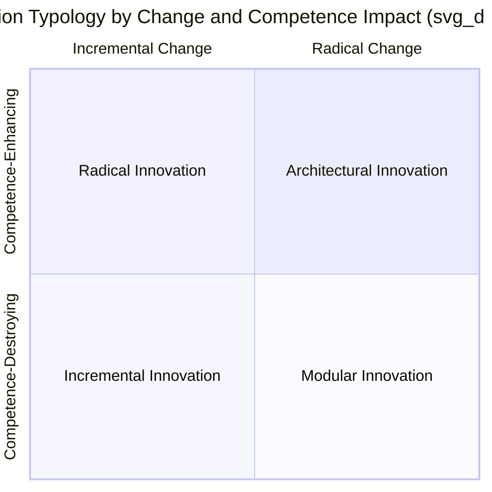
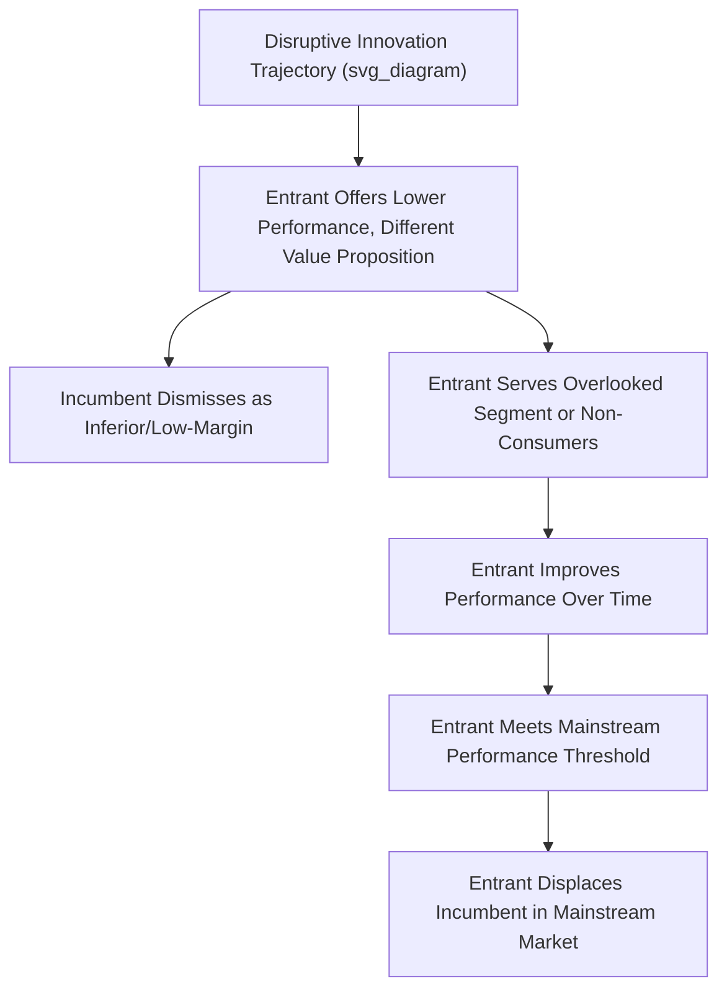

## Innovation Strategy Fundamentals

### Overview

Innovation Strategy Fundamentals establishes the core concepts, typologies, and frameworks used to understand how firms create, capture, and sustain value through innovation. Innovation strategy addresses the deliberate choices a firm makes about what to innovate, how to innovate, and how to organize and allocate resources to achieve sustainable competitive advantage through new products, services, processes, or business models. This chapter establishes foundational vocabulary and frameworks that subsequent innovation and technology strategy topics build upon.

### Defining Innovation and Its Types

Innovation is commonly defined as the successful implementation of new or significantly improved ideas that create value. Several classification schemes help firms distinguish among fundamentally different types of innovation, each requiring different strategic and organizational approaches.

#### Classification by Object of Innovation

- **Product innovation**: New or significantly improved goods or services offered to the market
- **Process innovation**: New or significantly improved methods of production or delivery
- **Business model innovation**: New approaches to how a firm creates, delivers, and captures value, independent of specific product or process changes
- **Position innovation**: Changes in the context in which products or services are introduced (e.g., repositioning an existing product for a new market segment)
- **Paradigm innovation**: Changes in the underlying mental models that frame what an organization does

#### Classification by Degree of Change: Incremental versus Radical Innovation

- **Incremental innovation**: Modest improvements to existing products, processes, or business models that build on established competencies and knowledge
- **Radical innovation**: Fundamental changes that create entirely new product categories, markets, or ways of competing, often requiring new competencies and knowledge bases

#### Henderson and Clark's Innovation Framework

Rebecca Henderson and Kim Clark proposed a refinement to the simple incremental/radical dichotomy by separating innovation impact along two dimensions: change to **core technological concepts** and change to **linkages between components**:

- **Incremental innovation**: Reinforces existing core concepts and existing component linkages
- **Modular innovation**: Changes core technological concepts within a component while leaving the overall architecture and component linkages unchanged
- **Architectural innovation**: Reconfigures the linkages between components while leaving the core technological concepts of individual components largely unchanged — often the most organizationally dangerous category because it can appear incremental on the surface while actually requiring entirely new organizational knowledge and communication patterns
- **Radical innovation**: Establishes new core concepts and new component linkages simultaneously

[Inference] Architectural innovation is frequently highlighted in the literature as a category firms are particularly prone to underestimate, since the individual components may look familiar even as the overall system relationships they depend on change fundamentally, causing established organizational routines to become misaligned without an obvious trigger.

#### Sustaining versus Disruptive Innovation

Clayton Christensen's distinction, central to the broader field of innovation strategy, separates innovation by its competitive trajectory relative to incumbent firms:

- **Sustaining innovation**: Improves product performance along dimensions that mainstream customers and incumbent firms already value, typically favoring established market leaders with resources to invest in continued improvement
- **Disruptive innovation**: Initially underperforms on the dimensions valued by mainstream customers but offers a different value proposition (typically simplicity, convenience, accessibility, or lower cost) that appeals to overlooked or non-consumer segments, then improves over time to eventually meet mainstream performance requirements while retaining its cost or convenience advantage

Disruptive innovation is further divided into:

- **Low-end disruption**: Targets existing customers at the bottom of the market who are overserved by current offerings and would accept lower performance for lower price
- **New-market disruption**: Targets non-consumption — people who previously lacked the skill, wealth, or access to use the existing product category at all

### The Innovation Funnel and Process

Firms typically structure innovation activity through a staged process designed to filter a large volume of early-stage ideas down to a smaller number of commercialized outcomes:

1. **Ideation/Discovery**: Generating a broad pool of potential innovation opportunities from internal and external sources
2. **Screening/Evaluation**: Applying strategic fit, market potential, and feasibility criteria to narrow the opportunity set
3. **Concept development**: Elaborating selected concepts into testable value propositions
4. **Development**: Building and refining the innovation (product, process, or business model)
5. **Testing and validation**: Assessing technical feasibility and market response, often through prototypes, pilots, or minimum viable products
6. **Launch/Commercialization**: Bringing the innovation to market at scale
7. **Post-launch review**: Assessing performance and capturing learning for future innovation cycles

[Unverified] The specific stage-gate terminology and number of formal gates varies considerably across organizations and industries, and many contemporary firms have moved toward more iterative, less strictly sequential innovation processes (see agile and lean innovation approaches) rather than a strictly linear funnel.

### Sources of Innovation

Strategic innovation frameworks typically distinguish between where innovation originates:

- **Internal R&D**: Innovation generated through the firm's own dedicated research and development function
- **Customer-driven innovation**: Insights and unmet needs identified directly from customer observation, feedback, or co-creation
- **Lead user innovation**: Innovations originating from sophisticated, demanding users who develop solutions to their own needs ahead of the broader market, later commercialized by firms
- **Supplier and partner innovation**: Innovation contributed through the firm's supply chain or ecosystem relationships
- **Open innovation**: Deliberate use of external ideas and external paths to market alongside internal innovation, as popularized by Henry Chesbrough, contrasted with a traditional "closed innovation" model in which firms rely exclusively on internally generated and internally commercialized ideas
- **Acquisition of innovation**: Acquiring external startups or technologies as a substitute for or complement to internal development

### Appropriability and Value Capture

A central strategic question in innovation strategy is not only how to create innovation but how to **capture** value from it, since innovators do not automatically retain the returns their innovations generate. Key concepts include:

- **Appropriability regime**: The degree to which an innovator can protect and capture returns from an innovation, influenced by the strength of intellectual property protection and the ease with which competitors can imitate the innovation
- **Complementary assets**: The manufacturing, marketing, distribution, and service capabilities needed to commercialize an innovation successfully; David Teece's framework highlights that when appropriability is weak and complementary assets are specialized and difficult to access, incumbents with those assets — rather than the original innovator — often capture the majority of value from an innovation
- **First-mover versus fast-follower strategy**: First movers may gain advantages such as brand recognition, switching costs, and preferential access to scarce resources, but often bear higher costs of market education, technology uncertainty, and channel development that fast followers can avoid by observing and improving upon the pioneer's approach

### Innovation Strategy and Business Strategy Alignment

Effective innovation strategy is explicitly linked to overall competitive strategy rather than treated as an independent activity:

- **Cost leadership strategies** typically favor process innovation aimed at efficiency and cost reduction
- **Differentiation strategies** typically favor product and service innovation aimed at creating unique value propositions
- **Innovation ambition framing** (often visualized as a portfolio across core, adjacent, and transformational innovation, per Bansi Nagji and Geoff Tuff's framework) helps firms deliberately balance innovation investment across:
  - **Core innovations**: Incremental improvements to existing offerings for existing customers
  - **Adjacent innovations**: Extending existing capabilities into new markets, customer segments, or offerings
  - **Transformational innovations**: Breakthrough offerings for markets that do not yet exist

[Inference] A commonly cited, though context-dependent, resource allocation heuristic suggests firms should weight investment more heavily toward core innovation and progressively less toward adjacent and transformational innovation, reflecting the differing risk-return and time-horizon profiles of each category, though optimal allocation varies significantly by industry maturity and competitive dynamics.

### Worked Example

**Example**: Consider a mid-sized industrial equipment manufacturer developing its innovation strategy.

- **Innovation type assessment**: The firm evaluates a proposed new sensor technology and determines that, while the underlying sensor technology itself is only modestly improved (making it appear incremental), it requires substantially different integration with the rest of the equipment's control architecture, indicating this is actually an architectural innovation requiring cross-functional coordination the firm's existing product teams are not structured to handle.
- **Disruption risk scan**: The firm identifies a smaller competitor offering a simplified, lower-cost version of its core product targeted at small-business customers the firm has historically ignored as unprofitable — a classic low-end disruption pattern — and evaluates whether to respond with a comparable low-cost offering or cede that segment.
- **Appropriability analysis**: Before committing significant R&D investment, the firm assesses that its target innovation would be difficult to patent effectively but would require specialized manufacturing capability the firm already possesses, suggesting it can rely on control of complementary assets rather than patent protection to capture value.
- **Portfolio allocation**: The firm's leadership adopts a core/adjacent/transformational allocation approach, dedicating the majority of R&D budget to incremental improvements of its existing product lines, a smaller allocation to adjacent market expansion, and a small exploratory allocation to a transformational technology bet with a longer, uncertain payoff horizon.

### Common Pitfalls and Critiques

- **Conflating invention with innovation**: Invention refers to the creation of a new idea or technology; innovation requires successful implementation and value creation from that idea, and firms sometimes overinvest in invention without adequate attention to commercialization pathways.
- **Underestimating architectural innovation**: Because architectural innovations can appear incremental on the surface, firms often fail to recognize the organizational and coordination changes such innovations actually require, leading to execution failure despite technically sound components.
- **Misapplying disruption theory**: [Inference] The term "disruptive" is frequently applied loosely in business commentary to describe any innovation that gains market share, when the formal theory specifically describes a particular competitive trajectory (initial underperformance on mainstream metrics, targeting overlooked segments, gradual improvement); applying the term without meeting these specific conditions can lead to strategic misdiagnosis.
- **Neglecting complementary assets in value capture strategy**: Firms sometimes assume that having a superior or well-protected innovation guarantees they will capture the resulting value, overlooking the critical role of specialized manufacturing, distribution, or service assets in determining who ultimately profits.
- **Innovation portfolio imbalance**: Overinvesting in core/incremental innovation at the expense of adjacent and transformational innovation can leave firms vulnerable to disruption, while overinvesting in transformational innovation without a strong core business can undermine near-term financial performance needed to fund long-term bets.

### Relationship to Other Frameworks

- **Resource-Based View**: Innovation capability itself can constitute a valuable, rare, and difficult-to-imitate resource, directly linking innovation strategy to sustained competitive advantage theory.
- **Dynamic Capabilities**: The capacity to sense innovation opportunities, seize them through resource reconfiguration, and transform organizational structures accordingly is a core dynamic capability.
- **Porter's Generic Strategies**: Innovation type and orientation (process versus product innovation) should align with whether a firm pursues cost leadership or differentiation.
- **Integration-Responsiveness Framework**: Global innovation strategy must consider whether innovation activities (particularly R&D) should be centralized for scale and coordination or dispersed for local market responsiveness.

**Related Topics**:

- Disruptive Innovation Theory in Depth
- Open Innovation and Ecosystem Strategy
- Technology S-Curves and Dominant Design
- Managing Innovation Portfolios (Core, Adjacent, Transformational)
- Intellectual Property Strategy and Appropriability
- Organizational Ambidexterity (Exploration vs. Exploitation)
- Lean Startup and Agile Innovation Methods