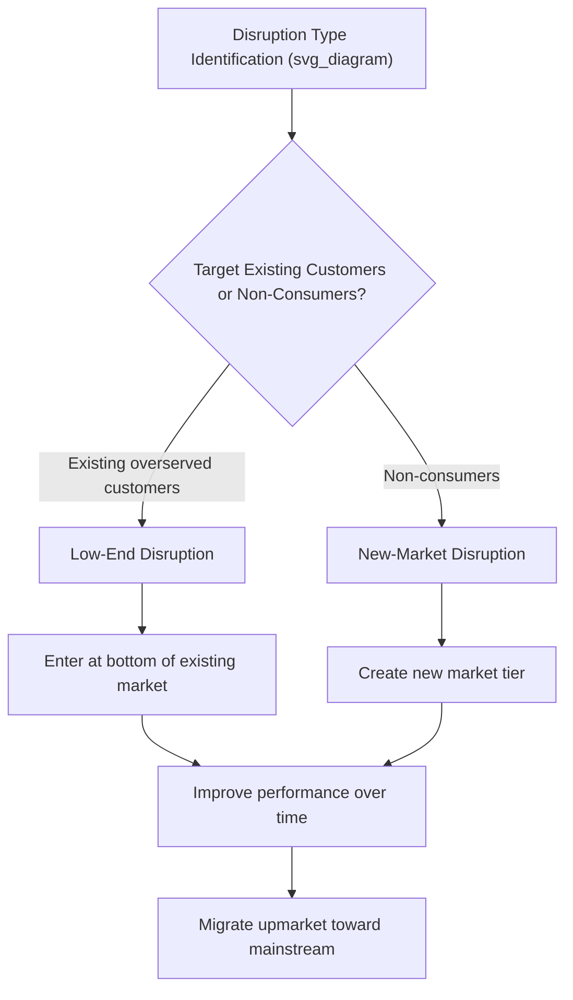

## Disruptive Innovation Theory

### Overview

Disruptive Innovation Theory, developed primarily by Clayton Christensen beginning in the 1990s, explains a specific pattern by which entrant firms can displace established industry leaders — not by outperforming them on the metrics incumbents and their best customers already value, but by introducing a fundamentally different value proposition that initially appeals to overlooked market segments before improving enough to capture the mainstream market. The theory has become one of the most widely applied — and widely debated — frameworks in innovation and technology strategy.

### Core Definitional Elements

Disruptive innovation theory rests on several precise conditions that distinguish genuinely disruptive innovation from innovation that is merely novel, fast-growing, or competitively successful:

1. **Initial underperformance on mainstream metrics**: The disruptive offering underperforms existing products on the dimensions that mainstream customers and incumbent firms have historically valued and competed on
2. **A different value proposition**: The disruptive offering compensates with attributes not previously prioritized by the mainstream market — typically simplicity, convenience, accessibility, or affordability
3. **Initial foothold in overlooked segments**: The disruptor gains traction among customers the incumbent finds unattractive to serve (due to low margins or small volume) or among non-consumers who previously could not use the existing product category at all
4. **Trajectory of improvement**: Over time, the disruptive offering improves along the mainstream performance dimensions at a pace that eventually satisfies mainstream customer requirements, while retaining its original cost or convenience advantage
5. **Incumbent response failure**: Established firms, following rational resource allocation processes prioritizing their most profitable existing customers, systematically underinvest in responding to the disruptive threat until it has become mainstream-competitive

### The Two Forms of Disruption

#### Low-End Disruption

Low-end disruption targets existing customers within the current market who are **overserved** by existing products — that is, customers who do not need or value all the performance improvements incumbents continue to add, and who would willingly accept a simpler, lower-cost alternative.

- **Mechanism**: Incumbents, driven by sustaining innovation and pursuit of their most profitable customers, tend to improve products faster than the needs of their least demanding customers grow, creating an "overshoot" gap that a low-end entrant can exploit
- **Entry point**: The bottom tier of the existing market, where price sensitivity is highest and performance requirements are lowest

#### New-Market Disruption

New-market disruption targets **non-consumption** — people or organizations who previously lacked the skill, wealth, equipment, or access needed to use the existing product category at all.

- **Mechanism**: By offering a simpler, more affordable, or more accessible alternative, the disruptor creates an entirely new population of consumers rather than competing directly for existing customers
- **Entry point**: A market that did not meaningfully exist for the established product category, avoiding direct competitive response from incumbents who do not perceive the non-consuming population as part of their addressable market



### The Performance Trajectory Model

Christensen's original framework is often illustrated through a trajectory diagram plotting product performance against time, showing two key lines:

- **The rate of performance improvement demanded by the market**: A relatively gradual, often flattening slope reflecting the reality that mainstream customer needs increase more slowly than technology's potential for improvement
- **The rate of performance improvement supplied by sustaining innovation**: A typically steeper slope, as incumbents continuously improve products along established performance metrics, eventually overshooting what most customers in a given tier actually need or are willing to pay for

The gap between these two trajectories — where supplied performance exceeds demanded performance — creates the strategic opening a disruptive entrant can exploit by offering "good enough" performance at a substantially lower cost or higher convenience.

```mermaid
flowchart LR
    subgraph Performance Trajectory Over Time (svg_diagram)
    A[Market Performance Demand - Gradual Slope] 
    B[Sustaining Innovation Supply - Steep Slope]
    C[Overshoot Gap Emerges]
    D[Disruptive Entrant Performance - Initially Below Both]
    D --> E[Entrant Improves Over Time]
    E --> F[Entrant Meets Market Demand Threshold]
    F --> G[Entrant Captures Mainstream Market]
    end
```

### Why Incumbents Struggle to Respond

A central and distinctive contribution of the theory is its explanation for *why* well-managed, rational incumbent firms often fail to respond effectively to disruptive threats, even when they are aware of them. Christensen's explanation, sometimes summarized as the **innovator's dilemma**, identifies several structural mechanisms:

- **Resource allocation processes favor existing customers**: Firms' internal resource allocation systems are typically designed to prioritize investments that satisfy the needs of current, most profitable customers, systematically starving investment in offerings that initially appeal only to low-margin or non-existent customer segments
- **Values and cost structure mismatch**: Established firms' cost structures and profitability expectations are often calibrated to their current market position, making the smaller margins and market size of an emerging disruptive segment appear financially unattractive relative to sustaining investments in the core business
- **Organizational capabilities misalignment**: The processes, culture, and capabilities that make an incumbent excellent at serving its current market are often precisely the wrong capabilities for competing in the disruptive segment, which typically requires different cost structures, distribution approaches, and performance priorities
- **Rational, not incompetent, decision-making**: [Inference] A key and often counterintuitive claim of the theory is that incumbent failure to respond to disruption is frequently the result of good management practice (listening to current customers, investing in the most profitable opportunities) rather than managerial incompetence, which is part of what makes the dilemma difficult to escape through conventional managerial improvement.

### Strategic Responses for Incumbents

The theory and subsequent extensions suggest several strategic approaches incumbents can use to respond to disruptive threats:

- **Establish an autonomous business unit**: Creating a separate organizational unit with its own cost structure, metrics, and decision-making authority, insulated from the resource allocation pressures and profitability expectations of the core business, allowing it to pursue the disruptive opportunity on its own terms
- **Acquire the disruptor**: Purchasing an emerging disruptive entrant while allowing it to continue operating with a distinct business model, rather than attempting to force it into the parent company's existing structure and cost expectations
- **Monitor and time market entry**: Continuously tracking the disruptive trajectory's improvement rate and market penetration to enter with a competitive response once uncertainty about the disruption's viability has substantially resolved, rather than either ignoring it or overreacting prematurely
- **Proactively cannibalize**: Deliberately building or acquiring a disruptive capability ahead of external competitors, accepting short-term cannibalization of the core business in exchange for controlling the disruptive trajectory rather than being displaced by it

### Distinguishing Disruptive from Sustaining Innovation

A recurring source of confusion in practice is the conflation of "disruptive" with "sustaining" innovation. The distinction depends specifically on the competitive trajectory and initial market entry point, not on how novel, technologically advanced, or commercially successful an innovation ultimately becomes:

| Characteristic | Sustaining Innovation | Disruptive Innovation |
| --- | --- | --- |
| Initial performance vs. mainstream expectations | Meets or exceeds current expectations | Initially underperforms on mainstream metrics |
| Target customer at entry | Existing, demanding mainstream customers | Overlooked customers or non-consumers |
| Typical originator | Often incumbent firms (well-positioned to serve existing customers) | Often entrant firms (less committed to existing customer priorities) |
| Competitive response likelihood | High — incumbents actively compete on sustaining dimensions | Low initially — incumbents often dismiss or ignore |
| Value proposition emphasis | Improved performance on established metrics | Simplicity, convenience, accessibility, affordability |

### Common Misapplications and Critiques

- **Overextension of the term "disruptive"**: [Inference] In business commentary and even in some corporate strategy discussions, "disruptive" is frequently applied to any innovation that is novel, fast-growing, or competitively threatening, regardless of whether it follows the specific low-end or new-market entry pattern the formal theory describes; this loose usage can lead to strategic misdiagnosis if firms respond to a sustaining threat as though it were disruptive, or vice versa.
- **Retrospective versus predictive application**: The theory was substantially developed by analyzing historical cases after the fact; using it prospectively to predict which of many emerging technologies will follow a disruptive trajectory requires additional judgment, since not every low-cost or simplified entrant successfully executes the full disruptive trajectory.
- **Academic critique of empirical support**: [Unverified] Some scholars and business historians have challenged the theory's empirical grounding in specific historical cases (e.g., certain disk drive and steel industry examples used in foundational research), arguing that the actual competitive dynamics in some cited cases were more complex than the simplified disruption narrative suggests; this remains a subject of ongoing academic debate rather than settled consensus.
- **Underemphasis on non-innovation factors**: Critics note that competitive outcomes attributed to disruption sometimes involve other contributing factors (capital structure, regulatory change, macroeconomic shifts) that the theory's parsimonious framework does not fully account for.
- **Not all successful entrants are disruptors**: Some of the most commercially significant new entrants succeed through sustaining innovation that directly outperforms incumbents on existing metrics, or through entirely different competitive mechanisms (network effects, platform strategy) that do not fit the disruption pattern.

### Worked Example

**Example**: Consider a hypothetical enterprise software company that has spent a decade adding advanced features to serve its largest, most sophisticated corporate clients, resulting in an increasingly complex and expensive platform.

- **Disruptive entry point identified**: A new entrant offers a simplified, lower-cost version of the core software targeted at small businesses that found the incumbent's platform too complex and expensive — a non-consumption segment the incumbent had not prioritized.
- **Incumbent response pattern**: The incumbent's sales team, compensated based on large enterprise contract value, has little incentive to pursue the small-business segment, and internal resource allocation continues to favor features requested by existing large clients, consistent with the resource-allocation mechanism the theory predicts.
- **Improvement trajectory**: Over several years, the entrant steadily adds features and capacity, eventually becoming viable for larger organizations while retaining a substantially lower price point than the incumbent's offering.
- **Strategic implication**: By the time the incumbent recognizes the entrant as a competitive threat to its core market, the entrant has already achieved sufficient scale, cost advantage, and product maturity to compete directly — illustrating the theory's core claim that incumbents often recognize disruptive threats too late to respond effectively through conventional competitive action.

### Relationship to Other Frameworks

- **Innovation Strategy Fundamentals**: Disruptive innovation theory sits within the broader typology of innovation classification, specifically describing a competitive trajectory rather than a technology category.
- **Resource-Based View / Dynamic Capabilities**: The theory implies that the very capabilities and resource allocation routines that constitute a source of competitive advantage in the current market can become a liability in responding to disruptive threats, directly engaging dynamic capabilities theory's emphasis on capability renewal.
- **Blue Ocean Strategy**: Both frameworks address value innovation that escapes direct competition with incumbents, though Blue Ocean Strategy focuses on simultaneous differentiation and cost reduction to create uncontested market space, while disruptive innovation theory specifically emphasizes a trajectory of initial underperformance followed by improvement.
- **Technology S-Curves**: Disruptive innovation trajectories are often mapped using S-curve technology adoption and performance improvement models to visualize the crossover point between disruptor and incumbent performance.

**Related Topics**:

- Innovation Strategy Fundamentals
- The Innovator's Dilemma and Organizational Response Strategies
- Technology S-Curves and Dominant Design
- Blue Ocean Strategy and Value Innovation
- Jobs-to-be-Done Theory
- Platform Strategy and Network Effects
- Organizational Ambidexterity (Exploration vs. Exploitation)