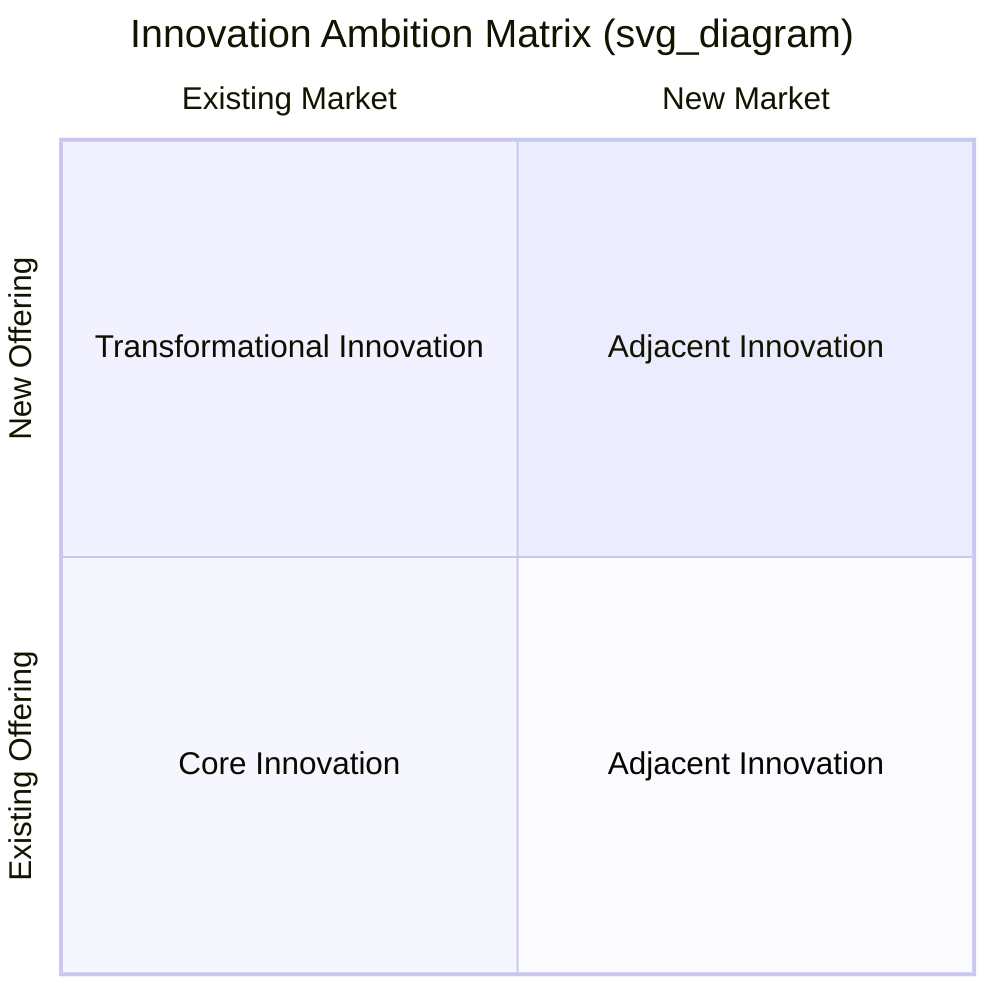
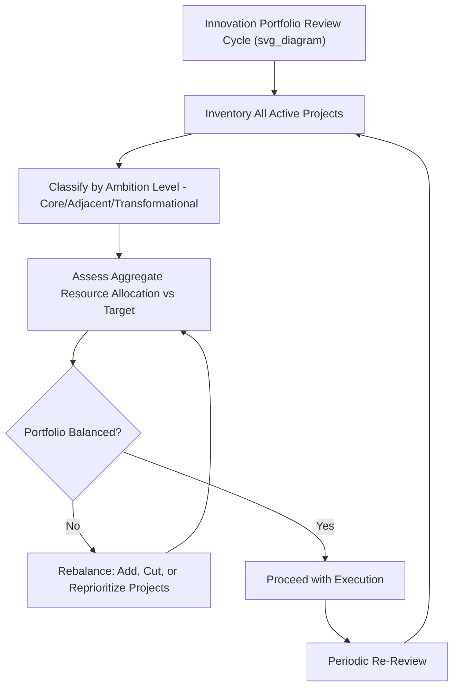

## Managing Innovation Portfolios

### Overview

Managing Innovation Portfolios addresses how firms deliberately allocate limited innovation resources — capital, talent, and management attention — across a mix of innovation initiatives that differ in risk, time horizon, and strategic ambition. Rather than evaluating innovation projects individually, portfolio management applies principles from financial portfolio theory to the innovation function, recognizing that the right question is not "is this a good project?" but "does this collection of projects, taken together, give the firm the right balance of near-term returns and long-term strategic options?"

### The Core Portfolio Management Problem

Firms face a fundamental tension in innovation resource allocation:

- **Overinvestment in incremental, low-risk innovation** can maximize near-term financial performance but leaves the firm vulnerable to disruption and unable to compete in future market states
- **Overinvestment in radical, high-risk innovation** can drain resources from the profitable core business, delay near-term returns, and expose the firm to excessive failure risk without a stable revenue base to fund it
- **Uncoordinated, ad hoc project selection** (evaluating each initiative independently without an explicit portfolio view) tends to systematically bias resource allocation toward incremental innovation, because incremental projects have more predictable returns and are easier to justify individually against near-term financial hurdles

Portfolio management addresses this by making the resource allocation trade-off explicit and deliberate at the aggregate level, rather than allowing it to emerge implicitly from a series of individually evaluated project decisions.

### The Core, Adjacent, and Transformational Framework

One of the most widely used innovation portfolio frameworks, developed by Bansi Nagji and Geoff Tuff, organizes innovation investment into three ambition levels:

#### Core Innovation

- **Definition**: Incremental improvements to existing offerings for existing customers, leveraging the firm's current capabilities and business model
- **Risk/return profile**: Lowest risk, most predictable and immediate returns
- **Typical examples**: Product line extensions, feature enhancements, process efficiency improvements

#### Adjacent Innovation

- **Definition**: Extending existing capabilities and assets into new markets, customer segments, channels, or related offerings
- **Risk/return profile**: Moderate risk and return, leveraging some existing capability while requiring new market or customer knowledge
- **Typical examples**: Entering a new geographic market with an existing product, extending an existing brand into a related product category

#### Transformational Innovation

- **Definition**: Breakthrough innovations that create offerings for markets that do not yet exist, often requiring fundamentally new capabilities, technologies, or business models
- **Risk/return profile**: Highest risk, longest time horizon, potentially highest long-term return, and highest failure rate
- **Typical examples**: Entirely new product categories, novel business models, platform or ecosystem plays

[Inference] A frequently cited resource allocation heuristic — often summarized as an approximate 70/20/10 split across core, adjacent, and transformational investment — is presented in the literature as a commonly observed pattern among high-performing innovators rather than a universally prescribed formula, and the optimal allocation varies meaningfully by industry maturity, competitive intensity, and firm-specific risk tolerance.

### Portfolio Balancing Dimensions

Beyond the ambition-level framework, firms typically evaluate innovation portfolios along several additional dimensions to ensure balanced allocation:

- **Time horizon**: Balancing short-term projects (near-term revenue impact) against long-term projects (multi-year development before any return)
- **Risk level**: Balancing well-understood, low-uncertainty projects against exploratory, high-uncertainty projects
- **Technology maturity**: Balancing investment in mature, well-understood technologies against emerging or unproven technologies
- **Market maturity**: Balancing innovation for established markets against innovation for nascent or undefined markets
- **Resource type**: Balancing capital-intensive projects against talent-intensive or partnership-based projects
- **Strategic fit**: Balancing projects that reinforce the firm's current strategic position against projects that may require repositioning or business model change

### Portfolio Visualization Tools

#### Risk-Return Bubble Charts

A common visualization technique plots individual innovation projects on a two-dimensional grid (typically risk versus potential return, or time-to-market versus strategic impact), with bubble size representing resource commitment, allowing portfolio managers to visually assess whether the aggregate portfolio is appropriately diversified or overly concentrated in one region of the risk-return space.

#### Innovation Ambition Matrix

As described above, this framework maps individual projects onto the core/adjacent/transformational grid, allowing management to assess the aggregate resource allocation percentage across ambition levels and compare it against a deliberate target allocation.

### Real Options Thinking in Portfolio Management

Because transformational and even many adjacent innovation projects involve significant uncertainty, firms increasingly apply **real options** logic — borrowed from financial options theory — to structure innovation investment as a series of staged decisions rather than a single upfront commitment:

- **Initial small investment**: Fund exploratory work (e.g., a discovery project, prototype, or pilot) at relatively low cost to reduce key uncertainties
- **Staged decision gates**: At each subsequent stage, make an explicit decision to increase investment (exercise the option), pause, or terminate the project (abandon the option) based on the information gained
- **Value of flexibility**: The ability to abandon a project early, before committing large capital, is treated as having explicit strategic value, since it caps downside risk while preserving upside potential if the innovation proves viable

This approach allows firms to maintain a larger number of early-stage transformational bets than they could afford to fully fund simultaneously, since most exploratory investments are small relative to the eventual cost of full-scale development and commercialization.

### Governance Structures for Portfolio Management

Effective innovation portfolio management typically requires distinct governance mechanisms from core business management:

- **Separate evaluation criteria by ambition level**: Applying the same financial hurdle rates and evaluation timelines used for core business investment to transformational projects tends to systematically starve longer-horizon, higher-uncertainty initiatives; many firms establish distinct criteria and approval processes calibrated to each ambition level
- **Dedicated portfolio review cadence**: Establishing regular (e.g., quarterly) portfolio-level reviews focused on aggregate balance and strategic fit, distinct from individual project status reviews
- **Cross-functional portfolio governance bodies**: Innovation review boards or committees that include representation from strategy, finance, R&D, and business unit leadership to ensure portfolio decisions reflect both financial discipline and strategic ambition
- **Separate funding pools**: Ring-fencing a dedicated budget for adjacent and transformational innovation, insulated from annual budget cycles that might otherwise reallocate funds toward core business priorities during periods of financial pressure

### Worked Example

**Example**: Consider a consumer electronics company reviewing its innovation portfolio.

- **Portfolio inventory**: The firm catalogs 40 active innovation projects and classifies each by ambition level, finding that 85% of resource allocation is directed toward core innovation (incremental improvements to existing product lines), with only 12% toward adjacent innovation and 3% toward transformational innovation.
- **Diagnosis**: Leadership recognizes this allocation is heavily skewed toward incremental innovation relative to its strategic ambition to enter new product categories over a five-year horizon, and identifies the individual project evaluation process (which requires near-term ROI justification) as systematically disadvantaging longer-horizon transformational proposals.
- **Rebalancing action**: The firm establishes a separate transformational innovation fund with its own evaluation criteria (focused on strategic learning and market signal rather than near-term ROI) and staged funding gates, allowing several small exploratory projects to proceed without competing directly against core business initiatives for the same budget.
- **Real options structuring**: One transformational project — exploring an entirely new product category — is funded initially only through a small discovery-phase budget to build and test a basic prototype with a limited customer panel, with a subsequent go/no-go decision gate before any further investment is committed.
- **Governance change**: The firm establishes a quarterly cross-functional innovation portfolio review involving strategy, finance, and R&D leadership, explicitly tracking the aggregate ambition-level allocation against a target mix rather than only reviewing individual project status.

### Common Pitfalls and Critiques

- **Portfolio drift toward the core**: [Inference] Without deliberate governance intervention, innovation portfolios tend to drift over time toward core, incremental innovation, because individual incremental projects are easier to justify against near-term financial metrics than adjacent or transformational projects, even when explicit target allocations have been set.
- **Applying uniform evaluation criteria across ambition levels**: Evaluating a transformational, multi-year, high-uncertainty project against the same near-term ROI hurdle rate used for core business investment systematically disadvantages exploratory innovation and biases the portfolio toward safer, incremental bets.
- **Treating portfolio balance as a one-time exercise**: Innovation portfolios require ongoing rebalancing as market conditions, competitive dynamics, and project outcomes evolve; a portfolio balanced at one point in time can quickly become imbalanced without continued governance attention.
- **Insufficient kill discipline**: Firms sometimes continue funding transformational projects well past the point where staged evidence suggests they should be terminated, due to sunk cost bias or personal or political investment in specific projects, undermining the risk-limiting benefit of real options structuring.
- **Conflating portfolio diversity with portfolio balance**: Simply having projects across many different ambition levels or technology areas does not guarantee an appropriately balanced allocation if the resource weighting across categories remains skewed.

### Relationship to Other Frameworks

- **Innovation Strategy Fundamentals**: Portfolio management operationalizes the strategic allocation decisions that follow from the innovation typologies (incremental, radical, disruptive) established in innovation strategy fundamentals.
- **Disruptive Innovation Theory**: Adequate transformational and adjacent innovation investment is often framed as a structural defense against the innovator's dilemma, since it creates organizational capacity to pursue disruptive opportunities before external entrants do.
- **Organizational Ambidexterity**: Portfolio balancing is closely linked to ambidexterity theory's distinction between exploitation (core innovation) and exploration (adjacent/transformational innovation), and the organizational structures needed to pursue both simultaneously.
- **Resource-Based View / Dynamic Capabilities**: The capability to systematically govern and rebalance an innovation portfolio is itself framed as a dynamic capability supporting long-term competitive advantage.

**Related Topics**:

- Organizational Ambidexterity (Exploration vs. Exploitation)
- Real Options Theory in Strategic Decision-Making
- Stage-Gate and Agile Innovation Process Design
- Corporate Venture Capital and Innovation Ecosystems
- Innovation Metrics and Performance Measurement
- Disruptive Innovation Theory
- R&D Portfolio Prioritization Methods