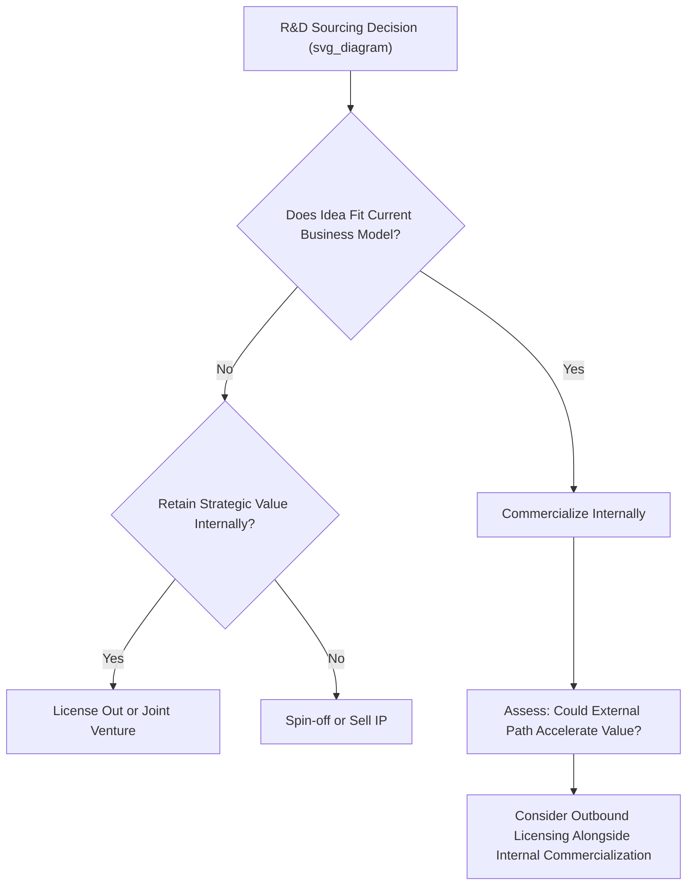

## R&D Strategy and Open Innovation

### Overview

R&D Strategy and Open Innovation examines how firms organize, fund, and govern research and development activity, and how the boundaries of the innovation process have shifted from a traditionally closed, internally contained model toward models that deliberately incorporate external knowledge, technology, and commercialization pathways. The central strategic question addressed is not only *how much* to invest in R&D, but *where* R&D should be sourced from and *how* the resulting innovations should reach the market.

### The Closed Innovation Paradigm

For much of the twentieth century, large firms predominantly operated under what Henry Chesbrough later termed a **closed innovation** model, characterized by:

- Internally generated ideas, developed internally, and commercialized internally
- Large, vertically integrated corporate R&D laboratories as the primary source of innovation
- A prevailing assumption that the smartest people in a given field worked for the firm itself, making external ideas inherently suspect or lower quality
- Strong emphasis on being first to market and controlling intellectual property tightly to prevent competitors from benefiting from the firm's investment
- Profit captured primarily through proprietary control of the full innovation-to-commercialization pipeline

[Inference] The closed innovation model was generally well-suited to environments with concentrated, scarce technical expertise, limited labor mobility of skilled researchers, and less-developed external markets for technology licensing or venture capital — conditions that have eroded significantly in most advanced economies since the latter part of the twentieth century.

### The Open Innovation Paradigm

Chesbrough's open innovation framework describes a fundamentally different logic: firms should systematically use both internal and external ideas, and both internal and external paths to market, to advance their technology and business models. Key underlying assumptions include:

- **Widely distributed knowledge**: Useful knowledge and expertise are now distributed across many organizations, universities, startups, and individuals, rather than concentrated primarily within large corporate labs
- **External commercialization pathways**: Ideas that do not fit a firm's current business model can still generate value through licensing, spin-offs, or joint ventures rather than being shelved
- **Combining internal and external ideas**: The firm's core capability shifts from generating all valuable ideas internally to effectively identifying, evaluating, integrating, and commercializing the best ideas regardless of origin

```mermaid
flowchart LR
    subgraph Closed Innovation (svg_diagram)
    A1[Internal Ideas Only] --> A2[Internal Development] --> A3[Internal Commercialization]
    end
    subgraph Open Innovation
    B1[Internal Ideas] --> B3[Internal or External Commercialization]
    B2[External Ideas] --> B3
    B3 --> B4[Licensing / Spin-offs / Partnerships]
    end
```

### Inbound and Outbound Open Innovation

Open innovation activity is typically divided into two directional flows:

#### Inbound Open Innovation ("Outside-In")

Bringing external knowledge and technology into the firm to accelerate or enhance internal innovation:

- **Technology licensing-in**: Acquiring rights to use externally developed technology
- **Crowdsourcing and innovation contests**: Soliciting solutions to specific technical problems from a broad external population
- **Corporate venture capital and startup partnerships**: Investing in or partnering with startups to gain early access to emerging technology
- **University and research institution collaboration**: Sponsored research agreements and joint research programs with academic institutions
- **Supplier and customer co-innovation**: Involving supply chain partners or lead customers directly in the innovation process
- **Acqui-hiring and technology acquisitions**: Acquiring firms primarily for their technology or talent rather than existing revenue

#### Outbound Open Innovation ("Inside-Out")

Allowing internally developed ideas and technology to reach the market through external paths rather than solely through the firm's own commercialization channels:

- **Licensing-out**: Licensing internally developed technology to other firms, including potential competitors, for a royalty or fee
- **Corporate spin-offs**: Establishing new independent companies to commercialize internally developed technology that does not fit the parent firm's current business model
- **Patent monetization**: Generating revenue from underutilized intellectual property rather than allowing it to remain unused
- **Open-sourcing**: Releasing technology (particularly software) publicly to build ecosystem adoption, even without direct licensing revenue, in pursuit of indirect strategic benefits (e.g., establishing a technology standard, building complementary product demand)



### Innovation Ecosystems and Platform-Based R&D

Beyond bilateral open innovation relationships, many firms now operate within broader **innovation ecosystems** — networks of interdependent firms, developers, suppliers, and complementary innovators whose collective activity determines the value and adoption of a shared technology platform.

- **Platform leadership**: A firm establishes a technology platform (e.g., an operating system, a hardware standard, an API ecosystem) and cultivates a network of third-party developers or complementors who build value-adding extensions
- **Complementary asset governance**: Platform leaders must balance opening sufficient access to attract ecosystem participation against retaining enough control to capture value and maintain quality and security standards
- **Ecosystem orchestration capability**: [Inference] Successfully managing an innovation ecosystem is often treated in the literature as requiring a distinct capability set — relationship governance, technical interface design, incentive alignment — that differs meaningfully from traditional internal R&D management capability.

### Organizational Models for R&D

Firms structure their R&D function according to different degrees of centralization and openness:

| Model | Description | Typical Fit |
| --- | --- | --- |
| Centralized corporate R&D | Single, large research lab serving the entire organization | Firms in mature industries requiring deep, long-term fundamental research |
| Decentralized/business-unit R&D | R&D embedded within individual business units, closer to specific market needs | Firms prioritizing speed and market responsiveness over long-term fundamental research |
| Hub-and-spoke R&D | A central research hub for foundational research paired with distributed application-focused teams | Firms balancing long-term research investment with near-term commercial relevance |
| Open innovation network | R&D substantially sourced through external partnerships, licensing, and acquisition rather than large internal labs | Firms in fast-moving, distributed-knowledge industries such as biotechnology and software |

### Managing the Risks of Open Innovation

Open innovation introduces distinctive risks that firms must actively manage:

- **Intellectual property leakage**: Sharing information with external partners increases the risk of unintended technology transfer to current or future competitors
- **Dependency risk**: Excessive reliance on external partners for critical technology can create strategic vulnerability if the partnership ends or the partner is acquired by a competitor
- **Coordination and integration costs**: Managing external relationships (contracts, joint governance, cultural and process differences) imposes overhead that must be weighed against the benefits of external knowledge access
- **Absorptive capacity requirements**: A firm's ability to recognize, assimilate, and apply externally sourced knowledge depends on having sufficient related internal expertise — a firm with weak internal technical capability may struggle to effectively evaluate or integrate external innovations, a phenomenon closely related to the broader concept of absorptive capacity

### Worked Example

**Example**: Consider a mid-sized pharmaceutical company evaluating its R&D strategy.

- **Closed model limitation identified**: The firm's internal drug discovery pipeline has slowed, while smaller biotechnology firms and academic labs have generated a growing share of novel early-stage compounds industry-wide.
- **Inbound open innovation response**: The firm establishes a dedicated external innovation scouting function tasked with identifying promising early-stage compounds at universities and small biotech firms, and creates a corporate venture capital arm to take minority equity stakes in promising startups, gaining early visibility and option value on their technology.
- **Outbound open innovation response**: The firm identifies several internally developed compounds that do not fit its current therapeutic area focus and licenses them to other pharmaceutical firms better positioned to commercialize them, generating royalty revenue from technology that would otherwise have remained unused.
- **Absorptive capacity investment**: Recognizing that evaluating external biotech innovations requires deep internal scientific expertise, the firm maintains a core internal research team specifically to build the technical capability needed to assess and integrate externally sourced compounds effectively.
- **Risk management**: For its most strategically important internal compounds, the firm continues to rely on internal development and tightly controlled partnerships rather than broad licensing, reflecting a deliberate choice to reserve closed innovation practices for its most valuable and defensible intellectual property.

### Common Pitfalls and Critiques

- **"Not invented here" resistance**: Organizational culture that implicitly or explicitly devalues externally sourced ideas can undermine open innovation initiatives regardless of formal strategy, requiring deliberate cultural and incentive change to overcome.
- **Treating open innovation as a cost-cutting measure rather than a capability**: [Inference] Firms that adopt open innovation practices primarily to reduce internal R&D headcount, without building the scouting, evaluation, and integration capabilities needed to effectively use external knowledge, often fail to capture the intended benefits.
- **Insufficient absorptive capacity**: Reducing internal R&D investment too aggressively in favor of external sourcing can erode the internal technical expertise needed to evaluate and integrate external innovations effectively, undermining the open innovation strategy itself.
- **Over-licensing strategically critical technology**: Outbound licensing of technology that is closely tied to a firm's core competitive advantage can inadvertently equip competitors, particularly if licensing terms do not adequately restrict use in directly competing applications.
- **Ecosystem governance neglect**: Platform leaders who fail to invest in clear technical interfaces, fair value-sharing arrangements, and quality standards for ecosystem participants risk complementor attrition or ecosystem fragmentation.

### Relationship to Other Frameworks

- **Innovation Strategy Fundamentals**: Open innovation represents a specific strategic choice regarding the *source* of innovation, one of several dimensions established in foundational innovation strategy concepts.
- **Managing Innovation Portfolios**: External sourcing (licensing-in, venture investment, acquisition) is itself a portfolio allocation choice alongside internal R&D investment across core, adjacent, and transformational categories.
- **Appropriability and Value Capture (Teece's Framework)**: Open innovation decisions directly engage appropriability regime analysis, since choosing to license out or open-source technology is fundamentally a decision about how to capture (or forgo capturing) value from innovation.
- **Dynamic Capabilities**: The capacity to sense, evaluate, and integrate external technology and knowledge is frequently framed as a dynamic capability in its own right, distinct from traditional internal R&D execution capability.

**Related Topics**:

- Innovation Ecosystems and Platform Strategy
- Absorptive Capacity and Organizational Learning
- Corporate Venture Capital Strategy
- Intellectual Property Strategy and Licensing
- Technology Scouting and External Innovation Sourcing
- Managing Innovation Portfolios
- University-Industry Research Collaboration Models