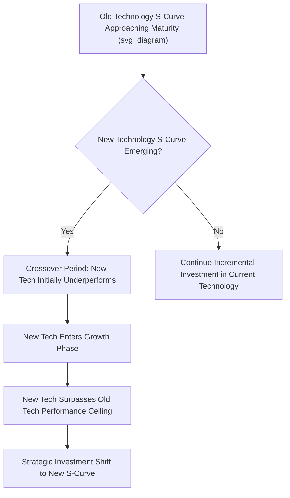

## Technology Life Cycle Management

### Overview

Technology Life Cycle Management examines how technologies evolve through predictable phases from emergence to obsolescence, and how firms should adapt strategy, resource allocation, and organizational capability at each stage. Understanding where a technology sits within its life cycle — and anticipating transitions between stages — is a foundational input to R&D investment timing, competitive positioning, and portfolio decisions across the innovation strategy domain.

### The Technology S-Curve

The technology S-curve is the central analytical tool in technology life cycle management, plotting technology performance (or the rate of improvement per unit of engineering effort or investment) against cumulative effort or time. The characteristic S-shape reflects three distinct phases:

1. **Emergence phase**: Performance improves slowly despite significant investment, as foundational scientific and engineering challenges are worked out and the technology's basic feasibility is established
2. **Growth/acceleration phase**: Performance improves rapidly for a given unit of investment, as the core technical challenges have been resolved and engineering effort translates efficiently into performance gains
3. **Maturity phase**: Performance improvement slows and eventually plateaus, as the technology approaches physical or engineering limits inherent to its underlying technical approach, and further investment yields diminishing returns

```mermaid
flowchart LR
    subgraph Technology S-Curve Phases (svg_diagram)
    A[Emergence: Slow Improvement, High Uncertainty] --> B[Growth: Rapid Improvement per Unit Investment]
    B --> C[Maturity: Diminishing Returns, Performance Plateau]
    C --> D[Decline: Superseded by New S-Curve]
    end
```

### Technology Discontinuities and S-Curve Transitions

A critical strategic insight from technology life cycle theory is that when one technology's S-curve approaches its performance ceiling, a **discontinuity** often occurs: a fundamentally different technological approach emerges with its own S-curve, initially underperforming the mature technology but with substantially greater long-term performance potential.

- **Technology discontinuity**: A shift from one underlying technological approach or scientific principle to a fundamentally different one used to achieve the same functional purpose
- **Competence-enhancing versus competence-destroying discontinuities**: Some discontinuities build on and extend a firm's existing technical knowledge and skills (competence-enhancing), while others render existing technical expertise obsolete or substantially less relevant (competence-destroying), with the latter posing significantly greater organizational adaptation challenges
- **Crossover dynamics**: During the transition period between an old technology's maturity plateau and a new technology's early emergence phase, the old technology may still outperform the new one on an absolute basis, creating a genuine strategic dilemma about when to switch investment focus, since switching too early sacrifices near-term performance while switching too late risks being overtaken once the new technology's growth phase accelerates



### The Technology Adoption Life Cycle

Distinct from the performance-focused S-curve, the technology adoption life cycle (drawing on diffusion of innovation research, notably Everett Rogers, and later adapted for high-technology markets by Geoffrey Moore) describes how different customer segments adopt a new technology over time based on their risk tolerance and need for proven solutions:

- **Innovators**: Technology enthusiasts willing to adopt unproven, early-stage technology for its own sake
- **Early adopters**: Visionaries who adopt new technology based on its strategic potential, tolerating incompleteness in exchange for competitive advantage
- **Early majority**: Pragmatists who adopt technology only once it has proven practical value and reduced risk, typically requiring reference customers and complete solutions
- **Late majority**: Conservatives who adopt technology only once it has become an established standard, often driven by necessity rather than enthusiasm
- **Laggards**: Skeptics who adopt new technology only when forced to by the unavailability of the older alternative

Moore's influential extension of this model identifies "the chasm" — a critical gap between early adopters and the early majority, arising because pragmatist early-majority customers are unwilling to accept the same level of risk and incompleteness that visionary early adopters find acceptable, requiring a distinct "crossing the chasm" strategy focused on dominating a narrow, well-defined market niche before expanding broadly.


### Dominant Design

A pivotal concept in technology life cycle management is the emergence of a **dominant design** — a single product architecture or set of core features that becomes the de facto industry standard, around which subsequent competition shifts from architectural experimentation to incremental refinement and cost reduction.

- **Pre-dominant-design phase**: Multiple competing technical architectures coexist, product innovation is high, and market share is highly fluid as firms experiment with different design approaches
- **Dominant design emergence**: A particular architecture, often driven by some combination of technical superiority, network effects, regulatory endorsement, or simple first-mover advantage in gaining critical adoption mass, becomes the standard that most firms and customers converge around
- **Post-dominant-design phase**: Competition shifts toward process innovation, manufacturing efficiency, and incremental feature improvement within the now-standardized architecture, while radical product architecture innovation becomes comparatively rare until the next technology discontinuity

[Inference] The emergence of a dominant design is generally associated in the literature with a significant industry shakeout, as firms whose product architectures do not become the dominant design often exit the market or are acquired, since continued competition based on incompatible architectures becomes increasingly difficult to sustain once network effects, complementary product ecosystems, and buyer expectations consolidate around the dominant design.

### Strategic Implications by Life Cycle Stage

| Life Cycle Stage | Key Strategic Priorities | Organizational Capability Emphasis |
| --- | --- | --- |
| Emergence | Technical feasibility research, experimentation with multiple architectures, tolerance for high failure rates | Scientific/engineering research capability, patience for uncertain returns |
| Growth (pre-dominant design) | Rapid product iteration, securing complementary assets and ecosystem partners, positioning to influence or win the dominant design battle | Design flexibility, ecosystem-building, speed to market |
| Growth (post-dominant design) | Scaling production, building manufacturing and distribution efficiency, incremental feature differentiation | Process engineering, operational scale-up, cost management |
| Maturity | Cost leadership, incremental efficiency gains, market segmentation, monitoring for emerging discontinuities | Operational excellence, cost discipline, external technology scanning |
| Decline | Harvest remaining value, manage orderly exit or transition, redeploy resources to emerging technology | Portfolio discipline, resource reallocation capability |

### Managing the Transition Between Technology Generations

Firms with a strong position in a mature technology face a distinctive strategic challenge when a discontinuity threatens to displace it — closely related to, but analytically distinct from, disruptive innovation theory, since technology discontinuities can occur through sustaining competitive dynamics rather than only through low-end or new-market entry patterns. Common strategic approaches include:

- **Parallel investment**: Maintaining investment in the mature technology's remaining performance improvements while simultaneously funding exploratory investment in the emerging discontinuous technology, hedging against uncertainty about the timing of the transition
- **Technology road-mapping**: Formal, structured processes for tracking the performance trajectory of both the current dominant technology and emerging alternative technologies, explicitly identifying trigger conditions (e.g., a competitor's demonstrated performance milestone) that would prompt an accelerated strategic shift
- **Capability transfer assessment**: Explicitly evaluating which of the firm's existing technical and organizational capabilities transfer to the new technology generation (competence-enhancing) versus which become obsolete (competence-destroying), informing whether internal development, acquisition, or partnership is the appropriate response mode
- **Managed technology sunset**: For firms electing to exit a declining technology rather than pursue the new generation, deliberately planning the wind-down of R&D investment, production capacity, and customer support to maximize remaining value extraction while minimizing reputational and contractual risk

### Worked Example

**Example**: Consider a manufacturer of a core industrial component built on a decades-old technological approach that has reached its performance plateau.

- **S-curve position assessment**: The firm's technology roadmapping process identifies that its current component technology has entered the maturity phase, with recent R&D investment yielding progressively smaller performance gains despite consistent funding levels.
- **Discontinuity monitoring**: The firm identifies an emerging alternative technical approach, currently in the emergence phase and underperforming the mature technology on an absolute basis, but demonstrating a steeper performance improvement trajectory in early trials.
- **Competence impact analysis**: The firm determines that the new technology is substantially competence-destroying, requiring manufacturing expertise and materials science knowledge largely outside its current capability base, and concludes that acquisition of a smaller specialized firm is more viable than internal development.
- **Parallel investment strategy**: Rather than abandoning the mature technology immediately, the firm continues incremental investment to serve existing customers profitably while funding the new technology acquisition and integration in parallel, avoiding premature abandonment of a still-profitable revenue stream.
- **Dominant design positioning**: Recognizing that the new technology has not yet converged on a single dominant architecture across the industry, the firm prioritizes securing key ecosystem partnerships and complementary standards influence to increase the likelihood that its preferred architectural approach becomes the eventual dominant design.

### Common Pitfalls and Critiques

- **Misjudging S-curve position**: Firms sometimes continue investing heavily in a mature technology under the assumption that historical improvement rates will continue, failing to recognize the onset of diminishing returns until a competitor's discontinuous technology has already gained significant traction.
- **Underestimating competence-destroying discontinuities**: [Inference] Firms with deep, long-standing expertise in a mature technology are often organizationally and psychologically resistant to acknowledging that a new technology renders much of that expertise obsolete, a bias that can delay necessary strategic pivots.
- **Premature abandonment of mature technology**: Conversely, exiting a still-profitable mature technology too early, before the replacement technology has demonstrated a credible performance trajectory, can sacrifice near-term returns needed to fund the transition itself.
- **Ignoring the adoption chasm**: Firms successfully navigating the technical S-curve can still fail commercially if they do not separately address the distinct challenge of crossing from early adopter to early majority customer segments, since technical superiority alone does not guarantee mainstream market adoption.
- **Assuming a single dominant design is inevitable**: In some markets, multiple architectures persist longer than typical dominant-design theory would predict, particularly where strong network effects are absent or regulatory fragmentation sustains parallel standards across different regions or use cases.

### Relationship to Other Frameworks

- **Innovation Strategy Fundamentals**: Technology life cycle stage directly informs which innovation type (incremental, architectural, radical) is strategically appropriate at a given point in time.
- **Disruptive Innovation Theory**: Technology discontinuities and disruptive innovation are related but distinct concepts; a discontinuity describes a shift in underlying technical approach, while disruption specifically describes a competitive entry and performance trajectory pattern, and the two can occur together or independently.
- **Managing Innovation Portfolios**: Life cycle stage assessment directly informs portfolio allocation, since a firm's core, adjacent, and transformational innovation mix should reflect the life cycle position of both current and emerging technologies.
- **R&D Strategy and Open Innovation**: Competence-destroying discontinuities often justify external sourcing (acquisition, licensing-in, partnership) over internal development, directly linking life cycle position to R&D sourcing strategy.

**Related Topics**:

- Crossing the Chasm and Technology Adoption Strategy
- Dominant Design and Industry Shakeout Dynamics
- Technology Roadmapping Methods
- Managing Innovation Portfolios
- Disruptive Innovation Theory
- Standards Wars and Network Effects
- Platform Strategy and Ecosystem Governance