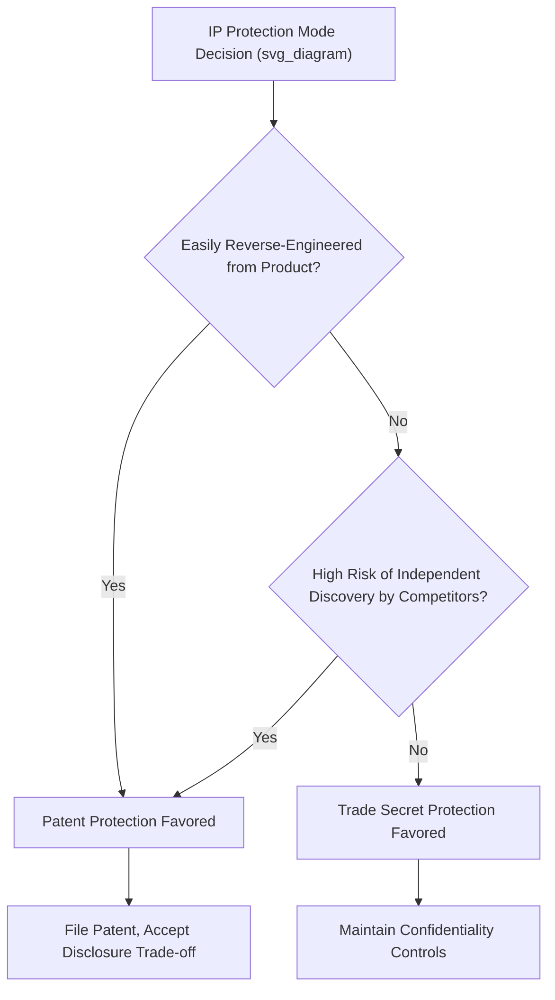

## Intellectual Property Strategy

### Overview

Intellectual Property (IP) Strategy addresses how firms identify, protect, and leverage their intangible innovation assets — patents, trade secrets, trademarks, and copyrights — as instruments of competitive advantage rather than merely as legal compliance activities. Effective IP strategy is tightly integrated with broader innovation and technology strategy, since decisions about what to protect, how to protect it, and whether to license, defend, or trade IP directly shape a firm's ability to capture value from its innovation investment.

### Forms of Intellectual Property Protection

#### Patents

Patents grant the holder exclusive rights to make, use, or sell a claimed invention for a limited period (typically twenty years from filing in most major jurisdictions), in exchange for public disclosure of the invention's technical details.

- **Utility patents**: Protect functional inventions, processes, machines, and compositions of matter
- **Design patents**: Protect the ornamental, non-functional appearance of a product
- **Strategic trade-off of disclosure**: Because patent protection requires public disclosure of the invention, firms must weigh the exclusivity benefit against the risk that competitors gain technical insight that could accelerate their own related development, even without direct infringement

#### Trade Secrets

Trade secrets protect confidential business information (formulas, processes, methods, customer data) that derives commercial value from not being publicly known, with protection lasting indefinitely as long as secrecy is maintained through reasonable protective measures.

- **No disclosure requirement**: Unlike patents, trade secrets involve no public filing, meaning competitors gain no technical insight even if reverse engineering ultimately reveals similar information
- **No protection against independent discovery or reverse engineering**: Trade secret law only protects against misappropriation (theft, breach of confidentiality obligations); if a competitor independently develops the same knowledge or lawfully reverse-engineers a product, trade secret protection provides no recourse
- **Indefinite but fragile duration**: Protection can theoretically last forever, but a single unauthorized disclosure can permanently destroy the trade secret's legal protection

#### Trademarks

Trademarks protect brand identifiers (names, logos, slogans) that distinguish a firm's goods or services in the marketplace, with protection potentially lasting indefinitely as long as the mark remains in active commercial use and is properly maintained.

#### Copyrights

Copyrights protect original creative and expressive works (software code, written content, artistic works), automatically upon creation in most jurisdictions, typically lasting for the life of the author plus a substantial fixed term (with different terms for corporate-authored works).

### The Patent-Versus-Trade-Secret Decision

A central strategic decision in IP strategy is whether to protect a given innovation through patenting (public disclosure, time-limited exclusivity) or trade secrecy (no disclosure, potentially indefinite protection but no protection against independent discovery). Key factors influencing this choice include:

| Factor | Favors Patenting | Favors Trade Secrecy |
| --- | --- | --- |
| Reverse-engineering difficulty | Innovation is easily reverse-engineered once the product is sold | Innovation is a process or method not discoverable from the finished product |
| Pace of technological change | Industry pace makes the twenty-year patent term still valuable | Industry pace is fast enough that patent term length is less relevant, but ongoing secrecy could extend advantage longer |
| Enforcement feasibility | Firm has resources and legal infrastructure to detect and pursue infringement | Firm has strong internal information security practices and limited ability to detect distant infringement |
| Independent discovery risk | Low risk that competitors would independently arrive at the same innovation | High risk that competitors could independently discover the same innovation, weakening trade secret's value |
| Strategic disclosure value | Disclosure could deter competitor R&D by signaling technical direction or complexity | Disclosure would provide meaningful competitive insight without other offsetting benefit |

### Appropriability Regimes and Value Capture

Building on David Teece's foundational work, IP strategy is closely tied to the concept of the **appropriability regime** — the environmental and legal conditions determining how effectively an innovator can capture returns from an innovation:

- **Tight appropriability regime**: Strong legal protection combined with difficult-to-imitate technology allows innovators to capture value largely independent of complementary assets
- **Weak appropriability regime**: Weak legal protection, easily imitated technology, or both mean that legal IP protection alone is insufficient to capture value, and control of complementary assets (manufacturing capability, distribution, brand, service networks) becomes the primary determinant of who captures value from an innovation, regardless of who invented it

[Inference] A key strategic implication is that firms operating in weak appropriability regimes should generally prioritize building and controlling complementary assets over relying primarily on formal IP protection, while firms in tight appropriability regimes have more latitude to rely on IP protection itself as the primary value-capture mechanism.

### Patent Portfolio Strategy

Firms holding substantial patent portfolios typically pursue several distinct strategic functions simultaneously, rather than treating each patent as an isolated protective asset:

- **Defensive patenting**: Building a portfolio broad enough to deter competitor litigation, since a large counter-portfolio increases the risk that any infringement lawsuit against the firm will be met with a countersuit
- **Offensive patenting**: Actively pursuing licensing revenue or litigation against infringing competitors as a direct revenue stream or competitive weapon
- **Patent thickets and blocking patents**: Filing dense clusters of related patents around a core technology to make it difficult for competitors to design around the firm's protected innovations without infringing at least one patent in the cluster
- **Cross-licensing arrangements**: Negotiating mutual licensing agreements with competitors holding complementary or overlapping patent portfolios, allowing both firms freedom to operate without extensive litigation
- **Patent pools**: Multiple firms in an industry, sometimes including direct competitors, jointly license a shared set of patents (frequently used in technology standards contexts) to reduce transaction costs and enable industry-wide interoperability
- **Non-practicing entity considerations**: Firms and specialized entities holding patents without themselves manufacturing products based on them, monetizing IP purely through licensing and litigation — a strategic model that has generated substantial legal and policy controversy

### IP Strategy in Standards-Setting Contexts

When a firm's patented technology becomes part of a formal industry standard, additional strategic and legal considerations arise:

- **Standard-essential patents (SEPs)**: Patents that必然 must be used to comply with a technical standard, since there is no non-infringing way to implement the standard
- **FRAND commitments**: Firms contributing patented technology to standards bodies typically commit to licensing standard-essential patents on Fair, Reasonable, And Non-Discriminatory terms, balancing the patent holder's right to compensation against the risk of "patent hold-up" (leveraging standard-essential status to extract excessive licensing terms after an industry has committed to the standard)
- **Strategic participation in standards bodies**: Firms often participate actively in standards-setting organizations specifically to influence which technologies (including their own patented approaches) become embedded in the resulting standard

### Worked Example

**Example**: Consider a specialty chemicals manufacturer developing a novel manufacturing process that improves yield for an existing product line.

- **Protection mode analysis**: The firm determines that the new process occurs entirely within its own manufacturing facility and cannot be discovered by analyzing the finished product, and that patent filing would require disclosing process details that could meaningfully accelerate competitor efforts to replicate the yield improvement even without direct infringement.
- **Decision**: Given the low reverse-engineering risk and the value of extending protection beyond a twenty-year patent term, the firm elects to protect the innovation as a trade secret rather than filing a patent, implementing enhanced information security protocols, restricted facility access, and confidentiality agreements for employees with knowledge of the process.
- **Complementary asset assessment**: Recognizing that even trade secret protection could eventually be undermined by employee turnover or independent discovery, the firm also invests in building specialized, hard-to-replicate manufacturing equipment configurations that provide an additional layer of practical protection beyond legal IP mechanisms alone.
- **Portfolio balance**: For other, more visible product-level innovations in its portfolio that would be easily reverse-engineered once sold, the firm pursues patent protection instead, reflecting a deliberate case-by-case application of the patent-versus-trade-secret framework rather than a uniform IP policy.

### Common Pitfalls and Critiques

- **Treating IP protection as automatically valuable**: Filing patents or maintaining trade secrets without a clear connection to actual competitive advantage or value capture strategy can consume significant resources (filing costs, legal fees, internal security overhead) without generating proportional strategic benefit.
- **Over-relying on legal protection in weak appropriability regimes**: [Inference] Firms sometimes underinvest in complementary assets because they assume patent protection alone will secure value capture, overlooking Teece's core insight that legal protection strength and complementary asset control jointly determine who captures innovation value.
- **Underestimating trade secret fragility**: Firms sometimes treat trade secret protection as equivalently robust to patent protection, without adequately investing in the information security and access control measures required to maintain legal trade secret status, which can be lost through a single inadequately protected disclosure.
- **Patent portfolio management without strategic purpose**: Accumulating large patent portfolios without a clear defensive, offensive, or licensing strategy can result in substantial maintenance costs (filing and renewal fees across multiple jurisdictions) without commensurate strategic value.
- **Standard-essential patent hold-up risk**: Firms that aggressively leverage standard-essential patent status to extract above-market licensing terms after a standard has achieved widespread adoption risk regulatory scrutiny, reputational damage, and erosion of trust within standards-setting bodies.

### Relationship to Other Frameworks

- **Innovation Strategy Fundamentals**: IP strategy directly implements the appropriability and complementary assets concepts introduced in foundational innovation strategy frameworks.
- **R&D Strategy and Open Innovation**: Licensing-in and licensing-out decisions in open innovation strategy are fundamentally IP strategy decisions, requiring careful evaluation of appropriability and complementary asset considerations.
- **Technology Life Cycle Management**: IP strategy considerations shift across the technology life cycle, with patent protection often most valuable during the growth phase before a dominant design emerges, while trade secret and process-based protection may extend value capture further into the maturity phase.
- **Global Value Chain Configuration**: Weak IP enforcement in certain jurisdictions is a significant factor influencing whether firms choose to disperse sensitive manufacturing activities internationally or retain them in jurisdictions with stronger legal protection.

**Related Topics**:

- Appropriability Regimes and Complementary Assets (Teece's Framework)
- Patent Portfolio Management and Litigation Strategy
- Standards-Setting and FRAND Licensing
- Trade Secret Protection and Information Security Governance
- Technology Licensing Strategy and Negotiation
- R&D Strategy and Open Innovation
- Global Value Chain Configuration