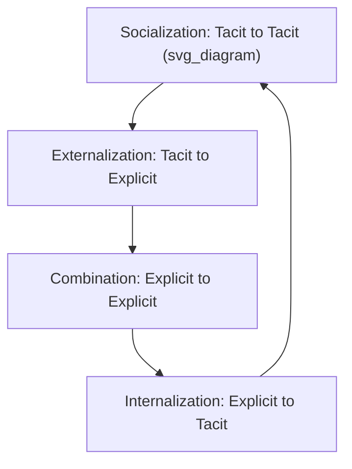

## Knowledge Management for Strategic Advantage

### Overview

Knowledge Management for Strategic Advantage examines how firms identify, create, capture, share, and leverage knowledge as a strategic resource that underpins sustained competitive advantage. Unlike physical or financial capital, knowledge — particularly tacit, experience-based knowledge embedded in people and organizational routines — is difficult for competitors to observe, transfer, or imitate, making effective knowledge management a potential source of durable competitive differentiation rather than merely an operational or IT support function.

### Types of Organizational Knowledge

#### Explicit versus Tacit Knowledge

Building on Michael Polanyi's foundational distinction and later organizational applications by Ikujiro Nonaka and Hirotaka Takeuchi, organizational knowledge is commonly divided into two fundamentally different types:

- **Explicit knowledge**: Knowledge that can be codified, documented, and transmitted through formal language — manuals, databases, patents, written procedures, and formal training materials. Explicit knowledge is relatively easy to store, transfer, and, importantly, for competitors to acquire once documented
- **Tacit knowledge**: Knowledge embedded in individual skill, experience, and intuition that is difficult or impossible to fully articulate or codify — the "know-how" that experienced practitioners possess but struggle to fully transfer through written instruction alone. Tacit knowledge is inherently difficult to imitate or transfer, making it a potentially more durable source of competitive advantage than explicit knowledge

[Inference] Because tacit knowledge resists codification and transfer, it is frequently identified in the strategic management literature as a particularly valuable category of organizational knowledge from a competitive advantage perspective, precisely because the same properties that make it difficult to manage internally also make it difficult for competitors or departing employees to fully extract and replicate elsewhere.

### The SECI Model of Knowledge Creation

Nonaka and Takeuchi's SECI model describes organizational knowledge creation as a continuous, spiraling process of conversion between tacit and explicit knowledge across four modes:

- **Socialization (tacit to tacit)**: Sharing tacit knowledge directly through shared experience, observation, and imitation — such as apprenticeship, mentoring, or informal on-the-job learning — without the knowledge ever being explicitly articulated
- **Externalization (tacit to explicit)**: Converting tacit knowledge into explicit, articulable form through dialogue, metaphor, analogy, or structured reflection — often considered the most difficult and highest-value conversion mode, since it makes previously inaccessible knowledge available for broader organizational use
- **Combination (explicit to explicit)**: Combining and reconfiguring existing explicit knowledge from different sources into new, more complex or systematized explicit knowledge, such as synthesizing multiple documented best practices into a new formal process
- **Internalization (explicit to tacit)**: Individuals absorbing explicit organizational knowledge (documented procedures, formal training) through practice and experience until it becomes internalized, intuitive tacit skill

This continuous spiral, occurring iteratively at individual, group, and organizational levels, is presented as the underlying mechanism by which organizations continuously generate new knowledge rather than merely storing and retrieving existing knowledge.

### Knowledge Management Strategy Archetypes

Firms typically emphasize one of two broad knowledge management strategic orientations, corresponding to Morten Hansen, Nitin Nohria, and Thomas Tierney's influential distinction:

#### Codification Strategy

- **Approach**: Knowledge is carefully codified, stored in structured databases, and made broadly reusable across the organization, enabling economies of scale in knowledge reuse
- **Typical fit**: Businesses built on relatively standardized, repeatable solutions to similar problems, where reusing existing codified knowledge (a proven approach, a documented solution template) is more efficient than developing custom solutions each time
- **Supporting infrastructure**: Heavy investment in knowledge repositories, document management systems, and structured knowledge-capture processes

#### Personalization Strategy

- **Approach**: Knowledge remains closely tied to the person who developed it and is shared primarily through direct person-to-person interaction, dialogue, and collaboration, rather than extensive codification
- **Typical fit**: Businesses built on highly customized, creative, or complex problem-solving where each situation differs substantially and codified templates would be of limited value
- **Supporting infrastructure**: Investment in networks, communication systems, and organizational practices that facilitate direct expert-to-expert connection (expertise directories, communities of practice, cross-functional collaboration forums) rather than primarily in document repositories

[Inference] A key strategic caution associated with this framework is that firms attempting to pursue both codification and personalization strategies with equal emphasis often achieve neither effectively, since the two approaches require different infrastructure investment priorities, different talent profiles, and different performance incentive structures; most successful knowledge management strategies emphasize one approach as primary, with modest secondary investment in the other.

### Organizational Mechanisms for Knowledge Management

- **Communities of practice**: Informal or semi-formal groups of practitioners who share a common domain of interest and interact regularly to develop and share expertise, often more effective at capturing and diffusing tacit knowledge than formal hierarchical reporting structures
- **After-action reviews and post-mortems**: Structured reflection processes conducted after the completion of projects or significant events, explicitly designed to externalize tacit lessons learned into more broadly shareable organizational knowledge
- **Knowledge repositories and expertise directories**: Centralized systems for storing codified knowledge and, in personalization-oriented organizations, systems for identifying who within the organization holds relevant tacit expertise on a given topic
- **Cross-functional rotation and staffing**: Deliberately moving individuals across organizational units to diffuse tacit knowledge through direct experience and relationship-building rather than relying solely on documentation
- **Mentoring and apprenticeship programs**: Formalized structures supporting the socialization mode of tacit knowledge transfer, particularly important for preserving expertise as experienced employees approach retirement

### Absorptive Capacity

A closely related concept, developed by Wesley Cohen and Daniel Levinthal, describes a firm's **absorptive capacity**: the ability to recognize the value of new external information, assimilate it, and apply it to commercial ends.

- **Path dependence**: Absorptive capacity is cumulative and path-dependent — firms with greater existing related knowledge are better positioned to recognize and integrate new external knowledge, meaning firms that underinvest in a knowledge domain over time may find themselves increasingly unable to absorb relevant external developments even if they later decide the domain has become strategically important
- **Strategic implication for open innovation**: Absorptive capacity directly determines how effectively a firm can benefit from external knowledge sourcing strategies (licensing-in, partnerships, acquisitions), since possessing external knowledge access without the internal capability to recognize and integrate it yields limited strategic value

### Knowledge Retention and Organizational Memory Risk

Firms face significant strategic risk from knowledge loss, particularly regarding tacit knowledge held by experienced individuals:

- **Employee turnover risk**: Departure of experienced employees, particularly in personalization-strategy organizations, can result in significant, difficult-to-recover knowledge loss if tacit expertise was never adequately externalized or transferred
- **Succession and retirement risk**: Organizations with aging specialized workforces face elevated risk of losing critical tacit knowledge (particularly in technical, engineering, and highly experience-dependent roles) without deliberate knowledge transfer planning well in advance of expected departures
- **Knowledge hoarding incentive misalignment**: Individual incentive structures that reward unique expertise possession over knowledge sharing can create organizational disincentives for the very knowledge transfer behaviors that formal knowledge management strategy aims to encourage

### Worked Example

**Example**: Consider a specialized engineering consulting firm facing the imminent retirement of several senior engineers who hold decades of accumulated project experience.

- **Knowledge type diagnosis**: Leadership recognizes that much of the senior engineers' expertise is tacit — intuitive judgment about design trade-offs developed through years of project experience — rather than explicit, meaning existing project documentation captures outcomes but not the underlying reasoning and judgment that produced them.
- **Strategy selection**: Given the firm's business model of highly customized, non-repeatable engineering solutions, leadership determines that a personalization-oriented knowledge management strategy is more appropriate than attempting to codify judgment-based expertise into rigid templates.
- **SECI-based intervention**: The firm implements a structured mentoring program pairing senior engineers with mid-career staff on active projects (socialization), combined with facilitated post-project debrief sessions specifically designed to surface and document the reasoning behind key design decisions (externalization), rather than relying solely on standard project documentation.
- **Absorptive capacity consideration**: The firm recognizes that only engineers with sufficient related technical background can effectively absorb the tacit judgment being transferred, and prioritizes pairing senior engineers with mid-career staff who already have strong foundational technical knowledge rather than junior staff without sufficient absorptive capacity.
- **Retention risk mitigation**: The firm extends part-time consulting arrangements with retiring senior engineers for a transitional period specifically to allow continued knowledge transfer opportunities beyond their formal departure date.

### Common Pitfalls and Critiques

- **Conflating knowledge management with information technology deployment**: [Inference] Firms sometimes treat knowledge management primarily as a technology implementation challenge (deploying a document repository or database system) without addressing the underlying organizational, cultural, and incentive factors that determine whether knowledge is actually shared and reused, resulting in underutilized systems despite significant technology investment.
- **Applying codification strategy to personalization-appropriate businesses**: Attempting to codify highly customized, judgment-intensive expertise into rigid templates and databases can produce knowledge assets that are technically accurate but insufficiently nuanced to be genuinely useful for the complex, non-repeatable problems the codified knowledge was meant to address.
- **Underinvesting in tacit knowledge transfer mechanisms**: Organizations sometimes focus knowledge management investment disproportionately on explicit knowledge systems (which are easier to build and measure) while neglecting the socialization and externalization mechanisms needed to capture and transfer tacit expertise, despite tacit knowledge often representing the more strategically valuable and competitively defensible knowledge category.
- **Ignoring incentive misalignment**: Implementing knowledge-sharing systems and processes without addressing underlying incentive structures that implicitly reward individual expertise hoarding over collaborative knowledge sharing tends to produce limited adoption regardless of the quality of the systems themselves.
- **Neglecting succession planning until departure is imminent**: Waiting until an employee's departure is announced to begin tacit knowledge transfer efforts significantly compresses the available transfer window, since externalization of deep tacit expertise typically requires extended time and repeated interaction rather than a brief handover period.

### Relationship to Other Frameworks

- **Resource-Based View**: Tacit, firm-specific knowledge exemplifies the valuable, rare, and difficult-to-imitate resource characteristics central to resource-based competitive advantage theory.
- **Dynamic Capabilities**: Absorptive capacity is frequently framed as a foundational dynamic capability underpinning a firm's broader capacity to sense and seize external opportunities and reconfigure internal resources.
- **R&D Strategy and Open Innovation**: Absorptive capacity directly determines the effectiveness of inbound open innovation strategies, since external knowledge sourcing yields limited value without sufficient internal capability to recognize and integrate it.
- **Cross-Cultural Strategic Management**: Knowledge transfer mechanisms, particularly tacit knowledge transfer reliant on direct interaction, face additional complexity in multinational and cross-cultural organizational contexts where communication norms and trust-building processes differ significantly.

**Related Topics**:

- Resource-Based View and Sources of Sustained Competitive Advantage
- Absorptive Capacity and Organizational Learning
- Communities of Practice and Organizational Learning Design
- Succession Planning and Critical Knowledge Retention
- R&D Strategy and Open Innovation
- Dynamic Capabilities Theory
- Organizational Ambidexterity (Exploration vs. Exploitation)