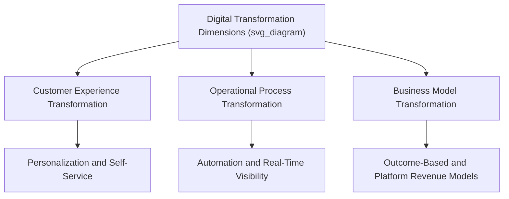

## Digital Transformation Strategy

### Overview

Digital Transformation Strategy addresses how organizations fundamentally reshape their business models, operations, customer experiences, and organizational capabilities through the strategic application of digital technologies. Distinct from mere technology adoption or IT modernization, digital transformation involves a deliberate, strategy-level reconception of how a firm creates and captures value in a digitally mediated competitive environment, often requiring changes to organizational structure, culture, talent, and governance alongside technology deployment.

### Distinguishing Digital Transformation from Digitization and Digitalization

A useful conceptual progression separates three related but distinct terms often conflated in practice:

- **Digitization**: The technical process of converting analog information into digital format (e.g., scanning paper documents into digital files) — a foundational, largely technical activity with limited direct strategic implication on its own
- **Digitalization**: The use of digital technologies to change or improve existing business processes (e.g., automating a previously manual workflow) — process-level improvement that typically preserves the underlying business model
- **Digital transformation**: A strategic-level reconception of the business model, value proposition, or competitive positioning enabled by digital technology — potentially altering what the firm sells, how it creates value, and how it competes, rather than simply making existing processes more efficient

[Inference] This distinction matters strategically because many organizational "digital transformation" initiatives in practice remain confined to digitization or digitalization activities without achieving genuine business-model-level transformation, a gap frequently cited as a key reason digital transformation initiatives underdeliver relative to their stated strategic ambitions.

### Core Dimensions of Digital Transformation

#### Customer Experience Transformation

- Redesigning customer touchpoints and journeys around digital channels, enabling personalization, self-service, and real-time responsiveness that traditional channels could not provide
- Leveraging customer data to develop increasingly individualized value propositions and pricing

#### Operational Process Transformation

- Applying automation, data analytics, and digital workflow tools to fundamentally redesign (rather than merely digitize) internal operational processes
- Building real-time operational visibility and decision-making capability that was previously unavailable or only available with significant time lag

#### Business Model Transformation

- Shifting from product-centric to service- or outcome-centric revenue models (e.g., moving from selling equipment to selling equipment-as-a-service with usage-based pricing) enabled by digital connectivity and data capture
- Introducing entirely new digitally enabled revenue streams that were not previously feasible (e.g., data monetization, platform-based intermediation)

### Strategic Drivers and Enabling Technologies

Digital transformation strategy is typically enabled by a cluster of interrelated technologies, each contributing distinct strategic capability:

- **Cloud computing**: Provides scalable, flexible infrastructure that reduces capital investment barriers to digital experimentation and enables rapid scaling of successful digital initiatives
- **Data analytics and artificial intelligence**: Enables data-driven decision-making, predictive capability, and increasingly automated decision execution at a scale and speed not achievable through traditional analysis methods
- **Internet of Things (IoT) and connected devices**: Enables real-time data capture from physical products and operations, supporting new service-based business models and operational visibility
- **Application programming interfaces (APIs) and platform architecture**: Enables modular, composable digital capability that supports faster integration with partners and more rapid internal development
- **Mobile technology**: Enables direct, continuous digital engagement with customers and employees independent of location

### Organizational Capability Requirements

[Inference] The strategic management literature generally emphasizes that digital transformation success depends substantially more on organizational and leadership factors than on technology selection itself, since the core challenges are frequently organizational rather than technical. Key capability requirements include:

- **Executive sponsorship and digital leadership**: Sustained senior leadership commitment, since digital transformation typically requires cross-functional coordination and resource reallocation decisions that cannot be resolved at lower organizational levels alone
- **Digital talent acquisition and development**: Building or acquiring capabilities in data science, software engineering, user experience design, and digital product management, often requiring significant changes to hiring practices and compensation structures relative to the firm's traditional talent model
- **Agile and iterative delivery capability**: Shifting from traditional, long-cycle planning and delivery processes toward iterative, test-and-learn approaches better suited to the uncertainty inherent in digital initiatives
- **Data governance and infrastructure**: Establishing the data quality, integration, and governance foundations necessary to support advanced analytics and AI applications, since flawed underlying data undermines even sophisticated analytical capability
- **Cultural change management**: Addressing organizational resistance to new ways of working, particularly in organizations with long-established processes and hierarchical decision-making norms that may conflict with the speed and experimentation digital transformation typically requires

### Organizational Models for Digital Transformation

Firms adopt varying organizational structures to drive digital transformation, each with distinct trade-offs:

| Model | Description | Trade-offs |
| --- | --- | --- |
| Centralized digital function (e.g., Chief Digital Officer unit) | Dedicated digital transformation team with cross-organizational authority | Strong coordination and focus, but risk of disconnection from business unit operational realities |
| Embedded digital teams within business units | Digital capability distributed directly within existing business functions | Strong business context and buy-in, but risk of duplicated effort and inconsistent standards across units |
| Digital innovation lab/incubator | Separate, often physically distinct unit insulated from core business constraints to experiment with digital initiatives | Enables faster experimentation, but risk of innovations failing to transfer back into core business operations |
| Hybrid center-of-excellence model | Central team provides standards, shared infrastructure, and specialized expertise while execution occurs within business units | Balances coordination and business relevance, but requires careful governance to avoid ambiguity in decision authority |

### Digital Maturity Assessment

Organizations commonly assess digital transformation progress using maturity models that classify capability across a staged progression, typically including dimensions such as:

- **Strategy**: Degree to which digital considerations are integrated into core strategic planning versus treated as a separate initiative
- **Technology infrastructure**: Degree of legacy system modernization, cloud adoption, and data infrastructure maturity
- **Organization and culture**: Degree of digital talent capability, agile working practices, and cultural readiness for digital ways of working
- **Customer experience**: Degree of digital channel integration and data-driven personalization capability

[Unverified] Specific maturity model stage labels and assessment methodologies vary considerably across consulting firms and academic frameworks, and no single standardized digital maturity model has achieved universal adoption across the field.

### Legacy System and Technical Debt Considerations

A distinctive strategic challenge in digital transformation, particularly for established firms, is managing the constraint imposed by existing legacy technology infrastructure:

- **Technical debt**: Accumulated cost and complexity resulting from past technology decisions optimized for short-term needs rather than long-term flexibility, which constrains the speed and feasibility of subsequent digital initiatives
- **Modernization sequencing decisions**: Firms must decide whether to modernize legacy infrastructure comprehensively before pursuing new digital capability, or to build new digital capability alongside legacy systems through integration layers, accepting some inefficiency in exchange for faster time-to-market
- **Build versus buy versus partner decisions**: Evaluating whether to develop digital capability internally, acquire it through vendor solutions, or access it through partnership (e.g., with specialized technology providers or platform ecosystems) based on the firm's assessment of which capabilities are strategically differentiating versus which are better sourced externally

### Worked Example

**Example**: Consider a traditional industrial equipment manufacturer pursuing digital transformation.

- **Strategic ambition clarification**: Leadership explicitly distinguishes between digitization projects already underway (scanning maintenance records into digital format) and the firm's actual transformation ambition: shifting from selling equipment outright to offering equipment-as-a-service with usage-based pricing enabled by IoT-connected sensors.
- **Enabling technology deployment**: The firm equips its equipment with IoT sensors to capture real-time usage and performance data, and builds cloud-based analytics infrastructure to process this data at scale.
- **Business model transformation**: Rather than treating the sensor data purely as an operational efficiency tool, the firm restructures its core revenue model around usage-based service contracts, fundamentally changing its customer relationship from a one-time equipment sale to an ongoing service relationship.
- **Organizational capability building**: Recognizing that its existing sales force is compensated and trained around one-time equipment sales, the firm redesigns incentive structures and invests in new customer success capability oriented around ongoing service relationship management rather than transactional sales.
- **Legacy system consideration**: The firm's existing enterprise resource planning system was not designed to support usage-based billing, leading leadership to build a new digital billing layer that integrates with, rather than immediately replaces, the legacy system, allowing faster time-to-market for the new business model while deferring comprehensive legacy system replacement.

### Common Pitfalls and Critiques

- **Confusing technology deployment with transformation**: [Inference] Organizations frequently declare "digital transformation" success based on technology deployment metrics (systems implemented, applications launched) without evidence of actual business model, customer experience, or competitive positioning change, reflecting the digitization/digitalization/transformation conflation discussed above.
- **Underinvesting in organizational and cultural change**: Technology-centric transformation programs that neglect talent, incentive, and cultural change requirements frequently underperform even when the underlying technology implementation is executed competently.
- **Treating digital transformation as a discrete, time-bound project**: Digital transformation is generally more accurately understood as an ongoing strategic capability and orientation rather than a project with a defined completion date, since the pace of technological and competitive change requires continuous adaptation rather than a one-time transformation effort.
- **Legacy system paralysis**: Some organizations delay digital initiatives indefinitely pending comprehensive legacy system modernization, missing competitive windows that could have been addressed through incremental integration approaches.
- **Innovation lab isolation**: Digital innovation labs and incubators that successfully generate promising pilots but lack clear mechanisms for transferring successful innovations back into core business operations risk generating interesting demonstrations without meaningful enterprise-wide impact.

### Relationship to Other Frameworks

- **Innovation Strategy Fundamentals**: Digital transformation initiatives can be classified using the core/adjacent/transformational innovation ambition framework, helping firms calibrate appropriate risk tolerance and governance for different digital initiatives.
- **Disruptive Innovation Theory**: Digitally enabled business model shifts (e.g., platform or service-based models displacing traditional product sales) frequently follow disruptive innovation patterns, particularly when they initially target overlooked customer segments or non-consumption.
- **Dynamic Capabilities**: Digital transformation capability is frequently framed as a specific manifestation of broader dynamic capabilities theory, since it requires the capacity to sense digital opportunities, seize them through resource reconfiguration, and transform organizational structures accordingly.
- **Platform Strategy**: Many digital transformation business model shifts involve moving toward platform-based value creation, directly connecting this topic to platform strategy and network effects frameworks.

**Related Topics**:

- Platform Strategy and Network Effects
- Data-Driven Decision-Making and Analytics Strategy
- Artificial Intelligence Strategy and Governance
- Agile Organizational Design
- Legacy System Modernization Strategy
- Dynamic Capabilities Theory
- Digital Business Model Innovation