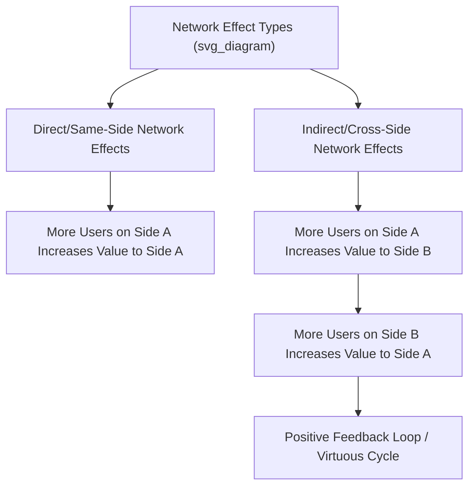
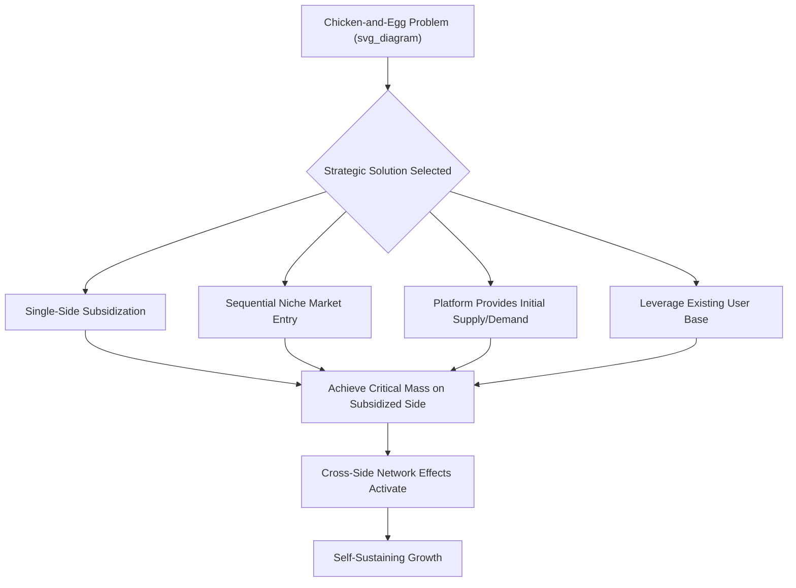

## Platform Business Models and Network Effects

### Overview

Platform Business Models and Network Effects examines a distinct category of business model in which a firm creates value primarily by facilitating interactions and exchanges between two or more distinct groups of participants, rather than by producing and selling goods or services directly through a traditional linear value chain. Platform strategy has become one of the most consequential areas of contemporary strategic management, underpinning the competitive dynamics of many of the largest and fastest-growing firms across technology, transportation, hospitality, and commerce sectors.

### Defining Platform Business Models

A platform business model is characterized by the firm acting as an **intermediary or matchmaker** connecting distinct participant groups — commonly producers and consumers, but often extending to advertisers, developers, or other complementors — enabling value-creating interactions between them that would be more difficult or costly to arrange independently.

- **Pipeline versus platform distinction**: Traditional "pipeline" businesses create value through a linear sequence of activities (design, produce, market, sell) controlled by the firm itself, while platform businesses create value primarily by enabling external parties to interact and transact with each other
- **Multi-sided markets**: Most platforms serve two or more distinct participant groups simultaneously (e.g., riders and drivers, buyers and sellers, viewers and content creators), with the platform's value to each side depending on the presence and activity of the other side(s)

```mermaid
flowchart LR
    subgraph Pipeline Business Model (svg_diagram)
    A1[Design] --> A2[Produce] --> A3[Market] --> A4[Sell to Customer]
    end
    subgraph Platform Business Model
    B1[Producer/Supplier Side] <--> B2[Platform Intermediary]
    B2 <--> B3[Consumer/Demand Side]
    end
```

### Network Effects

**Network effects** (also called network externalities) occur when the value of a product or service to a given user increases as more users join the network. Network effects are the fundamental economic mechanism underlying platform business model dynamics and are typically classified along two dimensions:

#### Direct (Same-Side) Network Effects

The value to a user on one side of the platform increases as more users join that **same** side. Classic examples include communication and social networking platforms, where each additional user directly increases the value of the network to existing users on the same side.

#### Indirect (Cross-Side) Network Effects

The value to a user on one side of the platform increases as more users join a **different** side. For example, a ride-sharing platform becomes more valuable to riders as more drivers join (increasing availability and reducing wait times), and more valuable to drivers as more riders join (increasing earning opportunity).



#### Positive versus Negative Network Effects

Network effects are not always positive: while additional participants often increase value (positive network effects), in some contexts additional participants can decrease value through congestion or increased competition for attention or matches (negative network effects), requiring platforms to actively manage participant density and matching quality rather than simply maximizing total participation.

### The Chicken-and-Egg Problem

A foundational strategic challenge in platform business models is the **chicken-and-egg problem** (also called the cold-start problem): because a platform's value to each participant group depends on the presence of the other group(s), a new platform with no participants on either side struggles to attract its first participants on any side, since there is initially no value to offer.

Common strategic approaches to solving the chicken-and-egg problem include:

- **Single-side subsidization**: Deliberately subsidizing or providing free access to one side of the platform (often the side with lower willingness to pay or higher price sensitivity) to build sufficient scale on that side to attract the other side, which is then monetized more heavily
- **Sequential market entry**: Focusing initial platform-building efforts on a narrow, well-defined niche market where critical mass can be achieved more easily, before expanding to broader markets once network effects have taken hold within the niche
- **Producing initial supply or demand directly**: The platform itself acts as a participant on one side in the earliest stages (e.g., a marketplace platform initially sourcing and listing its own inventory) to demonstrate value before attracting genuine third-party participation
- **Leveraging an existing user base**: Launching the platform to an existing captive audience from a prior product or service, providing an initial base of participants without needing to build demand from zero



### Platform Pricing Strategy

Platform pricing decisions are strategically distinct from traditional cost-plus or value-based pricing due to the interdependence between participant sides:

- **Which side to subsidize**: The side that is more price-sensitive, generates greater cross-side value for the other side, or has greater strategic importance to platform growth is typically subsidized (given free or below-cost access), while the side with lower price sensitivity or higher willingness to pay is charged more heavily
- **Multi-homing costs**: Pricing and platform design decisions are influenced by how easily participants can simultaneously use multiple competing platforms (multi-home) versus committing primarily to a single platform (single-home); platforms often seek to increase switching costs or exclusivity incentives specifically to reduce multi-homing among the more strategically valuable participant side
- **Take rate structuring**: The percentage fee a platform charges on transactions between participants must balance revenue generation against the risk of participants disintermediating the platform (transacting directly, bypassing the platform, once a relationship has been established through it)

### Governance and Platform Design Decisions

Platform owners must make explicit strategic choices about platform openness and control:

- **Access rules**: Determining which participants can join each side of the platform, and under what conditions (open access versus curated/vetted participation)
  </br>
- **Interface and standards control**: Determining how much technical flexibility to grant third-party participants (e.g., developers building on the platform) versus how much control the platform retains over user experience consistency and quality
- **Revenue-sharing and monetization rules**: Establishing how value generated on the platform is shared between the platform owner and participants, directly influencing participant incentive to invest in platform-specific complementary activity
- **Quality control and trust mechanisms**: Implementing rating systems, verification processes, and dispute resolution mechanisms to maintain trust between participants who may have no other basis for confidence in unfamiliar counterparties

### Platform Competitive Dynamics: Winner-Take-Most Markets

Strong network effects frequently produce **winner-take-most** or **winner-take-all** competitive dynamics, since a platform with a larger network becomes progressively more attractive relative to smaller competing platforms, creating a self-reinforcing advantage.

- **Tipping point dynamics**: Once a platform achieves sufficient relative scale advantage, network effects can rapidly accelerate its lead, causing the market to "tip" decisively toward the leading platform rather than sustaining multiple viable competitors
- **Multi-homing as a competitive counterforce**: Markets where participants can easily and cheaply use multiple competing platforms simultaneously tend to resist full tipping, since the network effect advantage of any single platform is diluted when participants are not exclusively committed to it
- **Switching costs and lock-in**: Platforms often invest deliberately in features that increase switching costs (accumulated data, integrated complementary services, social connections specific to the platform) to reduce multi-homing and reinforce network effect advantages over time

### Worked Example

**Example**: Consider a company launching a new food delivery platform connecting local restaurants and consumers.

- **Chicken-and-egg problem identification**: The platform recognizes that consumers will not use an app with few restaurant options, while restaurants will not invest effort in the platform without a meaningful volume of orders, creating a mutual dependency that prevents organic simultaneous growth on both sides.
- **Sequential niche entry strategy**: Rather than launching city-wide, the platform initially focuses on a single dense urban neighborhood, achieving sufficient restaurant and consumer density within that narrow geography to generate a genuinely useful service before expanding geographically.
- **Single-side subsidization**: The platform initially offers restaurants free onboarding and reduced commission rates during the launch period (subsidizing the more essential and harder-to-recruit supply side), while charging consumers standard delivery fees, reflecting an assessment that restaurant participation is the more critical bottleneck to platform value.
- **Multi-homing mitigation**: Recognizing that consumers can easily use multiple competing delivery platforms simultaneously, the platform invests in loyalty programs and exclusive restaurant partnerships to increase switching costs and reduce the likelihood that consumers default to whichever competing platform offers the lowest immediate price.
- **Governance decision**: The platform establishes a rating and review system for both restaurants and delivery couriers to build trust between parties who have no prior relationship, directly addressing a core trust-related governance challenge inherent to multi-sided platform models.

### Common Pitfalls and Critiques

- **Underestimating the chicken-and-egg problem's difficulty**: [Inference] Many platform ventures fail specifically at the cold-start stage, since achieving simultaneous critical mass across multiple interdependent participant sides is substantially more difficult than growing a traditional single-sided business, and this challenge is sometimes underestimated in initial business planning.
- **Subsidizing the wrong side**: Incorrectly identifying which participant side is more price-sensitive or generates greater cross-side value can result in subsidization strategies that fail to accelerate network effects as intended.
- **Neglecting multi-homing risk**: Platforms that fail to build meaningful switching costs or differentiation remain vulnerable to competitors who can attract the same participant base with only marginally better terms, since low-switching-cost markets resist the winner-take-most dynamics that make platform businesses particularly valuable when they do achieve dominance.
- **Governance overreach or underreach**: Excessive platform control over third-party participants can discourage complementary investment and innovation from the ecosystem, while insufficient governance and quality control can undermine the trust necessary for participants to transact confidently.
- **Assuming network effects are unconditionally positive**: Failing to account for negative network effects (congestion, quality dilution, oversaturation) can lead platforms to pursue growth strategies that degrade rather than enhance the experience for existing participants.

### Relationship to Other Frameworks

- **Digital Transformation Strategy**: Platform business models represent one of the most significant business-model-level manifestations of digital transformation, often requiring the organizational and technological enablers discussed in that topic.
- **Disruptive Innovation Theory**: Platform entrants frequently follow disruptive innovation patterns, particularly new-market disruption, by enabling transactions or connections that were previously impractical or too costly to arrange through traditional intermediaries.
- **Resource-Based View / Dynamic Capabilities**: Network effects and the resulting user base represent a distinctive strategic asset that is difficult for competitors to replicate quickly, directly connecting to resource-based competitive advantage theory.
- **Global Value Chain Configuration**: Platform business models often fundamentally reconfigure traditional value chain structures by disintermediating conventional intermediaries or creating entirely new intermediary layers.

**Related Topics**:

- Ecosystem Strategy and Platform Governance
- Multi-Sided Market Pricing Strategy
- Winner-Take-Most Competitive Dynamics
- Digital Transformation Strategy
- Disruptive Innovation Theory
- Complementor Management and Developer Ecosystems
- Two-Sided Market Regulation and Antitrust Considerations