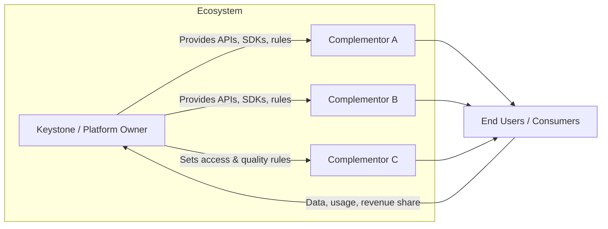

## Ecosystem Strategy and Multi-Sided Markets

### Overview

Ecosystem strategy is a school of strategic management concerned with how firms create and capture value not through vertically integrated control of a value chain, but through the orchestration of a network of loosely coupled, semi-autonomous partners — suppliers, complementors, developers, and even competitors — around a shared value proposition. Multi-sided markets (MSMs), also called multi-sided platforms (MSPs), are the dominant organizational structure through which modern ecosystem strategy is executed: a platform that creates value primarily by enabling direct interactions between two or more distinct customer or participant groups.

This topic represents a departure from the classical resource-based and positioning views of strategy, which largely assume a single firm competing against other single firms for a fixed pool of customer value. Ecosystem and platform strategy instead treats value creation as emergent from the interactions between multiple actors, and treats strategy as substantially concerned with *governance design* rather than only competitive positioning.

### Foundational Distinction: Pipelines vs. Platforms

**Key Points**

- **Pipeline (linear) business**: value is created upstream and consumed downstream in a fixed sequence — the firm designs the product, manufactures it, and sells it to a consumer. Value flows in one direction.
- **Platform business**: value is created by facilitating exchange or interaction between two or more sides. The platform firm does not necessarily produce the core value-generating asset; it produces the matching and transaction infrastructure.
- Many contemporary firms are hybrids, using pipeline logic for some product lines and platform logic for others.

### Multi-Sided Markets: Core Economics

#### Network Effects

The defining economic feature of multi-sided markets is the presence of network effects (also called network externalities): the value of the platform to a user on one side depends on the number and quality of users on the other side(s).

**Key Points**

- **Same-side (direct) network effects**: value to a user increases with the number of *same-side* participants (e.g., a messaging app becomes more valuable as more of your contacts join)
- **Cross-side (indirect) network effects**: value to a user on Side A increases with the number of participants on Side B (e.g., a ride-sharing app is more valuable to riders as more drivers join, and more valuable to drivers as more riders join)
- Cross-side network effects can be **positive** (more of the other side increases value) or, less commonly, **negative** (e.g., more advertisers on a side can reduce end-user value if it increases ad clutter)

The cross-side network effect for a two-sided platform can be represented conceptually as:

$$V_A = f(n_B), \quad V_B = f(n_A)$$

where $V_A$ is the value realized by a participant on side A, and $n_B$ is the number of active participants on side B, and vice versa. This creates a **chicken-and-egg problem**: side A will not join without side B present in sufficient numbers, and vice versa, making early-stage platform bootstrapping a distinct strategic challenge from linear product launches.

#### The Chicken-and-Egg Problem and Bootstrapping Strategies

**Key Points**

- **Single-side subsidization**: give away access or pay one side to join to attract critical mass, then monetize the other side (e.g., free basic accounts for consumers, paid listings for merchants)
- **Piggybacking**: launch on top of an existing network's user base to inherit initial liquidity (e.g., PayPal piggybacking on eBay's marketplace)
- **Follow-the-rabbit**: target a narrow, high-need niche first to achieve local liquidity before expanding (e.g., Facebook's initial restriction to Harvard students)
- **Micro-market sequencing**: launch fully in one small, geographically or demographically bounded market to reach liquidity, then replicate the playbook elsewhere (used extensively by ride-sharing and food-delivery platforms expanding city-by-city)
- **Seeding with fake or manual supply**: manually or artificially populating one side in the earliest phase to give the appearance of liquidity (has legal and reputational risk if undisclosed)

#### Platform Pricing Structure

A central strategic decision in multi-sided markets is which side to subsidize and which side to monetize — pricing is not symmetric across sides even when marginal cost is similar.

**Key Points**

- The side with more elastic demand (more price-sensitive, easier to attract elsewhere) is typically subsidized
- The side that captures more surplus once liquidity exists is typically the paying side
- Pricing decisions must account for the cross-side elasticity, not just each side's own-price elasticity, because a price change on Side A affects participation on Side B, which in turn affects the realized value on Side A

**Example**

Credit card networks subsidize cardholders (low or no annual fees, cashback rewards) while charging merchants an interchange fee, because merchant acceptance value depends heavily on cardholder volume, and cardholders are comparatively price-sensitive to switching between card products.

### Platform Governance and Ecosystem Roles

Ecosystem strategy requires the orchestrating firm ("keystone" or "platform owner") to design rules governing participation, without directly controlling every participant.

**Key Points**

- **Keystone/Orchestrator**: the firm that designs and maintains the platform's core infrastructure, rules, and interfaces (e.g., the OS provider)
- **Complementors**: third parties who build products or services that add value to the core platform (e.g., app developers)
- **Governance mechanisms**: access rules (open vs. closed), quality control (review/approval processes), revenue-sharing terms, and API/SDK design that shapes what complementors *can* build

**Governance tension**: openness increases the pace and variety of complementary innovation but reduces the platform owner's control over quality and user experience; closedness increases control and monetization capture but slows the rate of ecosystem-generated innovation and can deter complementor investment. This is often framed as the **openness-control tradeoff**.

### Value Capture Mechanisms in Platform Ecosystems

**Key Points**

- **Transaction fees**: a percentage or flat fee per interaction facilitated (marketplace commissions)
- **Subscription/access fees**: recurring fee for platform access, independent of usage volume
- **Freemium with tiered monetization**: free base tier funded by a paid tier or by monetizing a different side entirely
- **Data monetization**: aggregated behavioral or transactional data used for targeted advertising or sold as insights (subject to increasing legal/regulatory constraint — see Legal factors in PESTEL)
- **Advertising**: a third side (advertisers) monetized separately from the core two interacting sides (e.g., a search engine monetizes advertisers while providing search free to users, who interact indirectly with content providers)

### Winner-Take-All Dynamics and Multi-Homing

**Key Points**

- Strong network effects combined with low switching costs can produce **winner-take-all** or **winner-take-most** market structures, since users converge on the platform with the largest existing network
- **Multi-homing** — the practice of a user or complementor participating in multiple competing platforms simultaneously — weakens winner-take-all dynamics, since it reduces the switching cost and lock-in that would otherwise concentrate all users on one platform
- Platforms structurally favor **single-homing** environments through exclusivity terms, loyalty programs, or high data-portability friction, because single-homing preserves the value of accumulated network size as a competitive moat
- [Inference] The degree of winner-take-all concentration observed empirically across platform markets varies significantly by industry, and is moderated by regulatory intervention, interoperability mandates, and the ease of multi-homing specific to that market's switching costs

### Ecosystem Strategy vs. Traditional Competitive Strategy

| Dimension | Traditional (Pipeline) Strategy | Ecosystem/Platform Strategy |
| --- | --- | --- |
| Unit of competition | Firm vs. firm | Ecosystem vs. ecosystem |
| Value creation locus | Internal value chain | Interactions between external participants |
| Core asset | Proprietary product/process | Network of participants + governance rules |
| Growth constraint | Internal capacity, capital | Achieving critical mass / liquidity |
| Key strategic lever | Cost/differentiation positioning (Porter) | Network effects, complementor incentive design |
| Primary risk | Competitive imitation | Ecosystem fragmentation, disintermediation, low-quality complements |

### Strategic Risks Specific to Ecosystem Strategy

**Key Points**

- **Disintermediation risk**: participants on either side may learn to transact directly, bypassing the platform once introduced (common in freelance marketplaces and B2B platforms)
- **Envelopment**: an adjacent platform with an overlapping user base bundles in a competing feature, absorbing the incumbent platform's function as a secondary feature of its own offering
- **Complementor rebellion**: if the platform owner extracts too much value (e.g., raising fees, cloning a popular complementor's feature — sometimes termed "platform envelopment" at the complementor level), complementors may exit or multi-home to reduce dependency
- **Regulatory intervention**: dominant platforms increasingly face antitrust scrutiny specifically because of network-effect-driven concentration (a Legal/Political factor under PESTEL analysis)
- **Quality control failure**: open governance models risk reputational damage from low-quality or bad-faith complementor behavior at scale

### Worked Example: Ride-Sharing as a Multi-Sided Market

| Element | Description |
| --- | --- |
| Side A | Riders (demand side) |
| Side B | Drivers (supply side) |
| Cross-side effect | More drivers → shorter wait times for riders; more riders → higher earnings potential for drivers |
| Bootstrapping strategy | Micro-market sequencing (city-by-city launch with driver incentives to seed early supply) |
| Pricing structure | Riders pay per trip; platform takes a commission from driver earnings; driver side is often subsidized early via bonuses to solve the cold-start problem |
| Governance mechanism | Driver rating system, acceptance-rate requirements, dynamic (surge) pricing algorithm |
| Key ecosystem risk | Disintermediation is low (trip-based, low repeat-pairing) but regulatory risk (worker classification law) is high |

**Conclusion**

This example demonstrates that a platform's specific strategic priorities — which side to subsidize, how to bootstrap, and which risks dominate — are derivable directly from the underlying network-effect structure and the transaction characteristics (frequency, trust requirements, geographic boundedness) of that specific market, rather than from generic platform strategy prescriptions.

### Diagram: Two-Sided Platform Value Flow (svg_diagram)

<svg xmlns="http://www.w3.org/2000/svg" viewBox="0 0 560 320" font-family="Helvetica, Arial, sans-serif">
<text x="280" y="22" text-anchor="middle" font-size="15" font-weight="bold" fill="#1a1a1a">Two-Sided Platform Value Flow (svg_diagram)</text>

<rect x="220" y="130" width="120" height="60" rx="8" fill="#2c3e50" />
<text x="280" y="165" text-anchor="middle" font-size="13" fill="#fff" font-weight="bold">Platform</text>

<rect x="30" y="130" width="120" height="60" rx="8" fill="#2980b9" />
<text x="90" y="165" text-anchor="middle" font-size="13" fill="#fff" font-weight="bold">Side A (e.g. Users)</text>

<rect x="410" y="130" width="120" height="60" rx="8" fill="#c0392b" />
<text x="470" y="165" text-anchor="middle" font-size="13" fill="#fff" font-weight="bold">Side B (e.g. Merchants)</text>

<line x1="150" y1="150" x2="218" y2="150" stroke="#333" stroke-width="2" marker-end="url(#arrow)" />
<text x="185" y="140" text-anchor="middle" font-size="10">Access fee ↓</text>

<line x1="218" y1="170" x2="150" y2="170" stroke="#333" stroke-width="2" marker-end="url(#arrow)" />
<text x="185" y="188" text-anchor="middle" font-size="10">Subsidized value ↑</text>

<line x1="342" y1="150" x2="408" y2="150" stroke="#333" stroke-width="2" marker-end="url(#arrow)" />
<text x="375" y="140" text-anchor="middle" font-size="10">Reach to Side A</text>

<line x1="408" y1="170" x2="342" y2="170" stroke="#333" stroke-width="2" marker-end="url(#arrow)" />
<text x="375" y="188" text-anchor="middle" font-size="10">Transaction fee ↑</text>

<path d="M 90 130 Q 280 40 470 130" fill="none" stroke="#27ae60" stroke-width="2" stroke-dasharray="6,3" />
<text x="280" y="60" text-anchor="middle" font-size="11" fill="#27ae60" font-weight="bold">Cross-side network effect</text>
</svg>

### Ecosystem Strategy and AI/Digital Platforms

**Key Points**

- AI-driven platforms introduce a data-side network effect distinct from classical user-side effects: model quality improves with usage data volume, which attracts more users, which generates more data (a **data network effect** loop)
- Foundation-model providers exhibit ecosystem dynamics where "complementors" are developers building applications on top of an API, and governance decisions (API pricing, rate limits, usage policies) function analogously to classical platform governance
- [Speculation] The extent to which data network effects produce durable competitive moats comparable to classical user-side network effects is a subject of ongoing strategic and academic debate, since data value can exhibit diminishing returns past a certain volume threshold and can be partially substituted by synthetic data generation

### Limitations and Critiques of Ecosystem Strategy Frameworks

**Key Points**

- Network effect strength is often asserted qualitatively without rigorous measurement, leading to overinvestment based on assumed rather than demonstrated network dynamics
- Framework emphasis on growth and liquidity can understate the importance of unit economics, leading historically to platform business models that scale user counts without a clear or sustainable path to profitability
- Governance design prescriptions (open vs. closed) are context-dependent and do not generalize cleanly across industries with different trust, safety, and regulatory requirements
- Winner-take-all narratives can be overstated; many platform markets settle into stable oligopolies rather than single-winner outcomes, particularly where multi-homing is low-cost

### Related Topics

- Porter's Five Forces Framework (industry structure comparison)
- Network Effects and Metcalfe's Law
- Two-Sided Market Pricing Theory (Rochet-Tirole)
- Blue Ocean Strategy
- Business Model Canvas
- Digital Transformation Strategy
- Platform Governance and Antitrust Regulation
- Data Network Effects and AI Moats
- Disruptive Innovation Theory (Christensen)
- Complementary Assets and Value Appropriation (Teece)