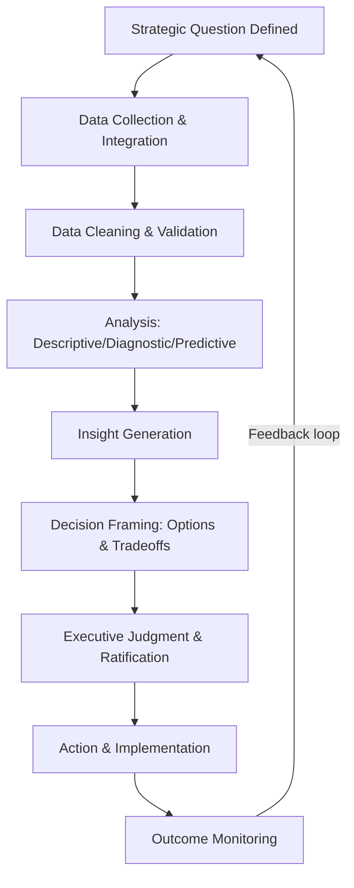

## Data-Driven Strategic Decision-Making

### Overview

Data-driven strategic decision-making (DDSDM) refers to the systematic use of quantitative data, analytics, and evidence to inform strategic choices, as opposed to reliance primarily on managerial intuition, experience-based heuristics, or unstructured judgment. It represents a shift in the epistemology of strategy formulation: from strategy as an art grounded in executive experience toward strategy as a discipline that treats organizational and market data as a primary input, subject to the same rigor as financial analysis.

This does not imply the elimination of judgment from strategic decision-making. Rather, the dominant contemporary framing treats data-driven and intuition-driven approaches as complements: data narrows the space of viable options and quantifies uncertainty, while judgment remains necessary to interpret ambiguous signals, weigh factors not captured in available data, and make the final call under residual uncertainty.

### Historical and Theoretical Context

**Key Points**

- Emerged from the broader convergence of business intelligence (BI), the "Big Data" movement of the 2010s, and increased computational capacity for analytics
- Draws on the strategy-as-practice research stream, which examines how strategists actually use tools and data in daily strategic work, as distinct from normative strategy theory
- Related to (but distinct from) evidence-based management, a broader movement advocating for management decisions grounded in the best available scientific and organizational evidence
- Advances in AI/ML expanded DDSDM from primarily descriptive and diagnostic analytics toward predictive and prescriptive analytics at the strategic level

### The Analytics Maturity Hierarchy

A standard way to characterize the sophistication of an organization's data-driven decision-making capability is the four-stage analytics maturity model.

**Key Points**

- **Descriptive analytics** — "What happened?" Summarizes historical data (dashboards, reports, KPIs)
- **Diagnostic analytics** — "Why did it happen?" Identifies causal or correlational drivers behind observed outcomes
- **Predictive analytics** — "What is likely to happen?" Uses statistical or machine learning models to forecast future states
- **Prescriptive analytics** — "What should we do about it?" Recommends or automates specific actions based on predicted outcomes and optimization

Strategic maturity increases with progression along this hierarchy, but each stage also requires progressively higher-quality data infrastructure, analytical talent, and organizational trust in the outputs. [Inference] Many organizations self-report ambitions toward prescriptive analytics while their actual operational capability remains concentrated at the descriptive or diagnostic stage; this gap is frequently cited in practitioner literature as a primary cause of failed "data-driven transformation" initiatives.

### Core Components of a Data-Driven Strategic Decision Process

#### Data Infrastructure and Governance

**Key Points**

- **Data architecture**: the systems (data warehouses, data lakes, lakehouses) that store and structure organizational data for analysis
- **Data governance**: policies determining data ownership, quality standards, access control, and lineage tracking
- **Data quality dimensions**: accuracy, completeness, consistency, timeliness, and validity — poor quality in any dimension propagates directly into flawed strategic conclusions ("garbage in, garbage out")
- **Master data management**: ensuring a single, consistent version of core business entities (customers, products, suppliers) across systems that would otherwise produce conflicting figures

#### Analytical Capability

**Key Points**

- Statistical inference and hypothesis testing to distinguish genuine signal from noise
- Predictive modeling (regression, time-series forecasting, machine learning classifiers) for forward-looking strategic questions (demand forecasting, churn prediction, market sizing)
- Causal inference methods (A/B testing, natural experiments, difference-in-differences, instrumental variables) to distinguish correlation from causation — critical because naive correlational analysis is a common source of strategic misjudgment
- Optimization techniques (linear programming, simulation) for prescriptive resource-allocation decisions

**Example**

A retailer observing that stores with loyalty program members have higher average revenue cannot conclude the loyalty program *causes* higher revenue without addressing selection bias — customers who already spend more may be more likely to join a loyalty program in the first place. A properly designed causal inference approach (e.g., a randomized rollout or matched control group) is needed before the loyalty program is scaled as a strategic initiative on the strength of that correlation.

#### Decision Rights and Process Integration

**Key Points**

- Data-driven decision-making requires embedding analytical outputs into the actual governance process where strategic decisions are ratified (e.g., board decks, executive committee reviews), not merely producing analysis that is generated but not consulted
- Clear designation of which decisions are delegated to data-driven automated rules versus which remain subject to executive judgment informed by data
- Organizational incentive alignment: decision-makers must be incentivized to act on data-driven findings even when they conflict with prior beliefs or established practice

### The HiPPO Problem

**Key Points**

- "HiPPO" (Highest Paid Person's Opinion) is a widely used practitioner term describing the tendency for the most senior person's judgment to override data-driven findings in organizational decision-making, regardless of the analytical evidence
- Overcoming HiPPO dynamics is frequently cited as a cultural rather than technical challenge — it requires leadership modeling openness to being wrong based on evidence, and structuring decision forums so that data is presented and debated before opinions are anchored
- [Unverified] The precise organizational conditions under which HiPPO dynamics are successfully overcome are not standardized in the literature and vary substantially by industry and leadership culture

### Framework: The Data-to-Decision Pipeline

**Key Points**

- The pipeline is iterative, not linear: outcome monitoring feeds back into the definition of future strategic questions, forming a continuous learning loop
- A common failure mode is skipping directly from data collection to decision framing without adequate validation of data quality (Step C), producing confidently wrong conclusions

### Worked Example: Market Entry Decision

| Stage | Data-Driven Input | Traditional/Judgment Input |
| --- | --- | --- |
| Market sizing | Census data, industry reports, transaction data from analogous markets | Executive experience with similar past launches |
| Demand forecasting | Regression model using demographic and macroeconomic covariates (linking to PESTEL Economic/Social factors) | Sales team qualitative pipeline estimates |
| Competitive response prediction | Game-theoretic simulation or historical pattern analysis of competitor reactions to past entries | Executive judgment on competitor culture and likely aggressiveness |
| Go/no-go decision | Expected NPV distribution from Monte Carlo simulation across demand scenarios | Risk appetite and strategic fit judgment by leadership |

**Conclusion**

This example illustrates the complementary framing central to mature DDSDM practice: data narrows uncertainty and quantifies expected outcomes across scenarios, but the final go/no-go decision — particularly the risk tolerance applied to the resulting probability distribution — remains an executive judgment call informed, but not replaced, by the analysis.

### Statistical Foundation: Expected Value Under Uncertainty

Strategic decisions under uncertainty are frequently formalized using expected value calculations across weighted scenarios, a direct quantitative link between data-driven forecasting and classical decision theory:

$$EV = \sum_{i=1}^{n} p_i \cdot V_i$$

where $p_i$ is the estimated probability of scenario $i$ (derived from predictive modeling or scenario planning) and $V_i$ is the value (e.g., NPV) of the outcome under that scenario. Data-driven approaches primarily improve the quality of the $p_i$ estimates; they do not eliminate the need for judgment in defining the scenario set itself or in setting the firm's risk tolerance for the resulting distribution.

### Risks and Limitations of Data-Driven Strategic Decision-Making

**Key Points**

- **Overfitting to historical data**: models trained on past patterns may fail during structural breaks (e.g., a pandemic, a regulatory shift) that invalidate the historical relationships the model relies on
- **False precision**: quantitative outputs can convey unwarranted confidence, especially when underlying data quality or model assumptions are weak
- **Data availability bias**: strategic questions get shaped by what is measurable rather than what is most strategically important, if organizations over-index on quantifiable factors at the expense of well-reasoned but harder-to-quantify considerations
- **Algorithmic and data bias**: historical data can encode past discriminatory practices or market conditions, propagating bias into predictive models used for strategic decisions (e.g., in hiring, lending, or market targeting)
- **Analysis paralysis**: excessive data-gathering and validation can slow decision velocity below what competitive conditions require
- **Privacy and legal constraints**: data collection and usage are increasingly bound by data protection regulation (a direct link to Legal factors in PESTEL analysis), constraining what data can be collected or how it can be used in decision models

### Data-Driven Decision-Making and AI Integration

**Key Points**

- Machine learning models increasingly automate portions of the predictive and prescriptive analytics stages, shifting the human strategic role toward model oversight, scenario interpretation, and edge-case judgment
- Generative AI tools are increasingly used to accelerate the analysis and insight-generation stages (synthesizing qualitative data, drafting scenario narratives), though outputs require validation given known model limitations around hallucination and training-data recency
- [Speculation] The degree to which AI-augmented decision pipelines will shift decision authority away from human executives toward increasingly autonomous prescriptive systems remains an actively contested question in both strategy practice and organizational theory literature, with significant variation expected by industry, regulatory environment, and the reversibility/stakes of the decision in question

### Organizational Prerequisites for Effective Data-Driven Strategy

**Key Points**

- Executive sponsorship and modeled behavior of evidence-based decision-making at the top of the organization
- Investment in data literacy across management levels, not only within a centralized analytics function
- A data infrastructure capable of delivering timely, trustworthy data to decision-makers rather than analysts working from fragmented or stale sources
- Clear escalation paths for when data-driven findings conflict with established strategic direction
- A tolerance for decisions that data reveals to be suboptimal, without this discouraging future data-driven scrutiny (a form of psychological safety applied to analytical findings)

### Related Topics

- Business Intelligence and Analytics Architecture
- Behavioral Strategy and Cognitive Biases in Decision-Making
- Scenario Planning and Strategic Foresight
- Evidence-Based Management
- A/B Testing and Causal Inference Methods
- Key Performance Indicators (KPI) Design
- Balanced Scorecard Framework
- Organizational Learning and the Feedback Loop
- AI Governance in Corporate Decision-Making
- Real Options Analysis for Strategic Investment Under Uncertainty