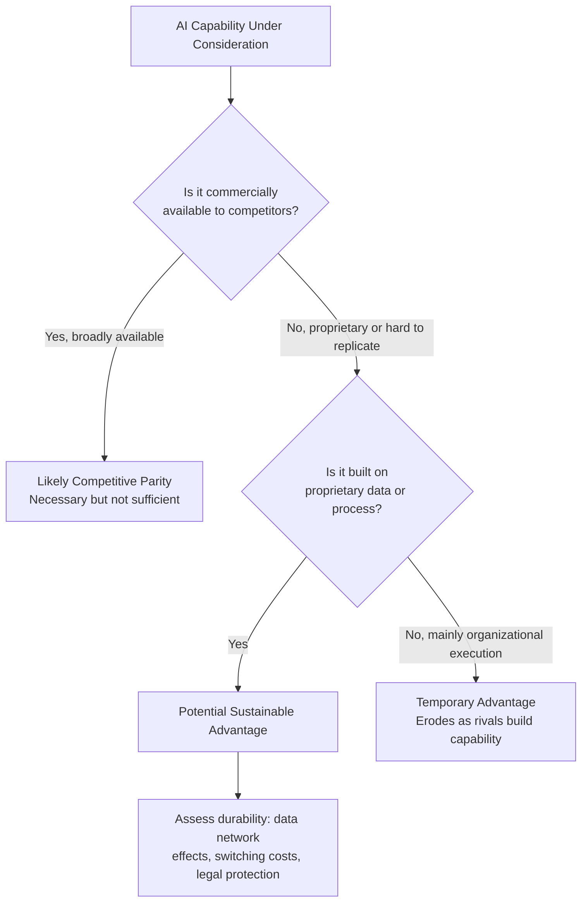

## Artificial Intelligence Strategy for Competitive Advantage

### Overview

AI strategy for competitive advantage concerns how organizations deliberately deploy artificial intelligence capabilities to build defensible, sustained performance advantages over rivals, as opposed to using AI as a set of isolated efficiency tools. It extends classical competitive advantage theory (the resource-based view, dynamic capabilities, and Porter's positioning framework) into a domain where the key resource — data, model capability, and algorithmic infrastructure — has economic properties distinct from traditional physical or even most intangible assets.

The central strategic question is not "should we adopt AI" but "under what conditions does AI adoption produce a *sustainable* advantage rather than a temporary one that rivals quickly replicate," given that AI tooling itself (cloud infrastructure, foundation models, ML frameworks) is increasingly commoditized and available to competitors on similar commercial terms.

### AI Strategy Within Existing Strategic Frameworks

#### Resource-Based View (RBV) and VRIO Applied to AI

Sustainable competitive advantage under the RBV requires a resource to be **V**aluable, **R**are, **I**nimitable, and supported by **O**rganizational capability to exploit it (VRIO). Applying this lens to AI-related resources clarifies where genuine advantage is likely versus unlikely to arise.

**Key Points**

- **Foundation models and general AI tooling**: largely fail the "Rare" test — commercially available via API to any competitor, and increasingly commoditized. Access to a capable LLM is not, by itself, a source of sustainable advantage.
- **Proprietary training data**: can satisfy Valuable and Rare, and if legally protected or operationally difficult to replicate (e.g., years of proprietary transaction or sensor data), can approach Inimitable
- **Domain-specific fine-tuned models and workflows**: may be Rare and Inimitable if they encode tacit organizational knowledge that is difficult for competitors to reverse-engineer
- **Organizational capability to deploy AI effectively** (data infrastructure, change management, workflow redesign, talent) is frequently the binding constraint — many firms have comparable access to models and data but differ sharply in their ability to operationalize them into decisions and products; this often satisfies the "Organization" criterion of VRIO better than the underlying technology does

**Conclusion**

Under RBV logic, sustainable AI-driven advantage is more likely to arise from proprietary data assets and organizational execution capability than from access to AI models or infrastructure per se, since the latter is increasingly available to all competitors on comparable terms.

#### Dynamic Capabilities and AI

**Key Points**

- Teece's dynamic capabilities framework (sensing, seizing, transforming) maps onto AI strategy as: sensing market/technology shifts via AI-enabled analytics, seizing opportunities by rapidly deploying AI-driven products or processes, and transforming organizational structures and workflows to sustain AI-driven advantage as conditions change
- Because AI capability and the competitive landscape for AI tooling evolve rapidly, the *capability to continuously re-configure* AI-related resources is argued to be more strategically important than any single AI deployment, consistent with dynamic capabilities theory's emphasis on capability renewal over static resource possession

### Sources of AI-Driven Competitive Advantage

#### Data Network Effects and Proprietary Data Moats

**Key Points**

- A **data network effect** arises when product usage generates data that improves the product (via model retraining), which attracts more usage, in a reinforcing loop
- The durability of a data-driven moat depends on: (1) whether the data is proprietary and difficult for competitors to acquire or replicate, (2) whether returns to additional data are still increasing or have plateaued, and (3) whether synthetic data generation or transfer learning allows competitors to approximate the advantage without equivalent proprietary data volume
- [Inference] The strength of data network effects as a durable moat is likely narrower than commonly assumed in practitioner discourse, because model performance frequently exhibits diminishing returns to additional data past a threshold, and because foundation models pretrained on broad data reduce the marginal value of proprietary data for many general-purpose tasks; the advantage is more durable in narrow, specialized domains with genuinely scarce or hard-to-replicate data

#### Process and Workflow Transformation

**Key Points**

- Advantage from embedding AI directly into core operational workflows (supply chain optimization, dynamic pricing, fraud detection, predictive maintenance) rather than as a bolt-on tool
- Advantage compounds when AI-driven process improvements are combined with organizational learning loops, so that operational data continuously refines the deployed models
- This category of advantage is more durable than pure tooling access because it requires organizational and process redesign that competitors cannot copy simply by licensing the same technology

#### Talent and Organizational Capability

**Key Points**

- ML/AI engineering talent, applied research capability, and cross-functional teams that can translate model outputs into product and operational decisions
- Organizational capability to manage AI-specific risk (model drift, bias, explainability requirements) at scale
- Change management capability to drive adoption of AI-augmented workflows among frontline employees, which is frequently the binding constraint on realized value rather than model quality itself

#### Ecosystem and Platform Positioning

**Key Points**

- Firms positioned as AI infrastructure or platform providers (cloud AI services, foundation model APIs) can capture ecosystem-level advantage via complementor lock-in and developer ecosystem effects (see Ecosystem Strategy and Multi-Sided Markets)
- Firms positioned as AI application builders on top of third-party infrastructure face a different risk profile: dependency on upstream platform pricing and policy decisions, and vulnerability to the platform provider entering their market segment directly ("platform envelopment")

### Framework: The AI Strategic Advantage Assessment Matrix

### Worked Example: AI Strategy in Retail

| Strategic Element | Parity-Level (Widely Available) | Potential Advantage Source |
| --- | --- | --- |
| Generic demand forecasting model | Off-the-shelf ML forecasting tools available to all competitors | Proprietary point-of-sale and supply chain data spanning years, feeding a fine-tuned model competitors cannot replicate without equivalent data history |
| Chatbot customer service | Foundation-model-based chatbots widely accessible via API | Deep integration with proprietary order/inventory systems enabling accurate, context-aware responses competitors' generic bots cannot match |
| Personalized recommendations | Standard collaborative filtering algorithms are commoditized | Proprietary behavioral data combined with organizational capability to rapidly A/B test and iterate recommendation logic |

**Conclusion**

This example illustrates the VRIO-consistent pattern across AI strategy generally: the AI *technique* is rarely the differentiator, while the *proprietary data feeding it* and the *organizational speed of iteration* are the more plausible sources of durable advantage.

### Risk Considerations Specific to AI Strategy

**Key Points**

- **Commoditization risk**: rapid diffusion of foundation model capability compresses the temporary advantage window for any given AI application, requiring continuous reinvestment to maintain relative position
- **Regulatory risk**: AI governance regulation (algorithmic accountability, data protection, sector-specific AI rules) is an evolving Legal/Political factor under PESTEL analysis that can constrain deployment options or impose compliance costs asymmetrically across firms
- **Bias and reputational risk**: models trained on historical data can encode and amplify existing biases, creating legal, ethical, and brand risk if deployed in consequential decisions (hiring, lending, pricing)
- **Overinvestment risk**: strategic AI initiatives pursued primarily due to competitive or investor pressure ("AI FOMO") without a clear path to defensible advantage or ROI
- **Talent and infrastructure lock-in**: dependency on a specific AI vendor's infrastructure or model family can create switching costs and strategic vulnerability if that vendor's pricing, capability, or policies change

[Unverified] The long-run equilibrium industry structure resulting from widespread foundation model commoditization — whether it favors a small number of infrastructure providers capturing most value, or a broad base of application-layer firms capturing value through domain-specific data and workflow integration — remains an open and actively debated question in both academic and practitioner strategy literature as of this writing.

### Building an AI Strategy: Sequential Considerations

**Steps**

1. **Identify the strategic objective** — cost reduction, differentiation, new market creation, or defensive parity — since the appropriate AI investment differs substantially by objective
2. **Audit data assets** — assess which proprietary data the firm holds that could support a defensible AI application, distinct from data any competitor could access
3. **Assess build-vs-buy** — determine whether to build proprietary models, fine-tune existing foundation models, or integrate third-party AI services, based on the source of intended advantage identified in Step 2
4. **Redesign workflows, not just tools** — identify which operational or decision processes must be redesigned around AI outputs to realize value, rather than layering AI onto unchanged processes
5. **Establish governance** — define model risk management, bias monitoring, and compliance processes appropriate to the regulatory environment
6. **Measure and iterate** — establish clear KPIs tied to the original strategic objective (Step 1) and build feedback loops for continuous model and process improvement

### Related Topics

- Resource-Based View (RBV) and VRIO Framework
- Dynamic Capabilities Theory (Teece)
- Ecosystem Strategy and Multi-Sided Markets
- Data-Driven Strategic Decision-Making
- Disruptive Innovation Theory
- Digital Transformation Strategy
- AI Governance and Algorithmic Accountability
- Build-vs-Buy Strategic Sourcing Decisions
- Blue Ocean Strategy
- Platform Envelopment and Complementor Risk