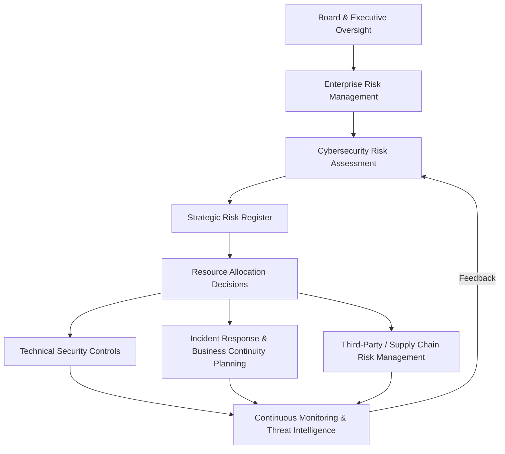

## Cybersecurity as a Strategic Consideration

### Overview

Cybersecurity as a strategic consideration concerns the elevation of information security from a purely technical, IT-function concern to a board-level and strategy-level determinant of enterprise value, competitive positioning, and organizational resilience. As firms digitize core operations, supply chains, and customer relationships, cybersecurity posture becomes directly coupled to business continuity, regulatory compliance, market trust, and — increasingly — competitive differentiation itself.

This represents a shift from a historically defensive, cost-center framing of cybersecurity ("prevent breaches") toward a strategic framing in which security posture is treated as a source of enterprise risk requiring board oversight, a factor in M&A due diligence and valuation, a determinant of customer and partner trust, and in some sectors a direct component of the value proposition offered to customers.

### Why Cybersecurity Is a Strategic (Not Only Technical) Issue

**Key Points**

- Breach events can produce direct financial loss (ransom payments, remediation costs, regulatory fines), indirect financial loss (customer attrition, stock price impact, increased cost of capital), and strategic loss (loss of competitive intellectual property, disrupted market entry timelines)
- Cybersecurity failures are increasingly a board-level fiduciary concern, with growing regulatory expectations (in various jurisdictions) for board-level cybersecurity expertise and disclosure of material incidents to investors — a direct Legal/Political factor under PESTEL analysis
- M&A due diligence increasingly includes cybersecurity posture assessment as a material valuation input, since acquired security liabilities (undisclosed prior breaches, weak infrastructure) can materially affect post-acquisition value realization
- Supply chain interdependency means a firm's cybersecurity exposure extends beyond its own perimeter to its vendors, partners, and customers (third-party and fourth-party risk), a structural feature of increasingly networked and platform-based business models (see Ecosystem Strategy and Multi-Sided Markets)
- In some sectors (financial services, healthcare, critical infrastructure, cloud services), demonstrated security posture and compliance certification function as a competitive differentiator and a precondition for enterprise sales, not merely a defensive necessity

### Cybersecurity Risk as a Category of Strategic Risk

#### Threat Landscape Overview

**Key Points**

- **Ransomware**: encryption of organizational data or systems with extortion demands, capable of halting core operations and, in critical infrastructure or healthcare contexts, posing physical safety risk
- **Data breach / exfiltration**: unauthorized access and theft of sensitive data (customer PII, intellectual property, trade secrets), with strategic consequences ranging from regulatory penalty to loss of competitive advantage if proprietary data (see AI Strategy for Competitive Advantage) is stolen
- **Supply chain attacks**: compromise of a trusted third-party vendor or software dependency used to gain access to the target organization, exploiting the interconnected nature of modern digital ecosystems
- **Business email compromise and social engineering**: exploitation of human rather than technical vulnerabilities, frequently the initial vector for larger breaches
- **Insider threat**: malicious or negligent actions by employees or contractors with legitimate system access
- **Nation-state and advanced persistent threats (APTs)**: sophisticated, sustained intrusion campaigns, often targeting intellectual property or critical infrastructure, introducing a geopolitical dimension directly linked to PESTEL Political factors

#### Strategic Consequences of Cyber Incidents

**Key Points**

- **Operational disruption**: direct halting of production, service delivery, or transaction processing during incident response and remediation
- **Financial impact**: direct costs (incident response, ransom, legal, regulatory fines) and indirect costs (customer churn, increased insurance premiums, credit rating impact)
- **Reputational damage**: erosion of customer and partner trust, particularly acute for firms whose value proposition depends on trust (financial services, healthcare, data-intensive platforms)
- **Competitive disadvantage**: loss of proprietary data or intellectual property to competitors or nation-state actors; delayed market entry due to incident recovery diverting strategic resources
- **Regulatory and legal exposure**: mandatory breach disclosure obligations, regulatory investigation, and potential litigation from affected parties

### Framework: Cybersecurity Risk Integration into Enterprise Strategy

**Key Points**

- Effective strategic integration requires a continuous feedback loop between technical monitoring and board-level risk assessment, rather than a one-directional reporting relationship where technical findings do not inform strategic resource allocation
- Cybersecurity risk assessment should feed directly into the same strategic risk register used for other categories of enterprise risk (financial, operational, legal), consistent with the integration principle discussed under Algorithmic Governance and Strategic Risk

### The Cybersecurity-Value Chain Linkage

**Key Points**

- Cybersecurity considerations increasingly intersect with core strategic frameworks: a firm's cost structure (security investment as a cost driver under Porter's generic strategies), differentiation potential (security/trust as a differentiator in B2B and regulated markets), and barriers to entry (regulatory security compliance requirements can raise entry barriers, a factor relevant to Five Forces analysis)
- Security-by-design in product development is increasingly treated as a strategic requirement rather than a late-stage technical add-on, particularly for firms building platforms or ecosystems where complementor and customer trust is foundational to the business model
- Cyber-insurance markets have emerged as a risk-transfer mechanism, but insurer underwriting increasingly requires demonstrated security maturity, effectively making baseline cybersecurity posture a precondition for risk-transfer options rather than a substitute for them

### Governance Structures for Strategic Cybersecurity Oversight

**Key Points**

- **Board-level oversight**: dedicated board risk or technology committees with cybersecurity expertise, or board-level briefings from the Chief Information Security Officer (CISO) at a cadence appropriate to the firm's risk exposure
- **CISO strategic positioning**: organizational placement of the CISO function (reporting line, executive team membership) signals and shapes the degree to which cybersecurity considerations are integrated into strategic decision-making versus treated as a subordinate IT function
- **Cross-functional risk committees**: integration of cybersecurity risk assessment with legal, compliance, and business unit leadership, particularly for decisions with cross-cutting exposure (new product launches, M&A, third-party vendor selection)
- **Incident response governance**: pre-defined escalation paths, communication protocols (including regulatory disclosure obligations and investor relations coordination), and business continuity plans tested via simulation exercises (tabletop exercises)

### Worked Example: Cybersecurity Considerations in M&A Due Diligence

| Due Diligence Dimension | Strategic Question |
| --- | --- |
| Historical incident disclosure | Has the target experienced undisclosed breaches that create latent legal or reputational liability post-acquisition? |
| Security infrastructure maturity | Does the target's security posture meet the acquirer's baseline, or does integration require material remediation investment? |
| Third-party and supply chain exposure | Does the target's vendor ecosystem introduce inherited risk exposure not present in the acquirer's existing risk profile? |
| Regulatory compliance status | Does the target operate in jurisdictions or sectors with cybersecurity compliance obligations that affect deal structuring or post-close integration timelines? |
| Intellectual property exposure | Has the target's proprietary data or IP (a potential source of competitive advantage per the resource-based view) been compromised in ways that diminish the strategic rationale for the acquisition? |

**Conclusion**

This example illustrates that cybersecurity due diligence directly affects valuation and deal structuring decisions, not merely post-close technical integration planning — a poorly governed target's security exposure can materially change the economic terms or strategic rationale of a transaction.

### Regulatory and Geopolitical Dimensions

**Key Points**

- Data breach disclosure requirements, data localization mandates, and sector-specific cybersecurity regulation vary substantially by jurisdiction, creating compliance complexity for multinational operations (a direct Legal factor under PESTEL)
- Geopolitical tensions increasingly manifest in cybersecurity strategy through export controls on security-relevant technology, sanctions affecting vendor relationships, and elevated nation-state threat activity tied to geopolitical events (a direct Political factor under PESTEL)
- [Unverified] The specific regulatory requirements governing breach disclosure timelines, data localization, and sector-specific cybersecurity obligations change frequently across jurisdictions and should be verified against current legal guidance applicable to the relevant jurisdiction and sector at the time of application

### Building Cybersecurity Into Strategic Planning

**Steps**

1. **Establish board-level accountability** — ensure cybersecurity risk is a standing item in board risk oversight, with clear reporting lines from technical security functions
2. **Integrate into enterprise risk management** — treat cybersecurity risk with the same rigor and strategic-register visibility as financial, operational, and legal risk categories
3. **Assess third-party and ecosystem exposure** — map vendor, partner, and platform dependencies for inherited risk, particularly relevant for firms operating within multi-sided or platform ecosystems
4. **Embed security-by-design in product and digital strategy** — treat security as a design constraint in new product and platform development rather than a post-launch remediation task
5. **Build and test incident response capability** — establish and regularly rehearse incident response and business continuity plans, including regulatory disclosure and stakeholder communication protocols
6. **Incorporate cybersecurity into M&A and partnership due diligence** — assess target and partner security posture as a material factor in transaction valuation and deal structuring

### Related Topics

- Algorithmic Governance and Strategic Risk
- Enterprise Risk Management (ERM) Frameworks
- PESTEL Analysis Framework (Legal and Political factors)
- Ecosystem Strategy and Multi-Sided Markets (third-party risk exposure)
- Corporate Governance and Board Oversight
- Mergers and Acquisitions Due Diligence
- Business Continuity and Crisis Management
- Data Protection and Privacy Law
- Artificial Intelligence Strategy for Competitive Advantage (data asset protection)
- Supply Chain Risk Management