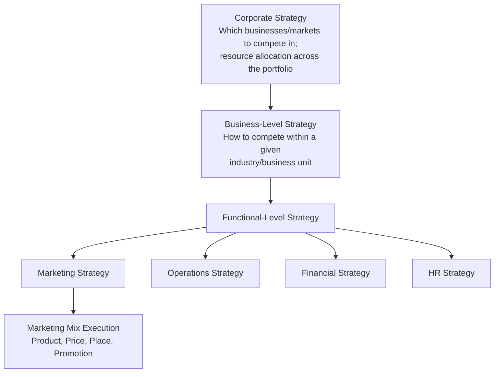

## Marketing Strategy Alignment with Corporate Strategy

### Overview

Marketing strategy alignment with corporate strategy concerns the vertical coherence between a firm's overarching corporate-level strategic direction and the specific marketing strategies, positioning choices, and marketing-mix decisions executed by the marketing function. This is a core application of the classical strategy hierarchy: corporate strategy defines *which businesses to compete in and how resources are allocated across them*; business-level (competitive) strategy defines *how to compete within a given business or industry*; and functional-level strategy — of which marketing strategy is one instance — defines *how each functional area executes in support of the business-level strategy*.

Misalignment between these levels is a well-documented source of strategic underperformance: a firm can possess a coherent corporate strategy and a well-resourced marketing function, yet fail to capture intended value if marketing activities are not deliberately calibrated to reinforce the chosen competitive positioning and corporate priorities.

### The Strategy Hierarchy and Marketing's Position Within It

**Key Points**

- Marketing strategy must be derived from, and consistent with, the business-level competitive strategy chosen (e.g., Porter's generic strategies: cost leadership, differentiation, or focus)
- Marketing strategy must also respect corporate-level resource allocation decisions and portfolio priorities — a business unit's marketing budget and mandate are shaped by its role in the corporate portfolio (see portfolio frameworks such as the BCG Growth-Share Matrix)
- Alignment is bidirectional in practice: while marketing strategy should be derived from corporate strategy, market intelligence gathered by the marketing function (customer insight, competitive positioning data) is also a legitimate strategic input that should inform corporate-level strategic reviews

### Mechanisms of Alignment

#### Alignment with Competitive (Business-Level) Strategy

**Key Points**

- **Cost leadership strategy** implies a marketing strategy emphasizing value/price messaging, broad distribution reach, and marketing spend efficiency (lower marketing cost as a percentage of revenue relative to differentiation-focused competitors)
- **Differentiation strategy** implies marketing investment in brand-building, premium positioning communication, and channels that reinforce perceived uniqueness, typically justifying higher marketing spend intensity
- **Focus strategy** (cost focus or differentiation focus) implies marketing strategy narrowly targeted at the defined niche segment, with messaging, channel selection, and product communication tailored specifically to that segment's needs rather than broad-market messaging

**Example**

A firm pursuing a cost-leadership strategy in a commodity product category (e.g., a discount retailer) that simultaneously invests heavily in premium brand-building campaigns exhibits a form of strategic misalignment: the marketing approach signals differentiation-level positioning inconsistent with the underlying cost-leadership value proposition, potentially confusing customer expectations and misallocating marketing resources relative to the chosen competitive basis.

#### Alignment with Corporate-Level Portfolio Strategy

**Key Points**

- Business units classified differently within a corporate portfolio (e.g., "star," "cash cow," "question mark," or "dog" under the BCG matrix) warrant different marketing strategic postures: cash cows typically receive marketing investment sufficient to defend market share efficiently rather than aggressive growth-oriented spend, while stars may warrant more aggressive marketing investment to capture growth
- Corporate brand architecture decisions (house of brands vs. branded house vs. hybrid) directly constrain marketing strategy options at the business-unit level — a business unit operating under a unified corporate brand has less latitude for independent positioning than one operating under a distinct sub-brand
- Cross-business marketing synergies (shared customer data, cross-selling opportunities, shared marketing infrastructure) are a corporate-level rationale for related diversification that only materializes if business-unit marketing strategies are designed with deliberate coordination rather than fully autonomous execution

#### Alignment Through Shared Strategic Objectives and Metrics

**Key Points**

- Marketing KPIs should be traceable to corporate strategic objectives (e.g., if the corporate strategy prioritizes market share growth in a specific geography, marketing metrics should include geography-specific share and awareness metrics, not only aggregate revenue metrics)
- Marketing planning cycles should be integrated with corporate strategic planning cycles, so that marketing budgets and campaign strategies are set with visibility into current corporate priorities rather than derived from the prior year's marketing plan by default
- Balanced Scorecard approaches are frequently used to operationalize this alignment, translating corporate strategic objectives into functional-level (including marketing) targets across customer, internal process, and learning/growth perspectives, in addition to financial metrics

### Common Sources of Misalignment

**Key Points**

- **Structural silos**: marketing functions operating with limited visibility into corporate strategic planning processes, resulting in marketing plans built on stale or incomplete strategic context
- **Incentive misalignment**: marketing performance metrics (e.g., campaign-level engagement, lead volume) that do not map to the corporate strategic objectives they are meant to serve, incentivizing activity that looks successful by functional metrics but does not advance strategic priorities
- **Brand-strategy drift**: gradual accumulation of marketing and brand decisions over time that collectively diverge from the originally intended competitive positioning, often without any single decision appearing misaligned in isolation
- **M&A integration failures**: acquired business units retaining pre-acquisition marketing strategies and brand positioning inconsistent with the acquirer's corporate strategic rationale for the acquisition
- **Decentralization tradeoffs**: highly decentralized organizational structures that grant business-unit marketing teams autonomy can produce strong business-level alignment at the cost of weaker corporate-level brand and strategic coherence across units

### Framework: Marketing-Corporate Alignment Diagnostic

**Steps**

1. **Clarify corporate strategic priorities** — confirm current corporate-level objectives (growth vs. margin, geographic priorities, portfolio role of the business unit) as the reference point for alignment assessment
2. **Map current marketing strategy against business-level competitive strategy** — verify that marketing mix decisions (positioning, pricing communication, channel investment) are consistent with the stated competitive basis (cost, differentiation, or focus)
3. **Trace marketing KPIs to corporate objectives** — verify that marketing's measured success metrics correspond to what corporate strategy defines as success, not solely functional-level activity metrics
4. **Assess resource allocation consistency** — confirm marketing budget allocation across products/segments/geographies reflects the business unit's role within the corporate portfolio
5. **Identify brand architecture constraints** — verify marketing positioning choices respect corporate brand architecture decisions rather than operating as an independent brand strategy
6. **Establish a recurring alignment review cadence** — integrate marketing strategic review into the corporate strategic planning cycle rather than treating marketing planning as an independent, functionally siloed process

### Worked Example: Alignment Assessment for a Diversified Consumer Goods Firm

| Corporate Strategic Element | Implication for Business-Unit Marketing Strategy |
| --- | --- |
| Corporate strategy prioritizes premiumization across the portfolio | Business-unit marketing strategies should shift emphasis toward premium positioning, quality-focused messaging, and channel selection favoring premium retail environments, even where prior marketing strategy emphasized value positioning |
| Business unit classified as a "cash cow" in the corporate portfolio | Marketing investment should prioritize efficient share defense (retention-focused campaigns, loyalty programs) over aggressive customer acquisition spend, reflecting the unit's role as a resource-generating rather than growth-priority unit |
| Corporate brand architecture is "house of brands" | Business-unit marketing retains latitude to develop distinct positioning and creative identity without deference to a unified corporate brand voice |
| Corporate strategy targets expansion into a new geographic region | Marketing strategy must incorporate market entry considerations (localization, channel development, brand awareness building) not previously required in the unit's mature, established markets |

**Conclusion**

This example illustrates that a single marketing strategy template cannot be applied uniformly across a diversified firm's business units — correct marketing strategy is contingent on both the specific competitive strategy chosen at the business level and that unit's specific role within the corporate portfolio, meaning alignment must be assessed and potentially revised whenever either corporate priorities or a unit's portfolio role changes.

### Diagram: Alignment vs. Misalignment Pattern (svg_diagram)

<svg xmlns="http://www.w3.org/2000/svg" viewBox="0 0 560 300" font-family="Helvetica, Arial, sans-serif">
<text x="280" y="22" text-anchor="middle" font-size="15" font-weight="bold" fill="#1a1a1a">Strategic Alignment vs. Misalignment (svg_diagram)</text>

<text x="140" y="55" text-anchor="middle" font-size="13" font-weight="bold" fill="`#27ae60`">Aligned</text>

<rect x="40" y="70" width="90" height="45" rx="6" fill="`#2c3e50`" />

<text x="85" y="97" text-anchor="middle" font-size="10" fill="#fff">Corporate: Cost Leadership</text>

<line x1="85" y1="115" x2="85" y2="145" stroke="`#27ae60`" stroke-width="2" marker-end="url(#arrowg)" />

<rect x="40" y="150" width="90" height="45" rx="6" fill="`#27ae60`" />

<text x="85" y="177" text-anchor="middle" font-size="10" fill="#fff">Marketing: Value Messaging</text>

<text x="420" y="55" text-anchor="middle" font-size="13" font-weight="bold" fill="`#c0392b`">Misaligned</text>

<rect x="370" y="70" width="90" height="45" rx="6" fill="`#2c3e50`" />

<text x="415" y="97" text-anchor="middle" font-size="10" fill="#fff">Corporate: Cost Leadership</text>

<line x1="415" y1="115" x2="415" y2="145" stroke="`#c0392b`" stroke-width="2" stroke-dasharray="4,3" marker-end="url(#arrowr)" />

<rect x="370" y="150" width="90" height="45" rx="6" fill="`#c0392b`" />

<text x="415" y="177" text-anchor="middle" font-size="10" fill="#fff">Marketing: Premium Branding</text>

<text x="280" y="240" text-anchor="middle" font-size="11" fill="#555">Alignment requires marketing execution to reinforce,</text>

<text x="280" y="255" text-anchor="middle" font-size="11" fill="#555">not contradict, the chosen competitive basis.</text>

</svg>

### Organizational Mechanisms That Support Alignment

**Key Points**

- Marketing leadership (CMO) participation in corporate strategic planning forums, ensuring marketing has both visibility into and input on corporate strategic direction
- Integrated planning calendars synchronizing corporate strategic review cycles with marketing budget and campaign planning cycles
- Shared strategic dashboards linking marketing KPIs directly to corporate-level strategic objectives, visible across both functional and corporate leadership
- Brand governance structures (particularly in multi-business-unit or "house of brands" corporate structures) that define the boundaries of business-unit marketing autonomy relative to corporate brand and positioning guardrails
- Regular strategic alignment reviews, particularly following corporate strategic pivots, M&A activity, or portfolio reclassification, since a business unit's optimal marketing strategy can change even without any change in the unit's own market conditions if its corporate portfolio role changes

### Related Topics

- Porter's Generic Competitive Strategies
- BCG Growth-Share Matrix and Portfolio Analysis
- Balanced Scorecard Framework
- Brand Architecture Strategy (House of Brands vs. Branded House)
- Corporate-Level Strategy and Diversification
- Strategy Implementation and Organizational Alignment
- Resource Allocation Across Business Units
- Mergers and Acquisitions Integration Strategy
- Segmentation, Targeting, and Positioning (STP)
- Strategic Planning Process and Cycles