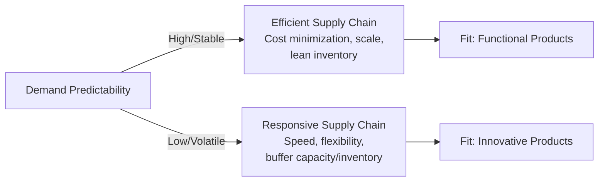

## Operations and Supply Chain Strategy

### Overview

Operations and supply chain strategy concerns the deliberate design and management of a firm's production, sourcing, logistics, and fulfillment systems in a manner that supports and reinforces its chosen business-level competitive strategy. As a functional-level strategy, it sits below business-level strategy in the strategy hierarchy (see Marketing Strategy Alignment with Corporate Strategy for the general hierarchy) and must be derived from, rather than independently determined apart from, the competitive basis the firm has selected — cost leadership, differentiation, or focus.

Operations strategy encompasses decisions about production processes, capacity, facility location, and quality management, while supply chain strategy extends this scope to encompass the network of suppliers, logistics providers, and distribution channels that convert raw inputs into delivered customer value. The two are treated jointly here because contemporary strategic practice increasingly integrates them: supply chain design decisions (e.g., supplier concentration, inventory positioning) are inseparable from operational decisions (e.g., production flexibility, quality control) in their effect on cost, responsiveness, and risk.

### Strategic Fit: Operations Strategy and Competitive Strategy

**Key Points**

- **Cost leadership strategy** implies operations strategy emphasizing scale economies, process standardization, capacity utilization maximization, and lean/waste-elimination methodologies, paired with a supply chain strategy favoring supplier consolidation for volume leverage and low-cost sourcing geographies
- **Differentiation strategy** implies operations strategy emphasizing quality control rigor, production flexibility to support product variation or customization, and potentially higher-cost but higher-reliability suppliers, paired with supply chain strategy favoring supplier relationships that support innovation, quality, or exclusivity rather than pure cost minimization
- **Focus strategy** implies operations and supply chain strategy scaled and specialized to the narrow target segment's specific requirements, which may not achieve the scale economies available to broad-market competitors but can achieve superior fit to the niche segment's needs

**Example**

A firm pursuing a differentiation strategy based on rapid product customization (e.g., made-to-order manufacturing) requires an operations strategy built around flexible, modular production processes and a supply chain strategy favoring suppliers capable of smaller, more frequent, and variable-specification deliveries — a fundamentally different sourcing and production configuration than a cost-leadership competitor optimizing for long production runs of standardized units.

### The Efficiency-Responsiveness Tradeoff

A central strategic tension in operations and supply chain design is the tradeoff between cost efficiency and responsiveness (flexibility, speed, service level).

**Key Points**

- **Efficient supply chains** prioritize cost minimization through economies of scale, high asset utilization, and lean inventory — appropriate when demand is predictable and cost competition is the primary basis of competition
- **Responsive supply chains** prioritize speed, flexibility, and service level, typically at higher unit cost — appropriate when demand is volatile or unpredictable, or when responsiveness itself is a differentiating factor valued by customers
- This tradeoff maps directly onto the classical **product-process matrix** concept: functional (efficient) products generally warrant efficient supply chains, while innovative (unpredictable-demand) products generally warrant responsive supply chains; a mismatch between product type and supply chain type is a well-documented source of poor supply chain performance
- [Inference] In practice, many contemporary supply chains attempt hybrid configurations (e.g., postponement strategies that delay product differentiation until closer to the point of demand certainty) rather than a pure efficient-or-responsive choice, reflecting the reality that a strict either/or framing understates the range of intermediate strategic options available

### Key Strategic Decisions in Operations Strategy

#### Facility and Capacity Strategy

**Key Points**

- **Location decisions**: proximity to markets (favoring responsiveness and reduced logistics cost/time) versus proximity to low-cost inputs or labor (favoring cost efficiency), a tradeoff directly linked to the firm's competitive basis
- **Capacity strategy**: "lead" capacity strategy (building ahead of demand to capture growth or preempt competitors) versus "lag" capacity strategy (building capacity only as demand materializes, minimizing the risk of stranded capacity) versus "match" strategy (incremental capacity additions tracking demand closely)
- **Facility focus**: whether facilities specialize by product, process, or market (a "focused factory" concept), trading production flexibility for depth of process expertise and typically higher efficiency in the focused domain

#### Make-vs-Buy and Vertical Integration Decisions

**Key Points**

- Vertical integration (bringing production stages in-house) versus outsourcing is a core operations-strategic decision with direct linkage to corporate strategy (vertical integration is itself a corporate diversification strategy) and to the resource-based view (integration is more strategically justified when the activity is a source of sustainable competitive advantage, per VRIO logic)
- Outsourcing offers flexibility and potential cost advantages (access to supplier specialization and scale) but introduces dependency risk, potential loss of proprietary process knowledge, and coordination costs
- Strategic sourcing decisions should assess not only current cost comparisons but the activity's strategic importance (is it a source of differentiation or advantage?) and the availability and reliability of qualified external suppliers over the relevant planning horizon

#### Quality Management Strategy

**Key Points**

- Quality strategy must be calibrated to the competitive basis: a differentiation strategy grounded in premium quality perception requires quality management systems (e.g., Total Quality Management, Six Sigma) capable of consistently meeting elevated specifications, while a cost-leadership strategy requires quality sufficient to avoid cost-increasing defects and returns without over-investing beyond what the value proposition requires
- Quality failures carry strategic risk beyond direct remediation cost, including reputational damage and, in regulated industries, legal and regulatory exposure

### Supply Chain Strategy: Core Structural Decisions

#### Supplier Base Strategy

**Key Points**

- **Single-sourcing** offers stronger negotiating leverage, potentially deeper collaborative relationships, and simplified coordination, but concentrates supply risk (a single point of failure)
- **Multi-sourcing** distributes risk and creates competitive pressure among suppliers on price and performance, but sacrifices some volume leverage and can complicate quality and process standardization
- **Supplier relationship depth**: transactional/arm's-length relationships suit commodity inputs where switching cost is low, while collaborative/strategic partnerships suit inputs central to differentiation or innovation, where joint investment and information-sharing generate mutual value not available in purely transactional relationships

#### Inventory and Network Design Strategy

**Key Points**

- **Inventory positioning** decisions (how much inventory to hold, and at which point in the supply chain — raw material, work-in-process, finished goods, and at which geographic nodes) directly trade off carrying cost against service level and responsiveness
- **Postponement strategy**: delaying final product differentiation or configuration until closer to the point of actual demand realization, reducing forecast risk exposure while preserving some efficiency benefits of standardized upstream production
- **Network design**: the number, location, and specialization of distribution nodes, balancing transportation cost, delivery speed, and inventory pooling benefits (risk pooling reduces aggregate safety stock requirements when demand across locations is imperfectly correlated)

#### Supply Chain Risk Management

**Key Points**

- Supply chain risk has grown in strategic prominence due to increased global sourcing complexity, geopolitical volatility (a direct PESTEL Political factor), and heightened awareness following major disruption events (natural disasters, pandemics, geopolitical conflict affecting trade routes)
- **Resilience strategies** include supplier diversification (geographic and count), strategic buffer inventory for critical inputs, dual-sourcing for single points of failure, and scenario planning for major disruption events
- A strategic tension exists between resilience-oriented redundancy (which typically raises cost) and lean efficiency (which typically reduces resilience) — firms must make an explicit strategic choice about the acceptable tradeoff given their competitive basis and risk tolerance, rather than defaulting to whichever approach is currently in vogue in practitioner discourse
- **Reshoring, nearshoring, and friend-shoring** trends represent strategic responses to supply chain risk and geopolitical considerations, trading some cost efficiency for reduced geopolitical and logistics risk exposure

### Framework: Operations/Supply Chain Strategy Alignment Diagnostic

**Steps**

1. **Confirm the business-level competitive strategy** — cost leadership, differentiation, or focus — as the reference point operations strategy must support
2. **Classify demand characteristics** — assess whether the relevant products/segments exhibit predictable (functional) or volatile (innovative) demand patterns to determine efficient vs. responsive supply chain fit
3. **Audit facility, capacity, and sourcing decisions against the competitive basis** — verify that location, capacity strategy, and supplier base decisions reinforce rather than undermine the chosen competitive positioning
4. **Assess vertical integration boundaries using VRIO logic** — determine whether currently outsourced or in-house activities should shift, based on whether they represent a source of sustainable advantage
5. **Evaluate risk exposure against resilience requirements** — assess whether current supplier concentration, inventory buffers, and network design provide a risk posture consistent with the firm's risk tolerance and the criticality of affected inputs
6. **Establish a recurring strategic review cadence** — given the sensitivity of optimal operations/supply chain configuration to shifting demand patterns, geopolitical conditions, and technology, formalize periodic reassessment rather than treating configuration as fixed

### Worked Example: Operations/Supply Chain Alignment for Two Contrasting Strategies

| Dimension | Cost-Leadership Furniture Manufacturer | Differentiation-Focused Custom Furniture Maker |
| --- | --- | --- |
| Facility strategy | Large centralized facilities maximizing scale economies | Smaller, flexible facilities enabling varied, lower-volume production runs |
| Capacity strategy | "Match" strategy tightly tracking demand to avoid excess capacity cost | "Lead" or flexible capacity strategy to accommodate variable, customized order volume |
| Supplier base | Consolidated, high-volume supplier relationships negotiated primarily on price | Smaller supplier base selected for material quality and flexibility in order size/specification |
| Inventory strategy | Lean inventory, high-turnover standardized SKUs | Postponement strategy — held as semi-finished components, configured to order |
| Quality management | Sufficient quality control to avoid cost-increasing defects at scale | Rigorous quality management directly supporting the premium/custom value proposition |
| Risk posture | Efficiency-weighted; some supply concentration accepted for cost leverage | Resilience-weighted for critical customizable materials; redundancy accepted despite cost |

**Conclusion**

This example demonstrates that there is no universally "better" operations or supply chain configuration in the abstract — correctness is defined entirely relative to the competitive strategy being supported, and a configuration that is well-designed for one competitive basis (e.g., the cost-leadership manufacturer's lean, consolidated approach) would represent clear strategic misalignment if applied to a firm competing on differentiation, and vice versa.

### Related Topics

- Porter's Generic Competitive Strategies
- Marketing Strategy Alignment with Corporate Strategy
- Resource-Based View (RBV) and VRIO Framework
- Vertical Integration and Corporate Diversification Strategy
- Total Quality Management and Six Sigma
- Supply Chain Risk Management and Resilience Planning
- PESTEL Analysis Framework (Political/geopolitical supply chain risk)
- Lean Management and Waste Elimination
- Strategic Sourcing and Procurement Strategy
- Product-Process Matrix