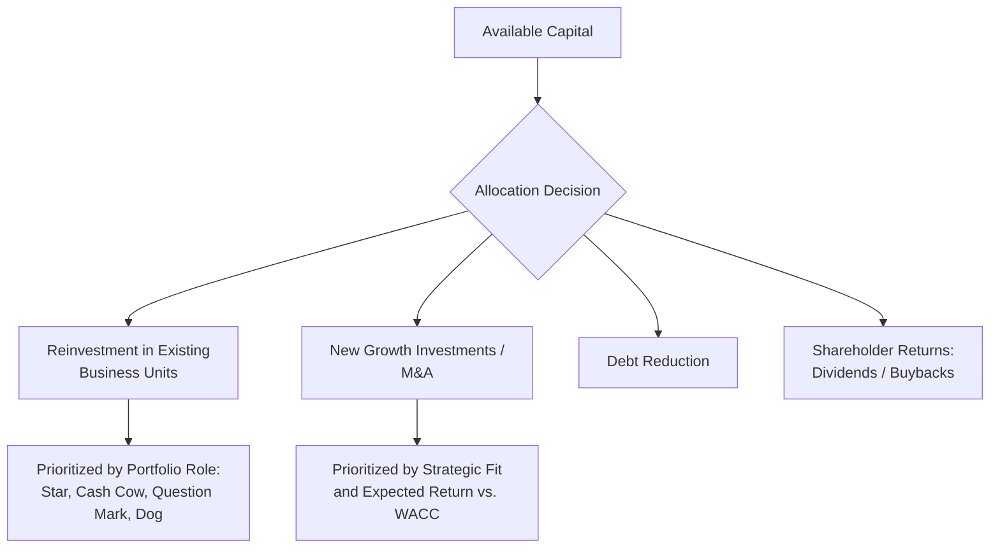

## Financial Strategy and Capital Allocation

### Overview

Financial strategy and capital allocation concerns how a firm raises, structures, and deploys financial capital in support of its corporate and business-level strategic objectives. As a functional-level strategy, it sits within the strategy hierarchy alongside marketing and operations strategy (see Marketing Strategy Alignment with Corporate Strategy for the general hierarchy), translating strategic priorities into decisions about capital structure, investment prioritization, and shareholder return policy.

Financial strategy is distinctive among functional strategies in that it directly constrains and enables all other functional strategies: marketing, operations, and technology investment decisions are ultimately bounded by the capital the firm can raise and chooses to allocate to each competing priority. Capital allocation is therefore frequently treated not merely as a financial-function task but as one of the most consequential recurring strategic decisions made at the corporate level.

### Financial Strategy Within the Strategy Hierarchy

**Key Points**

- Corporate strategy defines which businesses to compete in and the overall growth/portfolio ambition; financial strategy determines how the capital required to execute that ambition is raised and allocated across competing internal demands
- Business-level competitive strategy shapes financial strategy priorities: a cost-leadership strategy typically prioritizes capital efficiency and cost-of-capital minimization, while a differentiation or growth-focused strategy may justify higher capital intensity or willingness to accept a higher cost of capital to fund innovation and brand investment
- Financial strategy must also reconcile the sometimes-competing objectives of self-financed functional priorities (marketing, operations, technology) with corporate-level portfolio decisions and shareholder expectations

### Capital Structure Strategy

#### The Debt-Equity Tradeoff

**Key Points**

- **Debt financing** offers a lower cost of capital than equity (due to the tax deductibility of interest and debt's lower risk to the financier relative to equity) but introduces fixed repayment obligations that increase financial risk, particularly in cyclical or unpredictable-demand businesses
- **Equity financing** carries no fixed repayment obligation, providing greater financial flexibility during downturns, but is generally more expensive on a cost-of-capital basis and dilutes existing ownership
- The optimal capital structure balances the tax and cost advantages of debt against the increased financial risk (potential distress or bankruptcy cost) it introduces — a tradeoff formalized in corporate finance theory (e.g., the trade-off theory of capital structure) but subject to firm-specific and industry-specific considerations
- Capital structure decisions should be calibrated to business risk: firms in cyclical or high-uncertainty industries generally warrant more conservative (lower-leverage) capital structures to preserve financial flexibility, while firms with stable, predictable cash flows can typically sustain higher leverage without proportionally elevated distress risk

#### Weighted Average Cost of Capital (WACC)

The cost of capital is a central input to virtually all strategic investment decisions, since it represents the minimum required return a project or investment must generate to create value for capital providers.

$$WACC = \frac{E}{V} \cdot r_e + \frac{D}{V} \cdot r_d \cdot (1 - T_c)$$

where $E$ is the market value of equity, $D$ is the market value of debt, $V = E + D$ is total firm value, $r_e$ is the cost of equity, $r_d$ is the cost of debt, and $T_c$ is the corporate tax rate. The $(1 - T_c)$ term reflects the tax shield on debt interest, which is a primary reason debt is typically less expensive than equity on an after-tax basis.

**Key Points**

- WACC serves as the discount rate applied in net present value (NPV) analysis for evaluating strategic investments — a project must exceed the WACC to be value-creating for capital providers
- WACC is not a single firm-wide constant applied indiscriminately: project-specific or division-specific discount rates are theoretically preferable when a project's risk profile differs materially from the firm's average risk, since applying a blanket corporate WACC can lead to overinvestment in high-risk divisions and underinvestment in low-risk divisions
- Changes in the macroeconomic interest rate environment (a PESTEL Economic factor) directly affect WACC and, consequently, the set of strategic investments that clear the firm's minimum return threshold

### Capital Allocation Frameworks

#### Investment Prioritization Criteria

**Key Points**

- **Net Present Value (NPV)**: the theoretically preferred capital budgeting criterion, since it directly measures value creation in absolute currency terms and properly accounts for the time value of money
- **Internal Rate of Return (IRR)**: widely used in practice for its intuitive percentage-return framing, but subject to well-documented limitations (multiple IRR solutions for non-conventional cash flow patterns, and a reinvestment-rate assumption that can overstate attractiveness relative to NPV for certain cash flow profiles)
- **Payback period**: a simpler, liquidity-oriented criterion favored in some organizations for its intuitive appeal and emphasis on capital recovery speed, but it ignores cash flows beyond the payback threshold and does not directly measure value creation
- **Real options analysis**: treats certain strategic investments (particularly those with significant future flexibility, such as staged R&D or market entry) as analogous to financial options, capturing the strategic value of flexibility and the ability to abandon, expand, or delay that standard discounted cash flow analysis can understate

**Example**

A staged market-entry investment structured as an initial small pilot followed by an option to scale, contingent on pilot results, may appear less attractive under a naive single-scenario NPV analysis than a full immediate rollout, yet be strategically superior once the value of the embedded option to abandon or scale based on new information is properly accounted for.

#### Corporate-Level Capital Allocation Across the Portfolio

**Key Points**

- Portfolio frameworks (e.g., the BCG Growth-Share Matrix) provide a heuristic for capital allocation across business units: "cash cow" units generate capital in excess of their reinvestment needs, which is redeployed toward "star" or promising "question mark" units, rather than each unit's capital allocation being determined solely by its own generated cash flow
- Corporate capital allocation should be justified relative to alternative uses of the same capital (opportunity cost), not evaluated for each investment in isolation — a project with positive NPV in isolation may still be a suboptimal use of capital relative to a higher-NPV alternative competing for the same limited capital pool under capital rationing conditions
- [Inference] Persistent misallocation toward legacy "cash cow" businesses at the expense of higher-return growth opportunities is a commonly cited pattern in practitioner and academic critique of capital allocation practice, often attributed to organizational inertia, sunk-cost bias, or the political influence of established business unit leadership rather than to a rigorous return-based allocation process

### Shareholder Return Policy

**Key Points**

- **Dividends** provide a predictable, recurring return to shareholders and can signal financial confidence and stability, but reduce the capital pool available for reinvestment and are difficult to reduce without strong negative signaling effects
- **Share buybacks** offer greater flexibility than dividends (no ongoing commitment implied) and can be strategically timed, but their use is sometimes critiqued when they substitute for productive reinvestment rather than representing a genuine absence of higher-return internal investment opportunities
- The choice and balance between reinvestment and shareholder returns should reflect the firm's genuine assessment of available positive-NPV investment opportunities: a mature firm in a low-growth industry with limited reinvestment opportunities is a stronger candidate for higher shareholder returns than a firm with abundant high-return growth opportunities, for which reinvestment is more likely to create superior long-term shareholder value

### Financial Strategy and Risk Management

**Key Points**

- Financial strategy encompasses hedging decisions (currency, interest rate, commodity price risk) that protect strategic plans from macroeconomic volatility, particularly relevant for firms with significant international operations (linking to PESTEL Economic factors)
- Liquidity strategy — maintaining sufficient cash reserves or credit facility access — provides strategic optionality during downturns or unexpected opportunities (e.g., distressed-asset acquisition opportunities during industry downturns), representing a form of strategic flexibility with a carrying cost (foregone higher-return deployment of that capital)
- Financial risk tolerance should be explicitly linked to business risk: a firm with volatile, cyclical operating cash flows should generally maintain more conservative financial risk parameters (lower leverage, higher liquidity buffers) than a firm with highly predictable cash flows, since the two risk sources compound rather than offset

### Framework: Financial Strategy Alignment Diagnostic

**Steps**

1. **Confirm corporate strategic priorities** — growth ambition, portfolio composition, and risk tolerance — as the reference point for financial strategy
2. **Assess capital structure appropriateness** — evaluate whether current leverage aligns with the business risk profile of the firm's operations, rather than being driven primarily by historical convention or peer benchmarking alone
3. **Establish a consistent investment evaluation framework** — ensure capital budgeting decisions across business units apply comparable, risk-adjusted return criteria (NPV/appropriate discount rate) rather than inconsistent or purely qualitative criteria that could favor politically influential units over higher-return opportunities
4. **Evaluate portfolio-level capital reallocation** — assess whether capital generated by mature or lower-growth units is being redeployed toward higher-return growth opportunities elsewhere in the portfolio, consistent with portfolio strategy frameworks
5. **Reassess shareholder return policy against investment opportunity set** — verify that dividend and buyback decisions reflect a genuine absence of superior internal investment opportunities rather than default practice or short-term market signaling pressure
6. **Align financial risk parameters with business risk** — confirm leverage and liquidity policy are calibrated to the volatility and predictability of the firm's actual operating cash flows

### Worked Example: Capital Allocation Decision Across a Diversified Portfolio

| Business Unit | Portfolio Role | Generated Cash Flow | Capital Allocation Decision |
| --- | --- | --- | --- |
| Mature product line, stable market share, low growth | Cash Cow | High, exceeds reinvestment needs | Minimal reinvestment beyond maintenance capital; excess cash redirected to corporate capital pool |
| Emerging product line, rapid growth, uncertain long-term share | Star / Question Mark | Low or negative (investment phase) | Prioritized recipient of reallocated capital, subject to milestone-based performance review |
| Declining product line, shrinking market | Dog | Low, declining | Minimal further investment; evaluated for divestment if capital could be better redeployed elsewhere |

**Conclusion**

This example illustrates the core capital allocation principle central to financial strategy: capital should flow toward its highest risk-adjusted return use across the entire portfolio, which frequently means redirecting cash generated by mature business units toward growth opportunities elsewhere, rather than each business unit's investment being constrained solely to the cash flow it individually generates.

### Related Topics

- Marketing Strategy Alignment with Corporate Strategy
- Operations and Supply Chain Strategy
- BCG Growth-Share Matrix and Portfolio Analysis
- Net Present Value and Capital Budgeting Techniques
- Real Options Analysis for Strategic Investment Under Uncertainty
- Corporate-Level Strategy and Diversification
- Mergers and Acquisitions Valuation
- Dividend Policy and Shareholder Value
- PESTEL Analysis Framework (Economic factors)
- Enterprise Risk Management (ERM) Frameworks