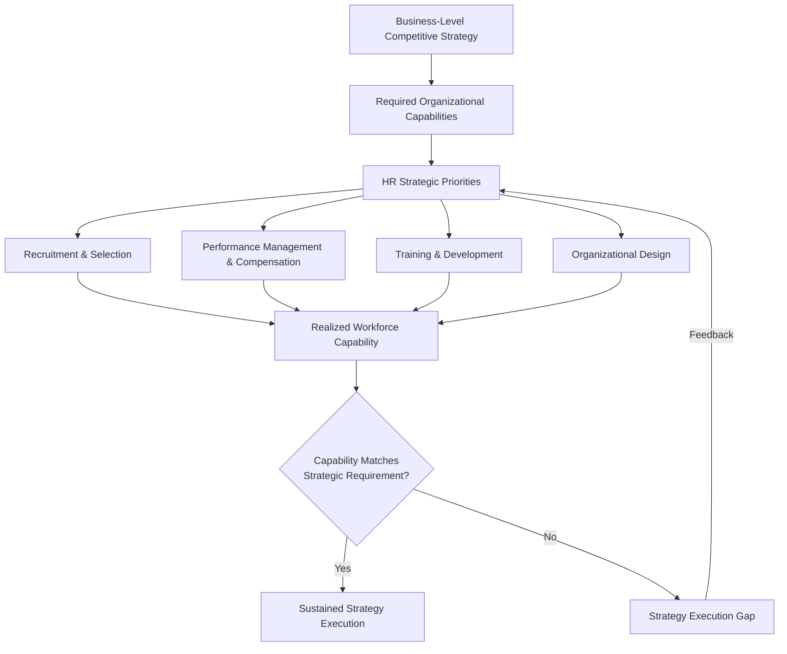

## Human Resource Strategy Alignment

### Overview

Human resource strategy alignment concerns the deliberate calibration of an organization's talent management systems — recruitment, development, compensation, performance management, and organizational design — to support and reinforce its corporate and business-level strategic objectives. As a functional-level strategy, HR strategy occupies the same hierarchical position as marketing, operations, and financial strategy (see Marketing Strategy Alignment with Corporate Strategy for the general hierarchy), and is subject to the same core principle: functional practices must be derived from, rather than independently determined apart from, the competitive strategy the organization has chosen to pursue.

HR strategy alignment is theoretically grounded in the resource-based view of the firm: since human capital and organizational capability are frequently cited as sources of sustainable competitive advantage (particularly when they are valuable, rare, and difficult to imitate — the VRIO criteria), the strategic management of that human capital is not merely an administrative support function but a potential direct source of competitive advantage in its own right.

### HR Strategy Within the Strategy Hierarchy and the Resource-Based View

**Key Points**

- Business-level competitive strategy (cost leadership, differentiation, or focus) implies distinct HR strategic requirements: the skills, behaviors, and incentive structures that support efficient, standardized execution differ substantially from those that support innovation, customization, or premium service delivery
- Under VRIO logic, HR practices themselves can be a source of advantage when they are difficult for competitors to replicate — not because any individual HR practice (a specific training program, a compensation scheme) is inherently inimitable, but because the *system* of mutually reinforcing HR practices, embedded in organizational culture and accumulated over time, is difficult to copy as a whole even when individual components are observable
- This is sometimes termed **causal ambiguity**: competitors may be able to observe a firm's HR practices but cannot easily discern which specific combination and interaction of practices produces the resulting organizational capability, making direct imitation difficult even absent formal legal protection

### Strategic Fit: HR Strategy and Competitive Strategy

**Key Points**

- **Cost leadership strategy** implies HR strategy emphasizing standardized job design, efficiency-oriented training, compensation systems linked to productivity and cost metrics, and recruitment focused on process-compliance capability, generally paired with leaner staffing ratios
- **Differentiation strategy** implies HR strategy emphasizing recruitment and development of specialized or creative capability, compensation structures that reward innovation or quality outcomes rather than pure output volume, and organizational designs that support cross-functional collaboration and knowledge-sharing
- **Focus strategy** implies HR strategy tailored to the specific capability requirements of the narrow target segment, which may require specialized recruitment and training pipelines not needed by broad-market competitors

**Example**

A firm pursuing a differentiation strategy centered on superior customer service quality that simultaneously implements a compensation system rewarding only call-handling volume (a cost-efficiency-oriented HR practice) exhibits a form of strategic misalignment: the incentive structure drives behavior inconsistent with the differentiation basis, likely degrading the very service quality the competitive strategy depends on.

### Core HR Strategic Domains and Their Alignment Requirements

#### Recruitment and Selection Strategy

**Key Points**

- Recruitment criteria and channels should be calibrated to the specific capabilities the competitive strategy requires — a differentiation strategy built on innovation warrants recruitment processes weighted toward creative problem-solving and domain expertise, while a cost-leadership strategy warrants recruitment weighted toward reliability, process adherence, and efficient trainability
- **Build vs. buy talent strategy**: developing capability internally through training and promotion pathways versus acquiring capability externally through hiring, a decision with implications for organizational culture continuity, time-to-capability, and cost, and one that should reflect how quickly and reliably the required capability can be developed internally relative to the strategic urgency of acquiring it

#### Performance Management and Compensation Strategy

**Key Points**

- Performance metrics and compensation structures function as a direct behavioral lever: employees respond to what is measured and rewarded, meaning misalignment between stated strategic priorities and actual incentive structures is a common and consequential source of strategy execution failure
- **Pay-for-performance intensity** should reflect the competitive strategy: highly individualized, output-based incentive structures suit environments where individual contribution to strategic objectives is clearly measurable and where the strategy rewards volume or efficiency, while team-based or longer-horizon incentive structures better suit strategies dependent on collaboration, innovation, or outcomes that only manifest over extended time periods
- Compensation strategy must also be internally consistent across organizational levels and functions to avoid perverse incentives — for example, a sales incentive structure rewarding volume that conflicts with a stated differentiation strategy based on premium, selective customer relationships

#### Training and Development Strategy

**Key Points**

- Development investment should be prioritized toward capabilities identified as strategically critical under the firm's chosen competitive basis, rather than allocated generically across all skill categories
- Leadership development pipelines should be designed to cultivate the specific strategic and managerial capabilities the firm's future competitive positioning will require, which may differ from the capabilities that were sufficient under a prior strategic posture (relevant during strategic pivots or industry disruption)
- Investment in employee capability is also a factor in employee retention strategy, since perceived development opportunity is a commonly cited driver of both attraction and retention of skilled talent in competitive labor markets

#### Organizational Design and Structure

**Key Points**

- Organizational structure (functional, divisional, matrix, or network forms) should support the coordination requirements of the chosen strategy — a differentiation strategy dependent on cross-functional innovation typically benefits from structures that facilitate lateral coordination (matrix or cross-functional team structures), while a cost-leadership strategy focused on standardized execution may benefit from more hierarchical, functionally specialized structures that maximize process efficiency
- Decision rights and reporting relationships should be designed to place strategic decision authority at the organizational level with the most relevant information and the clearest line of accountability to strategic outcomes
- Organizational design decisions interact directly with corporate portfolio structure (see Financial Strategy and Capital Allocation) — a "house of brands" corporate structure typically implies more decentralized HR and organizational design authority at the business-unit level than a unified corporate structure

### Framework: The HR-Strategy Alignment Chain

**Key Points**

- The alignment chain is only as strong as its weakest link: strong recruitment aligned with strategy can be undermined by misaligned compensation incentives, and vice versa — genuine HR strategic alignment requires consistency across all core HR domains simultaneously, not strength in any single domain in isolation

### Common Sources of HR-Strategy Misalignment

**Key Points**

- **Legacy incentive structures**: compensation and performance systems that persist unchanged following a strategic pivot, continuing to reward behaviors consistent with the prior strategy rather than the current one
- **Generic best-practice adoption**: implementing HR practices because they are considered general best practice or industry benchmark, without verifying fit to the firm's specific competitive strategy — a practice that is genuinely best-in-class for a differentiation strategy may be actively counterproductive for a cost-leadership strategy
- **M&A integration gaps**: acquired organizations retaining HR systems and culture inconsistent with the acquirer's strategic rationale for the acquisition, undermining intended synergy realization
- **HR function exclusion from strategic planning**: HR leadership operating without visibility into evolving corporate and business-level strategic priorities, resulting in HR strategic plans built on outdated strategic context (a pattern directly analogous to the marketing-corporate misalignment risk discussed under Marketing Strategy Alignment with Corporate Strategy)
- **Culture-strategy drift**: organizational culture that evolved under a prior competitive strategy persisting after a strategic shift, creating implicit resistance to behaviors the new strategy requires, even when formal HR policies have been updated

### Worked Example: HR Alignment Assessment Across Two Competitive Strategies

| HR Domain | Cost-Leadership Airline | Differentiation-Focused Premium Airline |
| --- | --- | --- |
| Recruitment focus | Efficiency, process adherence, rapid trainability for standardized roles | Service orientation, judgment for non-standard customer situations, brand fit |
| Compensation structure | Productivity-linked incentives (turnaround time, cost metrics) | Service-quality and customer satisfaction-linked incentives |
| Training investment | Efficient, standardized process training; rapid onboarding | Deeper service and brand-experience training; higher per-employee training investment |
| Organizational structure | Lean staffing ratios, standardized functional roles | Higher staffing ratios in customer-facing roles; greater front-line decision authority |
| Culture emphasis | Efficiency, reliability, cost discipline | Service excellence, empowerment, brand pride |

**Conclusion**

This example illustrates that HR strategy alignment, like the other functional-level strategies, has no universally superior configuration — an HR system well-designed for a cost-leadership competitive basis (lean staffing, efficiency-linked incentives) would represent clear strategic misalignment if implemented by a differentiation-focused competitor, and the reverse is equally true.

### Framework: HR Strategy Alignment Diagnostic

**Steps**

1. **Confirm the business-level competitive strategy** as the reference point HR strategy must support
2. **Identify the specific organizational capabilities the strategy requires** — translating the competitive basis into concrete capability requirements (e.g., "innovation speed," "process efficiency," "service judgment")
3. **Audit recruitment, compensation, training, and organizational design against required capabilities** — verify each HR domain reinforces rather than works against the identified capability requirements
4. **Check cross-domain consistency** — confirm that recruitment, compensation, training, and structure are mutually reinforcing rather than sending conflicting behavioral signals
5. **Assess culture-strategy fit**, particularly following recent strategic pivots or M&A activity, since culture often lags formal strategic and policy change
6. **Establish HR participation in strategic planning processes** to ensure ongoing alignment as corporate and business-level strategy evolves over time

### Related Topics

- Marketing Strategy Alignment with Corporate Strategy
- Operations and Supply Chain Strategy
- Financial Strategy and Capital Allocation
- Resource-Based View (RBV) and VRIO Framework
- Porter's Generic Competitive Strategies
- Organizational Design and Structure
- Corporate Culture and Strategy Execution
- Mergers and Acquisitions Integration Strategy
- Leadership Development and Succession Planning
- Strategy Implementation and Organizational Alignment