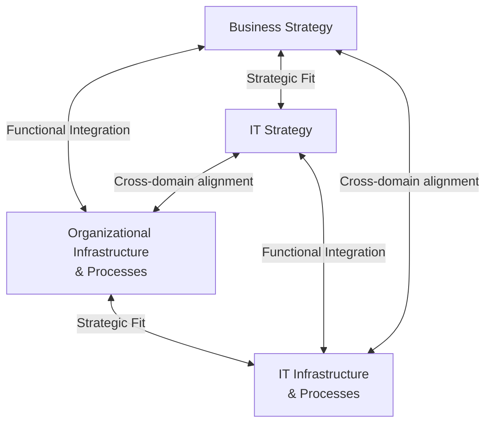

## Information Systems and Technology Strategy Alignment

### Overview

Information systems and technology (IS/IT) strategy alignment concerns the deliberate calibration of an organization's technology architecture, systems investment, and digital capability development to support and reinforce its corporate and business-level strategic objectives. As a functional-level strategy, IT strategy occupies the same hierarchical position as marketing, operations, financial, and HR strategy (see Marketing Strategy Alignment with Corporate Strategy for the general hierarchy), and is subject to the same foundational principle: technology investment and architecture decisions must be derived from strategic intent rather than pursued independently on the basis of technical merit or industry trend alone.

IT strategy alignment has grown in strategic prominence as digital capability has shifted from a back-office support function toward a direct enabler — and in many industries a direct source — of competitive advantage, customer value delivery, and business model innovation (see Artificial Intelligence Strategy for Competitive Advantage and Ecosystem Strategy and Multi-Sided Markets for adjacent digital-strategy topics). Misalignment between IT investment and business strategy is a long-documented and persistent source of value destruction in large organizations, frequently manifesting as substantial technology spend that fails to translate into competitive or operational benefit.

### The Strategic Alignment Model

A foundational framework for understanding IT-business alignment is the distinction between **strategic fit** (the alignment between external strategic positioning and internal organizational design) and **functional integration** (the alignment between business strategy/infrastructure and IT strategy/infrastructure).

**Key Points**

- Genuine alignment requires coherence across all four domains simultaneously (business strategy, organizational infrastructure, IT strategy, IT infrastructure), not merely a stated correspondence between business strategy and IT strategy documents
- Historically dominant alignment perspectives include **strategy execution** (IT strategy is derived from and executes business strategy — the most common default orientation) and **technology transformation** (business strategy is reshaped in response to emerging technology-enabled opportunities), with the latter becoming more prominent as digital and AI capability increasingly shapes what competitive strategies are viable in the first place
- [Inference] The relative balance between "IT as strategy executor" versus "IT as strategy driver" varies substantially by industry digital intensity; in digitally intensive or digitally disrupted industries, the technology-transformation orientation is increasingly treated as necessary rather than optional, while more traditional industries may still predominantly operate under the strategy-execution orientation

### Strategic Fit: IT Strategy and Competitive Strategy

**Key Points**

- **Cost leadership strategy** implies IT strategy emphasizing process automation, standardized enterprise systems (e.g., ERP platforms) that maximize operational efficiency and minimize per-unit transaction cost, and technology investment prioritization based primarily on demonstrable cost-reduction ROI
- **Differentiation strategy** implies IT strategy emphasizing systems that enable customization, superior customer experience (e.g., CRM and personalization platforms), and support for innovation processes (product development systems, data platforms enabling rapid experimentation)
- **Focus strategy** implies IT strategy scaled and specialized to the specific informational and operational requirements of the narrow target segment, which may require specialized systems not justified for a broad-market competitor

**Example**

A firm pursuing a differentiation strategy centered on highly personalized customer experience that simultaneously operates on a rigid, standardized legacy ERP system with limited data integration capability exhibits a form of strategic misalignment: the underlying technology infrastructure cannot support the level of customer data integration and responsiveness the competitive strategy requires, constraining strategic execution regardless of front-line intent.

### Core Domains of IT Strategy Requiring Alignment

#### Enterprise Architecture Strategy

**Key Points**

- **Enterprise architecture** defines the overall structure of an organization's technology systems, data flows, and integration patterns, and should be designed to support the specific coordination and flexibility requirements the business strategy demands
- **Build vs. buy decisions** for core systems parallel the make-vs-buy logic in operations strategy (see Operations and Supply Chain Strategy): custom-built systems offer greater strategic differentiation potential but higher cost and development risk, while commercial off-the-shelf or platform-based systems offer faster deployment and lower cost but less differentiation potential and possible constraint on unique process requirements
- **Legacy system modernization** decisions should be prioritized based on the strategic criticality of the constrained business capability, not solely on technical age or vendor support lifecycle, since not all legacy system risk is equally strategically consequential

#### Data Strategy and Governance

**Key Points**

- Data strategy — what data is collected, how it is governed, integrated, and made available for decision-making — is foundational to both data-driven decision-making (see Data-Driven Strategic Decision-Making) and AI strategy (see Artificial Intelligence Strategy for Competitive Advantage), making it a cross-cutting alignment concern rather than a narrowly technical one
- Data architecture fragmentation (siloed systems that do not share a common data model or integration layer) is a frequently cited structural barrier to realizing strategic value from both traditional analytics and AI initiatives, since fragmented data undermines the data quality and completeness that downstream analytical and AI capability depends on
- Data governance strategy must also account for the algorithmic governance and privacy/legal requirements discussed under Algorithmic Governance and Strategic Risk, since data strategy and AI governance strategy are deeply interdependent

#### IT Investment Prioritization and Portfolio Management

**Key Points**

- IT investment decisions should be evaluated using the same rigor applied to other capital allocation decisions (see Financial Strategy and Capital Allocation), including consideration of strategic fit, not solely technical feasibility or vendor recommendation
- A useful categorization for IT investment portfolio management distinguishes: **run-the-business** investment (maintaining current operational systems), **grow-the-business** investment (scaling existing capability to support growth), and **transform-the-business** investment (building fundamentally new capability aligned with strategic pivots) — misallocation heavily weighted toward run-the-business spend at the expense of transform-the-business investment is a commonly cited symptom of IT-strategy misalignment in mature organizations
- IT project prioritization frameworks should explicitly link proposed investments to specific strategic objectives, enabling capital allocation decisions to be defended on strategic grounds rather than solely on technical or departmental advocacy

#### Digital Capability and Organizational Readiness

**Key Points**

- Technology strategy execution depends on organizational capability to adopt and effectively use new systems, linking directly to HR strategy considerations (see Human Resource Strategy Alignment) around training, change management, and digital skill development
- **Digital maturity** — the organization's overall capability to leverage digital technology effectively across processes, culture, and decision-making — is a distinct construct from technology *investment level*; high technology spend without corresponding organizational and cultural readiness frequently fails to produce proportional strategic benefit
- Governance structures (e.g., IT steering committees with cross-functional business representation, rather than IT investment decisions made in isolation by the technology function) support ongoing alignment as strategic priorities evolve

### Common Sources of IT-Strategy Misalignment

**Key Points**

- **Technology-led rather than strategy-led investment**: pursuing technology adoption because of industry trend, vendor pressure, or executive enthusiasm for a specific technology, without a clear linkage to a defined strategic objective (a risk directly analogous to the "AI FOMO" pattern discussed under AI Strategy for Competitive Advantage)
- **IT function exclusion from strategic planning**: technology leadership operating without visibility into evolving corporate and business-level strategic priorities, producing IT roadmaps built on outdated strategic context — structurally the same misalignment risk identified for marketing and HR strategy
- **Legacy architecture constraint**: accumulated technical debt and legacy system rigidity that structurally constrains the range of strategic options viable for the business, effectively allowing past technology decisions to constrain current strategic flexibility
- **Siloed IT investment across business units**: in diversified or decentralized organizations, business-unit-level technology decisions made without corporate-level coordination can produce duplicated investment, data fragmentation, and lost synergy opportunities that a more coordinated enterprise architecture strategy would capture
- **Misaligned governance incentives**: IT function performance metrics (e.g., system uptime, cost per user) that do not correspond to the business strategic objectives the systems are meant to serve, incentivizing operational stability over strategically valuable innovation or flexibility

### Framework: IT-Strategy Alignment Diagnostic

**Steps**

1. **Confirm the business-level competitive strategy and corporate strategic priorities** as the reference point for IT strategic evaluation
2. **Map current enterprise architecture and system capability against strategic requirements** — assess whether core systems enable or constrain the specific capabilities (customization, integration speed, data availability) the competitive strategy requires
3. **Audit IT investment portfolio composition** — evaluate the balance between run-the-business, grow-the-business, and transform-the-business spend relative to the organization's current strategic phase (defense of position vs. active strategic transformation)
4. **Assess data strategy and governance maturity** — verify that data architecture supports the data-driven decision-making and AI capability the strategy depends on, rather than assuming data availability without direct verification
5. **Evaluate organizational digital readiness** — assess whether technology investment is matched by corresponding training, change management, and cultural readiness to realize intended strategic benefit
6. **Establish cross-functional IT governance** — ensure technology investment decisions are made with direct business strategic input, not determined solely within the technology function in isolation

### Worked Example: IT Strategy Alignment for Two Contrasting Competitive Strategies

| IT Domain | Cost-Leadership Retailer | Differentiation-Focused Retailer |
| --- | --- | --- |
| Enterprise architecture priority | Standardized, highly automated ERP and point-of-sale systems optimized for transaction efficiency | Flexible, integrated customer data platform enabling personalization and omnichannel experience |
| Investment portfolio balance | Weighted toward run-the-business efficiency and cost-reduction automation | Weighted toward transform-the-business investment in customer experience and data capability |
| Data strategy focus | Operational efficiency metrics, inventory optimization, cost analytics | Customer behavior data, personalization engines, experience analytics |
| Build vs. buy orientation | Favor commercial off-the-shelf systems for speed and cost efficiency | Greater willingness to build or heavily customize systems that directly support differentiation |
| Governance emphasis | System reliability, cost control, standardization compliance | Innovation speed, cross-functional data integration, experimentation capability |

**Conclusion**

This example illustrates that IT strategy, like the other functional-level strategies examined in this chapter, has no universally superior configuration independent of the competitive strategy it must serve — a highly standardized, efficiency-optimized architecture well-suited to a cost-leadership retailer would constrain, rather than enable, a differentiation-focused competitor's strategic execution, underscoring that IT strategy alignment is a derived rather than independently optimized functional decision.

### Related Topics

- Marketing Strategy Alignment with Corporate Strategy
- Operations and Supply Chain Strategy
- Financial Strategy and Capital Allocation
- Human Resource Strategy Alignment
- Data-Driven Strategic Decision-Making
- Artificial Intelligence Strategy for Competitive Advantage
- Algorithmic Governance and Strategic Risk
- Cybersecurity as a Strategic Consideration
- Enterprise Architecture Frameworks
- Digital Transformation Strategy