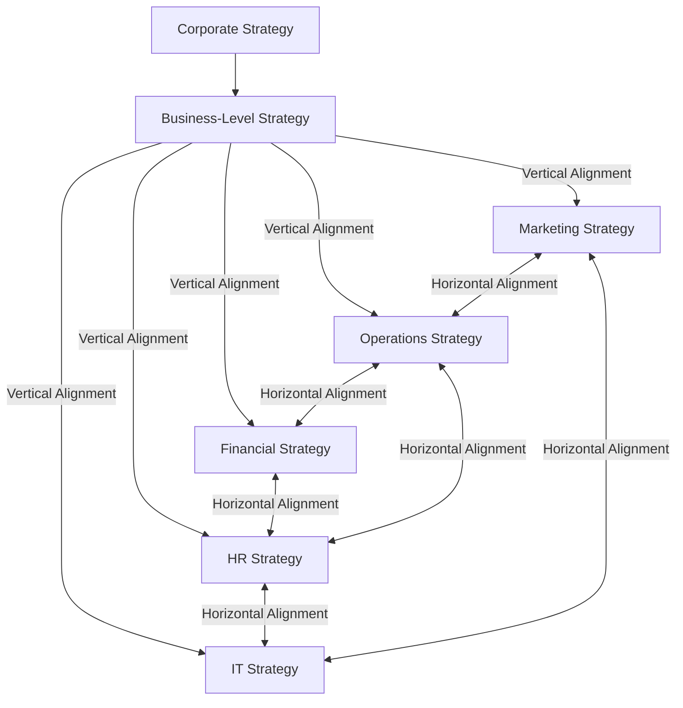

## Cross-Functional Strategic Integration

### Overview

Cross-functional strategic integration concerns the mechanisms, structures, and processes by which an organization ensures that its individual functional-level strategies — marketing, operations, financial, human resource, and information technology strategy (each addressed individually elsewhere in this chapter) — operate coherently together in support of a unified business-level and corporate strategy, rather than as independently optimized silos. It represents the synthesis point of functional-level strategy: even when each function is individually well-aligned to the overall competitive strategy, the absence of deliberate cross-functional coordination can produce interface failures, duplicated effort, or contradictory operational signals that undermine strategic execution.

This topic addresses a distinct failure mode from the function-specific misalignments discussed in the preceding sections of this chapter. A firm can achieve strong vertical alignment (each function individually well-derived from business strategy) while still suffering from weak horizontal alignment (functions poorly coordinated with one another), and both forms of alignment are independently necessary for effective strategy execution.

### Vertical Alignment vs. Horizontal Alignment

**Key Points**

- **Vertical alignment** (addressed in each function-specific section of this chapter) ensures each function's strategy is derived from and consistent with business-level competitive strategy
- **Horizontal alignment** (the focus of this topic) ensures functions are consistent with, and reinforcing of, one another — since functional strategies do not operate independently but interact continuously in actual execution
- Strong vertical alignment across all functions does not guarantee strong horizontal alignment: each function can be individually well-derived from the same competitive strategy yet still generate conflicting requirements, timelines, or resource claims when their execution intersects

### Sources of Cross-Functional Interdependency

**Key Points**

- **Sequential interdependency**: one function's output is another function's input (e.g., product development output flows into both operations' manufacturing planning and marketing's positioning strategy), creating timing and specification dependencies that require coordination
- **Reciprocal interdependency**: functions mutually influence and constrain one another in an ongoing cycle (e.g., marketing's demand forecasts inform operations' capacity planning, while operations' capacity constraints in turn bound what marketing can credibly promise to the market)
- **Pooled interdependency**: functions draw on a shared, limited resource pool (most commonly capital, per Financial Strategy and Capital Allocation, but also shared data infrastructure per Information Systems and Technology Strategy Alignment, or shared talent pools per Human Resource Strategy Alignment) such that one function's consumption directly constrains what is available to others
- Recognizing which type of interdependency dominates a given cross-functional relationship helps determine the appropriate coordination mechanism: sequential interdependencies are typically managed through defined handoff processes and shared timelines, reciprocal interdependencies require ongoing bidirectional communication channels, and pooled interdependencies require centralized allocation governance

### Common Cross-Functional Tension Points

#### Marketing-Operations Interface

**Key Points**

- Marketing's demand generation and promotional commitments must be reconciled with operations' actual production and fulfillment capacity — a well-executed marketing campaign that generates demand exceeding operational capacity can produce customer dissatisfaction and brand damage rather than the intended strategic benefit
- Product customization or variety promised by marketing/product positioning must be operationally feasible within the operations strategy's chosen efficiency-responsiveness tradeoff (see Operations and Supply Chain Strategy) — marketing commitments to rapid customization are only credible if operations strategy has been deliberately designed for that flexibility

**Example**

A firm whose marketing strategy promises expedited delivery as a differentiating feature, while its supply chain strategy is configured for cost-efficiency with centralized, low-frequency distribution, exhibits a cross-functional integration failure: the marketing promise is not operationally deliverable at the promised service level, regardless of how well each function's strategy independently derives from the stated competitive positioning.

#### Finance-Operations and Finance-Marketing Interface

**Key Points**

- Capital allocation decisions (see Financial Strategy and Capital Allocation) directly bound what operations and marketing can execute — a marketing strategy calling for aggressive brand investment or an operations strategy calling for capacity expansion both depend on financial strategy's willingness and capacity to fund them
- Financial performance metrics used to evaluate marketing and operations (e.g., short-term ROI thresholds) can create incentive conflicts with strategically necessary but longer-payback investments (e.g., brand-building, capacity expansion ahead of demand), requiring explicit reconciliation of evaluation horizons across functions

#### HR-Operations and HR-IT Interface

**Key Points**

- Operations strategy's chosen production and quality approach (see Operations and Supply Chain Strategy) requires HR strategy to provide correspondingly skilled talent and appropriately calibrated incentive structures (see Human Resource Strategy Alignment) — an operations strategy shift toward greater flexibility or customization is only executable if HR strategy has correspondingly developed the workforce capability and incentive alignment to support it
- Technology strategy investment (see Information Systems and Technology Strategy Alignment) requires HR strategy to provide corresponding digital skill development and change management support; technology deployed without matched organizational readiness is a frequently cited pattern of realized-value shortfall

#### IT as a Cross-Cutting Integration Layer

**Key Points**

- Information systems strategy functions distinctively among functional strategies as a cross-cutting integration mechanism itself: shared data architecture, integrated planning systems, and common technology platforms are frequently the concrete infrastructure through which cross-functional coordination is operationally enacted, not merely one function among several requiring coordination with the others
- Data fragmentation across functional systems (see Information Systems and Technology Strategy Alignment) is a structural barrier to cross-functional integration, since functions cannot effectively coordinate around shared strategic objectives if they lack shared visibility into the underlying data each function depends on

### Organizational Mechanisms for Cross-Functional Integration

**Key Points**

- **Cross-functional planning processes**: integrated strategic and operational planning cycles (e.g., Sales and Operations Planning, or S&OP, in manufacturing contexts) that bring marketing, operations, and finance together on a shared demand and resource planning cadence, rather than each function planning independently and reconciling conflicts after the fact
- **Cross-functional teams and liaison roles**: dedicated roles or standing teams (e.g., product management functions that sit between marketing, engineering, and operations) whose explicit mandate is to manage interdependencies that would otherwise fall between functional silos
- **Shared strategic metrics and balanced scorecards**: performance measurement systems (see Marketing Strategy Alignment with Corporate Strategy for the Balanced Scorecard reference) that include cross-functional or shared objectives, incentivizing coordinated behavior rather than purely function-optimized behavior that can be locally rational but globally suboptimal
- **Integrated technology platforms**: shared enterprise systems (ERP, CRM, integrated data platforms) that provide common data visibility across functions, reducing the coordination cost of cross-functional decision-making
- **Executive-level integration forums**: senior leadership team structures and cadences explicitly designed to surface and resolve cross-functional strategic conflicts at a level with authority to make binding tradeoff decisions, rather than leaving conflicts to be negotiated (or left unresolved) at lower organizational levels

### The Organizational Silo Problem

**Key Points**

- Functional silos emerge naturally from specialization and are not inherently dysfunctional — deep functional expertise generally requires some degree of functional specialization and distinct performance metrics
- Silos become strategically costly specifically when functional incentive structures, information systems, and planning processes are not deliberately counterbalanced with cross-functional integration mechanisms, allowing locally optimal functional decisions to aggregate into globally suboptimal strategic outcomes
- [Inference] Persistent organizational silos despite documented cross-functional interdependency are commonly attributed in practitioner and academic literature to misaligned functional incentive structures and the absence of senior leadership mechanisms with authority to resolve cross-functional tradeoffs, rather than to a lack of awareness that the interdependency exists

### Framework: Cross-Functional Integration Diagnostic

**Steps**

1. **Map functional interdependencies** — identify which pairs or groups of functions have sequential, reciprocal, or pooled interdependencies material to strategic execution
2. **Audit existing coordination mechanisms** against identified interdependencies — verify that planning processes, shared metrics, or liaison structures exist for each material interdependency, rather than assuming coordination will occur informally
3. **Identify incentive conflicts across functions** — check whether functional performance metrics could reward locally optimal behavior that undermines a cross-functional or overall strategic objective
4. **Assess shared information infrastructure** — verify functions have sufficient shared data visibility to coordinate effectively, particularly for reciprocal interdependencies requiring ongoing bidirectional information flow
5. **Confirm executive-level resolution mechanisms exist** for cross-functional conflicts that cannot be resolved at the functional level, ensuring tradeoffs are decided with appropriate strategic authority rather than left unresolved
6. **Establish a recurring cross-functional strategic review** integrated with, rather than separate from, individual functional strategic planning cycles

### Worked Example: Cross-Functional Integration for a Product Launch

| Function | Individual Strategic Contribution | Cross-Functional Dependency |
| --- | --- | --- |
| Marketing | Positioning, demand generation, launch timeline | Depends on operations' confirmed production capacity and IT's confirmed system readiness before committing external launch timeline |
| Operations | Production capacity, quality assurance, fulfillment readiness | Depends on marketing's demand forecast for capacity planning; depends on HR for trained production staff availability |
| Finance | Capital allocation for launch investment, ROI evaluation | Depends on marketing and operations' cost and revenue projections; provides the funding constraint both functions must plan within |
| HR | Staffing and training for new production or service roles | Depends on operations' capacity plan and timeline to schedule hiring/training completion ahead of launch |
| IT | Systems readiness (inventory, e-commerce, CRM integration) | Depends on marketing's channel strategy and operations' fulfillment process design to configure systems correctly |

**Conclusion**

This example illustrates that a product launch — a single strategic initiative — fails or succeeds based not on any individual function's strategic quality in isolation, but on whether the reciprocal and sequential interdependencies across all five functions are actively coordinated; a launch can fail despite excellent individual functional strategies if, for example, marketing commits to an external launch date before operations and HR have confirmed capacity and staffing readiness.

### Related Topics

- Marketing Strategy Alignment with Corporate Strategy
- Operations and Supply Chain Strategy
- Financial Strategy and Capital Allocation
- Human Resource Strategy Alignment
- Information Systems and Technology Strategy Alignment
- Strategy Implementation and Organizational Alignment
- Balanced Scorecard Framework
- Sales and Operations Planning (S&OP)
- Organizational Design and Structure
- Change Management and Strategic Execution