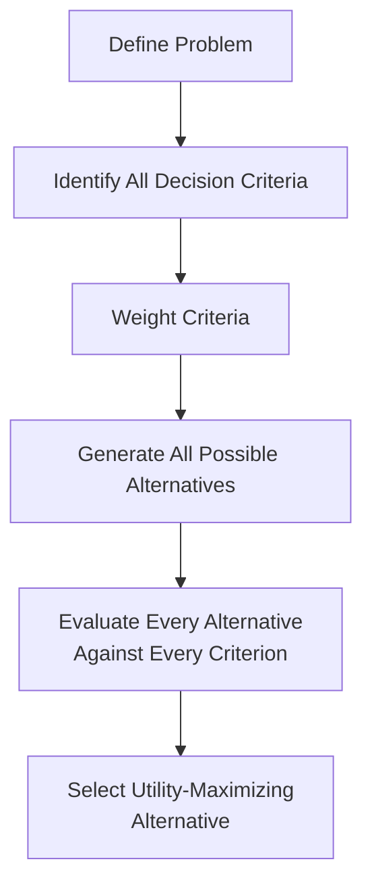

## Rational and Bounded Rationality Decision Models

### Overview

Rational and bounded rationality decision models represent two foundational, competing conceptions of how strategic decisions are — and should be — made within organizations. The classical rational decision model, rooted in neoclassical economics and early management science, describes decision-making as a comprehensive, systematic process of identifying all alternatives, evaluating them against complete information, and selecting the utility-maximizing option. Bounded rationality, introduced by Herbert Simon, challenges the descriptive accuracy of this model by arguing that real decision-makers operate under fundamental cognitive, informational, and time constraints that make comprehensive rationality practically unattainable, and that decision-makers instead adopt simplified strategies to reach adequate rather than optimal decisions.

This distinction is foundational to the broader field of behavioral strategy, since it establishes the basic tension — between how strategic decisions are normatively supposed to be made and how they are actually made under real organizational and cognitive constraints — that motivates the study of heuristics, biases, and behavioral influences on strategic decision-making covered elsewhere in this chapter.

### The Classical Rational Decision Model

**Key Points**

- Assumes the decision-maker has (1) complete and accurate information about all available alternatives, (2) stable and well-ordered preferences allowing consistent ranking of outcomes, (3) unlimited cognitive capacity to process and evaluate all information, and (4) the objective of utility or value maximization
- The classical rational model proceeds through a defined sequence: define the problem, identify all decision criteria, weight the criteria, generate all possible alternatives, evaluate each alternative against every criterion, and select the alternative with the highest total weighted value
- This model underlies much of formal strategic planning methodology, including systematic frameworks such as comprehensive SWOT analysis followed by structured alternative evaluation, and provides the theoretical foundation for quantitative decision techniques such as expected value analysis and formal capital budgeting criteria (see Financial Strategy and Capital Allocation)

### Herbert Simon's Bounded Rationality

**Key Points**

- Herbert Simon argued that the classical rational model is descriptively inaccurate because real decision-makers face fundamental limits: **information limits** (not all relevant information is available or knowable), **cognitive limits** (the human mind cannot process unlimited information simultaneously), and **time limits** (decisions must often be made within practical timeframes that preclude exhaustive analysis)
- Given these constraints, decision-makers engage in **satisficing** — selecting the first alternative that meets a minimum acceptable threshold across the criteria that matter most, rather than exhaustively searching for and comparing all possible alternatives to find the objectively optimal one
- Bounded rationality does not characterize decision-makers as irrational; rather, it describes rationality that is intentional but constrained by real cognitive and informational limits — decision-makers are still attempting to make good decisions, but within a fundamentally narrower and more selective search process than the classical model assumes

#### Satisficing vs. Optimizing

**Key Points**

- **Optimizing** (the classical rational model's objective) requires evaluating all alternatives to identify the single best option — a process whose cost (in time, information-gathering, and cognitive effort) can itself exceed the incremental value gained over a merely adequate decision, particularly for decisions of moderate strategic stakes
- **Satisficing** involves establishing an aspiration level (a minimum acceptable outcome) and selecting the first alternative encountered that meets or exceeds that threshold, terminating search once an adequate option is found rather than continuing to search for a potentially superior one
- [Inference] The practical prevalence of satisficing over optimizing in actual strategic decision-making is widely accepted in the behavioral strategy literature as the empirically dominant pattern, particularly for decisions made under significant time pressure or involving highly uncertain, difficult-to-quantify outcomes, though the degree of satisficing versus more exhaustive search likely varies with the perceived stakes and reversibility of the specific decision

### Contrasting the Two Models

| Dimension | Classical Rational Model | Bounded Rationality Model |
| --- | --- | --- |
| Information assumption | Complete and accurate information available | Information is incomplete, costly to obtain, and imperfectly processed |
| Alternative generation | All possible alternatives identified and considered | A limited, sequentially discovered subset of alternatives considered |
| Evaluation process | Exhaustive evaluation of all alternatives against all criteria | Evaluation stops once an adequate (satisficing) alternative is found |
| Decision objective | Utility/value maximization (the single objectively best option) | Satisfactory or "good enough" outcome relative to an aspiration level |
| Cognitive assumption | Unlimited processing capacity | Limited working memory and processing capacity (cognitive limits) |
| Primary use in strategy | Normative ideal; basis for formal quantitative decision techniques | Descriptive model of actual organizational decision-making behavior |

### Strategic Management Implications

#### Implications for Strategic Planning Process Design

**Key Points**

- Recognizing bounded rationality suggests that formal strategic planning processes should be designed to counteract, rather than assume away, cognitive and informational limits — for example, through structured processes that deliberately force consideration of a wider alternative set than decision-makers would naturally generate through unaided satisficing search
- Techniques such as scenario planning, devil's advocacy, and structured alternative generation exercises can be understood as organizational mechanisms designed specifically to widen the search process beyond what unaided bounded-rational decision-making would produce
- Formal quantitative techniques (NPV analysis, decision trees, expected value calculations — see Financial Strategy and Capital Allocation) remain valuable specifically because they impose a degree of the classical rational model's discipline onto decisions that would otherwise be subject to unaided satisficing, even though full classical rationality remains practically unattainable

#### Implications for Organizational Design

**Key Points**

- Since individual bounded rationality limits what any single decision-maker can process, organizations distribute decision-making across specialized units and hierarchical levels, each handling a bounded subset of the overall decision space — a structural response to bounded rationality that is foundational to organizational theory more broadly
- Standard operating procedures, decision rules, and organizational routines can be understood as institutionalized satisficing mechanisms: pre-established rules that allow adequate decisions to be made rapidly and consistently without requiring exhaustive case-by-case rational analysis for routine or recurring decisions
- Escalation processes that route only sufficiently novel or high-stakes decisions to more senior or resource-intensive analysis reflect an implicit organizational recognition that exhaustive rational analysis is warranted only when the stakes justify its cost, consistent with bounded rationality's cost-benefit logic around search termination

#### Implications for Strategic Decision Quality

**Key Points**

- Satisficing is not inherently a decision-quality failure; for many strategic decisions, particularly lower-stakes or highly time-sensitive ones, an adequate decision reached quickly can be strategically superior to an optimal decision reached too late to capture the relevant opportunity
- However, satisficing becomes a strategic risk when applied by default to high-stakes, difficult-to-reverse decisions (major capital investments, market entry decisions, M&A) where the cost of more exhaustive alternative generation and evaluation is clearly justified by the decision's strategic magnitude
- Recognizing when a decision warrants closer-to-classical-rational analysis versus when adequate satisficing is appropriate is itself a meta-strategic judgment that experienced strategic decision-makers and well-designed organizational processes should make explicit, rather than defaulting uniformly to either extreme

### Diagram: The Decision Model Spectrum (svg_diagram)

<svg xmlns="http://www.w3.org/2000/svg" viewBox="0 0 560 260" font-family="Helvetica, Arial, sans-serif">
<text x="280" y="22" text-anchor="middle" font-size="15" font-weight="bold" fill="#1a1a1a">Decision Model Spectrum (svg_diagram)</text>
<line x1="60" y1="140" x2="500" y2="140" stroke="#333" stroke-width="2" />
<circle cx="80" cy="140" r="6" fill="#2980b9" />
<circle cx="480" cy="140" r="6" fill="#c0392b" />

<text x="80" y="115" text-anchor="middle" font-size="12" font-weight="bold" fill="`#2980b9`">Classical Rational</text>

<text x="80" y="165" text-anchor="middle" font-size="10" fill="#555">Complete information,</text>

<text x="80" y="178" text-anchor="middle" font-size="10" fill="#555">exhaustive search,</text>

<text x="80" y="191" text-anchor="middle" font-size="10" fill="#555">optimization</text>

<text x="480" y="115" text-anchor="middle" font-size="12" font-weight="bold" fill="`#c0392b`">Bounded Rationality</text>

<text x="480" y="165" text-anchor="middle" font-size="10" fill="#555">Limited information,</text>

<text x="480" y="178" text-anchor="middle" font-size="10" fill="#555">sequential search,</text>

<text x="480" y="191" text-anchor="middle" font-size="10" fill="#555">satisficing</text>

<text x="280" y="135" text-anchor="middle" font-size="10" fill="#333">Most real strategic decisions</text>

<text x="280" y="148" text-anchor="middle" font-size="10" fill="#333">fall along this spectrum</text>

<circle cx="280" cy="140" r="5" fill="`#27ae60`" />

</svg>

### Worked Example: Applying Both Models to a Market Entry Decision

**Example**

Under a strict classical rational approach, a firm evaluating international market entry would systematically identify every candidate country, gather complete market sizing, regulatory, competitive, and macroeconomic data for each (linking to PESTEL Analysis Framework), and select the single country maximizing expected risk-adjusted return. In practice, under bounded rationality, the firm is more likely to generate a short list of candidate countries based on readily available information and prior organizational experience (e.g., markets where the firm or comparable firms have existing relationships or knowledge), evaluate these sequentially against key criteria, and select the first market meeting an internally established minimum threshold for expected return and acceptable risk — terminating search once an adequate candidate is found rather than continuing to exhaustively evaluate all theoretically possible markets worldwide.

**Conclusion**

This example illustrates that the practical strategic planning process for most real market entry decisions reflects bounded rationality far more closely than the classical rational ideal, even in organizations that use formal quantitative techniques (NPV analysis, scenario planning) within that process — the formal techniques discipline the evaluation of the *candidates considered*, but the initial candidate generation itself is typically a bounded, satisficing search rather than an exhaustive one.

### Critiques and Extensions

**Key Points**

- Critics of the classical rational model argue it is primarily useful as a normative benchmark rather than a descriptively accurate account of actual strategic decision-making, a view now broadly accepted within behavioral strategy scholarship
- Bounded rationality itself has been extended and refined by subsequent behavioral economics and psychology research (e.g., work on heuristics and biases, prospect theory) that further specifies the *particular* cognitive shortcuts and systematic biases decision-makers exhibit beyond the general satisficing concept — these specific heuristics and biases are addressed as distinct topics elsewhere in this chapter
- [Unverified] The degree to which specific organizational interventions (structured decision processes, decision-support technology, cross-functional review) can shift actual decision-making practice closer to the classical rational ideal, versus how much bounded rationality represents an irreducible feature of human cognition that such interventions can only partially mitigate, remains a subject of ongoing academic and practitioner discussion without clear empirical consensus

### Related Topics

- Heuristics and Cognitive Biases in Strategic Decision-Making
- Prospect Theory and Risk Behavior in Strategic Choices
- Data-Driven Strategic Decision-Making
- Scenario Planning and Strategic Foresight
- Groupthink and Strategic Decision-Making in Teams
- Organizational Routines and Standard Operating Procedures
- Real Options Analysis for Strategic Investment Under Uncertainty
- Strategic Planning Process and Cycles
- Escalation of Commitment in Strategic Decisions
- Herbert Simon's Administrative Behavior Theory