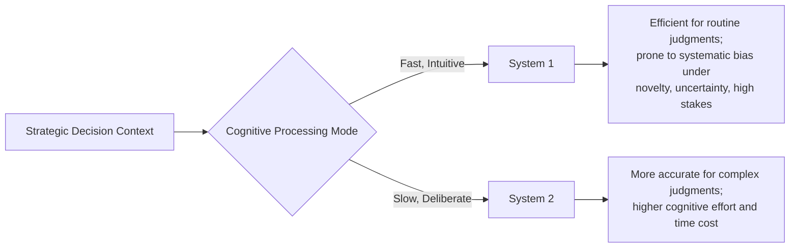
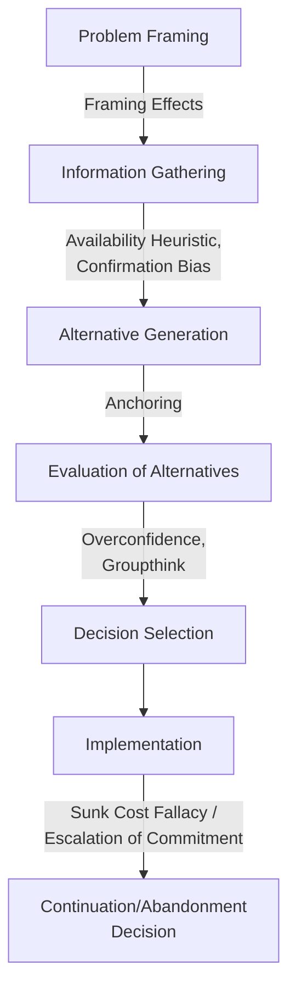

## Cognitive Biases in Strategic Decision-Making

### Overview

Cognitive biases in strategic decision-making refer to systematic, predictable patterns of deviation from normatively rational judgment that arise from the mental shortcuts (heuristics) decision-makers rely on when operating under the informational, cognitive, and time constraints described by bounded rationality (see Rational and Bounded Rationality Decision Models). Where bounded rationality explains *why* decision-makers use simplified strategies rather than exhaustive analysis, cognitive bias research — originating principally from the work of Daniel Kahneman and Amos Tversky — specifies the *particular, systematic ways* those simplified strategies produce predictable errors, as distinct from random or unsystematic mistakes.

This distinction matters strategically: because these biases are systematic rather than random, they do not average out across a decision-making group or over repeated decisions, and they can become embedded in organizational routines and culture, making them a persistent rather than self-correcting source of strategic error unless deliberately counteracted.

### Dual-Process Theory: The Cognitive Foundation of Bias

**Key Points**

- Kahneman's dual-process framework distinguishes **System 1** thinking (fast, automatic, intuitive, and effortless) from **System 2** thinking (slow, deliberate, analytical, and effortful)
- Most cognitive biases arise from System 1 processing being applied to judgments that would benefit from System 2 analysis — System 1 heuristics are generally adaptive and efficient for routine judgments but produce systematic errors when applied to the kind of complex, novel, and high-stakes judgments characteristic of strategic decision-making
- Strategic decisions are particularly susceptible to bias precisely because they often combine the conditions under which System 1 heuristics are most likely to mislead: high uncertainty, limited directly comparable past experience, significant time pressure, and high emotional or political stakes for the decision-makers involved

### Key Cognitive Biases Relevant to Strategic Decision-Making

#### Overconfidence Bias

**Key Points**

- The tendency to overestimate the accuracy of one's own judgments, forecasts, or the probability of a favorable outcome
- In strategic contexts, overconfidence manifests as systematic underestimation of the uncertainty and risk surrounding forecasts (e.g., revenue projections, project timelines, competitive response predictions), producing overly narrow confidence intervals around point estimates
- Overconfidence is frequently cited as a contributing factor in M&A overpayment, since acquiring executives may systematically overestimate the achievability of projected synergies and their own capability to successfully integrate the acquired firm

#### Confirmation Bias

**Key Points**

- The tendency to search for, interpret, and recall information in ways that confirm pre-existing beliefs, while discounting or failing to seek disconfirming evidence
- In strategic decision-making, confirmation bias can lead decision-makers to selectively interpret market research, competitive intelligence, or pilot program results as supporting a strategic direction the organization has already committed to, rather than as objective evidence to be weighed on its own terms
- Structured devil's advocacy processes and formal pre-mortem exercises (imagining a decision has already failed and working backward to identify why) are commonly recommended organizational countermeasures specifically because they force deliberate consideration of disconfirming evidence that confirmation bias would otherwise suppress

#### Anchoring Bias

**Key Points**

- The tendency for an initial piece of information (the "anchor") to disproportionately influence subsequent judgments, even when that anchor is arbitrary or only weakly relevant to the decision at hand
- In strategic contexts, anchoring can manifest in negotiation (an initial offer price disproportionately shaping the eventual settlement range), in forecasting (a prior year's figures anchoring current-year projections even amid materially changed conditions), and in valuation (an initial asking price in an M&A process anchoring subsequent valuation analysis)
- [Inference] Anchoring effects are widely documented as difficult to fully eliminate even when decision-makers are explicitly warned about them, suggesting that structural countermeasures (e.g., independent parallel valuation exercises conducted without exposure to an initial anchor figure) are likely more effective than reliance on individual awareness alone

#### Sunk Cost Fallacy and Escalation of Commitment

**Key Points**

- The sunk cost fallacy is the tendency to continue investing in a decision based on the cumulative resources already invested, rather than on a forward-looking, resources-already-spent-are-irrelevant evaluation of the decision's remaining expected value
- **Escalation of commitment** is the closely related organizational phenomenon in which decision-makers continue or increase investment in a failing strategic course of action, often precisely because of, rather than despite, the resources already committed and the psychological or reputational cost of publicly acknowledging the initial decision was flawed
- Escalation of commitment is particularly consequential in strategic contexts involving large, highly visible investments (major capital projects, product launches, M&A integration) where the original decision-maker retains influence over the continuation decision, since the personal and reputational stakes in avoiding an admission of error compound the cognitive bias itself

#### Availability Heuristic

**Key Points**

- The tendency to judge the probability or frequency of an event based on how easily relevant examples come to mind, rather than on actual statistical base rates
- In strategic risk assessment, the availability heuristic can lead organizations to overweight risks that are vivid, recent, or heavily publicized (e.g., a competitor's recent well-publicized failure) while underweighting less memorable but statistically more probable risks
- This bias is particularly relevant to scenario planning and risk assessment processes, where the set of scenarios considered can be inadvertently limited to those that are cognitively "available" to the planning team rather than those that are genuinely most probable or consequential

#### Groupthink

**Key Points**

- A distinct but related organizational-level phenomenon (originally described by Irving Janis) in which the desire for consensus and group cohesion within a decision-making team suppresses critical evaluation of alternatives, dissenting views, and available disconfirming information
- Groupthink is more likely in highly cohesive groups with a directive or dominant leader, insulation from outside expert opinion, and high stress combined with low perceived likelihood of finding a better solution than the leader's preferred option
- Groupthink compounds individual-level biases (confirmation bias, overconfidence) at the group level, since group dynamics can actively suppress the kind of dissenting challenge that might otherwise surface and correct an individual decision-maker's bias

#### Loss Aversion and Framing Effects

**Key Points**

- Drawing on prospect theory (Kahneman and Tversky), loss aversion describes the tendency for losses to be weighted more heavily in decision-making than equivalent-magnitude gains, producing asymmetric risk preferences depending on how a decision is framed
- **Framing effects**: identical decisions framed in terms of potential losses versus potential gains can produce systematically different strategic choices, even when the underlying expected value is mathematically identical — decision-makers tend toward greater risk-seeking behavior when a decision is framed as avoiding a loss, and greater risk-aversion when framed as securing a gain
- This has direct strategic implications for how strategic options are presented internally: the same restructuring decision framed as "avoiding further losses" versus "securing future gains" can produce different risk appetites among decision-makers evaluating functionally identical choices

### Framework: Bias Exposure Across the Strategic Decision Process

**Key Points**

- Different biases are more or less influential at different stages of the strategic decision process, meaning debiasing interventions should be targeted to the specific stage-appropriate bias risk rather than applied generically across the entire process

### Organizational Countermeasures (Debiasing Strategies)

**Key Points**

- **Devil's advocacy and dialectical inquiry**: formally assigning individuals or subgroups the role of challenging the prevailing view or proposing a genuinely opposing strategic alternative, structurally counteracting confirmation bias and groupthink
- **Pre-mortem analysis**: having the decision-making team imagine the decision has already failed and work backward to identify plausible causes, surfacing risks that optimism and confirmation bias would otherwise suppress before commitment
- **Structured, independent estimation**: gathering probability or valuation estimates from team members independently before group discussion (rather than as an open group discussion from the outset), reducing anchoring on the first-stated opinion and mitigating groupthink-style premature convergence
- **Reference class forecasting**: basing forecasts on the actual historical outcome distribution of a relevant reference class of similar past projects or decisions, rather than solely on bottom-up, case-specific estimation that is more susceptible to overconfidence and optimism bias
- **Decision review boards independent of the original decision-maker**: introducing accountability and evaluation from parties without a personal stake in defending the original decision, directly counteracting escalation of commitment
- **Explicit base-rate consideration**: deliberately incorporating statistical base rates (e.g., historical M&A success rates, new product launch failure rates) into strategic evaluation, counteracting the availability heuristic's tendency to substitute vivid anecdote for base-rate statistics

### Worked Example: Debiasing an M&A Evaluation Process

| Bias Risk | Manifestation in M&A Context | Organizational Countermeasure |
| --- | --- | --- |
| Overconfidence | Overestimating achievable synergies and integration success probability | Reference class forecasting using historical synergy realization rates across comparable past transactions |
| Confirmation bias | Selectively weighting due diligence findings that support a deal the executive sponsor already favors | Independent devil's advocacy team tasked explicitly with building the case against the transaction |
| Anchoring | Initial asking price anchoring the acquirer's own valuation analysis | Independent valuation conducted by a team insulated from exposure to the seller's initial asking price |
| Escalation of commitment | Continuing to pursue or fund a struggling post-merger integration due to sunk deal costs and sponsor reputational stake | Post-close integration review conducted by parties independent of the original deal team, with authority to recommend course correction |

**Conclusion**

This example illustrates that effective debiasing is rarely achieved through individual awareness or willpower alone; the countermeasures shown are structural and process-based, reflecting the behavioral strategy literature's general finding that systematic biases are more reliably mitigated by redesigning the decision process itself than by asking decision-makers to simply try harder to be objective.

### Limitations and Considerations

**Key Points**

- Not all deviations from the classical rational model constitute "bias" in a normatively negative sense; some heuristics are adaptively efficient for the specific conditions under which they evolved and can produce good outcomes at much lower cognitive cost than exhaustive analysis would require
- Debiasing interventions carry their own costs (time, process complexity, potential for analysis paralysis) and should be prioritized toward decisions of sufficient strategic magnitude to justify the additional process overhead, consistent with the cost-benefit logic of bounded rationality itself
- [Unverified] The durability and generalizability of specific debiasing interventions across different organizational cultures and decision contexts is an active area of ongoing behavioral science research, and practitioners should be cautious about assuming a given technique's documented effectiveness in one context or study generalizes uniformly to all strategic decision settings

### Related Topics

- Rational and Bounded Rationality Decision Models
- Prospect Theory and Risk Behavior in Strategic Choices
- Groupthink and Strategic Decision-Making in Teams
- Escalation of Commitment in Strategic Decisions
- Mergers and Acquisitions Due Diligence
- Scenario Planning and Strategic Foresight
- Data-Driven Strategic Decision-Making
- Organizational Culture and Decision-Making Norms
- Strategic Planning Process and Cycles
- Reference Class Forecasting