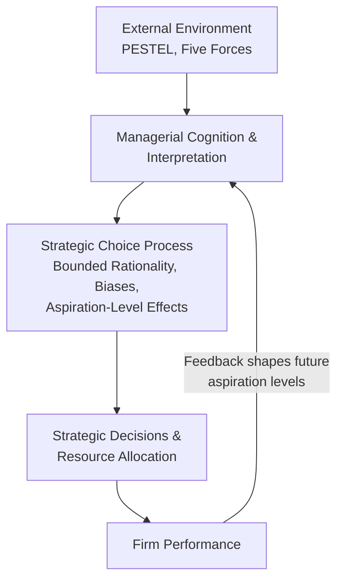

## Behavioral Strategy Theory

### Overview

Behavioral strategy theory is a school of strategic management that integrates realistic, empirically grounded assumptions about human cognition, emotion, and social behavior into the analysis of strategic management, strategist behavior, and firm performance. It represents a deliberate departure from the classical strategy tradition's implicit reliance on the rational-actor assumptions of neoclassical economics, instead building strategic theory and prescription directly on findings from psychology, behavioral economics, and cognitive science.

Behavioral strategy functions as the integrative umbrella for the specific topics addressed elsewhere in this chapter — bounded rationality (see Rational and Bounded Rationality Decision Models) and systematic cognitive biases (see Cognitive Biases in Strategic Decision-Making) are foundational building blocks of behavioral strategy, but behavioral strategy as a field extends beyond individual-level cognitive limitation to encompass how psychological and social-psychological realism should reshape strategic theory, strategy process design, and the practice of strategic leadership more broadly.

### Origins and Theoretical Lineage

**Key Points**

- Behavioral strategy traces its intellectual origins to Herbert Simon's foundational work on bounded rationality and administrative behavior, and to the Carnegie School tradition (Cyert and March's behavioral theory of the firm), which modeled organizations as coalitions of actors with differing goals operating under bounded rationality, rather than as unitary rational-actor entities
- It draws heavily on the subsequent behavioral economics tradition established by Kahneman and Tversky (heuristics and biases, prospect theory), extending their individual-decision-making findings into the organizational and strategic domain
- The formal articulation of "behavioral strategy" as a distinct field within strategic management is most closely associated with the work of scholars such as Sidney Finkelstein, Jerker Denrell, and Gerard Powell, who explicitly proposed integrating psychological and social-psychological realism into mainstream strategy theory, positioning it as a complement to (rather than wholesale replacement of) the classical strategy tradition

### Core Premises of Behavioral Strategy

**Key Points**

- **Bounded rationality as the default condition**: strategic decision-makers operate under genuine cognitive, informational, and time constraints (see Rational and Bounded Rationality Decision Models), making the classical rational-actor model a normative ideal rather than a descriptively accurate account of actual strategic behavior
- **Systematic, not random, deviation from rationality**: the ways decision-makers depart from classical rationality are predictable and repeatable (per the cognitive bias literature — see Cognitive Biases in Strategic Decision-Making), meaning behavioral effects on strategy are a persistent structural feature of organizational decision-making rather than noise that averages out
- **Social and emotional factors matter, not only cognitive limits**: behavioral strategy extends beyond purely cognitive constraints to incorporate the influence of emotion, social dynamics, power, and organizational politics on strategic decision-making and execution
- **Strategy as enacted by real people in real organizations**: behavioral strategy treats the psychological and social characteristics of actual executives, managers, and organizational actors as first-order explanatory variables for strategic choices and firm performance, rather than abstracting strategy formulation to an idealized, depersonalized analytical process

### Behavioral Strategy vs. Classical Strategy Perspectives

| Dimension | Classical Strategy Perspective | Behavioral Strategy Perspective |
| --- | --- | --- |
| Decision-maker model | Rational, utility-maximizing actor | Boundedly rational actor subject to systematic cognitive and social-psychological influences |
| Strategy formulation process | Systematic, comprehensive analysis leading to optimal choice | Iterative, heuristic-driven process shaped by cognition, emotion, and social dynamics |
| Source of competitive advantage explanation | Industry structure, resource positioning, capability configuration | Includes the above, plus differences in managerial cognition, judgment quality, and organizational decision processes |
| Treatment of executive judgment | Often treated as an input to be optimized via better information/frameworks | Treated as a variable subject to its own systematic biases requiring explicit management |
| View of strategic failure | Attributed primarily to flawed analysis, poor positioning, or execution gaps | Also attributes failure to identifiable behavioral patterns (overconfidence, escalation of commitment, groupthink) that recur predictably |

### Key Domains Within Behavioral Strategy

#### Managerial Cognition and Strategic Judgment

**Key Points**

- Examines how executives' mental models, cognitive frames, and prior experience shape what strategic options they perceive as available, and how they interpret ambiguous market and competitive information
- **Cognitive framing** of a strategic situation (e.g., perceiving industry change as a threat to be defended against versus an opportunity to be pursued) can materially shape strategic response even when the underlying objective market conditions are identical across firms, helping to explain why firms facing ostensibly similar external environments (per PESTEL Analysis Framework and Five Forces analysis) often pursue markedly different strategic responses
- Executive experience and cognitive diversity within top management teams are studied as factors influencing the range of strategic alternatives an organization is likely to generate and seriously consider

#### Behavioral Theory of the Firm and Organizational Decision-Making

**Key Points**

- Building on Cyert and March, organizations are modeled as coalitions of individuals and subunits with partially conflicting goals, operating under bounded rationality, using simplified decision rules (standard operating procedures) and sequential attention to competing goals rather than simultaneous optimization across all organizational objectives
- **Aspiration-level theory**: organizational and managerial behavior, particularly risk-taking, is strongly influenced by performance relative to a reference aspiration level (often derived from historical performance or peer benchmarks) rather than by absolute performance alone — firms performing below aspiration levels tend toward increased risk-taking (a behavioral pattern with direct roots in prospect theory's loss-aversion framing), while firms performing above aspiration tend toward more conservative, risk-averse strategic behavior
- Organizational search for strategic alternatives is characterized as **problemistic search** — triggered primarily by performance shortfalls relative to aspiration, and tending to terminate once an adequate (satisficing) alternative is found near the source of the identified problem, rather than as continuous, comprehensive environmental scanning

#### Behavioral Strategy and Strategic Leadership

**Key Points**

- Applies behavioral insight directly to the study of top executives and boards, examining how CEO psychological characteristics (overconfidence, risk tolerance, narcissism, and related traits studied in the upper echelons theory tradition) systematically influence strategic choices such as acquisition activity, capital structure decisions, and strategic risk-taking
- Examines group-level dynamics within top management teams and boards (including groupthink — see Cognitive Biases in Strategic Decision-Making) as a distinct behavioral layer beyond individual executive cognition, since strategic decisions are typically made by teams and boards rather than single individuals in isolation
- Considers the role of organizational culture and social norms in either reinforcing or counteracting individual-level cognitive biases at scale across the organization

### Framework: The Behavioral Strategy Lens Applied to Firm Performance

**Key Points**

- This framework highlights behavioral strategy's central theoretical contribution: it inserts managerial cognition and the strategic choice process as an explicit, non-neutral intermediating layer between objective external conditions and strategic outcomes, whereas classical strategy frameworks often implicitly treat this intermediation as neutral or frictionless
- The feedback loop from performance to aspiration levels, and from aspiration levels back to future risk-taking behavior, illustrates a key behavioral strategy insight: strategic behavior is path-dependent on the firm's own performance history in ways that a purely forward-looking rational optimization model would not predict

### Worked Example: Explaining Divergent Strategic Responses to Industry Disruption

**Example**

Two firms facing an identical disruptive technological shift in their industry, with comparable resource bases and market positions, may pursue markedly different strategic responses. Under a purely classical strategy lens, this divergence would be attributed to differences in objective resource endowments or market positioning. A behavioral strategy lens instead considers whether the divergence is better explained by differences in executive cognitive framing (perceiving the disruption as an existential threat to legacy operations, triggering defensive, loss-averse behavior consistent with prospect theory, versus perceiving it as a growth opportunity, triggering more aggressive investment), differences in each firm's current performance relative to its own aspiration level (a firm underperforming its aspiration may take on more strategic risk in response, per aspiration-level theory), and differences in top management team composition and any resulting groupthink or dissent-suppression dynamics shaping which strategic alternatives were seriously considered.

**Conclusion**

This example illustrates behavioral strategy's central explanatory contribution: it provides a systematic, theory-grounded account for strategic divergence between similarly positioned firms that classical, purely structural strategy frameworks are not designed to explain, without abandoning those classical frameworks' continued relevance for analyzing the external structural conditions both firms actually face.

### Practical Applications and Organizational Implications

**Key Points**

- Behavioral strategy insight informs the design of strategic decision processes intended to counteract known biases (devil's advocacy, pre-mortems, independent estimation — see Cognitive Biases in Strategic Decision-Making for specific techniques), reflecting behavioral strategy's practical orientation toward improving, not merely describing, strategic decision quality
- Executive selection, development, and top management team composition decisions are informed by behavioral strategy's findings on how individual executive psychology and team-level cognitive diversity influence strategic outcomes
- Performance measurement and target-setting practices can be designed with awareness of aspiration-level effects, recognizing that how performance targets are framed relative to historical or peer benchmarks will systematically influence subsequent organizational risk-taking behavior
- [Speculation] The continued integration of behavioral strategy insight with emerging data-driven and AI-augmented decision-making capability (see Data-Driven Strategic Decision-Making and Artificial Intelligence Strategy for Competitive Advantage) represents an actively developing area, raising open questions about whether algorithmic decision support can meaningfully counteract the specific behavioral biases this field has documented, or whether such tools introduce their own distinct behavioral risks (e.g., automation bias, or overreliance on model outputs without adequate critical evaluation)

### Critiques and Limitations

**Key Points**

- Behavioral strategy has been critiqued for sometimes offering a rich, plausible-sounding explanatory narrative for a specific strategic outcome after the fact, without equivalent predictive power specifying in advance which firms will exhibit which behavioral patterns and outcomes
- The field draws on a broad and sometimes loosely integrated set of psychological constructs (cognitive biases, personality traits, group dynamics, aspiration-level theory), and critics note that behavioral strategy as a field has not yet produced a single unifying formal theory comparable in parsimony to the classical rational-actor models it critiques
- [Unverified] The extent to which behavioral strategy findings, many originally derived from individual-level psychological experiments, generalize reliably to complex, multi-actor organizational strategic decision-making remains a subject of ongoing methodological discussion within the field

### Related Topics

- Rational and Bounded Rationality Decision Models
- Cognitive Biases in Strategic Decision-Making
- Prospect Theory and Risk Behavior in Strategic Choices
- Upper Echelons Theory and Executive Characteristics
- Behavioral Theory of the Firm (Cyert and March)
- Groupthink and Strategic Decision-Making in Teams
- Organizational Culture and Decision-Making Norms
- Strategic Leadership and Top Management Teams
- Escalation of Commitment in Strategic Decisions
- Data-Driven Strategic Decision-Making