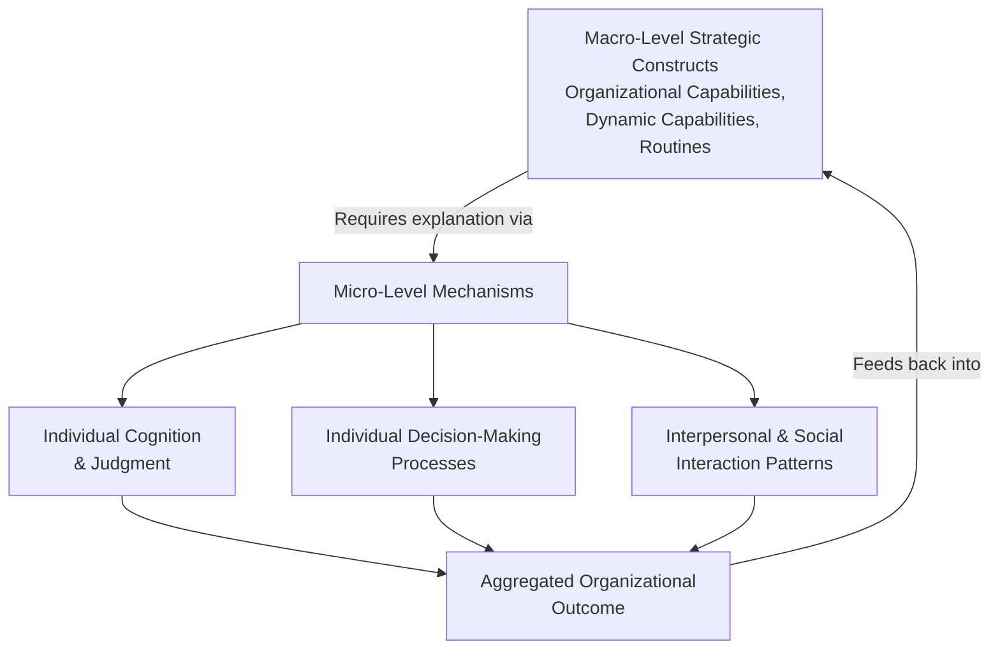

## Microfoundations of Strategy

### Overview

The microfoundations of strategy is a research and theoretical perspective within strategic management that argues macro-level strategic outcomes — firm performance, competitive advantage, capability development, organizational routines — must ultimately be explained by reference to the individual-level actions, cognitions, interactions, and decisions of the people within the organization. It represents a methodological and theoretical commitment to grounding strategy theory's macro-level constructs (organizational capabilities, dynamic capabilities, routines, resources) in verifiable individual and interpersonal-level mechanisms, rather than treating these macro constructs as self-contained explanatory entities operating independently of the people who enact them.

This perspective emerged partly in response to a critique of mainstream strategy theory: concepts such as "organizational capabilities" or "dynamic capabilities" (per the resource-based view and Teece's dynamic capabilities framework) are frequently invoked as explanatory constructs without full specification of the underlying individual behaviors, cognitive processes, and social interactions that actually constitute and produce them — a critique sometimes summarized as strategy theory's macro constructs risking becoming abstract labels rather than mechanistically explained phenomena.

### The Core Argument: Macro Constructs Require Micro-Level Explanation

**Key Points**

- Strategic management has historically operated substantially at the organizational or firm level of analysis (industry structure, resource bundles, capability configurations), often without equal attention to the individual-level processes that generate and sustain these firm-level phenomena
- The microfoundations perspective does not reject macro-level strategic constructs as invalid, but argues they are theoretically incomplete without an account of the individual-level mechanisms — cognition, decision-making, social interaction, motivation — through which they actually arise and are sustained over time
- This connects directly to behavioral strategy (see Behavioral Strategy Theory) and bounded rationality (see Rational and Bounded Rationality Decision Models): both fields share the microfoundations commitment to grounding strategic explanation in realistic accounts of how actual individuals think and decide, rather than in idealized or black-boxed organizational-level abstractions

### Microfoundations Applied to Core Strategy Constructs

#### Microfoundations of Organizational Capabilities

**Key Points**

- Organizational capabilities (the ability to reliably perform a coordinated set of tasks to achieve a valued outcome) are, under the microfoundations view, ultimately constituted by individual skills, individual and collective knowledge, coordination mechanisms between individuals, and the incentive structures shaping individual effort and behavior
- Two organizations can be described identically at the macro level (e.g., "both possess strong new product development capability") while differing substantially in the underlying individual-level mechanisms producing that capability (e.g., one relying on a small number of highly skilled individual experts, the other on well-designed cross-functional coordination routines that function well even with less individually exceptional talent) — a distinction with direct implications for how durable or transferable the capability actually is
- This has practical implications for capability-building strategic initiatives: interventions aimed at building organizational capability (training programs, process redesign, incentive restructuring) are only theoretically well-grounded if they target the actual individual-level mechanisms constituting the capability, rather than assuming capability change can be achieved by macro-level organizational restructuring alone

#### Microfoundations of Dynamic Capabilities

**Key Points**

- Teece's dynamic capabilities framework (sensing, seizing, transforming — see Artificial Intelligence Strategy for Competitive Advantage for an applied discussion) has been a particular focus of microfoundations scholarship, since "sensing" and "seizing" opportunities are inherently cognitive and entrepreneurial processes carried out by specific individuals (often, though not exclusively, senior executives) before they become organizational-level capability
- Microfoundations research on dynamic capabilities examines individual-level managerial cognition, entrepreneurial judgment, and decision-making processes as the mechanisms that must be specified to explain why some organizations sense and seize strategic opportunities more effectively than others, rather than treating "sensing capability" as an unexplained organizational attribute
- [Inference] This microfoundations extension of dynamic capabilities theory is broadly viewed within the strategy field as strengthening rather than undermining the original framework, by providing a more mechanistically complete account of how sensing and seizing capability actually develops and varies across organizations

#### Microfoundations of Organizational Routines

**Key Points**

- Organizational routines (repeated, recognizable patterns of interdependent organizational action) are, under the microfoundations view, constituted by the individual habits, cognitive scripts, and interpersonal coordination patterns of the specific individuals who enact them, rather than existing as an independent organizational-level entity separate from those individuals
- Routines are understood to exhibit both an **ostensive aspect** (the abstract, generalized pattern that can be described and recognized) and a **performative aspect** (the specific, situated enactment by particular individuals on a particular occasion) — and microfoundations scholarship emphasizes that routines can evolve and adapt precisely because their performative enactment by real individuals allows for variation, improvisation, and learning that a purely abstract description of the routine would not capture
- This has direct relevance to strategic change initiatives: attempts to change organizational routines that focus solely on redesigning the ostensive (formally described) pattern, without attention to how individuals will actually perform and potentially adapt the routine in practice, are more likely to encounter implementation gaps between intended and actual organizational behavior

### Microfoundations and the Resource-Based View

**Key Points**

- The resource-based view (RBV) and its VRIO extension have been a particular target of microfoundations critique, since resources and capabilities are frequently analyzed at the firm level (is a resource valuable, rare, inimitable, and organizationally exploited?) without full specification of the individual-level processes through which resources are identified, developed, deployed, and combined by actual organizational members
- Microfoundations scholarship argues that a firm-level resource's *inimitability* (a core VRIO criterion for sustainable advantage) is often actually rooted in the difficulty of replicating the specific individual-level knowledge, judgment, and social relationships that constitute the resource in practice — meaning a fuller microfoundational account can clarify *why* a given resource is genuinely difficult to imitate, beyond simply asserting that it is
- This connects to the concept of **causal ambiguity** discussed in the context of HR strategy (see Human Resource Strategy Alignment): microfoundations research helps explain why causal ambiguity arises — competitors can observe macro-level outcomes and even formal organizational practices, but cannot easily observe or replicate the underlying individual-level cognitive and social processes that actually generate the advantage

### Levels of Analysis in Microfoundations Research

| Level | Focus | Example Strategic Question |
| --- | --- | --- |
| Individual | Cognition, motivation, skill, judgment of specific organizational members | How does a specific executive's cognitive framing of market conditions shape the strategic alternatives considered? |
| Interpersonal/Team | Coordination, communication, and interaction patterns between individuals | How does a top management team's internal dynamics shape the quality of strategic decision-making? |
| Organizational (Aggregate) | The macro-level pattern emerging from aggregated individual and interpersonal processes | Why does the organization exhibit the "capability" or "routine" observed at the firm level? |

**Key Points**

- Microfoundations research explicitly works to connect these levels of analysis, arguing that rigorous strategy theory should specify the aggregation mechanism by which individual and interpersonal-level phenomena combine to produce the organizational-level outcome, rather than treating the organizational level as the sole or primary unit of analysis

### Strategic Management Implications

**Key Points**

- **Diagnostic implications**: when a firm-level capability or routine underperforms expectations, a microfoundations lens directs diagnostic attention toward the specific individual-level and interpersonal mechanisms that may be malfunctioning (e.g., specific coordination breakdowns, misaligned individual incentives, or gaps in individual-level skill), rather than treating the capability failure as an unexplained organizational-level phenomenon
- **Capability-building implications**: strategic initiatives intended to build new organizational capability are more likely to succeed when explicitly designed around the target individual-level mechanisms (specific skill development, specific coordination process design, specific incentive alignment) rather than pursued through macro-level structural or policy change alone, without attention to whether the intended individual-level behavior change will actually occur
- **M&A and capability transfer implications**: since capabilities are constituted by individual-level and interpersonal mechanisms that may not transfer intact when personnel change (e.g., following an acquisition, key employee departure, or major restructuring), a microfoundations perspective helps explain a commonly observed pattern in which acquired capabilities fail to transfer or persist post-acquisition despite the acquired organizational structure and formal processes being nominally preserved

### Worked Example: Microfoundations Analysis of an Innovation Capability

**Example**

A firm identified at the macro level as possessing "strong innovation capability" might, under microfoundations analysis, be found to depend substantially on: (1) the individual cognitive habits and domain expertise of a small number of key R&D scientists, (2) specific informal interpersonal coordination patterns between R&D and marketing personnel that facilitate rapid customer-insight-to-prototype iteration, and (3) individual-level incentive structures that reward calculated risk-taking on novel ideas rather than punishing well-reasoned failures. A competitor attempting to replicate this "innovation capability" purely by adopting the same formal organizational structure (e.g., a similarly named cross-functional innovation team) without replicating the specific individual expertise, informal coordination patterns, and incentive structures would likely fail to reproduce the underlying capability, despite superficial organizational similarity.

**Conclusion**

This example illustrates the microfoundations perspective's core practical value: it explains why organizational capabilities are often genuinely difficult for competitors to imitate even when the formal organizational structure appears observable and copyable, and it directs internal capability-building efforts toward the specific individual and interpersonal mechanisms that must be developed, rather than toward structural mimicry of firms perceived to possess the desired capability.

### Critiques and Debates

**Key Points**

- Critics of the strong microfoundations position argue that insisting all macro-level strategic constructs be fully reduced to individual-level mechanisms risks an infinite regress (individual cognition itself can be further decomposed into neurological or even more granular processes) and may sacrifice the genuine explanatory and predictive value that parsimonious macro-level strategic constructs provide, even without complete micro-level specification
- A moderate position, more widely accepted within the field, holds that microfoundations should *inform and strengthen* macro-level strategic theory by clarifying underlying mechanisms where doing so adds explanatory or practical value, without requiring the wholesale abandonment of macro-level constructs (capabilities, routines, resources) that remain analytically useful for many strategic questions
- [Unverified] The degree to which microfoundations research has, in practice, produced actionable and generalizable prescriptive guidance beyond enriching academic explanatory theory is a subject of ongoing discussion, with some practitioner-oriented critics noting that the granular, context-specific nature of individual-level mechanisms can make broad, generalizable strategic prescriptions more difficult to derive compared to macro-level frameworks

### Related Topics

- Behavioral Strategy Theory
- Rational and Bounded Rationality Decision Models
- Resource-Based View (RBV) and VRIO Framework
- Dynamic Capabilities Theory (Teece)
- Human Resource Strategy Alignment (causal ambiguity)
- Organizational Routines and Standard Operating Procedures
- Upper Echelons Theory and Executive Characteristics
- Strategic Leadership and Top Management Teams
- Mergers and Acquisitions Integration Strategy
- Cognitive Biases in Strategic Decision-Making