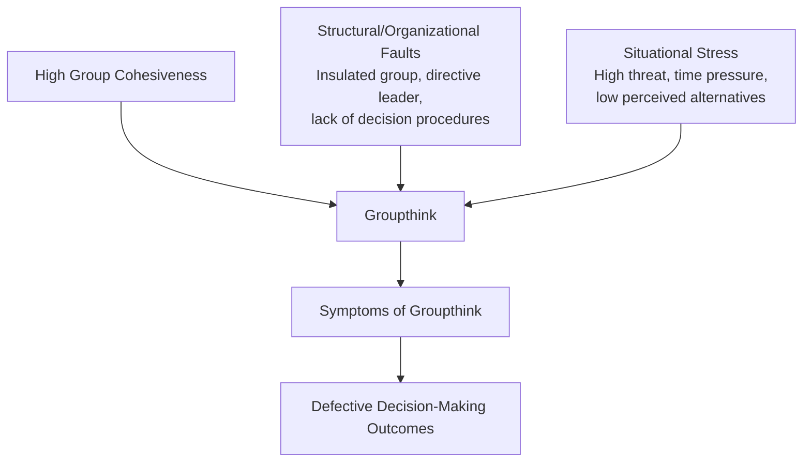

## Groupthink and Strategic Decision Pitfalls

### Overview

Groupthink and strategic decision pitfalls concerns the systematic failure modes that arise specifically from group and team dynamics in strategic decision-making, as distinct from the individual-level cognitive biases addressed in Cognitive Biases in Strategic Decision-Making. While individual biases (overconfidence, anchoring, confirmation bias) can affect any single decision-maker, groupthink and related pitfalls arise from the social and interpersonal dynamics of collective decision-making — dynamics that can either amplify individual biases or introduce entirely distinct failure modes not present when a single individual decides alone.

This distinction matters because most consequential strategic decisions (major investments, M&A, strategic pivots, crisis response) are made by groups — executive teams, boards, and committees — rather than by isolated individuals, making group-level decision pathology a central practical concern for strategic management, not a secondary elaboration of individual-level bias research.

### Irving Janis's Groupthink Theory

**Key Points**

- Groupthink, originally described by social psychologist Irving Janis, is defined as a mode of thinking that occurs when the desire for consensus and group cohesion overrides members' motivation to realistically evaluate alternative courses of action
- Janis developed the concept primarily through retrospective analysis of major foreign policy decision failures, but the underlying theoretical mechanism generalizes directly to corporate strategic decision-making bodies (executive committees, boards, deal teams) operating under similar structural and social conditions
- Groupthink is a group-level phenomenon: it does not require that any individual member is personally biased or incompetent, but arises from the interaction dynamics of the group itself, meaning even a group composed of individually capable and well-intentioned members can produce a groupthink failure

### Antecedent Conditions for Groupthink

**Key Points**

- **High group cohesiveness**: tightly-knit teams with strong interpersonal bonds and shared identity, while generally beneficial for morale and coordination, are more susceptible to groupthink because the social cost of dissent (damaging valued relationships) is higher
- **Structural/organizational faults**: insulation of the group from outside expert opinion or dissenting information, lack of impartial leadership (a directive leader who signals a preferred outcome early in deliberation), lack of established norms for methodical, structured decision procedures, and homogeneity in members' social and professional backgrounds
- **Situational context**: high external threat combined with low perceived hope of finding a better solution than the leader's preferred course of action, and high decision stress — conditions frequently present precisely in the high-stakes, time-pressured strategic decisions (crisis response, competitive threat response, major irreversible investments) where decision quality matters most

### Symptoms of Groupthink

**Key Points**

- **Illusion of invulnerability**: excessive optimism and risk-taking based on shared overconfidence in the group's collective judgment and capability
- **Collective rationalization**: discounting warnings or negative feedback that might otherwise prompt reconsideration of the group's assumptions, functioning as a group-level analog of individual confirmation bias
- **Belief in inherent group morality**: an unquestioned assumption that the group's decisions are inherently ethical or sound, discouraging critical ethical or risk-based scrutiny of the chosen course of action
- **Stereotyping of out-groups**: dismissive or oversimplified views of competitors, critics, or external stakeholders whose perspectives might otherwise challenge the group's assumptions
- **Direct pressure on dissenters**: applying social pressure to members who express doubts or arguments against the group's apparent consensus, discouraging further dissent
- **Self-censorship**: individual members withholding their own doubts or counterarguments to avoid disrupting apparent group consensus, even without direct external pressure
- **Illusion of unanimity**: silence from members being interpreted (often incorrectly) as agreement, reinforcing a false impression of consensus that reduces perceived need for further scrutiny
- **Self-appointed "mindguards"**: certain members taking on the informal role of protecting the group and its leader from dissenting or disconfirming information reaching the group's deliberation

### Consequences: Defective Decision-Making Symptoms

**Key Points**

- Incomplete survey of alternatives, with the group's consideration prematurely narrowing to a small set of options (often just the leader's preferred course of action and one or two token alternatives)
- Failure to examine risks associated with the preferred course of action, and failure to develop contingency plans in case the preferred option fails
- Poor information search, with the group failing to consult available expertise or gather additional relevant information that might challenge the emerging consensus
- Selective bias in processing available information, interpreting ambiguous information in ways consistent with the preferred alternative rather than objectively

**Example**

An executive team evaluating a major market entry decision under groupthink conditions might rapidly converge on the CEO's initially favored market, fail to seriously develop or evaluate alternative candidate markets, discount competitive intelligence suggesting the target market carries a higher regulatory risk than assumed, and proceed without a contingency plan for the scenario in which the anticipated demand fails to materialize — not because any individual team member lacked the capability to identify these gaps, but because the group's social dynamics suppressed the kind of critical scrutiny that would have surfaced them.

### Groupthink Compared to Related Group Decision Pitfalls

**Key Points**

- **Group polarization**: the tendency for group discussion to shift the group's collective position toward a more extreme version of the individual members' initial average inclination (e.g., a moderately risk-tolerant group becoming more risk-seeking after discussion), a distinct mechanism from groupthink though it can co-occur and compound similar risk-taking outcomes
- **Escalation of commitment in groups** (see Cognitive Biases in Strategic Decision-Making for the individual-level concept): group dynamics can amplify individual-level escalation of commitment, since publicly committing to a course of action as a group creates additional social and reputational barriers to later collective reversal, beyond what any individual member alone would face
- **False consensus and premature closure**: groups under time pressure may converge on an apparent consensus prematurely, driven by a shared desire to conclude the deliberation process rather than by genuine underlying agreement, producing similar symptoms to groupthink without necessarily requiring the high-cohesiveness antecedent condition Janis originally specified
- **Diffusion of responsibility**: group decision-making can reduce any individual member's felt accountability for the outcome relative to an individual decision-maker, potentially reducing the diligence any single member applies to scrutinizing the decision

### Organizational Countermeasures

**Key Points**

- **Assign a formal devil's advocate role**: designating one or more group members with the explicit mandate to challenge the emerging consensus and argue for alternative positions, structurally counteracting self-censorship and pressure on dissenters (this overlaps directly with the debiasing techniques discussed under Cognitive Biases in Strategic Decision-Making, applied specifically at the group level)
- **Leader withholds initial opinion**: group leaders deliberately refraining from stating a preferred position early in the deliberation process, reducing the anchoring and social pressure effects that a leader's early-stated preference can create
- **Break into independent subgroups**: dividing the decision-making group into smaller independent subgroups to evaluate the decision separately before reconvening, reducing the risk that a single group's internal social dynamics dominate the entire deliberation
- **Invite outside experts and dissenting perspectives**: deliberately incorporating individuals from outside the core decision-making group, particularly those without a personal stake in a particular outcome, to counteract insulation from disconfirming information
- **Second-chance meetings**: after apparent consensus is reached, holding a follow-up meeting explicitly dedicated to expressing any remaining doubts before final commitment, providing a structured opportunity to surface residual dissent that self-censorship may have suppressed in the original discussion
- **Structured, methodical decision procedures**: establishing and following explicit decision-making protocols (e.g., systematic alternative generation and evaluation criteria) rather than allowing informal, unstructured group discussion to determine the outcome, directly addressing one of groupthink's key antecedent structural faults

### Framework: Groupthink Risk Diagnostic for Strategic Decision Bodies

**Steps**

1. **Assess group cohesiveness and homogeneity** — evaluate whether the decision-making group is highly cohesive and/or homogeneous in background, which elevates baseline groupthink risk
2. **Evaluate leadership style during deliberation** — determine whether the group's leader states a preferred position early and directively, or facilitates open exploration of alternatives before expressing a view
3. **Check for structured decision procedures** — verify the group follows an explicit, methodical process for generating and evaluating alternatives, rather than relying on unstructured discussion
4. **Assess exposure to outside perspectives** — confirm the group has genuine channels for outside expert input and dissenting viewpoints, rather than being insulated from perspectives that could challenge emerging consensus
5. **Monitor for groupthink symptoms during deliberation** — watch for early, rapid convergence on a single alternative; suppressed or absent dissent; and unexamined assumptions about risk or the group's collective competence
6. **Institute a formal second-chance review** before final commitment on high-stakes strategic decisions, providing a structured final opportunity for dissent before the decision becomes difficult to reverse

### Worked Example: Board-Level M&A Approval Process

| Groupthink Risk Factor | Manifestation | Countermeasure Applied |
| --- | --- | --- |
| High board cohesiveness, long-tenured members | Reluctance to challenge a well-regarded, long-tenured CEO's acquisition recommendation | Independent board committee with delegated authority to commission separate due diligence and present findings without the CEO present |
| Directive leadership signal | CEO expresses strong personal enthusiasm for the deal early in the board presentation | Board chair structures the agenda so that independent director questions and concerns are solicited before the CEO's recommendation is formally voted on |
| Insulation from dissenting information | Deal team presentation emphasizes synergy upside with limited discussion of integration risk | External independent financial and legal advisors engaged specifically to present a risk-focused counter-analysis |
| Illusion of unanimity risk | Board members individually holding reservations may assume, incorrectly, that their silence signals isolated dissent | Anonymous pre-vote written comment process allowing directors to register concerns privately before the open board discussion |

**Conclusion**

This example illustrates that groupthink countermeasures for high-stakes strategic decisions (such as major M&A approval) are typically structural and procedural rather than reliant on individual board members' good intentions or awareness of groupthink risk — well-designed governance processes are specifically intended to function even when some or all of Janis's antecedent conditions for groupthink are present within the group.

### Limitations and Considerations

**Key Points**

- Not all group decision-making that reaches rapid consensus constitutes groupthink; genuine, well-reasoned agreement reached through legitimate deliberation is a normal and often efficient outcome of group decision processes, and should be distinguished from consensus reached through the suppression of dissent and inadequate alternative evaluation that defines groupthink specifically
- Countermeasures such as devil's advocacy and structured dissent processes carry their own costs in time, process complexity, and potential for artificially manufactured conflict that does not genuinely improve decision quality if implemented mechanically rather than as a genuine cultural commitment to critical evaluation
- [Unverified] The empirical evidence base for groupthink theory, while influential and widely taught, has faced some methodological critique in subsequent academic literature regarding the retrospective, case-study-based nature of much of the original supporting evidence; practitioners should treat the framework as a valuable diagnostic heuristic rather than a precisely validated predictive model

### Related Topics

- Cognitive Biases in Strategic Decision-Making
- Rational and Bounded Rationality Decision Models
- Behavioral Strategy Theory
- Escalation of Commitment in Strategic Decisions
- Strategic Leadership and Top Management Teams
- Corporate Governance and Board Oversight
- Mergers and Acquisitions Due Diligence
- Upper Echelons Theory and Executive Characteristics
- Organizational Culture and Decision-Making Norms
- Crisis Management and Reputational Risk Strategy