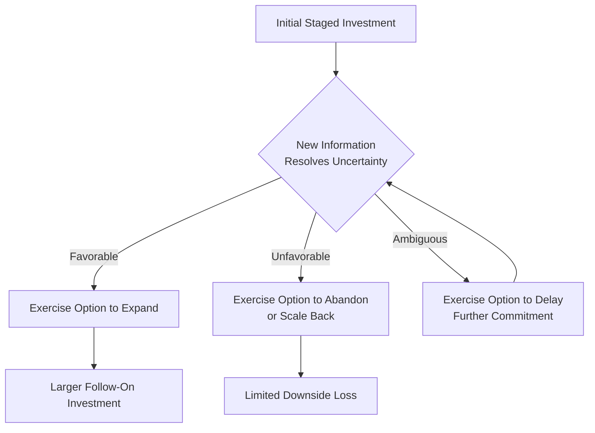

## Real Options Reasoning in Strategy

### Overview

Real options reasoning in strategy applies the conceptual and analytical logic of financial options theory to strategic investment decisions made under uncertainty, treating certain strategic investments not as single, irreversible commitments to be evaluated by traditional discounted cash flow analysis alone, but as investments that create valuable future decision rights — the option, but not the obligation, to expand, delay, abandon, or otherwise alter a course of action as uncertainty resolves over time. This reasoning is particularly consequential for strategic decision-making because many of the most important strategic investments (R&D programs, staged market entry, platform and technology bets, exploratory joint ventures) are characterized precisely by high uncertainty and significant managerial flexibility to adapt as new information arrives — conditions under which traditional static valuation approaches can systematically undervalue the investment.

Real options reasoning connects directly to earlier topics in this chapter: it is a partial technical corrective to the limitations of the classical rational decision model's single-scenario evaluation approach (see Rational and Bounded Rationality Decision Models), and it interacts with behavioral strategy considerations (see Behavioral Strategy Theory) since the disciplined, staged commitment logic of real options can serve as a structural countermeasure to escalation of commitment and overconfidence bias (see Cognitive Biases in Strategic Decision-Making).

### From Financial Options to Real Options

**Key Points**

- A financial option grants the holder the right, but not the obligation, to buy (a call option) or sell (a put option) an underlying asset at a specified price within a specified time period, with the option's value driven by the underlying asset's current price, the strike price, time to expiration, volatility, and the risk-free interest rate
- A **real option** applies this same right-without-obligation logic to real (non-financial) strategic investments: for example, an initial investment in a pilot program can be understood as purchasing the option to make a larger follow-on investment later, contingent on the pilot's results, without an obligation to proceed if results are unfavorable
- The central insight distinguishing real options reasoning from traditional discounted cash flow analysis is that **uncertainty combined with managerial flexibility has positive economic value** — traditional single-scenario NPV analysis (see Financial Strategy and Capital Allocation) can undervalue investments specifically because it does not separately account for the value created by the ability to react favorably to new information as it arrives

### Why Traditional NPV Analysis Can Undervalue Strategic Flexibility

**Key Points**

- Standard discounted cash flow analysis typically evaluates an investment based on a single expected cash flow scenario (or a probability-weighted average across scenarios), computing $NPV = \sum_{t=0}^{n} \frac{CF_t}{(1+r)^t}$ as a single, static number
- This approach implicitly assumes a "now or never," fully committed investment decision, and does not separately capture the value of being able to expand investment if early results are favorable, or to abandon/scale back if early results are unfavorable — asymmetric payoff structures that traditional expected-value NPV analysis tends to average away rather than properly value
- [Inference] The magnitude of undervaluation from applying traditional static NPV analysis to investments with substantial embedded optionality is generally understood to increase with the degree of underlying uncertainty (volatility) and the degree of genuine managerial flexibility to respond to new information — meaning the practical case for real options analysis is strongest specifically for high-uncertainty, staged, or reversible strategic investments, and comparatively weak for low-uncertainty, fully committed, one-time investments where traditional NPV analysis is already reasonably adequate

### Types of Real Options Relevant to Strategy

**Key Points**

- **Option to expand**: an initial, smaller-scale investment that creates the right to scale up significantly if conditions prove favorable (e.g., a pilot store format that can be rolled out broadly if successful)
- **Option to delay/defer**: retaining the right to postpone a larger commitment until additional information reduces uncertainty (e.g., delaying full market entry until observing a competitor's initial results in a similar market)
- **Option to abandon**: the ability to exit a strategic initiative and recover some value (e.g., salvage value of invested assets) if it underperforms, limiting downside exposure relative to a fully committed, non-abandonable investment
- **Option to switch/stage**: flexibility to alter the scale, technology, or approach of an initiative as conditions evolve, rather than being locked into an initial configuration (e.g., staged R&D funding contingent on milestone achievement)
- **Growth options embedded in current investments**: certain investments (e.g., an initial platform technology investment, or entry into an adjacent market) create option value not from their own direct returns, but from the future strategic opportunities they open up that would not otherwise be available

### Real Options and the Strategy Process

**Key Points**

- Real options reasoning provides a structural rationale for **staged, incremental strategic commitment** as opposed to large, single-shot commitments, particularly in high-uncertainty domains such as entry into emerging markets, novel technology adoption, and R&D investment portfolios
- This directly informs the bootstrapping and market entry sequencing considerations discussed under Ecosystem Strategy and Multi-Sided Markets (e.g., micro-market sequencing as a real-options-consistent approach to platform expansion) and the AI strategy build-vs-buy sequencing discussed under Artificial Intelligence Strategy for Competitive Advantage
- Real options logic also provides a disciplined framework for evaluating exploratory investments (new ventures, corporate venture capital positions, early-stage partnerships) that would appear unattractive or marginal under a traditional single-scenario NPV test, but that may be justified by the strategic option value they create for future, currently unspecified strategic moves

### Worked Example: Staged Market Entry Evaluated as a Real Option

| Stage | Investment Decision | Real Options Interpretation |
| --- | --- | --- |
| Stage 1 | Small-scale pilot launch in one city/segment | Purchase of the option to expand, at relatively low cost, with capped downside |
| Decision point | Observe pilot demand, competitive response, regulatory reception | Uncertainty partially resolves; new information available to inform the next decision |
| Stage 2a (favorable results) | Exercise the option: scale to full national rollout | Full commitment made only after uncertainty has been substantially reduced |
| Stage 2b (unfavorable results) | Exercise the option to abandon: exit with limited sunk investment | Downside is capped near the Stage 1 investment amount, rather than the much larger amount a full immediate rollout would have exposed |

**Conclusion**

This example illustrates the central practical value of real options reasoning: a staged approach can be strategically superior to an immediate full-scale commitment even when the *expected value* of both approaches appears similar under a simplified single-scenario analysis, because the staged approach captures asymmetric payoff value (limited downside, preserved upside) that a single-scenario NPV comparison does not fully represent.

### Real Options Valuation Approaches

**Key Points**

- **Formal quantitative real options valuation** adapts financial option pricing models (e.g., binomial lattice models, or adaptations of the Black-Scholes framework) to real investment contexts, requiring estimation of parameters analogous to financial option inputs (an underlying "asset value," a "strike price" equivalent to the follow-on investment cost, an estimate of volatility in the underlying uncertain variable, and time to the decision point)
- **Real options reasoning as a qualitative/strategic lens**, distinct from formal quantitative valuation, is more commonly and more broadly applied in strategic management practice: even without precise option-pricing calculation, explicitly considering "what is the value of the flexibility this investment structure preserves, and what is the cost of foreclosing that flexibility by committing fully upfront" can meaningfully improve strategic investment decision quality
- [Unverified] Formal quantitative real options valuation faces persistent practical estimation challenges — particularly around reliably estimating the "volatility" parameter for real (non-traded) strategic assets, which lack the continuous market pricing data available for financial options — and as a result, many practitioners and scholars regard the qualitative reasoning framework as more broadly and reliably applicable to strategic decisions than the formal quantitative valuation models, though both approaches remain in active use depending on context and data availability

### Real Options and Behavioral Strategy Interactions

**Key Points**

- Explicit real options framing of a staged investment can function as a structural countermeasure to escalation of commitment (see Cognitive Biases in Strategic Decision-Making): by establishing upfront that a follow-on investment is genuinely contingent on specific, pre-defined decision criteria being met, organizations can create a clearer psychological and procedural basis for abandonment than an investment framed from the outset as an unconditional multi-year commitment
- However, real options reasoning does not automatically eliminate behavioral bias risk: overconfidence bias can lead decision-makers to systematically overestimate the favorability of future decision points, or to treat abandonment options as merely theoretical rather than genuinely intending to exercise them when unfavorable evidence accumulates — meaning the disciplined execution of real options logic, not merely its conceptual adoption, is what provides the behavioral countermeasure benefit
- [Speculation] The degree to which organizations that formally adopt real options language and staged investment structures actually achieve better decision discipline in practice, versus using real options framing post hoc to rationalize investments that would have proceeded regardless of the staged structure's genuine decision-gating function, is likely to vary considerably by organizational culture and governance rigor, and is not fully resolved by the existence of a formally staged investment structure alone

### Limitations and Critiques

**Key Points**

- Real options reasoning requires genuine optionality — an actual, credible ability to abandon, delay, or alter course — to provide its claimed value; if organizational, political, contractual, or reputational factors make abandonment or delay effectively infeasible in practice, the theoretical option value does not translate into real strategic value, and the investment should be evaluated closer to a traditional committed-investment basis
- Formal quantitative real options valuation models carry meaningful estimation risk given the difficulty of specifying reliable volatility and other parameters for genuinely novel strategic investments lacking historical or market-based reference data
- The framework can be misused to justify continued investment in a genuinely failing initiative by retroactively reframing sunk costs as "option premiums already paid," a rationalization pattern that a sound application of real options logic (focused strictly on the forward-looking value of remaining genuine flexibility) should not support
- Real options reasoning is most reliably applicable to investments with clear, identifiable decision points and genuinely separable stages; strategic investments that are inherently indivisible or where meaningful information only resolves after full commitment gain comparatively less practical benefit from the framework

### Related Topics

- Financial Strategy and Capital Allocation
- Rational and Bounded Rationality Decision Models
- Cognitive Biases in Strategic Decision-Making
- Behavioral Strategy Theory
- Ecosystem Strategy and Multi-Sided Markets (staged market entry)
- Artificial Intelligence Strategy for Competitive Advantage (staged technology investment)
- Scenario Planning and Strategic Foresight
- Net Present Value and Capital Budgeting Techniques
- Escalation of Commitment in Strategic Decisions
- Corporate Venture Capital and Exploratory Investment Strategy