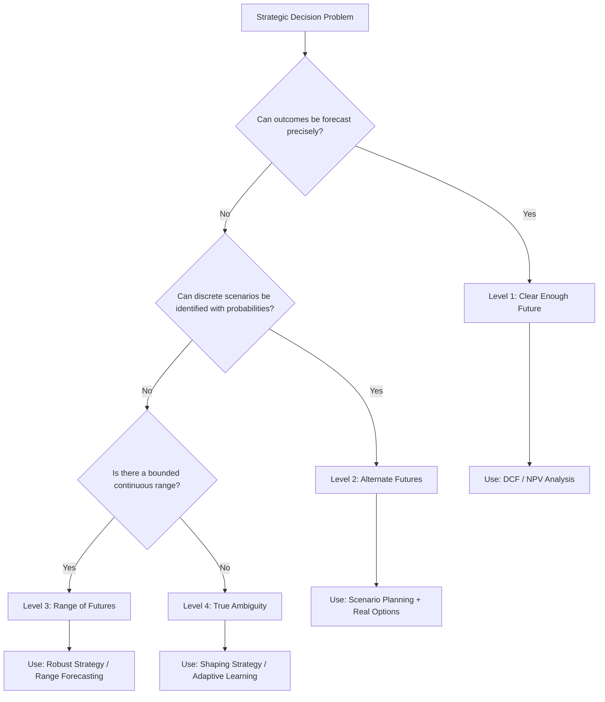
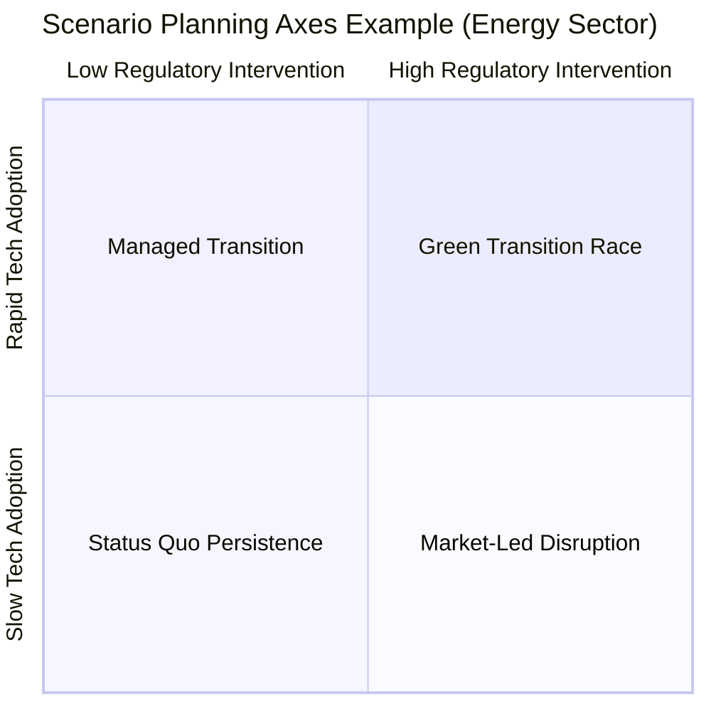

## Decision-Making Under Uncertainty and Ambiguity

### Overview

Decision-making under uncertainty and ambiguity is a core subfield of strategic management and behavioral strategy that examines how executives and organizations choose among courses of action when outcomes cannot be predicted with confidence and when the very structure of the decision problem may be unclear. Classical strategy models (e.g., Porter's Five Forces, SWOT) implicitly assume that decision-makers can identify relevant variables, assign probabilities, and rank options by expected value. In reality, strategic choices — market entry, M&A, R&D investment, geopolitical exposure — are frequently made under conditions where probabilities are unknown or unknowable, and where the range of possible future states is itself contested.

### Distinguishing Risk, Uncertainty, and Ambiguity

**Key Points**

- **Risk**: Outcomes are unknown, but the probability distribution over those outcomes is known or can be estimated (e.g., insurance actuarial tables, known failure rates). Decision theory here relies on expected value and expected utility calculations.
- **Uncertainty** (Knightian uncertainty, per economist Frank Knight, 1921): Outcomes and their probabilities are both unknown. There is no reliable basis for assigning likelihoods, so classical probability-weighted decision rules break down.
- **Ambiguity**: A related but distinct condition where the decision-maker faces multiple plausible probability distributions and lacks confidence in choosing among them (formalized by Daniel Ellsberg's 1961 paradox). Ambiguity aversion causes decision-makers to prefer known risks over unknown probabilities, even when expected values are equal.

$$EV = \sum_{i=1}^{n} p_i \cdot x_i$$

Where $p_i$ is the probability of outcome $i$ and $x_i$ is its payoff. Under true (Knightian) uncertainty, the $p_i$ terms cannot be reliably specified, so this formula is not computable in a meaningful way — this is the central analytical challenge the field addresses.

**Example**

A pharmaceutical company deciding whether to invest in a Phase III trial faces *risk* (known historical success rates for similar drug classes can inform probability estimates). The same company entering an entirely new gene-therapy modality with no historical precedent faces *uncertainty* (no base rates exist). If the company has two internal models predicting different success probabilities and cannot determine which model is more credible, it faces *ambiguity*.

### Courtney, Kirkland, and Viguerie's Four Levels of Uncertainty

A widely used strategic framework (originally published in *McKinsley Quarterly*, 1997) categorizes strategic uncertainty into four levels, each requiring a different strategic posture:

| Level | Description | Strategic Posture |
| --- | --- | --- |
| **Level 1** | A clear-enough future; a single forecast is precise enough for strategy | Standard NPV/DCF-based planning |
| **Level 2** | Alternate futures; a discrete set of scenarios, each with estimable probability | Scenario planning, real options |
| **Level 3** | A range of futures; a continuous range of outcomes with no natural scenarios | Range forecasting, robust strategy |
| **Level 4** | True ambiguity; multiple dimensions of uncertainty interact, no basis for forecasting | Adaptive/shaping strategies, learning-based approaches |

[Inference] Empirically, most large-scale strategic decisions (entering emerging markets, disruptive technology bets) fall into Level 3 or Level 4, yet many organizations default to Level 1 planning tools (single-point forecasts), producing a mismatch between analytical method and actual uncertainty structure.

### Behavioral Strategy Foundations

Behavioral strategy integrates cognitive and social psychology into strategic decision theory, challenging the assumption of rational, utility-maximizing decision-makers (the "rational actor" model of classical economics and early strategy theory).

**Key Points**

- **Bounded rationality** (Herbert Simon, 1947): Decision-makers operate with limited information, limited cognitive processing capacity, and limited time, leading to "satisficing" (choosing an option that is good enough) rather than optimizing.
- **Heuristics and biases** (Tversky & Kahneman, 1974): Under uncertainty, decision-makers rely on mental shortcuts that produce systematic, predictable errors:
  - **Availability heuristic**: Overweighting information that is easily recalled (e.g., overestimating competitor risk after a salient news event).
  - **Anchoring**: Over-relying on an initial reference point (e.g., an early valuation figure that skews subsequent M&A negotiations).
  - **Overconfidence bias**: Systematic overestimation of the precision of one's own forecasts, well-documented in strategic planning and capital budgeting contexts.
  - **Confirmation bias**: Seeking information that confirms a prior strategic commitment while discounting disconfirming evidence, which can contribute to escalation of commitment.
  - **Loss aversion** (Prospect Theory, Kahneman & Tversky, 1979): Losses are weighted roughly 2 to 2.5 times more heavily than equivalent gains, which skews executives toward risk-averse choices when framed as potential losses and risk-seeking choices when framed as potential gains from a loss position.

$$v(x) = \begin{cases} x^{\alpha} & x \geq 0 \\ -\lambda(-x)^{\beta} & x < 0 \end{cases}$$

This is the prospect theory value function, where $\lambda > 1$ represents the loss-aversion coefficient (commonly estimated around 2.25 in Kahneman and Tversky's original work), and $\alpha, \beta$ are typically less than 1, capturing diminishing sensitivity to both gains and losses.

**Example**

An executive team facing a declining product line may continue funding it (escalation of commitment) because withdrawing funding requires "realizing" the loss, whereas continued investment allows the loss to remain unrealized/ambiguous — even when the expected value of continued investment is clearly negative.

### Analytical Approaches to Managing Uncertainty and Ambiguity

#### 1. Scenario Planning

A structured method (pioneered by Royal Dutch Shell in the 1970s under Pierre Wack) for developing multiple internally consistent narratives about the future, rather than a single forecast.

**Next Steps for Applying Scenario Planning**

- Identify key driving forces (both predetermined trends and critical uncertainties).
- Select the 2-3 most impactful and most uncertain variables as scenario "axes."
- Construct 3-4 distinct, plausible, internally consistent narratives (avoid a simple "best case / worst case / base case" structure, which tends to anchor on the middle scenario).
- Stress-test current strategy against each scenario to identify robust moves (actions that perform acceptably across all scenarios) versus contingent moves.
- Establish "early warning" indicators to signal which scenario is emerging.

#### 2. Real Options Reasoning

Applies financial options theory to strategic investment decisions, treating incremental commitments (pilot projects, minority stakes, joint ventures) as options that preserve the right, but not the obligation, to make larger future investments as uncertainty resolves.

**Key Points**

- **Option to defer**: Delaying full commitment until more information arrives.
- **Option to expand**: Making a small initial investment with the ability to scale.
- **Option to abandon**: Limiting downside by structuring initial investment as a capped-loss commitment.
- **Option to switch**: Retaining flexibility to pivot between alternative technologies or markets.

The Black-Scholes framework is sometimes adapted (with caveats) to value strategic real options:

$$C = S_0 N(d_1) - Ke^{-rt}N(d_2)$$

Where $S_0$ is the present value of expected cash flows from the underlying project, $K$ is the investment cost, $r$ is the risk-free rate, $t$ is time to decision, and $N(\cdot)$ is the cumulative standard normal distribution. [Unverified] In practice, strategy scholars caution that the strict assumptions of Black-Scholes (e.g., tradable underlying assets, log-normal returns) rarely hold for real strategic investments, so real options analysis is more often used qualitatively to structure staged decision-making than to produce precise valuations.

#### 3. Robust Decision-Making (RDM)

Rather than optimizing for a single predicted future, RDM (developed largely at RAND Corporation) seeks strategies that perform "well enough" across a very wide range of plausible futures, explicitly avoiding the need to assign probabilities.

**Key Points**

- Uses computational scenario generation to stress-test a proposed strategy against thousands of plausible future states.
- Identifies vulnerabilities — combinations of conditions under which the strategy fails.
- Iteratively adjusts the strategy to reduce vulnerability, rather than seeking a single "optimal" plan.
- Well suited to Level 3/Level 4 uncertainty where scenario probabilities cannot be credibly estimated.

#### 4. Effectuation Logic

Developed by Saras Sarasvathy (2001) from research on expert entrepreneurs, effectuation is a decision logic explicitly designed for high-uncertainty environments, contrasted with **causal** logic (used under Level 1/2 uncertainty).

| Dimension | Causal Logic | Effectual Logic |
| --- | --- | --- |
| Starting point | Predefined goal | Available means (who I am, what I know, whom I know) |
| Approach to future | Prediction-based planning | Control-based action ("to the extent we can control the future, we do not need to predict it") |
| Risk orientation | Expected-return maximization | Affordable-loss principle |
| Attitude to surprises | Avoided where possible | Leveraged as opportunities |
| Relationships | Competitive analysis | Pre-commitments/partnerships that co-create the market |

**Example**

Rather than conducting extensive market research to predict demand for a novel product (causal logic), an effectuation-driven venture launches a minimal version funded only with resources it can afford to lose, and lets early customer commitments and partnerships shape the product roadmap.

#### 5. Bayesian Updating and Adaptive Strategy

In situations of partial (rather than radical) uncertainty, Bayesian reasoning provides a formal mechanism for revising probability estimates as new information arrives.

$$P(H \mid E) = \frac{P(E \mid H) \cdot P(H)}{P(E)}$$

Where $P(H)$ is the prior probability of hypothesis $H$ (e.g., "this market will grow"), $P(E \mid H)$ is the likelihood of observing evidence $E$ given $H$, and $P(H \mid E)$ is the updated (posterior) probability after observing $E$. Strategically, this underpins staged decision processes: initial market entry decisions are treated as priors, and subsequent investment stages are recalibrated as market feedback (the evidence) arrives.

### Ambiguity Aversion and the Ellsberg Paradox in Strategic Choice

The Ellsberg paradox demonstrates that decision-makers systematically prefer bets with known probabilities (risk) over bets with unknown probabilities (ambiguity), even when the expected values are identical — violating the axioms of subjective expected utility theory.

**Example**

Given two urns — Urn A with a known 50 red / 50 black ball composition, and Urn B with an unknown mix of 100 red and black balls — most people prefer betting on either color from Urn A over the equivalent bet on Urn B, despite the objective probability of winning being 50% in both cases under a symmetric-ignorance assumption. Strategically, this manifests as **home bias** (preferring familiar domestic markets over foreign markets with less-known risk profiles) and reluctance to enter markets where competitive dynamics are opaque, even when expected returns are comparable to familiar markets.

[Inference] This suggests that some observed corporate conservatism in unfamiliar markets reflects ambiguity aversion rather than purely rational risk-adjusted return calculations, though isolating this effect from other explanations (agency costs, information asymmetry) in field settings is methodologically difficult.

### Organizational Mechanisms for Managing Uncertainty

**Key Points**

- **Devil's advocacy and dialectical inquiry**: Structured processes that assign individuals or subgroups to challenge a proposed strategic direction, reducing groupthink and confirmation bias.
- **Premortem analysis** (Gary Klein): Before finalizing a decision, the team imagines that the decision has already failed and works backward to identify plausible causes, surfacing risks that optimistic forward-looking analysis tends to suppress.
- **Diversity of information sources and cognitive diversity**: Reduces correlated blind spots among decision-makers, though it can also slow consensus-building.
- **Staged/incremental commitment structures**: Tranche-based capital allocation (e.g., venture capital's staged funding rounds) that limits exposure and preserves the option to exit as ambiguity resolves.
- **Decentralization and local experimentation**: Allowing business units to run parallel, low-cost experiments under high ambiguity rather than committing to a single centralized bet.

### Illustrative Diagram: Decision Logic Under Increasing Uncertainty (svg_diagram)

<svg xmlns="http://www.w3.org/2000/svg" viewBox="0 0 760 420">
<text x="380" y="30" text-anchor="middle" font-size="18" font-weight="bold" fill="#1a1a2e">Decision Logic vs. Uncertainty Level (svg_diagram)</text>
<line x1="60" y1="370" x2="720" y2="370" stroke="#333" stroke-width="2" />
<line x1="60" y1="370" x2="60" y2="60" stroke="#333" stroke-width="2" />
<text x="390" y="405" text-anchor="middle" font-size="14" fill="#333">Increasing Uncertainty / Ambiguity →</text>
<text x="30" y="220" text-anchor="middle" font-size="14" fill="#333" transform="rotate(-90 30 220)">Reliance on Prediction</text>
<rect x="90" y="90" width="140" height="260" fill="#a8dadc" stroke="#1d3557" stroke-width="1.5" />
<text x="160" y="230" text-anchor="middle" font-size="13" font-weight="bold" fill="#1d3557">Level 1</text>
<text x="160" y="248" text-anchor="middle" font-size="11" fill="#1d3557">DCF / NPV</text>
<text x="160" y="264" text-anchor="middle" font-size="11" fill="#1d3557">Causal Logic</text>
<rect x="250" y="150" width="140" height="200" fill="#84c1cf" stroke="#1d3557" stroke-width="1.5" />
<text x="320" y="240" text-anchor="middle" font-size="13" font-weight="bold" fill="#1d3557">Level 2</text>
<text x="320" y="258" text-anchor="middle" font-size="11" fill="#1d3557">Scenario Planning</text>
<text x="320" y="274" text-anchor="middle" font-size="11" fill="#1d3557">Real Options</text>
<rect x="410" y="200" width="140" height="150" fill="#5fa8b8" stroke="#1d3557" stroke-width="1.5" />
<text x="480" y="265" text-anchor="middle" font-size="13" font-weight="bold" fill="#0b1d26">Level 3</text>
<text x="480" y="283" text-anchor="middle" font-size="11" fill="#0b1d26">Robust Decision</text>
<text x="480" y="298" text-anchor="middle" font-size="11" fill="#0b1d26">Making</text>
<rect x="570" y="250" width="140" height="100" fill="#e07a5f" stroke="#81261a" stroke-width="1.5" />
<text x="640" y="290" text-anchor="middle" font-size="13" font-weight="bold" fill="#3d0d05">Level 4</text>
<text x="640" y="308" text-anchor="middle" font-size="11" fill="#3d0d05">Effectuation /</text>
<text x="640" y="323" text-anchor="middle" font-size="11" fill="#3d0d05">Adaptive Learning</text>
<path d="M 90 100 Q 400 60 710 260" stroke="#e63946" stroke-width="2" fill="none" stroke-dasharray="5,4" />
<text x="400" y="55" text-anchor="middle" font-size="11" fill="#e63946">Forecast confidence declines →</text>
</svg>

### Common Pitfalls

**Key Points**

- Treating Level 3/4 uncertainty problems with Level 1 tools (single-point forecasts, precise NPV calculations), producing false precision.
- Escalation of commitment driven by sunk-cost reasoning and loss aversion rather than updated expected value.
- Groupthink in top management teams, particularly under time pressure and high-stakes ambiguity, which suppresses dissenting scenario interpretations.
- Overreliance on historical base rates when the underlying environment has undergone structural change (regime change risk), a form of the availability heuristic.
- Mistaking ambiguity reduction (gathering more information) for uncertainty reduction (reducing the actual unpredictability of outcomes) — additional data does not always narrow the true range of future outcomes.

### Conclusion

Strategic decision-making under uncertainty and ambiguity requires moving beyond classical expected-value optimization toward a portfolio of complementary approaches: diagnosing the correct uncertainty level, applying scenario planning and real options where discrete or continuous futures can be bounded, adopting effectuation and adaptive logics where prediction is fundamentally unreliable, and institutionalizing behavioral safeguards (premortems, devil's advocacy, staged commitments) to counteract well-documented cognitive biases. No single framework dominates across all uncertainty conditions; effective strategists match the analytical tool to the specific uncertainty structure they face and remain willing to revise both their strategy and their diagnosis of the uncertainty type as new information emerges.

**Related Topics**

- Real Options Valuation in Strategic Investment Decisions
- Scenario Planning Methodology and Shell's Historical Case Studies
- Prospect Theory and Managerial Risk Framing
- Effectuation vs. Causation in Entrepreneurial Strategy
- Groupthink and Devil's Advocacy in Top Management Teams
- Escalation of Commitment and Sunk Cost Bias in Capital Allocation
- Dynamic Capabilities and Strategic Agility Under Environmental Turbulence
- Behavioral Game Theory in Competitive Strategic Interaction