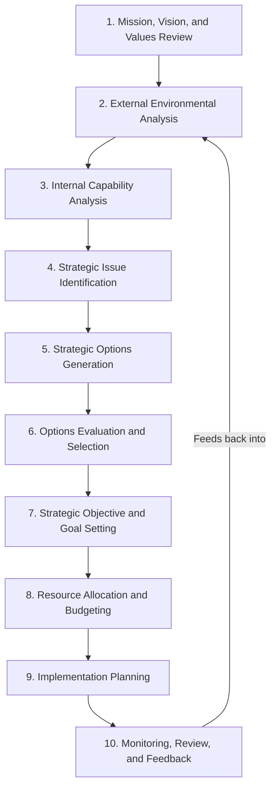
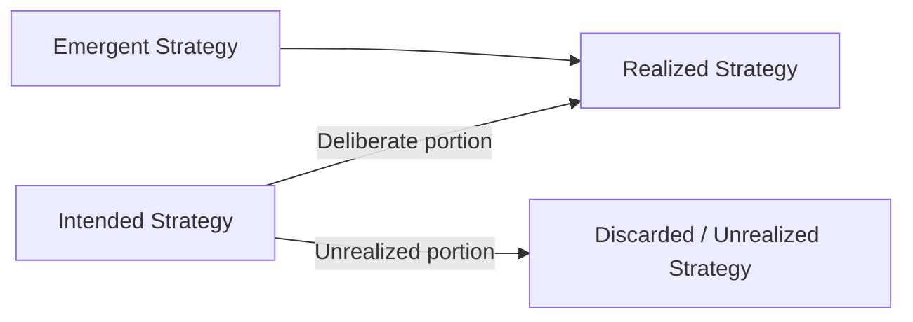

## Strategic Planning Process Design

### Overview

Strategic planning process design refers to the deliberate architecture of *how* an organization conducts strategy formulation — the sequencing of analytical steps, the governance structures, the participants involved, the cadence, and the artifacts produced — as distinct from the *content* of the strategy itself. Poor process design is one of the most commonly cited reasons strategic plans fail to translate into action, even when the underlying analysis (market assessment, competitive positioning) is sound. Process design determines whether a strategy is realistic, whether it secures organizational buy-in, and whether it can adapt as conditions change.

### Core Design Dimensions

**Key Points**

- **Process ownership**: Whether strategy is designed top-down (senior executive/board-driven), bottom-up (business-unit-driven and aggregated), or iterative/interactive (a structured back-and-forth between corporate and business-unit levels).
- **Planning horizon**: The time frame covered — typically 3-5 years for corporate strategy, 1 year for annual operating plans, with some organizations running rolling forecasts rather than fixed annual cycles.
- **Cadence and rhythm**: Whether planning is an annual calendar-driven event, a continuous/rolling process, or event-triggered (initiated by a market shock, M&A opportunity, or leadership change).
- **Degree of formalization**: Ranges from highly structured (templates, mandatory analytical frameworks, standardized timelines) to emergent/informal (loosely structured strategic conversations), with most large organizations situated toward the formalized end.
- **Level of stakeholder participation**: How many organizational levels and functions are consulted, which affects both the quality of ground-level information incorporated and the degree of buy-in achieved during implementation.

[Inference] Organizations operating in fast-moving industries (technology, consumer digital products) tend to favor rolling or continuous planning cadences over fixed annual cycles, since a plan fixed a year in advance risks obsolescence before implementation completes, though the empirical prevalence of this shift across industries is not something a single source can fully quantify.

### The Classical Sequential Planning Process

Most formal strategic planning processes follow a variant of a common sequential architecture, historically formalized in corporate strategic planning departments from the 1960s–1980s (e.g., General Electric's strategic business unit planning system) and still widely taught and used today.

**Stage Details**

1. **Mission, Vision, and Values Review**: Confirms or revisits the organization's fundamental purpose and long-term aspiration before analysis begins, ensuring subsequent options are evaluated against a consistent strategic identity.
2. **External Environmental Analysis**: Deploys tools such as PESTEL analysis, Porter's Five Forces, and industry life-cycle analysis to characterize the competitive and macro-environment.
3. **Internal Capability Analysis**: Uses tools such as VRIO analysis, resource-based view assessments, and value chain analysis to identify sources of competitive advantage and capability gaps.
4. **Strategic Issue Identification**: Synthesizes external and internal analysis (commonly via SWOT) into a prioritized list of the critical strategic questions the organization must resolve.
5. **Strategic Options Generation**: Develops multiple candidate strategic directions rather than converging prematurely on a single option, often using frameworks like the Ansoff Matrix or scenario-based option generation.
6. **Options Evaluation and Selection**: Applies suitability, feasibility, and acceptability (SFA) criteria, along with financial modeling (NPV, real options), to narrow options to a selected strategic direction.
7. **Strategic Objective and Goal Setting**: Translates the selected strategy into measurable objectives, often structured via OKRs (Objectives and Key Results) or the Balanced Scorecard's four perspectives (financial, customer, internal process, learning and growth).
8. **Resource Allocation and Budgeting**: Aligns capital and human resource allocation with strategic priorities — a step at which many strategic plans fail if the budgeting process runs independently of the strategic planning process.
9. **Implementation Planning**: Defines specific initiatives, owners, timelines, and dependencies, often supported by structured methodologies such as Hoshin Kanri (policy deployment) or a strategy map.
10. **Monitoring, Review, and Feedback**: Establishes periodic review cadences (quarterly business reviews, strategy off-sites) and leading/lagging indicators to track execution and trigger replanning.

### Alternative Process Architectures

#### Top-Down vs. Bottom-Up vs. Iterative Design

| Architecture | Description | Strengths | Weaknesses |
| --- | --- | --- | --- |
| **Top-down** | Corporate center sets strategic direction and cascades objectives to business units | Fast, ensures alignment with corporate priorities, avoids parochial bias | Risk of poor ground-level information, weaker buy-in, unrealistic targets |
| **Bottom-up** | Business units develop strategic proposals which are aggregated at the corporate level | High local knowledge incorporation, stronger ownership/commitment | Risk of fragmented, inconsistent strategy; sub-optimization; slower consolidation |
| **Iterative (sandwich/interactive)** | Alternating rounds of corporate guidance and business-unit proposals with negotiation between levels | Balances direction-setting with local realism; widely regarded as best practice for multi-business firms | More time-consuming; requires strong facilitation and clear decision rights |

#### Emergent / Continuous Strategy Process

Contrasted with the classical sequential design, an emergent process (drawing on Henry Mintzberg's distinction between *deliberate* and *emergent* strategy) treats strategy formation as a continuous, adaptive process where realized strategy is partly the product of unplanned, bottom-up initiatives that succeed and get retrospectively incorporated into formal strategy.

**Key Points**

- Deliberate strategy: intended and realized as planned.
- Emergent strategy: unintended patterns that arise from ad hoc decisions and later get recognized and formalized.
- Unrealized strategy: intended strategy that is not implemented due to changing conditions.
- Process design implication: build in mechanisms (regular pattern-recognition reviews, "strategy retrospectives") to identify and formalize emergent strategic patterns rather than relying solely on the annual top-down cycle.

### Governance Structures for Strategic Planning

**Key Points**

- **Strategy office / corporate development function**: A dedicated team that facilitates the planning process, maintains analytical rigor, and ensures cross-business consistency without necessarily making the strategic decisions themselves (decision rights typically remain with line executives and the board).
- **Steering committees**: Cross-functional groups (often including finance, operations, and business-unit leaders) that review and challenge strategic proposals before board submission.
- **Board involvement**: Boards typically engage at key checkpoints (strategy off-sites, annual approval of the strategic plan) rather than in day-to-day process facilitation, though board-level strategy committees are increasingly common in larger organizations.
- **RACI clarity**: Explicitly defining who is Responsible, Accountable, Consulted, and Informed at each stage of the planning process prevents the common failure mode of ambiguous ownership over strategic decisions.

### Common Process Design Frameworks and Tools by Stage

| Stage | Common Frameworks/Tools |
| --- | --- |
| External analysis | PESTEL, Porter's Five Forces, industry life cycle, scenario planning |
| Internal analysis | VRIO, value chain analysis, resource-based view, core competence analysis |
| Synthesis | SWOT/TOWS matrix, strategic issue prioritization matrices |
| Option generation | Ansoff Matrix, Blue Ocean Strategy Canvas, real options framing |
| Option evaluation | SFA framework (Suitability/Feasibility/Acceptability), NPV/DCF, decision trees |
| Goal setting | Balanced Scorecard, OKRs, strategy maps |
| Implementation | Hoshin Kanri (policy deployment/catchball), Gantt/roadmap tools, RACI matrices |
| Monitoring | KPI dashboards, quarterly business reviews (QBRs), Balanced Scorecard cascades |

### Designing for Implementation: The Execution Gap

**Key Points**

A well-documented weakness in strategic planning process design is the "execution gap" — the disconnect between a formally approved strategic plan and actual organizational behavior. Process design choices that mitigate this gap include:

- **Integrating budgeting and strategic planning cycles**, rather than running them as separate, loosely coupled processes with different timelines and owners.
- **Cascading objectives explicitly** from corporate strategy to business-unit, functional, and individual performance goals (a core mechanic of both Balanced Scorecard cascading and Hoshin Kanri's catchball process).
- **Building in a formal review cadence** (commonly quarterly) with clear escalation triggers when performance deviates materially from plan.
- **Embedding a "kill criteria" or off-ramp mechanism** for strategic initiatives that are underperforming, avoiding escalation of commitment to failing initiatives.
- **Assigning single-point accountability** for each major strategic initiative rather than diffuse committee ownership.

### Illustrative Diagram: Iterative Strategic Planning Architecture (svg_diagram)

<svg xmlns="http://www.w3.org/2000/svg" viewBox="0 0 760 460">
<text x="380" y="30" text-anchor="middle" font-size="18" font-weight="bold" fill="#1a1a2e">Iterative (Sandwich) Planning Process (svg_diagram)</text>
<rect x="260" y="60" width="240" height="60" rx="8" fill="#264653" stroke="#1a1a2e" stroke-width="1.5" />
<text x="380" y="95" text-anchor="middle" font-size="13" fill="#fff" font-weight="bold">Corporate Center:</text>
<text x="380" y="112" text-anchor="middle" font-size="12" fill="#fff">Strategic Guidance &amp; Priorities</text>
<path d="M 340 120 L 260 180" stroke="#333" stroke-width="2" fill="none" marker-end="url(#arrow)" />
<path d="M 420 120 L 500 180" stroke="#333" stroke-width="2" fill="none" marker-end="url(#arrow)" />
<rect x="80" y="180" width="200" height="60" rx="8" fill="#2a9d8f" stroke="#1a1a2e" stroke-width="1.5" />
<text x="180" y="205" text-anchor="middle" font-size="12" fill="#fff" font-weight="bold">Business Unit A:</text>
<text x="180" y="222" text-anchor="middle" font-size="11" fill="#fff">Bottom-Up Proposal</text>
<rect x="480" y="180" width="200" height="60" rx="8" fill="#2a9d8f" stroke="#1a1a2e" stroke-width="1.5" />
<text x="580" y="205" text-anchor="middle" font-size="12" fill="#fff" font-weight="bold">Business Unit B:</text>
<text x="580" y="222" text-anchor="middle" font-size="11" fill="#fff">Bottom-Up Proposal</text>
<path d="M 200 240 L 340 300" stroke="#333" stroke-width="2" fill="none" marker-end="url(#arrow)" />
<path d="M 560 240 L 420 300" stroke="#333" stroke-width="2" fill="none" marker-end="url(#arrow)" />
<rect x="260" y="300" width="240" height="60" rx="8" fill="#e9c46a" stroke="#1a1a2e" stroke-width="1.5" />
<text x="380" y="325" text-anchor="middle" font-size="12" fill="#1a1a2e" font-weight="bold">Negotiation &amp;</text>
<text x="380" y="342" text-anchor="middle" font-size="12" fill="#1a1a2e" font-weight="bold">Consolidation</text>
<path d="M 380 360 L 380 400" stroke="#333" stroke-width="2" fill="none" marker-end="url(#arrow)" />
<rect x="230" y="400" width="300" height="50" rx="8" fill="#e76f51" stroke="#1a1a2e" stroke-width="1.5" />
<text x="380" y="430" text-anchor="middle" font-size="12" fill="#fff" font-weight="bold">Approved Integrated Strategic Plan</text>
</svg>

### Process Design Pitfalls

**Key Points**

- **Calendar-driven ritualism**: Treating the annual planning cycle as a compliance exercise disconnected from real strategic decision-making, often producing incrementalist plans that merely extrapolate the prior year.
- **Analysis-implementation disconnect**: Separating the analytical/planning team from the operational/implementation team, leading to plans that are analytically sound but organizationally unrealistic.
- **Over-formalization**: Excessive templating and process steps that consume management time without improving decision quality — sometimes termed "planning paralysis."
- **Under-formalization**: Insufficient structure leading to inconsistent strategic logic across business units and difficulty aggregating a coherent corporate-level strategy.
- **Misaligned incentive structures**: Performance management and compensation systems that reward short-term operational metrics while the strategic plan calls for long-term capability investment, undermining implementation.
- **Insufficient environmental scanning cadence**: Conducting external analysis only once annually in fast-changing industries, missing significant shifts that occur mid-cycle.

### Designing Process Cadence: Illustrative Comparison

| Cadence Type | Typical Review Frequency | Best Suited For |
| --- | --- | --- |
| Fixed annual cycle | Once per year, with quarterly monitoring | Stable, mature industries (utilities, heavy manufacturing) |
| Rolling/continuous forecast | Continuously updated (e.g., rolling 4-6 quarters) | Fast-moving markets (technology, consumer digital) |
| Event-triggered replanning | Ad hoc, triggered by major external shocks or opportunities | Highly volatile or disrupted industries |
| Hybrid (annual + rolling) | Annual strategic reset with quarterly rolling operational updates | Most large diversified corporations |

### Conclusion

Strategic planning process design is not a neutral administrative exercise but a strategic choice in its own right — the architecture of the process shapes which information gets surfaced, who feels ownership over the resulting strategy, and how readily the organization can adapt when conditions change. Effective process design matches the degree of formalization and cadence to the volatility of the operating environment, integrates budgeting and performance management with strategic objectives to close the execution gap, and builds in structured mechanisms (retrospectives, kill criteria, rolling reviews) to capture emergent strategy rather than relying solely on deliberate, top-down planning. [Behavior may vary by organizational context, industry dynamics, and leadership practices; the frameworks above represent established design patterns rather than a single universally optimal process.]

**Related Topics**

- Hoshin Kanri and Policy Deployment (Catchball Process)
- Balanced Scorecard Design and Strategy Mapping
- Mintzberg's Deliberate vs. Emergent Strategy Typology
- OKRs vs. Balanced Scorecard for Strategic Goal Cascading
- Strategy Execution and the Implementation Gap
- Corporate Strategy Office Design and Governance Models
- Scenario Planning as an Input to Process Design
- Resource Allocation Processes and Capital Budgeting Alignment with Strategy