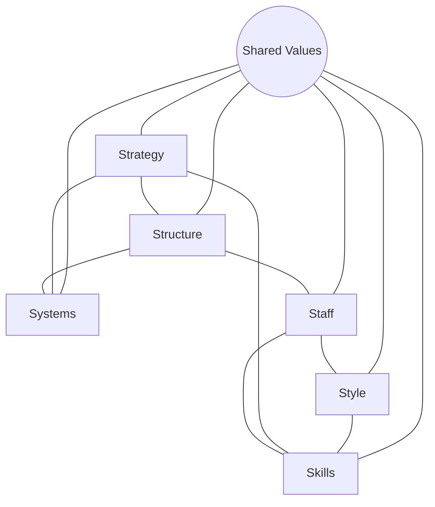

## The McKinsey 7S Framework

### Overview

The McKinsey 7S Framework is a management model for analyzing organizational effectiveness by examining seven internal elements that must be aligned for an organization to perform well. Developed in the late 1970s by consultants at McKinsey & Company — commonly attributed to Robert Waterman, Tom Peters, and Julien Phillips, with contributions from Richard Pascale and Anthony Athos — the framework was introduced partly as a critique of strategy models that focused narrowly on structure and strategy while neglecting softer organizational dimensions such as culture and skills. It gained wide visibility through Peters and Waterman's 1982 book *In Search of Excellence*.

### The Seven Elements

The framework divides organizational elements into two categories: **"Hard" elements** (more tangible, easier to identify and directly influence through formal plans and structures) and **"Soft" elements** (less tangible, culturally embedded, and harder to change directly).

| Category | Element | Description |
| --- | --- | --- |
| Hard | **Strategy** | The plan for building and sustaining competitive advantage over the market and competitors |
| Hard | **Structure** | The organizational chart and reporting lines — how the organization is divided and coordinated |
| Hard | **Systems** | The formal and informal procedures, workflows, and information systems that govern daily operations |
| Soft | **Shared Values** (originally "Superordinate Goals") | The core values and organizational culture that guide member behavior, positioned at the center of the model |
| Soft | **Skills** | The organization's core competencies and distinctive capabilities |
| Soft | **Staff** | The people, their capabilities, demographics, and how the organization develops and retains talent |
| Soft | **Style** | The leadership approach and cultural style of management, including behavioral norms observed rather than stated |

**Key Points**

- The framework's central insight is that these seven elements are interdependent — a change in one element (e.g., a new strategy) will create tension unless the other six elements are realigned to support it.
- **Shared Values** sits at the center of the classic diagram, reflecting the view that culture and values are the foundation connecting and constraining all other elements.
- Unlike hierarchical models that treat strategy as the top-level driver of structure and systems (as in Chandler's "structure follows strategy" thesis), the 7S model treats all seven elements as mutually influencing, with no single element assumed to be primary.

### The Classic Diagram Structure

The 7S framework is traditionally depicted as a web or network diagram, deliberately avoiding a hierarchical or linear structure to emphasize interconnection rather than sequential dependency.

### Detailed Element Analysis

#### Strategy

The coherent set of actions and resource commitments designed to achieve a sustainable competitive advantage in response to environmental changes, customer needs, and competitor actions. In a 7S diagnostic, analysts assess whether the stated strategy is actually reflected in resource allocation, structural design, and staff behavior, or whether it exists only as a document disconnected from operational reality.

#### Structure

The way the organization is divided into units and how those units are coordinated — including the degree of centralization versus decentralization, span of control, and reporting relationships. Common structural forms assessed include functional, divisional, matrix, and network structures. A 7S diagnostic examines whether the current structure supports or impedes the intended strategy.

#### Systems

The formal processes and procedures used to run the organization day to day, including performance management systems, budgeting and capital allocation processes, IT and information systems, quality control mechanisms, and communication routines. Systems are often described as the most influential of the hard elements in practice, since employees' daily behavior is shaped more directly by systems (how they are measured and rewarded) than by strategy documents.

#### Shared Values

The core identity, values, and organizational culture that inform how members of the organization behave, largely independent of formal directives. Originally termed "superordinate goals" in the earliest formulations of the model, this element was renamed "shared values" to better capture organizational culture as commonly understood. Misalignment between stated corporate values and actual shared values (the values genuinely held and acted upon by staff) is a frequent diagnostic finding.

#### Skills

The distinctive competencies and capabilities that reside within the organization — both at the organizational level (core competencies, per Prahalad and Hamel) and reflected in the collective abilities of employees. A 7S diagnostic evaluates whether the organization has developed or acquired the skills necessary to execute its intended strategy, and where skill gaps exist relative to strategic requirements.

#### Staff

The people dimension: workforce composition, recruitment and development practices, motivation, and retention. This element considers not just headcount and skill inventories but also demographic patterns, career development pathways, and how talent management practices align with (or work against) the strategic direction.

#### Style

The leadership style and cultural tone set by top management, distinguished from formally stated management philosophy by focusing on how managers actually behave — including how they spend their time, what they pay attention to, and what behaviors they visibly reward or tolerate. Style is closely observed by employees and often communicates organizational priorities more powerfully than written policy.

### Using the Framework: Diagnostic Process

**Next Steps for Applying the 7S Framework**

1. **Map current state**: Document the current condition of each of the seven elements through interviews, document review, and observation.
2. **Map desired/future state**: Define what each element should look like to support the intended strategy or organizational change.
3. **Identify gaps and misalignments**: Compare current and future states for each element, and — critically — examine the connections between elements to identify where misalignment between two or more elements is undermining performance (e.g., a decentralized structure paired with a centralized, rigid budgeting system).
4. **Prioritize interventions**: Because the soft elements (shared values, skills, staff, style) are harder and slower to change than the hard elements, sequencing matters — structural and systems changes are often easier to implement quickly, but sustainable change usually requires parallel attention to culture and capability development.
5. **Implement with ongoing monitoring**: Given the interdependency of the elements, changes should be monitored for second-order effects on other elements rather than treated as isolated interventions.

### Example Application

**Example**

A mid-sized manufacturing firm decides to pursue a new **strategy** of shifting from a low-cost, high-volume commodity business to a differentiated, custom-engineering business model. A 7S diagnostic reveals:

- **Structure**: The existing functional structure (separate sales, engineering, and production departments with limited cross-functional coordination) is poorly suited to custom-engineering work, which requires tight sales-engineering collaboration on each account.
- **Systems**: The performance management system still rewards production volume and cost-per-unit metrics inherited from the commodity business, actively discouraging the slower, more consultative sales process the new strategy requires.
- **Skills**: The engineering team's core competency is process optimization for standardized products, not the design consultation skills needed for custom work — indicating a skills gap requiring hiring or retraining.
- **Staff**: Sales staff were hired and incentivized for high-volume transactional selling, not the longer relationship-based selling cycles typical of custom engineering accounts.
- **Style**: Middle management's day-to-day behavior (e.g., emphasis on weekly volume reports in team meetings) continues to signal that volume, not customization quality, is what matters — undermining the stated strategic shift.
- **Shared Values**: Long-tenured staff still describe the company's identity in terms of "being the low-cost producer," reflecting a cultural identity misaligned with the new differentiated positioning.

This example illustrates the framework's core diagnostic value: the new strategy alone (one element) cannot succeed without corresponding realignment across structure, systems, skills, staff, style, and shared values.

### Strengths and Limitations

**Key Points**

*Strengths*

- Provides a holistic checklist that counteracts the tendency of narrower strategy frameworks to overlook "soft" organizational factors like culture and leadership style.
- Useful for organizational change diagnostics, M&A integration planning (comparing 7S profiles of merging organizations), and post-merger cultural due diligence.
- The non-hierarchical, web-like structure usefully emphasizes interdependency rather than implying a simple causal chain from strategy to execution.

*Limitations*

- [Inference] The framework is primarily diagnostic and descriptive rather than prescriptive — it identifies where misalignment exists but does not itself specify how to resolve identified gaps, requiring supplementary frameworks (e.g., change management models like Kotter's 8-Step Process) for implementation guidance.
- Assessing "soft" elements (shared values, style) is inherently more subjective and harder to measure reliably than hard elements, introducing potential inconsistency across analysts or evaluators.
- The framework does not explicitly incorporate external environmental analysis (competitive dynamics, market forces), so it is typically used as a complement to external-facing tools (PESTEL, Porter's Five Forces) rather than as a standalone strategic analysis.
- Some practitioners note that treating all seven elements as equally weighted may understate the practical reality that certain elements (e.g., systems, given their direct influence on daily behavior) often exert disproportionate influence on organizational outcomes.

### Illustrative Diagram: 7S Interdependency Web (svg_diagram)

<svg xmlns="http://www.w3.org/2000/svg" viewBox="0 0 700 700">
<text x="350" y="30" text-anchor="middle" font-size="18" font-weight="bold" fill="#1a1a2e">McKinsey 7S Framework (svg_diagram)</text>
<line x1="350" y1="350" x2="350" y2="120" stroke="#999" stroke-width="1.5" />
<line x1="350" y1="350" x2="540" y2="200" stroke="#999" stroke-width="1.5" />
<line x1="350" y1="350" x2="580" y2="400" stroke="#999" stroke-width="1.5" />
<line x1="350" y1="350" x2="480" y2="580" stroke="#999" stroke-width="1.5" />
<line x1="350" y1="350" x2="220" y2="580" stroke="#999" stroke-width="1.5" />
<line x1="350" y1="350" x2="120" y2="400" stroke="#999" stroke-width="1.5" />
<line x1="350" y1="350" x2="160" y2="200" stroke="#999" stroke-width="1.5" />
<line x1="350" y1="120" x2="540" y2="200" stroke="#ccc" stroke-width="1" />
<line x1="540" y1="200" x2="580" y2="400" stroke="#ccc" stroke-width="1" />
<line x1="580" y1="400" x2="480" y2="580" stroke="#ccc" stroke-width="1" />
<line x1="480" y1="580" x2="220" y2="580" stroke="#ccc" stroke-width="1" />
<line x1="220" y1="580" x2="120" y2="400" stroke="#ccc" stroke-width="1" />
<line x1="120" y1="400" x2="160" y2="200" stroke="#ccc" stroke-width="1" />
<line x1="160" y1="200" x2="350" y2="120" stroke="#ccc" stroke-width="1" />
<circle cx="350" cy="350" r="75" fill="#e9c46a" stroke="#1a1a2e" stroke-width="2" />
<text x="350" y="345" text-anchor="middle" font-size="13" font-weight="bold" fill="#1a1a2e">Shared</text>
<text x="350" y="362" text-anchor="middle" font-size="13" font-weight="bold" fill="#1a1a2e">Values</text>
<circle cx="350" cy="110" r="55" fill="#264653" stroke="#1a1a2e" stroke-width="2" />
<text x="350" y="115" text-anchor="middle" font-size="12" fill="#fff" font-weight="bold">Strategy</text>
<circle cx="555" cy="195" r="55" fill="#264653" stroke="#1a1a2e" stroke-width="2" />
<text x="555" y="200" text-anchor="middle" font-size="12" fill="#fff" font-weight="bold">Structure</text>
<circle cx="595" cy="405" r="55" fill="#264653" stroke="#1a1a2e" stroke-width="2" />
<text x="595" y="410" text-anchor="middle" font-size="12" fill="#fff" font-weight="bold">Systems</text>
<circle cx="485" cy="595" r="55" fill="#2a9d8f" stroke="#1a1a2e" stroke-width="2" />
<text x="485" y="600" text-anchor="middle" font-size="12" fill="#fff" font-weight="bold">Style</text>
<circle cx="215" cy="595" r="55" fill="#2a9d8f" stroke="#1a1a2e" stroke-width="2" />
<text x="215" y="600" text-anchor="middle" font-size="12" fill="#fff" font-weight="bold">Staff</text>
<circle cx="105" cy="405" r="55" fill="#2a9d8f" stroke="#1a1a2e" stroke-width="2" />
<text x="105" y="410" text-anchor="middle" font-size="12" fill="#fff" font-weight="bold">Skills</text>
<circle cx="150" cy="195" r="55" fill="#264653" stroke="#1a1a2e" stroke-width="2" />
<text x="150" y="195" text-anchor="middle" font-size="12" fill="#fff" font-weight="bold">Systems</text>
<text x="150" y="210" text-anchor="middle" font-size="10" fill="#fff">(Hard)</text>

<text x="350" y="655" text-anchor="middle" font-size="11" fill="#555" font-style="italic">Dark = Hard Elements | Teal = Soft Elements | Center = Shared Values</text>

</svg>

### Relationship to Other Strategy Frameworks

**Key Points**

- Often used alongside **SWOT analysis**: SWOT identifies strategic issues at a high level, while the 7S framework provides a structured internal lens for diagnosing why an organization may struggle to execute a strategy addressing those issues.
- Complements **Kotter's 8-Step Change Model**: the 7S framework diagnoses *what* is misaligned, while Kotter's model provides a *process* for driving organizational change to close identified gaps.
- Distinct from the **Balanced Scorecard**, which is primarily a performance measurement and strategy execution tracking tool, whereas 7S is a diagnostic and alignment framework used earlier in the strategy process.
- Frequently applied during **M&A integration**, where practitioners compare the 7S profiles of the acquiring and target organizations to identify integration risk areas, particularly around Style and Shared Values, which are common sources of post-merger cultural friction.

### Conclusion

The McKinsey 7S Framework remains a widely used diagnostic tool precisely because it forces analysts to look beyond the "hard" elements of strategy, structure, and systems to consider the "soft" elements — shared values, skills, staff, and style — that frequently determine whether a well-formulated strategy is actually executed. Its non-hierarchical, interconnected structure highlights that sustainable organizational change requires coordinated adjustment across all seven elements rather than isolated interventions in any single area. While the framework does not prescribe specific solutions and requires supplementary tools for implementation and external analysis, it remains valuable as a structured lens for internal organizational diagnosis, particularly in change management and M&A integration contexts.

**Related Topics**

- SWOT Analysis and Internal-External Strategic Synthesis
- Organizational Culture and Strategy Alignment
- Kotter's 8-Step Change Management Model
- Post-Merger Integration and Cultural Due Diligence
- Resource-Based View and Core Competence Analysis (Prahalad and Hamel)
- Balanced Scorecard as a Complementary Execution Tool
- Chandler's "Structure Follows Strategy" Thesis
- Organizational Design and Structural Alternatives (Functional, Divisional, Matrix)