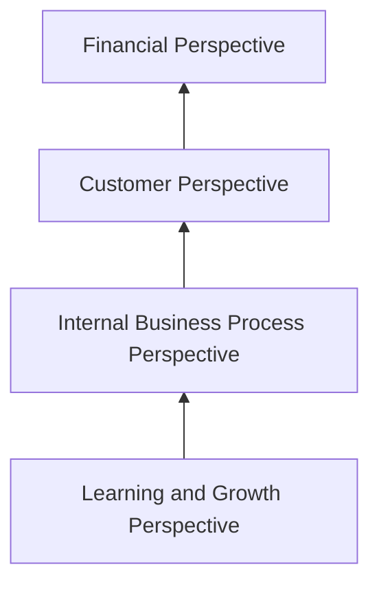
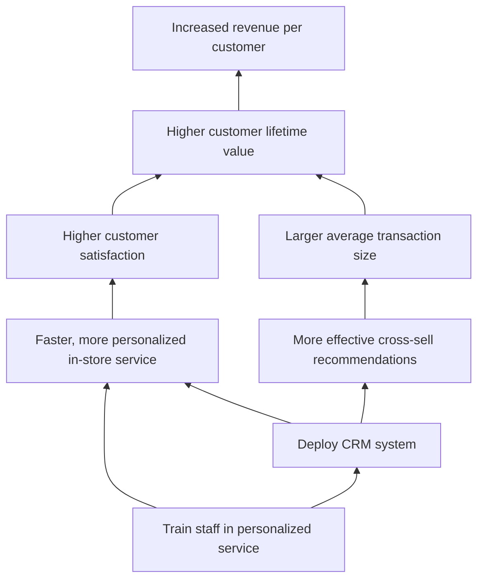

## The Balanced Scorecard for Strategy Formulation

### Overview

The Balanced Scorecard (BSC) is a strategic management and performance measurement framework developed by Robert S. Kaplan and David P. Norton, first introduced in their 1992 *Harvard Business Review* article "The Balanced Scorecard: Measures That Drive Performance" and expanded through subsequent books, notably *The Balanced Scorecard: Translating Strategy into Action* (1996) and *Strategy Maps* (2004). The framework was originally conceived as a corrective to management systems that relied excessively on financial metrics alone, which tend to be lagging indicators that report past performance without revealing the underlying drivers of future results. The BSC translates an organization's mission and strategy into a coherent set of performance measures across four perspectives, balancing financial and non-financial, lagging and leading, and internal and external measures.

### The Four Perspectives

| Perspective | Core Question | Typical Metrics |
| --- | --- | --- |
| **Financial** | "To succeed financially, how should we appear to our shareholders?" | Revenue growth, ROIC, EVA, profit margin, cost structure |
| **Customer** | "To achieve our vision, how should we appear to our customers?" | Customer satisfaction, retention rate, market share, Net Promoter Score |
| **Internal Business Process** | "To satisfy our shareholders and customers, what business processes must we excel at?" | Cycle time, defect rates, process innovation rate, order fulfillment time |
| **Learning and Growth** | "To achieve our vision, how will we sustain our ability to change and improve?" | Employee training hours, employee engagement scores, information system capability, employee retention |

**Key Points**

- The four perspectives are explicitly causally linked in a hypothesized chain: improvements in **Learning and Growth** (employee capability, systems, culture) drive improvements in **Internal Process** performance, which drive improvements in the **Customer** perspective (satisfaction, loyalty), which ultimately drive **Financial** results.
- This causal chain is the theoretical core of the BSC's departure from purely financial performance management: financial results are treated as **lagging indicators** (outcomes of past strategic execution), while the other three perspectives contain more **leading indicators** (drivers of future financial performance).
- Kaplan and Norton explicitly designed the four-perspective structure to be adaptable — organizations (particularly public sector and nonprofit entities) sometimes reorder the hierarchy, placing mission or customer/stakeholder impact above the financial perspective, since financial return is not the primary organizational objective in those contexts.

### From Scorecard to Strategy Map

While the original 1992 formulation of the Balanced Scorecard was primarily a measurement tool, Kaplan and Norton's later work (particularly *The Strategy-Focused Organization*, 2000, and *Strategy Maps*, 2004) repositioned the BSC explicitly as a strategy formulation and communication tool through the introduction of the **strategy map** — a one-page visual representation of the cause-and-effect relationships between strategic objectives across the four perspectives.

**Key Points**

- A strategy map makes explicit the **hypothesized causal linkages** between objectives (e.g., "improved employee cross-training" in Learning and Growth → "reduced process cycle time" in Internal Process → "improved on-time delivery" in Customer → "increased revenue per customer" in Financial).
- This transforms the scorecard from a passive measurement dashboard into an active strategy formulation tool: building the strategy map forces the strategy team to articulate *why* they believe a given set of initiatives will produce financial results, surfacing and testing the underlying strategic logic (sometimes termed the organization's "theory of the business").
- Strategy maps typically also distinguish between two generic value-creation themes within the Internal Process perspective: **operational excellence** processes (efficiency, cost, quality) and **customer intimacy/innovation** processes (new product development, customer relationship management), aligned to the chosen strategic positioning (e.g., Treacy and Wiersema's value disciplines: operational excellence, product leadership, or customer intimacy).

### Building the Balanced Scorecard: Process Steps

**Next Steps for Constructing a Balanced Scorecard**

1. **Clarify and translate the vision and strategy**: Senior management builds consensus on the organization's strategic priorities before metric selection begins — attempting to build a scorecard without a clear prior strategic direction produces a disconnected metrics list rather than a strategic tool.
2. **Develop the strategy map**: Identify strategic objectives in each of the four perspectives and map the hypothesized cause-and-effect relationships connecting them, working top-down from financial/mission objectives or bottom-up from capability objectives (or both, meeting in the middle).
3. **Select measures and targets for each objective**: For each strategic objective, select 1-2 measures (avoiding excessive metric proliferation, a common implementation failure) and set specific numeric targets and time frames.
4. **Identify strategic initiatives**: Define specific programs, projects, or actions required to close the gap between current performance and targets for each objective — Kaplan and Norton term the aggregate of these the "strategic initiative portfolio."
5. **Cascade the scorecard**: Translate the corporate-level scorecard into business-unit, departmental, and (in some implementations) individual-level scorecards, ensuring line-of-sight between individual performance goals and overall strategy.
6. **Align resource allocation and budgeting**: Integrate the scorecard's strategic initiatives with the capital budgeting process (Kaplan and Norton's later work formalized this as the "STRATEGY" management system loop, connecting strategy formulation, planning, execution, and review).
7. **Conduct periodic strategic review**: Establish a regular (typically monthly or quarterly) management review meeting focused specifically on strategy execution and scorecard performance, distinct from operational performance reviews.

### Example Strategy Map (Illustrative)

**Example**

A retail company pursuing a customer-intimacy strategic positioning might construct the following simplified causal chain:

- **Learning and Growth**: Invest in staff training on personalized customer service techniques and deploy a new customer relationship management (CRM) system.
- **Internal Process**: Improved staff capability and CRM data enable faster, more personalized in-store service and more effective cross-selling recommendations.
- **Customer**: Personalized service and relevant recommendations increase customer satisfaction scores and average items per transaction.
- **Financial**: Increased satisfaction and larger basket sizes drive higher revenue per customer and improved customer lifetime value.

### Illustrative Diagram: Four-Perspective Scorecard Structure (svg_diagram)

<svg xmlns="http://www.w3.org/2000/svg" viewBox="0 0 700 520">
<text x="350" y="30" text-anchor="middle" font-size="18" font-weight="bold" fill="#1a1a2e">Balanced Scorecard Structure (svg_diagram)</text>
<rect x="180" y="55" width="340" height="30" fill="#264653" stroke="#1a1a2e" />
<text x="350" y="76" text-anchor="middle" font-size="13" fill="#fff" font-weight="bold">Vision and Strategy</text>
<rect x="60" y="120" width="580" height="90" rx="6" fill="#e76f51" stroke="#1a1a2e" stroke-width="1.5" />
<text x="350" y="142" text-anchor="middle" font-size="13" fill="#fff" font-weight="bold">Financial Perspective</text>
<text x="350" y="160" text-anchor="middle" font-size="11" fill="#fff">"To succeed financially, how should we appear to shareholders?"</text>
<text x="350" y="178" text-anchor="middle" font-size="10" fill="#fff">Objectives | Measures | Targets | Initiatives</text>
<rect x="60" y="225" width="580" height="90" rx="6" fill="#e9c46a" stroke="#1a1a2e" stroke-width="1.5" />
<text x="350" y="247" text-anchor="middle" font-size="13" fill="#1a1a2e" font-weight="bold">Customer Perspective</text>
<text x="350" y="265" text-anchor="middle" font-size="11" fill="#1a1a2e">"To achieve our vision, how should we appear to customers?"</text>
<text x="350" y="283" text-anchor="middle" font-size="10" fill="#1a1a2e">Objectives | Measures | Targets | Initiatives</text>
<rect x="60" y="330" width="580" height="90" rx="6" fill="#2a9d8f" stroke="#1a1a2e" stroke-width="1.5" />
<text x="350" y="352" text-anchor="middle" font-size="13" fill="#fff" font-weight="bold">Internal Business Process Perspective</text>
<text x="350" y="370" text-anchor="middle" font-size="11" fill="#fff">"What processes must we excel at?"</text>
<text x="350" y="388" text-anchor="middle" font-size="10" fill="#fff">Objectives | Measures | Targets | Initiatives</text>
<rect x="60" y="435" width="580" height="70" rx="6" fill="#264653" stroke="#1a1a2e" stroke-width="1.5" />
<text x="350" y="457" text-anchor="middle" font-size="13" fill="#fff" font-weight="bold">Learning and Growth Perspective</text>
<text x="350" y="475" text-anchor="middle" font-size="11" fill="#fff">"How will we sustain our ability to change and improve?"</text>
<path d="M350,505 L350,90" stroke="#333" stroke-width="1.5" stroke-dasharray="4,3" marker-end="url(#arrowup)" />
</svg>

### Cascading and Alignment

**Key Points**

- **Cascading** refers to the process of deriving business-unit and departmental scorecards from the corporate-level scorecard, ensuring that objectives and measures at lower organizational levels causally support higher-level strategic objectives rather than being independently generated.
- Two cascading approaches are common: a fully **aligned cascade**, where lower-level scorecards mirror the corporate structure and directly link to specific corporate objectives, and a **contribution-based cascade**, where business units define their own objectives but must explicitly demonstrate how those objectives support corporate strategy.
- Effective cascading is a primary mechanism through which the BSC closes the strategy-execution gap common in strategic planning processes, since it creates explicit line-of-sight between individual and team performance goals and overall corporate strategy.

### Strengths and Limitations

**Key Points**

*Strengths*

- Forces strategic clarity by requiring management to make explicit the causal assumptions linking capability investments to financial outcomes, rather than treating strategy as a purely qualitative narrative.
- Balances short-term financial performance against the leading indicators (customer, process, capability) necessary for long-term competitive advantage, mitigating the well-documented tendency of purely financial control systems to encourage short-termism.
- Provides a structured mechanism for cascading strategy throughout the organization, improving strategic alignment and line-of-sight for individual contributors.
- Adaptable beyond for-profit contexts; public sector and nonprofit organizations widely use modified BSC structures with mission/stakeholder impact positioned as the top-level perspective rather than financial return.

*Limitations*

- [Inference] The causal relationships depicted in a strategy map are hypotheses, not empirically validated laws — the assumed links (e.g., that specific training investments will in fact translate into specific financial outcomes) may not hold, and few organizations rigorously test these causal assumptions with the same discipline used to build the map, though the extent of this gap likely varies significantly across organizations and is difficult to generalize precisely.
- Risk of excessive metric proliferation if governance discipline is weak, undermining the framework's original intent of focus (Kaplan and Norton recommended roughly 20-25 measures total across all four perspectives for a corporate-level scorecard).
- Effective implementation requires sustained senior leadership commitment and cultural buy-in; scorecards imposed purely as a measurement compliance exercise, without genuine strategic dialogue, tend to default back to the classical failure mode of the tool becoming a static reporting mechanism rather than an active strategy management tool.
- Selecting appropriate leading indicators for the Learning and Growth and Internal Process perspectives is often more difficult in practice than selecting lagging financial indicators, since the causal distance to financial outcomes is longer and less directly measurable.

### Relationship to Other Strategy Frameworks

**Key Points**

- Complements the **McKinsey 7S Framework**: 7S provides an internal organizational diagnostic (are structure, systems, skills, staff, style, and shared values aligned to support strategy), while the BSC translates that strategy into a measurable execution and communication system.
- Distinct from and complementary to **Hoshin Kanri** (policy deployment): Hoshin Kanri emphasizes the cascading "catchball" negotiation process for aligning goals top-down and bottom-up, while the BSC emphasizes the causal architecture of objectives and measures across the four perspectives; the two are frequently combined in practice.
- Frequently used alongside **OKRs** (Objectives and Key Results) in modern implementations, particularly in fast-moving organizations that prefer OKRs' shorter (typically quarterly) goal-setting cycle for execution while retaining the BSC's four-perspective structure for higher-level strategic architecture.

### Common Implementation Pitfalls

**Key Points**

- Building the scorecard as a top-down, finance-department-owned metrics exercise without genuine input and buy-in from business-unit and functional leaders, undermining strategic dialogue value.
- Selecting measures based on data availability rather than genuine strategic relevance ("measuring what's easy" rather than "measuring what matters").
- Failing to link the scorecard to resource allocation and budgeting processes, leaving strategic initiatives underfunded relative to stated priorities.
- Treating scorecard review meetings as data-reporting sessions rather than genuine strategic discussions about whether the causal hypotheses embedded in the strategy map are holding true.
- Over-cascading rigidly to the individual level in ways that can encourage gaming of narrow metrics rather than genuine contribution to strategic objectives.

### Conclusion

The Balanced Scorecard evolved from a corrective to financially-narrow performance measurement into a comprehensive strategy formulation, communication, and execution management system through the introduction of the strategy map and its explicit causal architecture linking Learning and Growth, Internal Process, Customer, and Financial perspectives. Its principal contribution to strategy formulation is forcing management teams to make explicit and testable the causal logic connecting capability investments to ultimate financial performance, and to cascade that logic coherently throughout the organization. Its effectiveness depends heavily on implementation discipline — genuine strategic dialogue in construction, integration with resource allocation, and periodic strategic (not merely operational) review — without which the tool risks becoming a static reporting mechanism disconnected from actual strategic decision-making.

**Related Topics**

- Strategy Maps and Cause-and-Effect Objective Linkage
- Hoshin Kanri and Policy Deployment (Catchball Process)
- OKRs (Objectives and Key Results) vs. Balanced Scorecard
- Treacy and Wiersema's Value Disciplines (Operational Excellence, Product Leadership, Customer Intimacy)
- The McKinsey 7S Framework as a Complementary Internal Diagnostic
- Strategic Initiative Portfolio Management and Resource Allocation
- Performance Measurement System Design and Metric Selection
- Public Sector and Nonprofit Adaptations of the Balanced Scorecard