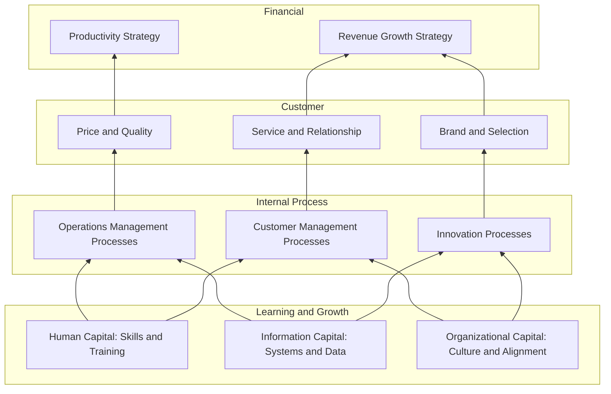

## Strategy Maps

### Overview

A strategy map is a one-page visual diagram that depicts the cause-and-effect relationships between an organization's strategic objectives across the four Balanced Scorecard perspectives — Financial, Customer, Internal Business Process, and Learning and Growth. Developed by Robert S. Kaplan and David P. Norton as an extension of their Balanced Scorecard work, strategy maps were formalized in their 2000 book *The Strategy-Focused Organization* and given a dedicated full treatment in *Strategy Maps: Converting Intangible Assets into Tangible Outcomes* (2004). While the Balanced Scorecard organizes measures into four perspectives, the strategy map explicitly articulates the *logic* connecting those perspectives — making visible the strategic hypothesis of how investments in people, systems, and processes are expected to translate into financial results.

### Purpose and Conceptual Foundation

**Key Points**

- Strategy maps address a core weakness Kaplan and Norton identified in the original 1992 Balanced Scorecard: organizations often selected metrics for each of the four perspectives without explicitly articulating *how* those metrics were causally connected to one another, producing a "balanced" but incoherent set of measures.
- The central premise is that strategy is a set of hypotheses about cause and effect, and that these hypotheses should be made explicit, visible, and testable rather than left as tacit assumptions among senior management.
- Strategy maps are particularly aimed at describing how **intangible assets** — human capital, information capital, and organizational capital, collectively addressed in the Learning and Growth perspective — are converted into tangible financial outcomes, a conversion process that traditional financial accounting does not capture on the balance sheet.

$$\text{Learning \& Growth} \rightarrow \text{Internal Process} \rightarrow \text{Customer} \rightarrow \text{Financial}$$

This directional causal chain is the structural backbone of every strategy map, read from bottom to top.

### The Four Perspective Layers in a Strategy Map

| Layer (bottom to top) | Focus | Typical Objective Types |
| --- | --- | --- |
| **Learning and Growth** | Intangible assets: human capital, information capital, organizational capital | Employee skill development, strategic job readiness, information system/technology capability, culture and alignment |
| **Internal Business Process** | The critical processes that create and deliver the value proposition | Operations management processes, customer management processes, innovation processes, regulatory/social processes |
| **Customer** | The value proposition delivered to targeted customer segments | Price, quality, availability, selection, functionality, service, partnership, brand |
| **Financial** | The ultimate economic outcomes sought by shareholders | Revenue growth (new markets, new products, new customers), productivity improvement (cost reduction, asset utilization) |

**Key Points**

- Kaplan and Norton decompose the **Financial** perspective's top-level objectives into two generic strategic themes: a **revenue growth strategy** (expanding revenue through new markets, products, or customer relationships) and a **productivity strategy** (improving cost structure and asset utilization) — most financial objective sets on a strategy map blend both.
- The **Customer** perspective is organized around the chosen **customer value proposition**, drawing on Michael Treacy and Fred Wiersema's generic value disciplines: **operational excellence** (best total cost), **customer intimacy** (best total solution, tailored relationships), or **product leadership** (best product). The strategy map's internal process objectives should align with whichever value proposition is chosen.
- The **Internal Process** perspective is typically grouped into four generic process clusters: **operations management** (supply, production, distribution), **customer management** (selection, acquisition, retention, growth), **innovation** (identifying opportunities, R&D, new product/service development), and **regulatory and social** processes (environment, safety, community, employment practices).
- The **Learning and Growth** perspective addresses three categories of intangible asset readiness: **human capital** (skills, training, knowledge), **information capital** (databases, information systems, networks), and **organizational capital** (culture, leadership, alignment, teamwork).

### Anatomy of a Strategy Map: Illustrative Full Structure

### Building a Strategy Map: Process Steps

**Next Steps for Constructing a Strategy Map**

1. **Confirm the mission, values, and vision**: Strategy maps are built beneath an explicit statement of long-term aspiration, ensuring all objectives ladder up to a coherent organizational purpose.
2. **Define the overarching strategy or strategic themes**: Identify 2-4 broad strategic themes (e.g., "operational excellence in distribution," "deepen key account relationships") that will organize the objectives on the map — large organizations often build one strategy map per strategic theme rather than a single map covering all strategy simultaneously.
3. **Set top-level Financial perspective objectives**: Define the specific financial outcomes sought (e.g., "increase revenue per customer by X%," "reduce cost-to-serve by Y%"), typically balancing revenue growth and productivity objectives.
4. **Define the Customer value proposition and objectives**: Articulate what the organization must deliver to its targeted customer segment to achieve the financial objectives, and select the applicable value discipline (operational excellence, customer intimacy, or product leadership).
5. **Identify critical Internal Process objectives**: Determine which processes, across the four generic process clusters, must excel to deliver the customer value proposition — this is typically the step requiring the most cross-functional strategic debate.
6. **Define Learning and Growth objectives**: Identify the human capital, information capital, and organizational capital investments required to enable the identified critical processes.
7. **Draw and validate causal linkages**: Connect objectives across perspectives with arrows representing hypothesized cause-and-effect relationships, and critically review whether each linkage is genuinely plausible or merely aspirational.
8. **Assign measures, targets, and initiatives**: Convert the strategy map (which shows objectives and their relationships) into a full Balanced Scorecard by adding specific measures, targets, and initiatives to each objective — the strategy map precedes and structures scorecard construction.

### Worked Example: Strategy Map for a Regional Bank

**Example**

A regional retail bank pursuing a "trusted advisor" customer-intimacy strategy might build the following strategy map logic:

- **Financial**: Increase revenue per household and reduce cost-to-serve through channel optimization (blending revenue growth and productivity themes).
- **Customer**: Deliver a "trusted financial advisor" value proposition characterized by proactive, personalized financial guidance and responsive service.
- **Internal Process**:
  - *Customer management process*: Deploy proactive financial-needs-assessment outreach for existing customers.
  - *Operations management process*: Reduce loan approval cycle time through streamlined underwriting workflows.
- **Learning and Growth**:
  - *Human capital*: Train relationship managers in consultative financial planning (rather than transactional product-selling) techniques.
  - *Information capital*: Implement a customer data platform that surfaces life-event triggers (e.g., approaching retirement, home purchase signals) to relationship managers.
  - *Organizational capital*: Shift incentive compensation from product-sales volume toward customer relationship depth and retention metrics.

The map's causal narrative reads: incentive redesign and relationship-manager training (Learning and Growth) enable more effective proactive outreach (Internal Process), which strengthens the trusted-advisor relationship (Customer), which drives higher wallet share and retention (Financial).

### Illustrative Diagram: Strategy Map with Explicit Causal Arrows (svg_diagram)

<svg xmlns="http://www.w3.org/2000/svg" viewBox="0 0 760 560">
<text x="380" y="30" text-anchor="middle" font-size="17" font-weight="bold" fill="#1a1a2e">Strategy Map: Causal Architecture (svg_diagram)</text>
<rect x="220" y="55" width="320" height="60" rx="6" fill="#e76f51" stroke="#1a1a2e" stroke-width="1.5" />
<text x="380" y="80" text-anchor="middle" font-size="12" fill="#fff" font-weight="bold">Financial Perspective</text>
<text x="380" y="98" text-anchor="middle" font-size="10" fill="#fff">Revenue Growth + Productivity</text>
<rect x="220" y="160" width="320" height="60" rx="6" fill="#e9c46a" stroke="#1a1a2e" stroke-width="1.5" />
<text x="380" y="185" text-anchor="middle" font-size="12" fill="#1a1a2e" font-weight="bold">Customer Perspective</text>
<text x="380" y="203" text-anchor="middle" font-size="10" fill="#1a1a2e">Customer Value Proposition</text>
<rect x="80" y="265" width="180" height="60" rx="6" fill="#2a9d8f" stroke="#1a1a2e" stroke-width="1.5" />
<text x="170" y="290" text-anchor="middle" font-size="11" fill="#fff" font-weight="bold">Operations Mgmt</text>
<text x="170" y="306" text-anchor="middle" font-size="10" fill="#fff">Process</text>
<rect x="290" y="265" width="180" height="60" rx="6" fill="#2a9d8f" stroke="#1a1a2e" stroke-width="1.5" />
<text x="380" y="290" text-anchor="middle" font-size="11" fill="#fff" font-weight="bold">Customer Mgmt</text>
<text x="380" y="306" text-anchor="middle" font-size="10" fill="#fff">Process</text>
<rect x="500" y="265" width="180" height="60" rx="6" fill="#2a9d8f" stroke="#1a1a2e" stroke-width="1.5" />
<text x="590" y="290" text-anchor="middle" font-size="11" fill="#fff" font-weight="bold">Innovation</text>
<text x="590" y="306" text-anchor="middle" font-size="10" fill="#fff">Process</text>
<rect x="60" y="370" width="200" height="60" rx="6" fill="#264653" stroke="#1a1a2e" stroke-width="1.5" />
<text x="160" y="395" text-anchor="middle" font-size="11" fill="#fff" font-weight="bold">Human Capital</text>
<text x="160" y="411" text-anchor="middle" font-size="10" fill="#fff">Skills / Training</text>
<rect x="290" y="370" width="200" height="60" rx="6" fill="#264653" stroke="#1a1a2e" stroke-width="1.5" />
<text x="390" y="395" text-anchor="middle" font-size="11" fill="#fff" font-weight="bold">Information Capital</text>
<text x="390" y="411" text-anchor="middle" font-size="10" fill="#fff">Systems / Data</text>
<rect x="520" y="370" width="200" height="60" rx="6" fill="#264653" stroke="#1a1a2e" stroke-width="1.5" />
<text x="620" y="395" text-anchor="middle" font-size="11" fill="#fff" font-weight="bold">Organizational Capital</text>
<text x="620" y="411" text-anchor="middle" font-size="10" fill="#fff">Culture / Alignment</text>
<path d="M170 370 L170 325" stroke="#333" stroke-width="1.5" marker-end="url(#a1)" />
<path d="M390 370 L280 325" stroke="#333" stroke-width="1.5" marker-end="url(#a1)" />
<path d="M620 370 L590 325" stroke="#333" stroke-width="1.5" marker-end="url(#a1)" />
<path d="M170 265 L340 220" stroke="#333" stroke-width="1.5" marker-end="url(#a1)" />
<path d="M380 265 L380 220" stroke="#333" stroke-width="1.5" marker-end="url(#a1)" />
<path d="M590 265 L420 220" stroke="#333" stroke-width="1.5" marker-end="url(#a1)" />
<path d="M380 160 L380 115" stroke="#333" stroke-width="1.5" marker-end="url(#a1)" />

<text x="380" y="470" text-anchor="middle" font-size="11" fill="#555" font-style="italic">Arrows represent hypothesized cause-and-effect linkages, read bottom to top</text>

</svg>

### Strategy Maps by Generic Value Discipline

**Key Points**

Kaplan and Norton note that the specific composition of a strategy map's Customer and Internal Process objectives should differ systematically depending on the organization's chosen value discipline:

- **Operational excellence strategies**: Internal process objectives emphasize supply chain efficiency, cost management, and quality consistency; customer objectives emphasize price, convenience, and reliable/consistent quality rather than customization.
- **Customer intimacy strategies**: Internal process objectives emphasize customer relationship management, solution customization, and account management depth; customer objectives emphasize tailored solutions, responsiveness, and relationship trust.
- **Product leadership strategies**: Internal process objectives emphasize R&D and innovation cycle time, time-to-market, and technical excellence; customer objectives emphasize product performance, features, and being "first to market."

[Inference] A common strategy map design flaw is selecting internal process and learning-and-growth objectives that do not clearly correspond to the stated value discipline (e.g., emphasizing cost-cutting process objectives while claiming a product-leadership strategy), producing an internally inconsistent map — though the frequency of this specific failure mode in practice is not something that can be precisely quantified from available sources.

### Strategy Maps vs. the Balanced Scorecard

| Aspect | Strategy Map | Balanced Scorecard |
| --- | --- | --- |
| Primary function | Visualizes strategic logic and causal hypotheses | Measures and tracks performance against targets |
| Content | Objectives and their causal linkages only | Objectives, measures, targets, and initiatives |
| Primary use | Strategy formulation, communication, and executive alignment discussions | Ongoing performance monitoring and management review |
| Sequencing | Typically built first | Built after the strategy map, adding the measurement layer |

### Strengths and Limitations

**Key Points**

*Strengths*

- Makes the tacit causal assumptions underlying strategy explicit and open to challenge, improving the quality of strategic dialogue among senior executives.
- Provides a single-page communication artifact that is considerably easier for broad organizational audiences to understand and internalize than lengthy strategic planning documents.
- Explicitly addresses the challenge of managing and valuing intangible assets (human, information, and organizational capital), which are typically invisible in traditional financial reporting but often represent the majority of an organization's actual value drivers in knowledge-intensive industries.
- Facilitates cascading, since business units and departments can build their own strategy maps that explicitly link to specific objectives on the corporate map.

*Limitations*

- The causal arrows represent hypotheses, not verified causal relationships; without disciplined periodic review of whether hypothesized linkages are actually materializing in performance data, a strategy map can ossify into an unchallenged assumption set.
- Risk of oversimplification: reducing complex, multi-directional organizational dynamics into a clean, linear, bottom-to-top causal chain may obscure feedback loops and lateral dependencies that exist in reality.
- Requires significant senior management time and genuine strategic debate to construct meaningfully; when rushed or delegated entirely to staff functions, the resulting map risks being generic and disconnected from actual strategic decision-making.
- Best suited to relatively stable strategic contexts; in highly turbulent or ambiguous environments (see decision-making under high uncertainty), the fixed causal chain implied by a strategy map may require more frequent revision than the annual cycle typical of Balanced Scorecard implementations.

### Conclusion

Strategy maps extend the Balanced Scorecard from a measurement framework into a genuine strategy formulation and communication tool by making explicit the causal hypotheses connecting intangible asset investments (Learning and Growth) through critical processes (Internal Process) and customer value delivery (Customer) to financial outcomes (Financial). Their central contribution is forcing strategic teams to articulate and visually communicate *why* they believe a given set of capability investments and process improvements will produce specific financial results — surfacing assumptions that often remain implicit and untested in conventional strategic planning documents. Effective use requires treating the map's causal linkages as testable hypotheses subject to ongoing validation, rather than as a fixed diagram produced once and left unexamined.

**Related Topics**

- The Balanced Scorecard: Perspectives, Measures, and Cascading
- Treacy and Wiersema's Value Disciplines and Customer Value Propositions
- Intangible Asset Management: Human, Information, and Organizational Capital
- The Strategy-Focused Organization and Strategic Theme Management
- Hoshin Kanri Policy Deployment as a Complementary Cascading Mechanism
- Causal Ambiguity in Strategic Resource-Based Advantage
- Strategic Initiative Portfolio Management
- Performance Measurement System Design and KPI Selection