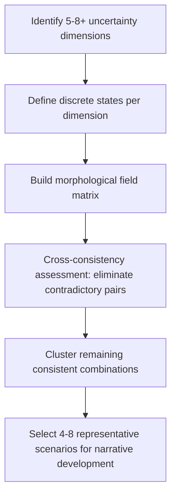
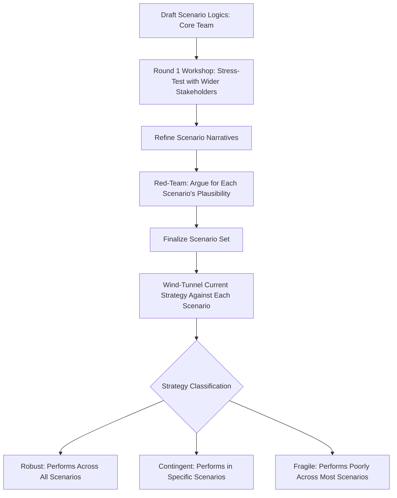

## Advanced Scenario Planning Techniques

### Overview

Advanced scenario planning techniques extend beyond introductory scenario construction (identifying two critical uncertainties and building a 2x2 matrix of futures) into more rigorous methodological approaches used by practitioners facing complex, multi-variable strategic environments. These techniques originated substantially from work at Royal Dutch Shell under Pierre Wack and Ted Newland in the 1970s, the Global Business Network (GBN) founded by Peter Schwartz, and later formalized computational approaches from RAND Corporation and the Oxford Scenario Planning Approach developed by Rafael Ramírez and Angela Wilkinson. This material assumes familiarity with foundational scenario planning (narrative construction, driving forces identification) and focuses on more sophisticated methods for handling deep uncertainty, structured probability elicitation, and organizational embedding.

### Beyond the 2x2 Matrix: Morphological Analysis

**Key Points**

Basic scenario planning often defaults to selecting only two "critical uncertainties" to form a 2x2 matrix of four scenarios — a simplification that can artificially collapse genuinely multi-dimensional uncertainty into an oversimplified structure. **General Morphological Analysis (GMA)**, developed by astrophysicist Fritz Zwicky and adapted for scenario planning by researchers including Tom Ritchey at the Swedish Defence Research Agency, addresses this limitation by systematically exploring combinations across many uncertainty dimensions simultaneously.

**Next Steps for Applying Morphological Analysis**

1. Identify all relevant uncertainty dimensions (parameters) affecting the strategic question — not limited to two, potentially five to eight or more.
2. For each dimension, identify the plausible discrete states or conditions it could take (e.g., "Regulatory environment" might have states: "Deregulated," "Moderately regulated," "Heavily regulated").
3. Construct a **morphological field** — a matrix with dimensions as rows and their possible states as columns — generating a theoretical combinatorial space (the product of the number of states across all dimensions, which can quickly reach thousands of combinations).
4. Apply **cross-consistency assessment (CCA)**: systematically evaluate each pair of states across different dimensions for logical consistency, eliminating combinations that are mutually contradictory or highly improbable.
5. From the remaining internally consistent combinations, cluster and select a manageable number (typically 4-8) of representative, maximally distinct scenarios for narrative development.

$$N_{total} = \prod_{i=1}^{k} s_i$$

Where $k$ is the number of uncertainty dimensions and $s_i$ is the number of possible states for dimension $i$. Cross-consistency assessment reduces this large theoretical combinatorial space to a tractable set of internally consistent scenarios.

### Probabilistic and Bayesian Scenario Weighting

**Key Points**

While classical scenario planning (per Wack and Schwartz) deliberately avoids assigning explicit probabilities to scenarios — treating each as equally plausible to prevent premature anchoring on a single "most likely" future — some advanced applications incorporate structured probability elicitation for decision-analytic purposes, particularly when scenarios must feed into quantitative models (e.g., real options valuation, capital allocation optimization).

- **Structured expert elicitation** (e.g., the **Delphi method**): Iteratively surveys a panel of subject matter experts anonymously across multiple rounds, sharing aggregated responses between rounds to converge toward a more considered, less anchored group probability estimate for each scenario, without face-to-face dynamics that can produce groupthink or status-based deference.
- **Cross-Impact Analysis**: Extends basic scenario probability assignment by explicitly modeling how the occurrence of one event affects the conditional probability of other events, capturing interdependencies that independent probability assignment would miss.

$$P(E_1 \cap E_2) = P(E_1) \times P(E_2 \mid E_1)$$

This conditional structure underlies cross-impact matrices, which map how each pair of scenario-relevant events influences the likelihood of the others, rather than treating them as independent.

[Inference] Practitioners in the Wack/Schwartz tradition generally caution against over-quantifying scenario probabilities, arguing that the discipline's core value lies in expanding decision-makers' perceptual field to consider genuinely different futures rather than in producing a precise probability-weighted forecast — over-quantification risks reintroducing the false precision that scenario planning was originally designed to counteract, though views on this vary among practitioners and the appropriate degree of quantification likely depends on the specific decision context.

### The Oxford Scenario Planning Approach (OSPA)

**Key Points**

Developed by Rafael Ramírez and Angela Wilkinson at Oxford's Saïd Business School, OSPA represents a more recent methodological refinement distinguishing between two purposes of scenario work:

- **La Prospective (French tradition)**: Scenario planning aimed at *shaping* the future through deliberate, coordinated action — treating the organization as an agent that can influence which future emerges, not merely adapt to it.
- **Intuitive Logics (American/Shell tradition)**: Scenario planning aimed at *understanding and adapting* to an uncertain future that the organization has limited power to influence.

OSPA explicitly integrates both traditions and adds emphasis on:

- **Reperceiving**: The core cognitive objective of scenario work — not merely producing documents, but genuinely shifting how decision-makers perceive their environment and challenge existing mental models.
- **Distinguishing scenarios from forecasts explicitly at the outset**, ensuring organizational stakeholders do not misinterpret scenarios as probability-weighted predictions.
- **Embedding scenario logic into ongoing strategic conversation** rather than treating scenario planning as a discrete, one-time project with a final deliverable.

### Multi-Round and Iterative Scenario Development (The GBN/Shell Method, Extended)

**Key Points**

Advanced practice extends the classical Schwartz eight-step scenario process (identify focal issue, key forces, driving forces, rank by importance/uncertainty, select scenario logics, flesh out scenarios, assess implications, select leading indicators) with iterative refinement loops:

- **Multiple workshop rounds with expanding stakeholder groups**: An initial core team develops draft scenario logics, which are then stress-tested and refined with broader stakeholder input in subsequent rounds, improving both scenario quality and organizational buy-in.
- **Red-teaming scenarios**: Assigning a dedicated subgroup to argue for why each scenario, including the most uncomfortable or seemingly implausible ones, could plausibly occur — countering the tendency for planning teams to unconsciously suppress scenarios that are organizationally threatening or politically unpalatable.
- **Wind-tunneling strategy against scenarios**: Systematically testing current and proposed strategic options against every constructed scenario (not just the most likely one), identifying options that are **robust** (perform acceptably across all scenarios) versus **contingent** (perform well only in specific scenarios) versus **fragile** (perform poorly across most scenarios).

### Combining Scenario Planning with Real Options Analysis

**Key Points**

A sophisticated extension links scenario outputs directly to staged investment decision-making through real options reasoning, rather than treating scenario planning and financial valuation as separate exercises.

- Each scenario is used to generate a distinct set of cash-flow projections for a proposed strategic investment.
- Decision points are identified at which the organization would gain sufficient information to determine which scenario is emerging (informed by the "leading indicators" identified during scenario construction).
- The investment is then structured as a staged option: an initial limited commitment preserves the *option* to scale, pivot, or abandon as scenario-resolving information arrives, rather than requiring full upfront commitment based on an averaged or "most likely" scenario.
- This combination directly addresses a common critique of scenario planning in isolation — that constructing rich narratives does not, by itself, translate into an actionable investment or resource allocation decision.

### Systems Thinking and Causal Loop Diagrams in Scenario Development

**Key Points**

Advanced scenario practice increasingly incorporates **systems thinking** techniques, particularly **causal loop diagrams (CLDs)**, to map the feedback structures driving key uncertainties, rather than treating driving forces as independent variables.

- Identifies **reinforcing loops** (self-amplifying dynamics, e.g., "market share gains → increased economies of scale → lower costs → further market share gains") and **balancing loops** (self-correcting dynamics, e.g., "rising prices → reduced demand → downward price pressure").
- Helps scenario teams distinguish driving forces that are likely to persist and compound (reinforcing dynamics) from those likely to self-correct or plateau (balancing dynamics), improving the plausibility and internal consistency of resulting scenario narratives.
- Particularly valuable for identifying potential **tipping points** or **regime shifts** — situations where a system's feedback structure fundamentally changes character, a phenomenon simple linear extrapolation of driving forces tends to miss.

### Illustrative Diagram: Cross-Impact Matrix Structure (svg_diagram)

<svg xmlns="http://www.w3.org/2000/svg" viewBox="0 0 640 420">
<text x="320" y="30" text-anchor="middle" font-size="17" font-weight="bold" fill="#1a1a2e">Cross-Impact Matrix (svg_diagram)</text>
<rect x="180" y="60" width="100" height="50" fill="#264653" stroke="#1a1a2e" />
<text x="230" y="90" text-anchor="middle" font-size="10" fill="#fff">Event A</text>
<rect x="280" y="60" width="100" height="50" fill="#264653" stroke="#1a1a2e" />
<text x="330" y="90" text-anchor="middle" font-size="10" fill="#fff">Event B</text>
<rect x="380" y="60" width="100" height="50" fill="#264653" stroke="#1a1a2e" />
<text x="430" y="90" text-anchor="middle" font-size="10" fill="#fff">Event C</text>
<rect x="80" y="110" width="100" height="50" fill="#264653" stroke="#1a1a2e" />
<text x="130" y="140" text-anchor="middle" font-size="10" fill="#fff">Event A</text>
<rect x="180" y="110" width="100" height="50" fill="#e9c46a" stroke="#1a1a2e" />
<text x="230" y="140" text-anchor="middle" font-size="10" fill="#1a1a2e">—</text>
<rect x="280" y="110" width="100" height="50" fill="#e9c46a" stroke="#1a1a2e" />
<text x="330" y="140" text-anchor="middle" font-size="10" fill="#1a1a2e">+0.3</text>
<rect x="380" y="110" width="100" height="50" fill="#e9c46a" stroke="#1a1a2e" />
<text x="430" y="140" text-anchor="middle" font-size="10" fill="#1a1a2e">-0.2</text>
<rect x="80" y="160" width="100" height="50" fill="#264653" stroke="#1a1a2e" />
<text x="130" y="190" text-anchor="middle" font-size="10" fill="#fff">Event B</text>
<rect x="180" y="160" width="100" height="50" fill="#e9c46a" stroke="#1a1a2e" />
<text x="230" y="190" text-anchor="middle" font-size="10" fill="#1a1a2e">+0.4</text>
<rect x="280" y="160" width="100" height="50" fill="#e9c46a" stroke="#1a1a2e" />
<text x="330" y="190" text-anchor="middle" font-size="10" fill="#1a1a2e">—</text>
<rect x="380" y="160" width="100" height="50" fill="#e9c46a" stroke="#1a1a2e" />
<text x="430" y="190" text-anchor="middle" font-size="10" fill="#1a1a2e">+0.1</text>
<rect x="80" y="210" width="100" height="50" fill="#264653" stroke="#1a1a2e" />
<text x="130" y="240" text-anchor="middle" font-size="10" fill="#fff">Event C</text>
<rect x="180" y="210" width="100" height="50" fill="#e9c46a" stroke="#1a1a2e" />
<text x="230" y="240" text-anchor="middle" font-size="10" fill="#1a1a2e">-0.1</text>
<rect x="280" y="210" width="100" height="50" fill="#e9c46a" stroke="#1a1a2e" />
<text x="330" y="240" text-anchor="middle" font-size="10" fill="#1a1a2e">+0.2</text>
<rect x="380" y="210" width="100" height="50" fill="#e9c46a" stroke="#1a1a2e" />
<text x="430" y="240" text-anchor="middle" font-size="10" fill="#1a1a2e">—</text>

<text x="320" y="290" text-anchor="middle" font-size="11" fill="#555" font-style="italic">Cell values: conditional impact of row event's occurrence on column event's probability</text>

</svg>

### Organizational Embedding Techniques

**Key Points**

Advanced practice distinguishes between scenario *construction* (a project with a defined endpoint) and scenario *institutionalization* (embedding scenario thinking as an ongoing organizational capability):

- **Scenario-informed early warning systems**: Formal tracking of pre-identified leading indicators (per scenario) integrated into regular management reporting, so the organization can detect which scenario is emerging in near-real time rather than only at the next planning cycle.
- **Scenario-based strategic conversation cadences**: Regular (e.g., quarterly) executive discussions explicitly structured around "which scenario indicators have moved, and does our strategy still hold" rather than one-off scenario workshops disconnected from ongoing decision-making.
- **Decentralized scenario literacy**: Training business-unit and functional leaders directly in scenario thinking, rather than concentrating scenario expertise solely within a central strategy team, to improve the speed and quality of decentralized decisions made under the same shared set of scenario logics.
- **Scenario planning as a periodic "immune system" check**: Using scheduled scenario refresh cycles (e.g., every 2-3 years or upon major environmental shock) to test whether previously identified scenarios remain the most useful set, or whether structural change warrants constructing an entirely new scenario set rather than incrementally updating the old one.

### Common Pitfalls in Advanced Scenario Practice

**Key Points**

- **False comfort from complexity**: Adding morphological or cross-impact sophistication can create an illusion of rigor that masks continued reliance on the facilitation team's subjective judgment in selecting which combinations to retain and which cross-impact values to assign.
- **Scenario fatigue**: Overly frequent or overly numerous scenario exercises without clear connection to actual decisions can lead executives to disengage from the process, undermining the "reperceiving" objective central to the method's value.
- **Treating scenarios as forecasts despite methodological intent**: Even with explicit disclaimers, decision-makers often gravitate toward treating one scenario as the "official" expected case, undermining the discipline's purpose of maintaining genuine strategic flexibility across multiple plausible futures.
- **Insufficient diversity in the planning team**: Homogeneous planning teams (in terms of function, seniority, or worldview) tend to produce scenario sets that under-represent genuinely divergent futures, particularly futures that are uncomfortable or threatening to the current business model.

### Conclusion

Advanced scenario planning techniques extend foundational narrative scenario construction with more rigorous methods for handling genuinely multi-dimensional uncertainty (morphological analysis), structured probability elicitation (Delphi methods, cross-impact analysis), explicit distinctions between shaping and adapting orientations (the Oxford Scenario Planning Approach), systems-thinking-informed causal structure (causal loop diagrams), and direct linkage to investment decision-making (real options integration). The unifying objective across these advanced methods remains consistent with the discipline's origins under Pierre Wack: to expand decision-makers' perceptual field and challenge existing mental models about the future, rather than to produce a single, falsely precise prediction. Organizational embedding — through early warning systems, recurring scenario-informed strategic conversation, and decentralized scenario literacy — determines whether these more sophisticated techniques translate into genuinely improved strategic decision-making or remain isolated planning exercises with limited lasting influence.

**Related Topics**

- Foundational Scenario Planning: The Schwartz Eight-Step Method
- Real Options Reasoning and Staged Strategic Investment
- Causal Loop Diagrams and Systems Thinking in Strategy
- The Delphi Method for Structured Expert Elicitation
- Robust Decision-Making (RDM) Under Deep Uncertainty
- Decision-Making Under Uncertainty and Ambiguity
- Wind-Tunneling Strategy Against Multiple Futures
- Early Warning Indicator Systems for Strategic Monitoring