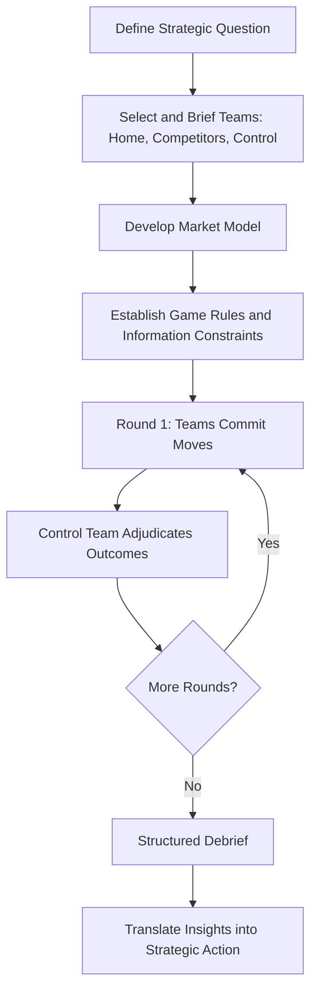

## War Gaming and Competitive Simulation

### Overview

War gaming and competitive simulation are strategy formulation techniques adapted from military planning traditions into business strategy contexts, used to test strategic options by simulating dynamic, multi-round competitive interactions rather than relying solely on static analytical frameworks. Unlike tools such as SWOT or Porter's Five Forces, which produce a point-in-time analytical snapshot, business war games explicitly model how competitors, customers, regulators, and other market actors are likely to *react* to a firm's strategic moves, and how the firm should adapt in response — capturing the interactive, multi-period nature of real competitive dynamics. The technique draws directly on military staff college war-gaming traditions dating to 19th-century Prussian *Kriegsspiel* exercises, adapted for corporate strategy use substantially from the 1980s onward.

### Rationale: Why Static Analysis Is Insufficient

**Key Points**

- Classical strategic frameworks tend to treat the competitive environment as relatively fixed at the time of analysis, implicitly assuming competitors will not meaningfully adapt their behavior in response to a firm's strategic moves.
- Game theory concepts (e.g., Nash equilibrium reasoning) demonstrate that in genuinely interactive competitive settings, the outcome of any strategic move depends on rivals' rational responses, which in turn depend on their expectations of the firm's further responses — a recursive structure that static frameworks do not capture.
- War gaming operationalizes this game-theoretic insight experientially: rather than asking analysts to formally model competitor payoff functions and solve for equilibria, it has trained participants role-play as competitors and other market actors, surfacing behaviorally realistic (if less mathematically rigorous) reaction patterns.
- [Inference] This experiential approach can surface non-obvious second- and third-order competitive reactions — and their downstream implications — that purely analytical modeling might miss, particularly where competitor psychology, organizational politics, or non-economic motivations (reputation, market signaling) influence real-world competitive behavior, though the reliability of role-played reactions as predictors of actual competitor behavior depends heavily on how well-informed and realistic the role-players' assumptions are.

### Core Components of a Business War Game

| Component | Description |
| --- | --- |
| **Teams** | Typically organized as: the "home team" (representing the sponsoring organization), one or more "competitor teams" (each representing a specific real rival), and sometimes teams representing customers, regulators, suppliers, or new entrants |
| **Facilitator/Control team ("White Cell")** | A neutral team that sets the rules, adjudicates outcomes, introduces external events (market shocks, regulatory changes), and enforces realistic constraints on each team's moves |
| **Move-countermove rounds** | Structured sequential rounds in which each team commits to a strategic move, competitor teams then respond, and the process repeats over multiple rounds to simulate an extended competitive time horizon |
| **Market model/scoring mechanism** | A simplified but disciplined mechanism (often a spreadsheet-based market share, pricing, or profitability model) that translates each round's committed moves into simulated market outcomes, providing objective feedback rather than purely narrative judgment |
| **Debrief and synthesis** | Structured post-game analysis extracting strategic insights, "aha moments," and specific action implications for the sponsoring organization |

### The War Gaming Process

**Next Steps for Designing and Running a Business War Game**

1. **Define the strategic question**: Clarify precisely what decision or set of decisions the war game is intended to inform (e.g., "how should we respond if Competitor X launches a low-cost entrant product," "what pricing strategy should we adopt in response to a new market entrant").
2. **Select and brief participants**: Assign cross-functional, typically senior, participants to home and competitor teams. Effective competitor role-play requires deep, well-researched knowledge of each simulated rival's history, incentives, capabilities, and likely strategic logic — participants are often deliberately assigned to represent competitors other than their own actual employer to reduce anchoring on home-team assumptions.
3. **Develop the market model**: Build a simplified but internally consistent model of the competitive market (demand elasticity, cost structures, market share dynamics) that will translate each round's strategic moves into simulated financial and market share outcomes.
4. **Establish game rules and constraints**: Define the rules of engagement — what moves are permissible, what information each team has access to (often deliberately asymmetric, mirroring real-world information asymmetry), and the time horizon and number of rounds.
5. **Conduct move-countermove rounds**: Run the game through multiple rounds (commonly 3-5), with each team committing to strategic moves (pricing changes, product launches, capacity investments, geographic expansion, M&A) each round, followed by the control team adjudicating and revealing outcomes before the next round begins.
6. **Conduct structured debrief**: Systematically capture insights about competitor reaction patterns, vulnerabilities in the home team's current strategy, and unexpected strategic opportunities or threats that emerged during play.
7. **Translate insights into strategic action**: Convert war-gaming insights into specific changes to strategic plans, contingency plans, or early-warning indicators to monitor for signs that a simulated competitive scenario is beginning to materialize in reality.

### Types of Business War Games

**Key Points**

- **Market entry/competitive response games**: Simulate how incumbents and new entrants would react to a specific market entry decision, commonly used before major geographic or product-category expansion decisions.
- **Pricing war games**: Focus specifically on pricing move-countermove dynamics, testing whether a proposed pricing strategy is likely to trigger destructive price competition and modeling the resulting margin and market-share trajectory.
- **M&A and deal war games**: Simulate how competitors, regulators, and target company management might respond to a potential acquisition announcement, informing deal structuring and negotiation strategy.
- **Regulatory/political war games**: Extend the competitor concept to regulators, policymakers, and other non-market stakeholders, used particularly in heavily regulated industries facing potential policy change.
- **Innovation/disruption war games**: Simulate how a disruptive new entrant (sometimes a hypothetical, not-yet-existing competitor) might attack an incumbent's business model, used to stress-test defensibility against disruption before it materializes.

### Illustrative Diagram: War Game Round Structure (svg_diagram)

<svg xmlns="http://www.w3.org/2000/svg" viewBox="0 0 720 460">
<text x="360" y="30" text-anchor="middle" font-size="17" font-weight="bold" fill="#1a1a2e">Business War Game: Team Structure and Rounds (svg_diagram)</text>
<rect x="40" y="60" width="150" height="60" rx="6" fill="#264653" stroke="#1a1a2e" stroke-width="1.5" />
<text x="115" y="85" text-anchor="middle" font-size="12" fill="#fff" font-weight="bold">Home Team</text>
<text x="115" y="103" text-anchor="middle" font-size="10" fill="#fff">(Sponsoring Org)</text>
<rect x="210" y="60" width="150" height="60" rx="6" fill="#e76f51" stroke="#1a1a2e" stroke-width="1.5" />
<text x="285" y="85" text-anchor="middle" font-size="12" fill="#fff" font-weight="bold">Competitor A</text>
<text x="285" y="103" text-anchor="middle" font-size="10" fill="#fff">Team</text>
<rect x="380" y="60" width="150" height="60" rx="6" fill="#e76f51" stroke="#1a1a2e" stroke-width="1.5" />
<text x="455" y="85" text-anchor="middle" font-size="12" fill="#fff" font-weight="bold">Competitor B</text>
<text x="455" y="103" text-anchor="middle" font-size="10" fill="#fff">Team</text>
<rect x="550" y="60" width="130" height="60" rx="6" fill="#2a9d8f" stroke="#1a1a2e" stroke-width="1.5" />
<text x="615" y="85" text-anchor="middle" font-size="12" fill="#fff" font-weight="bold">Customer/</text>
<text x="615" y="103" text-anchor="middle" font-size="10" fill="#fff">Regulator Team</text>
<rect x="280" y="160" width="160" height="50" rx="6" fill="#e9c46a" stroke="#1a1a2e" stroke-width="1.5" />
<text x="360" y="182" text-anchor="middle" font-size="11" fill="#1a1a2e" font-weight="bold">Control Team</text>
<text x="360" y="198" text-anchor="middle" font-size="10" fill="#1a1a2e">("White Cell")</text>
<path d="M115 120 L340 165" stroke="#333" stroke-width="1" fill="none" />
<path d="M285 120 L340 165" stroke="#333" stroke-width="1" fill="none" />
<path d="M455 120 L380 165" stroke="#333" stroke-width="1" fill="none" />
<path d="M615 120 L400 165" stroke="#333" stroke-width="1" fill="none" />
<rect x="60" y="250" width="140" height="45" rx="5" fill="#f4f1de" stroke="#999" />
<text x="130" y="277" text-anchor="middle" font-size="11" fill="#333">Round 1: Moves</text>
<rect x="220" y="250" width="140" height="45" rx="5" fill="#f4f1de" stroke="#999" />
<text x="290" y="277" text-anchor="middle" font-size="11" fill="#333">Adjudicate</text>
<rect x="380" y="250" width="140" height="45" rx="5" fill="#f4f1de" stroke="#999" />
<text x="450" y="277" text-anchor="middle" font-size="11" fill="#333">Round 2: Moves</text>
<rect x="540" y="250" width="140" height="45" rx="5" fill="#f4f1de" stroke="#999" />
<text x="610" y="277" text-anchor="middle" font-size="11" fill="#333">Adjudicate</text>
<path d="M200 272 L220 272" stroke="#333" stroke-width="1.5" marker-end="url(#a2)" />
<path d="M360 272 L380 272" stroke="#333" stroke-width="1.5" marker-end="url(#a2)" />
<path d="M520 272 L540 272" stroke="#333" stroke-width="1.5" marker-end="url(#a2)" />
<rect x="230" y="340" width="260" height="50" rx="6" fill="#264653" stroke="#1a1a2e" stroke-width="1.5" />
<text x="360" y="370" text-anchor="middle" font-size="12" fill="#fff" font-weight="bold">Structured Debrief and Action Plan</text>
<path d="M610 295 L360 335" stroke="#333" stroke-width="1.5" marker-end="url(#a2)" />
</svg>

### Illustrative Example (Hypothetical)

**Example**

A national airline considering whether to launch a new low-cost subsidiary brand runs a war game with three teams: the home team (airline management), a "Major Legacy Competitor" team, and a "Existing Low-Cost Carrier" team, plus a control team managing fuel price shocks and regulatory slot allocation events.

- **Round 1**: The home team announces the low-cost subsidiary launch on three domestic routes. The Existing Low-Cost Carrier team, role-playing aggressive incumbent defense of its territory, responds by matching fares on those specific routes at a loss-making level, betting on the new entrant's shallower capital reserves.
- **Round 2**: The home team must decide whether to escalate (match the fare cut, burning capital) or retreat to different routes. The Major Legacy Competitor team, observing the fare war, opportunistically raises prices on unaffected routes to capture premium travelers avoiding the price war.
- **Debrief insight**: The exercise reveals that the proposed three initial routes overlap precisely with the low-cost incumbent's most defensible territory, suggesting the actual launch strategy should target routes where the incumbent has weaker existing presence, and that the airline should pre-position additional capital reserves specifically sized to survive a modeled fare-war scenario of the duration observed in the simulation.

This type of insight — a specific route-selection refinement driven by a modeled aggressive incumbent reaction — is characteristic of what war gaming can surface that static market-sizing analysis alone typically would not.

### Strengths and Limitations

**Key Points**

*Strengths*

- Surfaces dynamic, multi-round competitive reaction patterns that static analytical frameworks structurally cannot capture, particularly around competitor retaliation and escalation dynamics.
- Builds genuine organizational empathy for competitor perspectives among senior executives, since directly role-playing a rival's likely logic tends to produce more realistic threat assessment than abstract competitor analysis conducted solely from the home team's vantage point.
- Creates a low-risk environment to stress-test aggressive or unconventional strategic moves before real-world commitment, surfacing vulnerabilities while the cost of "failure" is limited to the simulation.
- Tends to generate strong senior-executive engagement and memorable, action-oriented insights compared to more passive analytical presentations, aiding subsequent implementation buy-in.

*Limitations*

- [Inference] The quality of insights is highly dependent on the realism of competitor role-play; participants' own cognitive biases, incomplete competitive intelligence, or reluctance to authentically model aggressive/unethical competitor tactics can produce a war game that reflects the home team's existing assumptions rather than genuinely surfacing blind spots — the extent of this limitation in any specific instance is difficult to assess without external validation of the role-play's realism.
- Resource-intensive relative to purely analytical strategy tools, typically requiring one to several days of senior executive time, dedicated facilitation expertise, and preparatory competitive intelligence research.
- Market models used to adjudicate rounds are inevitably simplifications of real market dynamics; overly simplistic models can produce mechanically unrealistic outcomes, while overly complex models can slow the exercise and obscure clear strategic learning.
- Risk of false confidence if participants conflate the specific simulated outcomes with actual predictions of competitor behavior, rather than treating the exercise as a tool for expanding strategic imagination and identifying vulnerabilities, similar to the forecast-conflation risk noted in classical scenario planning.
- Less suited to situations involving many (more than 3-4) significant competitors simultaneously, as the combinatorial complexity of realistic multi-party interaction becomes difficult to manage within a practical exercise format.

### Relationship to Other Strategy Tools

**Key Points**

- Complements **game theory** analysis: war gaming provides an experiential, behaviorally-grounded alternative or complement to formal game-theoretic equilibrium modeling, particularly useful when competitor payoff structures are not cleanly quantifiable or when organizational/psychological factors materially affect real-world competitor behavior.
- Distinct from **scenario planning**: scenario planning primarily addresses uncertainty in the broader macro-environment (regulatory, technological, economic trends) through narrative construction, whereas war gaming specifically addresses interactive competitive dynamics among identified rivals through simulated move-countermove play; the two are frequently combined, with war games sometimes run within a specific scenario context established by prior scenario planning work.
- Often used downstream of **Porter's Five Forces** and competitive profiling analysis, which identify the relevant competitors and general competitive structure that the war game then dynamically tests through simulated interaction.
- Provides a complementary stress-test to the **Quantitative Strategic Planning Matrix (QSPM)** and similar static evaluation tools, since war gaming can reveal that a strategy scoring well on static criteria is nonetheless vulnerable to specific, realistic competitor countermoves not captured in the QSPM's factor list.

### Common Pitfalls

**Key Points**

- Assigning junior or insufficiently prepared staff to competitor teams, producing unrealistic or overly passive role-play that fails to surface genuine competitive threats.
- Insufficiently rigorous market models that allow teams to "game the model" rather than pursue realistic strategic logic, undermining the exercise's value.
- Failing to translate war-gaming insights into concrete changes to strategic plans, contingency triggers, or monitoring indicators, allowing valuable insights generated during the exercise to dissipate without organizational follow-through.
- Running the exercise as a one-off event disconnected from an ongoing strategic planning cadence, rather than as a recurring capability revisited as competitive conditions evolve or before major strategic commitments.
- Home-team participants unconsciously "pulling punches" when role-playing competitors against their own actual employer's strategy, out of reluctance to seriously threaten leadership's preferred strategic direction.

### Conclusion

War gaming and competitive simulation address a structural limitation of static strategic analysis frameworks by explicitly modeling the dynamic, multi-round, interactive nature of real competitive markets — surfacing how rivals, customers, and regulators are likely to react and counter-react to a firm's strategic moves. Adapted from military planning traditions into structured team-based exercises with move-countermove rounds and neutral adjudication, the technique's principal value lies in generating experiential, behaviorally realistic insight into competitive reaction patterns that purely analytical tools structurally cannot capture, while requiring careful attention to role-play realism, market model rigor, and disciplined translation of insights into concrete strategic and contingency action to avoid the exercise becoming an engaging but ultimately inconsequential organizational event.

**Related Topics**

- Game Theory Foundations in Competitive Strategy
- Porter's Five Forces and Competitive Profile Analysis
- Advanced Scenario Planning Techniques
- The Quantitative Strategic Planning Matrix (QSPM)
- Premortem Analysis and Structured Dissent Techniques
- Strategic Early Warning Indicator Systems
- M&A Deal Strategy and Competitive Reaction Modeling
- Disruptive Innovation and Incumbent Response Strategy