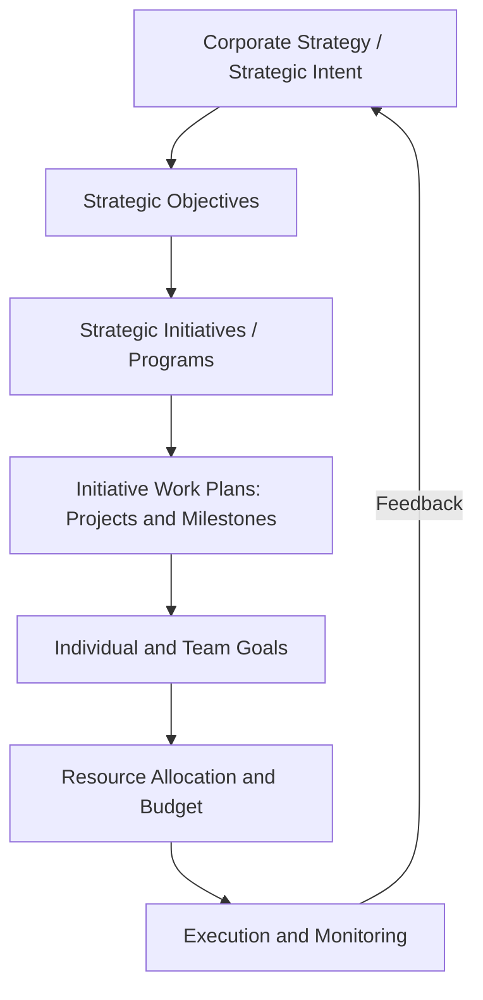
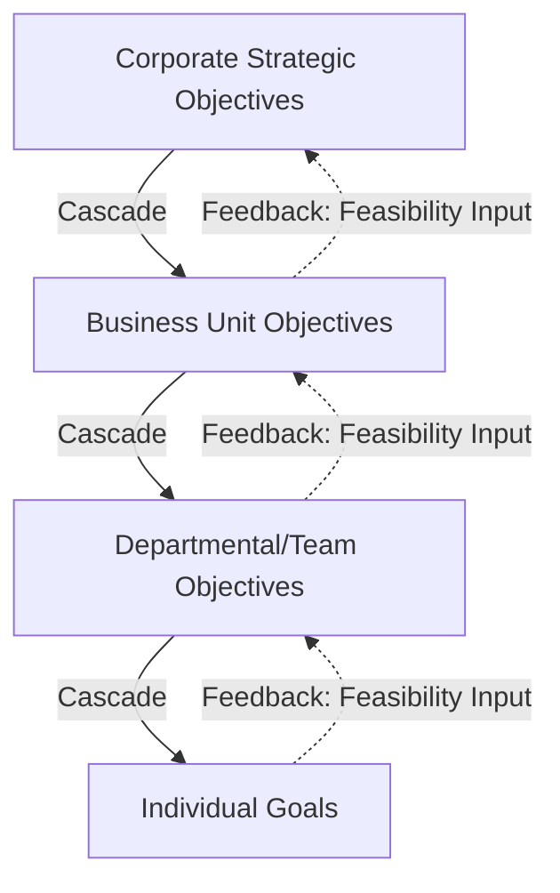

## Translating Strategy into Actionable Plans

### Overview

Translating strategy into actionable plans addresses the critical transition point between strategy formulation (deciding *what* the organization should do) and strategy execution (ensuring the organization actually *does* it). This is widely regarded as one of the most failure-prone stages in strategic management — surveys and academic research on strategy execution consistently identify the gap between formulated strategy and realized results as a primary driver of underperformance relative to strategic intent, even when the underlying strategic analysis and choice were sound. This topic addresses the frameworks, mechanisms, and disciplines used to convert high-level strategic direction into the specific, measurable, resourced, and accountable actions required for implementation.

### Why Strategies Fail to Translate into Action

**Key Points**

- **Lack of specificity**: Strategic plans often remain at a level of abstraction ("become the customer service leader in our industry") that provides no clear guidance on what any individual, team, or department should actually do differently starting Monday morning.
- **Disconnection from resource allocation**: Strategic priorities stated in planning documents frequently fail to be reflected in actual budget and headcount allocation decisions, which continue to follow historical patterns or political influence rather than strategic priority.
- **Absence of clear accountability**: Diffuse or shared ownership of strategic initiatives, without a single accountable owner, tends to result in initiatives receiving insufficient sustained attention amid competing operational demands.
- **Missing line-of-sight**: Individual employees and middle managers often cannot see how their day-to-day work connects to top-level strategic objectives, reducing both motivation and the practical ability to make strategy-aligned decisions in daily work.
- **Absence of a disciplined execution cadence**: Without a regular review rhythm specifically focused on strategic execution (as distinct from routine operational reporting), strategic initiatives can quietly stall without triggering timely management attention.
- [Inference] This combination of factors suggests that translating strategy into action is less a single-step task than an ongoing organizational discipline requiring aligned goal-setting, resourcing, accountability structures, and review cadence operating in concert — deficiency in any one dimension can undermine outcomes even when the others are well executed, though the relative weight of each factor likely varies by organizational context.

### The Strategy-to-Action Translation Chain

**Key Points**

Each link in this chain represents a translation step where strategic intent can be lost, diluted, or distorted if not managed deliberately:

- **Strategy → Objectives**: Requires converting broad strategic direction into specific, measurable strategic objectives (often via frameworks like the Balanced Scorecard or OKRs).
- **Objectives → Initiatives**: Requires identifying the specific programs, projects, or capability investments required to close the gap between current and target performance on each objective.
- **Initiatives → Work Plans**: Requires standard project management discipline — scoping, sequencing, milestone definition, and dependency mapping — to make initiatives executable.
- **Work Plans → Individual Goals**: Requires cascading accountability down to specific roles and individuals, ensuring named ownership rather than diffuse departmental responsibility.
- **Goals → Resources**: Requires the budgeting and capital allocation process to be genuinely aligned with, rather than independent of, the strategic initiative portfolio.

### Goal-Setting Frameworks for Strategic Translation

| Framework | Structure | Best Suited For |
| --- | --- | --- |
| **OKRs (Objectives and Key Results)** | Qualitative Objective + 3-5 quantitative Key Results per objective, typically on a quarterly cadence | Fast-moving organizations wanting frequent goal refresh and cross-functional alignment |
| **Balanced Scorecard cascading** | Objectives and measures across four perspectives (Financial, Customer, Process, Learning & Growth), cascaded from corporate to business-unit to individual levels | Organizations wanting an integrated, causally-linked measurement architecture tied to strategy maps |
| **Hoshin Kanri (Policy Deployment)** | Annual breakthrough objectives cascaded through an iterative "catchball" negotiation process between organizational levels | Organizations (particularly in manufacturing/operations-heavy sectors) emphasizing consensus-built, bidirectional goal alignment |
| **SMART goals** | Specific, Measurable, Achievable, Relevant, Time-bound criteria applied to individual or team-level goals | Ensuring individual goal statements meet a minimum quality bar for actionability, regardless of which higher-level framework is used |

**Key Points**

- **OKRs** deliberately separate the qualitative, inspirational Objective from the quantitative Key Results used to measure progress, and typically encourage a degree of intentional stretch (Google's well-known practice of treating 70% average Key Result attainment as a healthy outcome, since consistently hitting 100% may indicate insufficiently ambitious goal-setting).
- **Hoshin Kanri's catchball process** is distinguished by its explicitly negotiated, iterative nature: draft objectives are passed down from senior leadership, tested and refined by middle management and front-line teams for feasibility, and passed back up — repeating until genuine alignment (not merely top-down compliance) is achieved.
- Many organizations use these frameworks in combination rather than as mutually exclusive alternatives — for example, using the Balanced Scorecard's four-perspective architecture for the overall strategic map while using OKRs as the quarterly execution and tracking mechanism beneath it.

### From Strategic Initiatives to Executable Work Plans

**Next Steps for Converting a Strategic Initiative into an Actionable Plan**

1. **Define the initiative's specific scope and success criteria**: Translate the strategic objective it supports into a concrete deliverable or capability with clear, measurable completion criteria — avoiding vague initiative descriptions like "improve customer experience" without specifying what "improved" concretely means and how it will be measured.
2. **Identify dependencies and sequencing**: Map which initiatives must precede others (e.g., a new CRM system implementation typically must precede a sales-process-redesign initiative that depends on the new system's data capabilities).
3. **Assign a single accountable owner**: Designate one named individual (not a committee) as ultimately accountable for the initiative's success, even where cross-functional teams are involved in execution — diffusing accountability across a committee is a frequently cited cause of stalled strategic initiatives.
4. **Break the initiative into milestones and workstreams**: Apply standard project management decomposition — work breakdown structures, milestone timelines, and resourcing plans — converting the initiative into a manageable project rather than an open-ended aspiration.
5. **Allocate specific resources**: Assign concrete budget, headcount, and other resources to the initiative through the formal budgeting process, ensuring the initiative is genuinely funded rather than merely endorsed on paper.
6. **Establish leading and lagging indicators**: Define both the ultimate outcome measure (lagging) and earlier-available indicators (leading) that will reveal whether the initiative is on track well before the final outcome is observable.
7. **Integrate into the regular review cadence**: Ensure the initiative appears explicitly in periodic strategic review meetings (not only routine operational reporting), so any deviation from plan triggers timely management attention and course-correction.

### Cascading and Line-of-Sight

**Key Points**

- **Cascading** refers to the systematic process of deriving business-unit, departmental, team, and individual-level goals from corporate strategic objectives, ensuring every level of the organization has clear, traceable line-of-sight to the overall strategy.
- Two broad cascading approaches are used: a **direct/aligned cascade**, where lower-level objectives are strict subsets or direct contributions to specific higher-level objectives, and a **contribution-based cascade**, where lower levels define their own contextually appropriate objectives but must explicitly articulate how those objectives support higher-level strategy.
- Effective cascading requires **bidirectional communication**, not purely top-down assignment: middle management and front-line input on feasibility, resourcing constraints, and local market conditions materially improves both the quality and the genuine ownership of cascaded goals — this is the organizational insight underlying Hoshin Kanri's catchball mechanism.
- **Line-of-sight** — an individual employee's ability to understand and articulate how their specific work contributes to overall strategy — is both a motivational factor and a practical enabler of better decentralized decision-making, since employees who understand strategic intent can make more strategy-aligned judgment calls in ambiguous day-to-day situations without needing constant escalation.

### Integrating Resource Allocation with Strategic Priorities

**Key Points**

A recurring failure mode in strategy translation is the operation of the budgeting/capital-allocation process as a largely separate exercise from strategic planning, often on a different timeline and owned by a different function (finance) with different incentives (historical baseline preservation, political negotiation) than the strategic planning process.

**Next Steps for Aligning Budgeting with Strategy**

- **Synchronize timelines**: Ensure the strategic planning cycle produces its outputs (prioritized initiatives, resource requirements) early enough to genuinely inform, rather than follow, the annual budgeting cycle.
- **Create a dedicated strategic initiative budget category**, distinguished from baseline/run-the-business operating budgets, protecting strategic investment from being incrementally cut during routine budget negotiations.
- **Require explicit strategic linkage for major budget requests**: Mandate that significant budget or headcount requests articulate which specific strategic objective or initiative they support, surfacing and challenging spending that has no clear strategic rationale.
- **Establish portfolio-level initiative review**, evaluating the full strategic initiative portfolio periodically (not just individual initiatives in isolation) to ensure aggregate resource allocation matches aggregate strategic priority, and to make deliberate trade-off decisions when demand for resources exceeds supply.

### Governance and Review Mechanisms

**Key Points**

- **Quarterly Business Reviews (QBRs)** or equivalent periodic strategic review meetings, distinct from routine operational performance reviews, focused specifically on strategic initiative progress, leading indicator trends, and whether the underlying strategic logic (e.g., the causal hypotheses embedded in a strategy map) continues to hold.
- **Strategy management offices or corporate development functions**, where present, often facilitate this review cadence, maintain the initiative portfolio tracking system, and ensure consistency in how progress is reported across business units — while typically not holding the decision rights themselves, which remain with line executives.
- **Escalation triggers**: Pre-defined thresholds (e.g., a leading indicator falling more than a specified percentage below target) that automatically trigger management attention and a course-correction discussion, rather than relying on ad hoc detection of stalled initiatives.
- **"Kill criteria" or stage-gate mechanisms**: Explicit, pre-agreed conditions under which a strategic initiative will be paused, redesigned, or terminated, reducing the risk of escalation of commitment to failing initiatives that continue consuming resources due to sunk-cost reasoning.

### Illustrative Example

**Example**

A B2B software company's corporate strategy calls for "becoming the platform of choice for mid-market manufacturing customers." Translating this into action might proceed as follows:

- **Strategic Objective** (via Balanced Scorecard Customer perspective): Increase mid-market manufacturing customer market share from 8% to 15% within three years.
- **Strategic Initiative**: Develop and launch a manufacturing-specific product module addressing inventory and supply-chain integration needs unmet by the current general-purpose platform.
- **Work Plan**: Product module scoped into three development phases (core inventory integration, supply-chain API connectors, manufacturing-specific reporting dashboards), each with defined milestones, a named engineering lead as single accountable owner, and a 14-month total timeline with quarterly milestone reviews.
- **Individual Goals**: The VP of Product's quarterly OKR includes a Key Result tied to Phase 1 completion; the sales team's regional quotas for mid-market manufacturing accounts are explicitly increased and tied to compensation, providing line-of-sight and incentive alignment.
- **Resource Allocation**: A dedicated engineering budget line is created for the manufacturing module, protected from the general product development budget's routine prioritization process, alongside a defined marketing budget for a manufacturing-vertical launch campcampaign.
- **Review Cadence**: The initiative appears as a standing agenda item in the company's quarterly strategic review, with a leading indicator (number of manufacturing-sector sales pipeline opportunities) tracked monthly to provide early signal ahead of the lagging market-share metric.

### Illustrative Diagram: Common Execution Gap Points (svg_diagram)

<svg xmlns="http://www.w3.org/2000/svg" viewBox="0 0 740 380">
<text x="370" y="30" text-anchor="middle" font-size="17" font-weight="bold" fill="#1a1a2e">Where Strategy Translation Commonly Breaks (svg_diagram)</text>
<rect x="20" y="70" width="140" height="50" rx="6" fill="#264653" stroke="#1a1a2e" />
<text x="90" y="100" text-anchor="middle" font-size="11" fill="#fff" font-weight="bold">Strategy</text>
<rect x="200" y="70" width="140" height="50" rx="6" fill="#264653" stroke="#1a1a2e" />
<text x="270" y="100" text-anchor="middle" font-size="11" fill="#fff" font-weight="bold">Objectives</text>
<rect x="380" y="70" width="140" height="50" rx="6" fill="#264653" stroke="#1a1a2e" />
<text x="450" y="100" text-anchor="middle" font-size="11" fill="#fff" font-weight="bold">Initiatives</text>
<rect x="560" y="70" width="140" height="50" rx="6" fill="#264653" stroke="#1a1a2e" />
<text x="630" y="100" text-anchor="middle" font-size="11" fill="#fff" font-weight="bold">Individual Goals</text>
<path d="M160 95 L200 95" stroke="#333" stroke-width="1.5" marker-end="url(#a3)" />
<path d="M340 95 L380 95" stroke="#333" stroke-width="1.5" marker-end="url(#a3)" />
<path d="M520 95 L560 95" stroke="#333" stroke-width="1.5" marker-end="url(#a3)" />
<rect x="150" y="150" width="120" height="60" rx="6" fill="#e76f51" stroke="#1a1a2e" />
<text x="210" y="172" text-anchor="middle" font-size="10" fill="#fff" font-weight="bold">Gap: Lack of</text>
<text x="210" y="188" text-anchor="middle" font-size="10" fill="#fff" font-weight="bold">Specificity</text>
<rect x="330" y="150" width="120" height="60" rx="6" fill="#e76f51" stroke="#1a1a2e" />
<text x="390" y="172" text-anchor="middle" font-size="10" fill="#fff" font-weight="bold">Gap: Diffuse</text>
<text x="390" y="188" text-anchor="middle" font-size="10" fill="#fff" font-weight="bold">Accountability</text>
<rect x="510" y="150" width="120" height="60" rx="6" fill="#e76f51" stroke="#1a1a2e" />
<text x="570" y="172" text-anchor="middle" font-size="10" fill="#fff" font-weight="bold">Gap: Missing</text>
<text x="570" y="188" text-anchor="middle" font-size="10" fill="#fff" font-weight="bold">Line-of-Sight</text>
<rect x="230" y="250" width="280" height="60" rx="6" fill="#e9c46a" stroke="#1a1a2e" />
<text x="370" y="272" text-anchor="middle" font-size="11" fill="#1a1a2e" font-weight="bold">Gap: Resource Allocation Disconnected</text>
<text x="370" y="288" text-anchor="middle" font-size="11" fill="#1a1a2e" font-weight="bold">from Strategic Priority</text>

<text x="370" y="345" text-anchor="middle" font-size="11" fill="#555" font-style="italic">Each gap represents a point where strategic intent can be lost during translation</text>

</svg>

### Common Pitfalls

**Key Points**

- Producing a strategic plan document that is analytically rigorous but never translated into specific initiatives, work plans, and individual accountabilities, leaving the strategy as an aspirational statement rather than a driver of actual behavior.
- Over-cascading rigidly to the individual level in ways that encourage narrow metric-gaming rather than genuine contribution to broader strategic intent — a risk shared with over-cascaded Balanced Scorecard implementations.
- Allowing the budgeting process to operate independently of, or even in tension with, stated strategic priorities, resulting in strategically important initiatives being systematically underfunded relative to legacy operational spending.
- Treating strategic initiative reviews as routine operational status updates rather than genuine strategic discussions about whether underlying assumptions and causal logic continue to hold.
- Failing to build in explicit kill criteria or stage-gates, resulting in escalation of commitment to underperforming initiatives well past the point where a rational reassessment would have redirected resources elsewhere.

### Conclusion

Translating strategy into actionable plans requires a deliberate, multi-stage architecture connecting high-level strategic intent through specific objectives, resourced and accountable initiatives, executable work plans, and individual goals with genuine line-of-sight — supported by a budgeting process that is integrated with, rather than independent of, strategic priority, and a disciplined review cadence capable of detecting and correcting execution drift before it becomes entrenched. The persistent gap between strategy formulation and realized results across many organizations reflects the difficulty of maintaining coherence across this full chain simultaneously; effective execution treats strategy translation not as a single planning-cycle event but as an ongoing organizational discipline requiring sustained attention to goal-setting frameworks, cascading and accountability structures, resource alignment, and governance mechanisms working in concert.

**Related Topics**

- OKRs vs. Balanced Scorecard Cascading for Goal Alignment
- Hoshin Kanri and the Catchball Process
- Strategic Initiative Portfolio Management
- Resource Allocation and Capital Budgeting Alignment with Strategy
- Strategy Maps and Causal Objective Linkage
- Quarterly Business Reviews and Strategic Governance Cadence
- Escalation of Commitment and Kill-Criteria Design
- Middle Management's Role in Strategy Execution