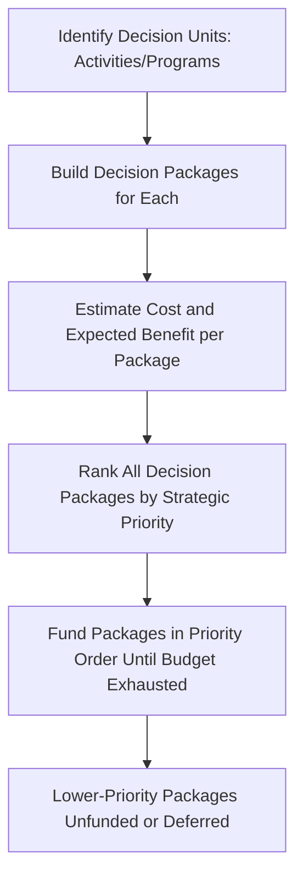

## Resource Allocation and Strategic Budgeting

### Overview

Resource allocation and strategic budgeting concerns the processes by which organizations translate strategic priorities into concrete commitments of capital, headcount, and operational spending. This is frequently identified as the single point at which strategy execution most commonly breaks down: strategic plans may be analytically rigorous and well-communicated, but if the budgeting process operates independently of stated strategic priorities — following historical spending patterns, political negotiation, or departmental incrementalism instead — the strategy remains unfunded and therefore unrealized regardless of the quality of the underlying analysis.

### The Core Problem: Strategic-Operational Budget Disconnection

**Key Points**

- Many organizations run strategic planning and annual budgeting as **structurally separate processes**, often owned by different functions (a strategy office or executive team for planning; finance for budgeting), operating on different timelines, and using different underlying logic.
- **Incremental budgeting** — the common default practice of setting each unit's budget as a percentage adjustment from its prior-year baseline — inherently perpetuates historical resource allocation patterns regardless of whether those patterns reflect current strategic priorities, since the starting point for negotiation is what a unit already has rather than what the current strategy requires.
- This disconnect produces a well-documented failure pattern: strategic plans identify new priority initiatives, but because those initiatives must compete for funding against the inertia of existing baseline budgets (which are rarely fundamentally re-examined), new strategic priorities are systematically underfunded relative to legacy spending.
- [Inference] The severity of this disconnect likely correlates with how structurally separated the strategic planning and budgeting functions are within a given organization — firms with a shared governance process and overlapping ownership between the two functions may experience less of this gap than firms with fully separate, sequentially-run processes, though the degree of correlation would vary by organizational context and is difficult to establish with precision from general principles alone.

### Budgeting Methodologies and Their Strategic Implications

| Methodology | Description | Strategic Alignment Strength |
| --- | --- | --- |
| **Incremental budgeting** | Each period's budget set as an adjustment (typically a percentage change) from the prior period's baseline | Weak — perpetuates historical allocation regardless of current strategic priority |
| **Zero-based budgeting (ZBB)** | Each budget cycle requires every expenditure to be justified from a "zero base," rather than referencing prior-period baselines | Strong — forces periodic re-justification of all spending against current strategic priorities, though resource-intensive to execute |
| **Activity-based budgeting (ABB)** | Budgets built from the specific activities and processes required to achieve organizational objectives, using activity-based costing principles | Moderate to strong — links spending directly to the activities driving strategic objectives, though requires mature activity-based costing infrastructure |
| **Rolling/continuous budgeting** | Budget continuously extended and revised (e.g., a rolling 12-18 month forecast updated monthly or quarterly) rather than fixed to an annual cycle | Strong for volatile environments — allows resource reallocation to track evolving strategic priorities more responsively than a fixed annual cycle |
| **Strategic/priority-based budgeting** | Budget explicitly organized around strategic priorities or initiatives rather than departmental or functional lines, sometimes as a supplementary layer atop traditional departmental budgets | Strong — creates direct visibility and protection for strategic initiative funding, distinct from baseline operating spend |

### Zero-Based Budgeting in Strategic Context

**Key Points**

- Originally developed and popularized in the 1970s (notably associated with Peter Pyhrr's work at Texas Instruments and subsequent high-profile application in Georgia state government under then-Governor Jimmy Carter), ZBB requires managers to build their budget request from a zero base each cycle, justifying every expenditure rather than only justifying incremental changes from the prior baseline.
- ZBB's core strategic value lies in periodically forcing an organization-wide re-examination of whether existing spending patterns are still justified by current strategic priorities, directly countering the inertia that incremental budgeting reinforces.
- Practical implementations often use "decision packages" — discrete, ranked funding proposals for specific activities or programs — that senior management can then rank and fund according to available resources and strategic priority, effectively creating a resource-allocation waterfall from highest to lowest strategic priority until the available budget is exhausted.
- [Inference] Full ZBB implementation across an entire organization every budget cycle is highly resource-intensive in management time; many organizations that have adopted ZBB principles apply them selectively — for example, to a subset of discretionary spending categories, or on a rotating basis across different business units in different years — rather than as a comprehensive annual exercise across all spending, balancing the strategic benefit of re-justification against its administrative cost, though the specific balance struck varies across organizations.

### Integrating Strategic Initiative Portfolios with Capital Budgeting

**Key Points**

- A widely used mechanism for closing the strategy-budget gap is maintaining an explicit **strategic initiative portfolio** — a centrally tracked, prioritized list of the specific programs and projects required to achieve strategic objectives, distinct from routine operating expenditure.
- Organizations increasingly separate the operating budget (funding the ongoing "run the business" activities) from a distinct **strategic investment budget or fund**, protecting strategic initiative funding from being incrementally eroded during routine departmental budget negotiations.
- **Capital allocation frameworks** for evaluating and ranking competing strategic investment proposals commonly combine quantitative financial criteria (NPV, IRR, payback period) with qualitative strategic-fit criteria (alignment with core strategic themes, capability-building value, risk profile), since purely financial ranking can systematically disadvantage strategically important but harder-to-quantify investments (e.g., foundational capability or platform investments with diffuse, longer-term payoff).
- **Portfolio-level review**, evaluating the full set of strategic initiatives together rather than approving each independently, allows senior management to make deliberate trade-offs when aggregate resource demand exceeds available supply, rather than approving initiatives sequentially on a first-come, first-served or politically-influenced basis.

### The Resource Allocation Process (RAP) as an Internal Capital Market

**Key Points**

Building on Chandler's multidivisional structure concept, corporate-level resource allocation functions increasingly conceptually as an **internal capital market**, where a corporate center allocates capital across business units or strategic initiatives based on relative strategic attractiveness and expected returns, analogous to how external capital markets allocate funds across competing investment opportunities.

- **Advantages of an internal capital market** (per research including work by economists studying diversified conglomerates): the corporate center may have better information about internal business unit prospects than external capital markets, potentially enabling more informed allocation decisions and the ability to cross-subsidize promising but currently cash-constrained units using cash generated by mature units.
- **Documented risks of internal capital markets**: research on diversified firms has identified patterns of **socialistic cross-subsidization**, where politically influential or larger business units capture disproportionate capital allocation regardless of relative strategic attractiveness, and **agency costs** where divisional managers over-invest to grow empire size rather than to maximize genuine shareholder or strategic value.
- Effective resource allocation processes attempt to mitigate these risks through structured, criteria-based evaluation (e.g., QSPM-style scoring, standardized NPV hurdle rates) and portfolio-level governance review that makes allocation trade-offs explicit and subject to challenge, rather than allowing allocation to be driven primarily by internal political influence.

### Process for Integrating Strategy and Budgeting

**Next Steps for Building an Integrated Resource Allocation Process**

1. **Sequence the strategic planning cycle to precede and inform the budgeting cycle**: Ensure strategic priorities and the initiative portfolio are finalized early enough in the calendar to genuinely shape, rather than merely react to, the annual budget.
2. **Separate strategic investment budget from baseline operating budget**: Create a distinct governance track for strategic initiative funding, protected from routine incremental budget negotiation applied to legacy operating spend.
3. **Require explicit strategic linkage for significant budget requests**: Mandate that any material budget or headcount request identify which specific strategic objective or initiative it supports, surfacing legacy spending that lacks clear current strategic justification.
4. **Apply consistent evaluation criteria across competing proposals**: Use a standardized framework (financial criteria plus explicit strategic-fit criteria) to rank competing resource requests, reducing the influence of political negotiating power relative to genuine strategic merit.
5. **Conduct portfolio-level review, not only individual-initiative review**: Evaluate the aggregate strategic initiative portfolio periodically to ensure the combined resource allocation reflects overall strategic priority weighting, and make deliberate trade-off decisions when demand exceeds supply.
6. **Build in periodic re-justification for legacy spend**: Apply zero-based or activity-based budgeting principles, even if only selectively or on a rotating basis, to counteract the tendency of incremental budgeting to perpetuate outdated allocation patterns indefinitely.
7. **Monitor and reallocate**: Establish a mechanism for reallocating resources mid-cycle when strategic initiatives underperform (triggering kill-criteria) or overperform (justifying additional investment), rather than treating the annual budget as entirely fixed once approved.

### Illustrative Diagram: Integrated Strategy-Budget Cycle (svg_diagram)

<svg xmlns="http://www.w3.org/2000/svg" viewBox="0 0 740 420">
<text x="370" y="30" text-anchor="middle" font-size="17" font-weight="bold" fill="#1a1a2e">Integrated Strategy and Budget Cycle (svg_diagram)</text>
<rect x="40" y="70" width="160" height="55" rx="6" fill="#264653" stroke="#1a1a2e" />
<text x="120" y="95" text-anchor="middle" font-size="11" fill="#fff" font-weight="bold">Strategic Planning</text>
<text x="120" y="112" text-anchor="middle" font-size="10" fill="#fff">Priorities and Initiatives</text>
<rect x="290" y="70" width="160" height="55" rx="6" fill="#e76f51" stroke="#1a1a2e" />
<text x="370" y="95" text-anchor="middle" font-size="11" fill="#fff" font-weight="bold">Initiative Portfolio</text>
<text x="370" y="112" text-anchor="middle" font-size="10" fill="#fff">Ranked by Strategic Fit</text>
<rect x="540" y="70" width="160" height="55" rx="6" fill="#e9c46a" stroke="#1a1a2e" />
<text x="620" y="95" text-anchor="middle" font-size="11" fill="#1a1a2e" font-weight="bold">Budget Allocation</text>
<text x="620" y="112" text-anchor="middle" font-size="10" fill="#1a1a2e">Strategic + Operating</text>
<path d="M200 97 L290 97" stroke="#333" stroke-width="1.5" marker-end="url(#a4)" />
<path d="M450 97 L540 97" stroke="#333" stroke-width="1.5" marker-end="url(#a4)" />
<rect x="290" y="180" width="160" height="55" rx="6" fill="#2a9d8f" stroke="#1a1a2e" />
<text x="370" y="205" text-anchor="middle" font-size="11" fill="#fff" font-weight="bold">Execution and</text>
<text x="370" y="222" text-anchor="middle" font-size="10" fill="#fff">Performance Tracking</text>
<path d="M620 125 L400 180" stroke="#333" stroke-width="1.5" marker-end="url(#a4)" />
<rect x="290" y="290" width="160" height="55" rx="6" fill="#8ab8b0" stroke="#1a1a2e" />
<text x="370" y="315" text-anchor="middle" font-size="11" fill="#1a1a2e" font-weight="bold">Reallocation Trigger</text>
<text x="370" y="332" text-anchor="middle" font-size="10" fill="#1a1a2e">(Kill/Scale Decisions)</text>
<path d="M370 235 L370 290" stroke="#333" stroke-width="1.5" marker-end="url(#a4)" />
<path d="M290 315 Q150 260 120 130" stroke="#333" stroke-width="1.5" fill="none" stroke-dasharray="5,4" marker-end="url(#a4)" />
<text x="150" y="220" font-size="9" fill="#555">Feedback to next cycle</text>
</svg>

### Worked Example

**Example**

A diversified consumer products company has three business units: a mature, cash-generative legacy household products division; a mid-sized personal care division growing steadily; and a small, early-stage direct-to-consumer digital brand identified as a key strategic growth priority. Under a purely incremental budgeting approach, historical spending patterns would allocate the largest budget increase to the legacy division simply because it has the largest existing baseline, even though corporate strategy has explicitly identified the digital brand as the priority growth vehicle.

By introducing a separate strategic investment fund evaluated through portfolio-level review with explicit strategic-fit criteria (in addition to standard NPV/IRR financial screening), corporate leadership deliberately allocates a disproportionate share of new incremental capital to the digital brand relative to its current revenue base, justified by its strategic priority rather than its historical size. The legacy division's baseline operating budget is separately subjected to zero-based review, identifying discretionary spending that can be reduced or reallocated, partially self-funding the incremental investment in the strategic growth priority rather than requiring purely new capital.

### Common Pitfalls

**Key Points**

- **Running strategic planning and budgeting as fully sequential, disconnected processes**, where the budget is finalized based on largely independent logic from the strategic plan produced earlier in the year.
- **Allowing incremental budgeting to apply unchallenged to 100% of the budget**, with no periodic zero-based or activity-based re-justification mechanism, allowing legacy spending patterns to persist indefinitely regardless of continued strategic relevance.
- **Evaluating strategic initiatives purely on individual financial merit (NPV/IRR) without portfolio-level strategic-fit review**, which can systematically disadvantage foundational or platform investments with diffuse, longer-term, harder-to-quantify strategic value relative to more immediately quantifiable but strategically peripheral investments.
- **Failing to build in mid-cycle reallocation mechanisms**, treating the annual budget as entirely fixed once set, preventing the organization from redirecting resources toward emerging opportunities or away from underperforming initiatives before the next full budget cycle.
- **Allowing political influence and negotiating power, rather than structured strategic-fit criteria, to determine resource allocation outcomes** — a documented risk in internal capital market research, particularly in larger, more diversified organizations with multiple competing business units.

### Conclusion

Resource allocation and strategic budgeting represent the mechanism through which strategic intent either becomes real, resourced action or remains an unfunded aspiration. The central challenge is structural: default incremental budgeting practices inherently perpetuate historical spending patterns regardless of current strategic priority, requiring deliberate countermeasures — zero-based or activity-based re-justification, separated strategic investment funding protected from baseline budget erosion, standardized strategic-fit evaluation criteria, and portfolio-level governance review — to ensure that capital and headcount genuinely flow toward stated strategic priorities rather than legacy allocation patterns or internal political influence. Organizations that successfully integrate strategic planning and budgeting into a coherent, mutually informing cycle are substantially better positioned to translate strategic intent into realized results than those that operate the two processes independently.

**Related Topics**

- Zero-Based Budgeting Methodology and Decision Package Design
- Strategic Initiative Portfolio Management
- Internal Capital Markets and Diversified Firm Resource Allocation
- Translating Strategy into Actionable Plans
- Capital Budgeting Techniques: NPV, IRR, and Real Options
- Chandler's Multidivisional Structure and Corporate Capital Allocation
- Escalation of Commitment and Kill-Criteria Design
- Activity-Based Costing and Budgeting