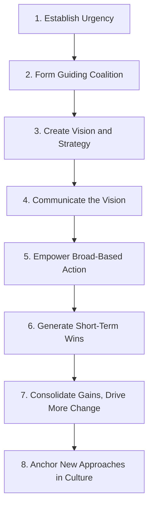

## Overcoming Strategic Implementation Barriers

### Overview

Overcoming strategic implementation barriers addresses the systematic obstacles that prevent well-formulated strategies from being successfully executed, and the corresponding diagnostic and intervention approaches used to address them. This topic synthesizes across the implementation challenges already examined individually (translation into action plans, structural alignment, resource allocation, cross-functional coordination) into an integrated framework for diagnosing why strategy execution stalls and systematically addressing the root causes, drawing substantially on research into the persistent gap between strategy formulation quality and realized strategic outcomes.

### Categorizing Implementation Barriers

**Key Points**

Implementation barriers are commonly organized into several overlapping categories, useful as a diagnostic checklist when an organization's strategy execution is underperforming relative to its strategic intent:

| Category | Description | Representative Symptoms |
| --- | --- | --- |
| **Structural barriers** | Organizational design misaligned with strategic requirements | Slow cross-functional decision-making, unclear accountability, coordination breakdowns |
| **Resource barriers** | Insufficient or misallocated capital, headcount, or capability investment | Strategic initiatives chronically underfunded relative to legacy spending |
| **Communication barriers** | Strategic intent not effectively understood at operational levels | Employees unable to articulate how their work connects to strategy; inconsistent understanding of priorities across levels |
| **Cultural and behavioral barriers** | Organizational culture, incentives, or ingrained behaviors working against the strategy's requirements | Resistance to change, incentive systems rewarding behaviors inconsistent with new strategic direction |
| **Leadership and governance barriers** | Insufficient senior management commitment, attention, or follow-through | Strategic reviews treated as compliance exercises; inconsistent leadership messaging; competing leadership priorities |
| **Capability barriers** | The organization lacks the skills, systems, or processes required to execute the chosen strategy | Skills gaps relative to strategic requirements; inadequate information systems to support new ways of working |

### Kotter's Eight-Step Change Model as an Implementation Framework

**Key Points**

John Kotter's eight-step model, introduced in his 1996 book *Leading Change* (building on his earlier *Harvard Business Review* research on why transformation efforts fail), remains one of the most widely applied frameworks for systematically addressing implementation barriers, particularly those involving significant organizational change.

1. **Establish a sense of urgency**: Build genuine organizational recognition that the status quo is untenable and change is necessary, countering complacency that undermines commitment to the effort required for successful execution.
2. **Form a powerful guiding coalition**: Assemble a group with sufficient positional authority, expertise, credibility, and leadership capability to lead the change effort, rather than relying on a single champion.
3. **Create a vision and strategy**: Develop a clear, compelling vision of the desired future state and the strategy for achieving it, providing direction for the many specific decisions implementation will require.
4. **Communicate the change vision**: Communicate the vision repeatedly, through multiple channels, and — critically — through leadership behavior consistent with the vision, since inconsistency between stated vision and observed leadership behavior undermines credibility faster than almost any other single factor.
5. **Empower broad-based action**: Remove structural barriers (misaligned systems, disempowering structures, resistant middle managers) that impede employees who want to act on the new vision.
6. **Generate short-term wins**: Deliberately plan and create visible, unambiguous early successes, which build momentum, provide evidence the strategy is working, and reward the effort of those driving implementation.
7. **Consolidate gains and produce more change**: Use the credibility from early wins to tackle more difficult structural, systems, and policy issues that have not yet been addressed, avoiding premature declaration of victory.
8. **Anchor new approaches in the culture**: Ensure new behaviors and approaches become embedded in organizational norms and succession practices, so they persist beyond the tenure of the specific leaders who drove the original change effort.

**Key Points**

[Inference] Kotter's research and subsequent practitioner experience suggests that skipping steps or moving through them too quickly (particularly failing to establish sufficient urgency in step 1, or failing to generate genuine short-term wins in step 6) is a common cause of implementation failure, since later steps depend on the organizational momentum and credibility the earlier steps are meant to establish — though the applicability of this strict sequential dependency likely varies depending on the specific type and scale of strategic change being implemented.

### Diagnosing Implementation Barriers: A Structured Approach

**Next Steps for Diagnosing Why Strategy Execution Is Underperforming**

1. **Assess structural fit**: Does the current organizational structure (per Chandler's structure-follows-strategy logic) genuinely support the strategy's coordination and accountability requirements, or has the strategy outgrown a legacy structure?
2. **Trace resource allocation against stated priorities**: Compare actual budget and headcount allocation to stated strategic priorities — does the pattern of spending reflect what the strategy says matters most, or does it continue to reflect historical/incremental patterns?
3. **Test line-of-sight at multiple organizational levels**: Interview or survey employees at various levels to assess whether they can articulate how their specific work connects to overall strategic objectives — poor line-of-sight indicates a communication or cascading breakdown.
4. **Examine incentive and performance management alignment**: Identify whether compensation, promotion criteria, and performance metrics reward behaviors consistent with the strategy, or whether they continue to reward legacy behaviors that work against the new strategic direction.
5. **Assess leadership consistency and visible commitment**: Evaluate whether senior leadership behavior (time allocation, decisions made under pressure, what gets discussed in leadership meetings) is genuinely consistent with stated strategic priorities, since inconsistency here undermines organizational trust in the strategy's seriousness.
6. **Identify specific capability gaps**: Determine whether the organization has the skills, systems, and processes the strategy requires, or whether capability investment (training, hiring, system implementation) has lagged behind strategic ambition.
7. **Review governance and cadence**: Assess whether a genuine, disciplined strategic review cadence exists (distinct from routine operational reporting) capable of detecting and correcting execution drift in a timely manner.

### Common Root Causes and Corresponding Interventions

| Root Cause | Corresponding Intervention |
| --- | --- |
| Structure misaligned with strategic coordination needs | Structural redesign (see Aligning Organizational Structure with Strategy); addition of integrator roles or cross-functional teams |
| Budget disconnected from strategic priority | Zero-based or activity-based budget review; separated strategic investment funding (see Resource Allocation and Strategic Budgeting) |
| Poor line-of-sight and communication gaps | Improved cascading discipline (Balanced Scorecard, OKRs, Hoshin Kanri catchball); more frequent, multi-channel leadership communication |
| Misaligned incentives rewarding legacy behavior | Redesign of performance metrics and compensation structures to reflect new strategic priorities |
| Insufficient leadership commitment/consistency | Executive coaching and accountability structures; explicit leadership behavior expectations tied to the change effort |
| Capability gaps (skills, systems) | Targeted training and hiring investment; phased system implementation aligned with capability-building timeline |
| Weak governance/review cadence | Establishment of dedicated strategic (not merely operational) review meetings with clear escalation triggers |
| Cultural resistance to change | Kotter-style change management approach emphasizing urgency, coalition-building, and early wins |

### Organizational Culture as an Implementation Barrier

**Key Points**

- Organizational culture — the shared values, norms, and unwritten rules governing behavior — can be a particularly persistent implementation barrier because it operates largely below the level of explicit awareness, making it resistant to direct top-down directive change (a theme also addressed by the "shared values" element at the center of the McKinsey 7S framework).
- **Cultural resistance often manifests as passive rather than active opposition**: employees may verbally endorse a new strategic direction while continuing established behavioral patterns, particularly where those established patterns are reinforced by existing incentive systems, social norms, or simply deeply ingrained habit.
- Effective approaches to cultural barriers generally combine **symbolic actions** (visible leadership behavior changes signaling genuine commitment), **structural changes** (incentive and process redesign that makes new behaviors the path of least resistance), and **narrative/communication efforts** (repeated, consistent explanation of why the change matters) — relying on any single lever alone (e.g., communication without structural reinforcement) tends to produce limited and often temporary behavioral change.

### The Role of Middle Management in Implementation

**Key Points**

- Middle managers occupy a structurally critical position in strategy execution: they are positioned to translate senior leadership's strategic intent into specific operational guidance for front-line employees, while simultaneously surfacing ground-level operational realities and constraints back up to senior leadership — a bidirectional role sometimes termed "sensemaking" and "sensegiving" in organizational behavior research.
- Middle managers can become either **implementation champions** (actively translating and reinforcing strategic direction) or **implementation barriers** (through passive resistance, ambiguous or watered-down communication of strategic intent to their teams, or continued reliance on legacy priorities), depending on factors including their perceived stake in the change, clarity of what is expected of them, and whether they were genuinely consulted (per Hoshin Kanri's catchball logic) rather than merely informed of decisions made without their input.
- [Inference] Organizations that invest specifically in middle-management engagement, training, and genuine two-way consultation during strategic planning and implementation tend to experience less implementation friction at this level than those that treat middle managers purely as a communication conduit for centrally-determined decisions, though isolating the precise magnitude of this effect from other contributing factors is difficult without controlled organizational comparison.

### Illustrative Diagram: Implementation Barrier Diagnostic Map (svg_diagram)

<svg xmlns="http://www.w3.org/2000/svg" viewBox="0 0 740 460">
<text x="370" y="30" text-anchor="middle" font-size="17" font-weight="bold" fill="#1a1a2e">Implementation Barrier Diagnostic Categories (svg_diagram)</text>
<circle cx="370" cy="230" r="70" fill="#e9c46a" stroke="#1a1a2e" stroke-width="2" />
<text x="370" y="225" text-anchor="middle" font-size="12" font-weight="bold" fill="#1a1a2e">Strategy</text>
<text x="370" y="242" text-anchor="middle" font-size="12" font-weight="bold" fill="#1a1a2e">Execution Gap</text>
<rect x="30" y="70" width="150" height="55" rx="6" fill="#264653" stroke="#1a1a2e" />
<text x="105" y="95" text-anchor="middle" font-size="10" fill="#fff" font-weight="bold">Structural</text>
<text x="105" y="111" text-anchor="middle" font-size="9" fill="#fff">Barriers</text>
<rect x="290" y="55" width="150" height="55" rx="6" fill="#e76f51" stroke="#1a1a2e" />
<text x="365" y="80" text-anchor="middle" font-size="10" fill="#fff" font-weight="bold">Resource</text>
<text x="365" y="96" text-anchor="middle" font-size="9" fill="#fff">Barriers</text>
<rect x="560" y="70" width="150" height="55" rx="6" fill="#2a9d8f" stroke="#1a1a2e" />
<text x="635" y="95" text-anchor="middle" font-size="10" fill="#fff" font-weight="bold">Communication</text>
<text x="635" y="111" text-anchor="middle" font-size="9" fill="#fff">Barriers</text>
<rect x="30" y="340" width="150" height="55" rx="6" fill="#8ab8b0" stroke="#1a1a2e" />
<text x="105" y="365" text-anchor="middle" font-size="10" fill="#1a1a2e" font-weight="bold">Cultural/</text>
<text x="105" y="381" text-anchor="middle" font-size="9" fill="#1a1a2e">Behavioral Barriers</text>
<rect x="290" y="360" width="150" height="55" rx="6" fill="#f4a261" stroke="#1a1a2e" />
<text x="365" y="385" text-anchor="middle" font-size="10" fill="#1a1a2e" font-weight="bold">Leadership/</text>
<text x="365" y="401" text-anchor="middle" font-size="9" fill="#1a1a2e">Governance Barriers</text>
<rect x="560" y="340" width="150" height="55" rx="6" fill="#e63946" stroke="#1a1a2e" />
<text x="635" y="365" text-anchor="middle" font-size="10" fill="#fff" font-weight="bold">Capability</text>
<text x="635" y="381" text-anchor="middle" font-size="9" fill="#fff">Barriers</text>
<path d="M180 100 L305 190" stroke="#333" stroke-width="1" />
<path d="M365 110 L370 160" stroke="#333" stroke-width="1" />
<path d="M560 100 L435 190" stroke="#333" stroke-width="1" />
<path d="M180 365 L305 270" stroke="#333" stroke-width="1" />
<path d="M365 360 L370 300" stroke="#333" stroke-width="1" />
<path d="M560 365 L435 270" stroke="#333" stroke-width="1" />
</svg>

### Worked Example: Diagnosing a Stalled Implementation

**Example**

A retail bank's strategic plan calls for a shift toward digital-first customer service, but eighteen months in, digital adoption metrics remain far below target. A structured diagnostic reveals a combination of barriers rather than a single cause:

- **Structural barrier**: Digital channel management sits within IT, disconnected from the branch network organization that still owns the primary customer relationship, creating unclear accountability for the digital transition's success.
- **Resource barrier**: The digital initiative's budget was approved but has been repeatedly tapped to cover cost overruns in unrelated legacy system maintenance, leaving the digital team under-resourced relative to plan.
- **Incentive barrier**: Branch staff compensation remains tied primarily to in-branch transaction volume, creating a direct incentive to encourage customers toward branch visits rather than digital self-service, directly undermining the stated strategic direction.
- **Leadership barrier**: Senior leadership discusses the digital strategy prominently in external communications but spends the majority of internal leadership meeting time on branch network performance issues, sending an inconsistent signal about actual priority.

Addressing the stalled implementation requires interventions across all four identified barriers simultaneously — restructuring accountability, protecting the digital budget, redesigning branch staff incentives, and shifting leadership's actual time allocation and internal messaging — rather than a single-point fix, since Kotter's model and the broader implementation literature suggest that addressing only one barrier while leaving others unaddressed typically yields limited overall improvement.

### Common Pitfalls in Addressing Implementation Barriers

**Key Points**

- **Treating implementation barriers as a single-cause problem** when multiple reinforcing barriers are typically present simultaneously, leading to interventions that address only part of the underlying issue and produce disappointing results.
- **Focusing exclusively on communication as the solution** ("we just need to communicate the strategy better") when the underlying barriers are actually structural or incentive-based, since better communication alone cannot overcome a genuine misalignment between stated strategy and the structures/incentives employees actually operate under.
- **Declaring victory after early wins** (skipping Kotter's step 7), allowing organizational attention and resources to drift back to legacy priorities before the more difficult structural and cultural changes required for lasting implementation have been completed.
- **Underestimating middle management's role**, treating implementation as purely a senior-leadership-to-front-line communication exercise while neglecting the critical translation and sensemaking function middle managers perform.
- **Insufficient diagnostic rigor before intervening**, applying generic change-management techniques without first identifying the specific combination of structural, resource, communication, cultural, leadership, and capability barriers actually present in the given organizational context.

### Conclusion

Overcoming strategic implementation barriers requires systematic diagnosis across multiple potential barrier categories — structural, resource, communication, cultural/behavioral, leadership/governance, and capability — since implementation failures typically result from a combination of reinforcing barriers rather than any single isolated cause. Established change management frameworks, particularly Kotter's eight-step model, provide a sequential discipline for building the organizational momentum and credibility required to address deeper structural and cultural barriers, while middle management's dual translation and sensemaking role represents a frequently underappreciated lever for either accelerating or obstructing implementation. Effective implementation ultimately requires coordinated intervention across structure, resources, incentives, communication, and leadership behavior simultaneously — addressing symptoms in only one dimension while leaving misalignment in others tends to produce limited and often temporary improvement in strategy execution outcomes.

**Related Topics**

- Kotter's Eight-Step Change Management Model in Depth
- Aligning Organizational Structure with Strategy
- Resource Allocation and Strategic Budgeting
- Cross-Functional Coordination for Execution
- Translating Strategy into Actionable Plans
- The McKinsey 7S Framework and Cultural Alignment
- Middle Management's Sensemaking and Sensegiving Roles
- Incentive Design and Performance Metric Alignment with Strategy