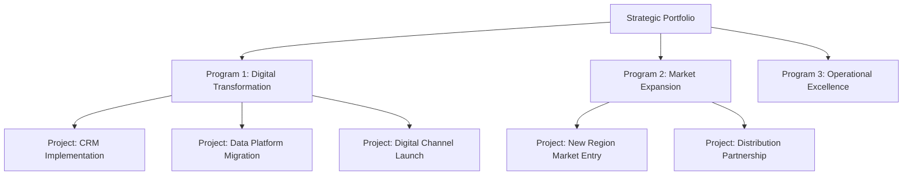
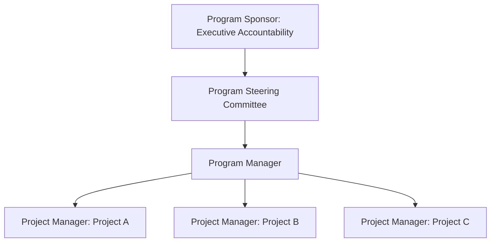

## Strategic Initiative and Program Management

### Overview

Strategic initiative and program management concerns the disciplines used to organize, execute, and govern the discrete programs and projects through which an organization's strategic objectives are actually realized. While strategic planning identifies *what* the organization needs to achieve, and translation frameworks (Balanced Scorecard cascading, OKRs) convert those objectives into measurable goals, strategic initiative and program management provides the operational machinery — portfolio structuring, program governance, resource sequencing, and progress tracking — through which specific initiatives are actually delivered. This discipline draws heavily on formal program and project management methodology (notably frameworks associated with the Project Management Institute, or PMI) applied specifically to strategy-driven, rather than purely operational or technical, initiatives.

### Distinguishing Projects, Programs, and Portfolios

**Key Points**

| Level | Definition | Strategic Role |
| --- | --- | --- |
| **Project** | A temporary endeavor with a defined scope, timeline, and deliverable, undertaken to create a specific output | The basic unit of execution — a single, bounded piece of work |
| **Program** | A group of related projects, sub-programs, and program activities managed in a coordinated way to obtain benefits not available from managing them individually | Delivers a specific strategic capability or outcome requiring multiple coordinated projects |
| **Portfolio** | A collection of projects, programs, and other work grouped together to facilitate effective management in meeting strategic business objectives | Represents the organization's entire strategic investment set, enabling prioritization and trade-off decisions across initiatives |

**Key Points**

- The critical distinction between program and simple multi-project management is the pursuit of **benefits not achievable by managing projects independently** — a program manager coordinates interdependencies, shared resources, and sequencing across component projects specifically to realize a strategic benefit that would be lost or diminished if each project were managed in isolation.
- **Portfolio management** operates at a higher altitude than individual program management, focused on selecting, prioritizing, and balancing the organization's overall set of strategic investments against available resources and strategic priority — directly connecting to the resource allocation and strategic budgeting processes discussed elsewhere in strategy implementation.

### Strategic Initiative Portfolio Structuring

**Next Steps for Structuring a Strategic Initiative Portfolio**

1. **Inventory candidate initiatives**: Compile all proposed and in-flight initiatives that claim to advance strategic objectives, including those emerging from business-unit proposals, executive mandates, and prior strategic planning cycles.
2. **Map each initiative to specific strategic objectives**: Require explicit linkage between each initiative and the strategic objective(s) it is intended to advance (connecting to the Balanced Scorecard or OKR structure established during strategy translation), surfacing initiatives with unclear or weak strategic justification.
3. **Assess interdependencies across initiatives**: Identify where initiatives share resources, depend on common enabling capabilities (e.g., a shared data platform multiple initiatives depend on), or would benefit from coordinated sequencing — the analysis that determines which individually-scoped projects should be grouped into a formal program.
4. **Apply prioritization criteria**: Score or rank initiatives using consistent criteria combining strategic-fit, expected value/return, risk, and resource requirements (methodologically similar to the QSPM approach used in strategy formulation, now applied to implementation-stage initiative selection).
5. **Balance the portfolio**: Consider the portfolio's overall risk profile, time horizon mix (near-term versus longer-term payoff initiatives), and resource concentration, avoiding over-investment in a single strategic theme at the expense of portfolio diversification appropriate to the organization's risk tolerance.
6. **Establish governance cadence**: Define the recurring review rhythm (see Governance section below) at which the portfolio's composition and individual initiative progress will be assessed and adjusted.

### Program Governance Structures

**Key Points**

- **Program sponsor**: A senior executive who holds ultimate accountability for the program's strategic value delivery, provides escalation authority for cross-functional conflicts, and ensures sustained organizational attention and resourcing.
- **Program manager**: The individual with day-to-day responsibility for coordinating the program's component projects, managing interdependencies, tracking aggregate progress, and surfacing risks or resource conflicts to the program sponsor and steering committee.
- **Program steering committee**: A cross-functional governance body, typically including representatives from each function or business unit materially affected by or contributing to the program, that reviews progress, resolves cross-functional trade-offs, and approves significant scope or resource changes.
- **Project managers** (for each component project within the program): Responsible for their specific project's execution, reporting progress and risks up to the program manager for aggregation and cross-project coordination.

### Initiative and Program Planning Artifacts

| Artifact | Purpose |
| --- | --- |
| **Program/initiative charter** | Establishes the initiative's strategic rationale, scope, sponsor, success criteria, and high-level timeline — the foundational authorization document |
| **Work breakdown structure (WBS)** | Decomposes the initiative into manageable, assignable work packages with clear ownership |
| **Roadmap/timeline (e.g., Gantt chart)** | Sequences work packages and milestones across the initiative's timeline, highlighting critical dependencies |
| **RACI matrix** | Clarifies who is Responsible, Accountable, Consulted, and Informed for each significant decision or deliverable, reducing accountability ambiguity |
| **Risk register** | Tracks identified risks, their likelihood and impact assessment, and mitigation or contingency plans |
| **Benefits realization plan** | Explicitly tracks the specific, measurable strategic benefits the initiative is intended to deliver and how/when they will be measured, distinguishing the initiative's *outputs* (deliverables produced) from its intended *outcomes* (strategic value realized) |

**Key Points**

- The **benefits realization plan** deserves particular emphasis in strategic (as opposed to purely operational) initiative management, since a common failure pattern is delivering an initiative's technical outputs on time and on budget (e.g., successfully implementing a new CRM system) without ever verifying whether the intended strategic outcome (e.g., improved customer retention) was actually achieved — the initiative can be judged a project management success while remaining a strategic failure.
- Benefits realization tracking typically continues **after** the formal project or program has technically concluded (post-implementation), since many strategic benefits (behavior change, market share shifts, retention improvements) manifest only over a longer time horizon than the implementation project itself.

### Governance Cadence and Reviews

**Key Points**

- **Portfolio-level reviews** (typically quarterly), assessing the aggregate strategic initiative portfolio's health, resource allocation balance, and whether the current initiative set still reflects current strategic priority as conditions evolve.
- **Program-level steering committee reviews** (typically monthly or aligned to major milestones), reviewing progress against the program's benefits realization plan, resolving escalated cross-project or cross-functional issues, and approving significant scope or timeline changes.
- **Project-level status reviews** (typically weekly or bi-weekly), tracking granular task-level progress, near-term risks, and immediate resource or coordination needs.
- **Stage-gate/kill-criteria checkpoints**: Pre-defined decision points at which a program or major initiative is formally reassessed against its original business case and strategic rationale, with explicit authority to pause, redirect, or terminate the initiative if it is underperforming relative to plan — a critical governance mechanism for avoiding escalation of commitment to failing initiatives.

### Illustrative Diagram: Initiative Governance Cadence (svg_diagram)

<svg xmlns="http://www.w3.org/2000/svg" viewBox="0 0 720 380">
<text x="360" y="30" text-anchor="middle" font-size="17" font-weight="bold" fill="#1a1a2e">Multi-Level Governance Cadence (svg_diagram)</text>
<rect x="40" y="60" width="640" height="60" rx="6" fill="#264653" stroke="#1a1a2e" />
<text x="360" y="85" text-anchor="middle" font-size="12" fill="#fff" font-weight="bold">Portfolio Review — Quarterly</text>
<text x="360" y="103" text-anchor="middle" font-size="10" fill="#fff">Strategic fit, resource balance, portfolio composition</text>
<rect x="40" y="150" width="640" height="60" rx="6" fill="#e76f51" stroke="#1a1a2e" />
<text x="360" y="175" text-anchor="middle" font-size="12" fill="#fff" font-weight="bold">Program Steering Committee — Monthly</text>
<text x="360" y="193" text-anchor="middle" font-size="10" fill="#fff">Benefits realization, cross-project escalations, scope changes</text>
<rect x="40" y="240" width="640" height="60" rx="6" fill="#2a9d8f" stroke="#1a1a2e" />
<text x="360" y="265" text-anchor="middle" font-size="12" fill="#fff" font-weight="bold">Project Status Review — Weekly/Bi-Weekly</text>
<text x="360" y="283" text-anchor="middle" font-size="10" fill="#fff">Task progress, near-term risks, immediate coordination needs</text>
<path d="M360 120 L360 150" stroke="#333" stroke-width="1.5" marker-end="url(#a6)" />
<path d="M360 210 L360 240" stroke="#333" stroke-width="1.5" marker-end="url(#a6)" />

<text x="360" y="330" text-anchor="middle" font-size="11" fill="#555" font-style="italic">Issues escalate upward; strategic direction and priority cascade downward</text>

</svg>

### Agile and Adaptive Approaches to Strategic Program Management

**Key Points**

- Traditional (often termed "waterfall") program management, with sequential phases and comprehensive upfront planning, is well suited to strategic initiatives with relatively stable, well-understood requirements and lower environmental uncertainty (Level 1-2 uncertainty).
- **Agile program management approaches** (drawing on agile software development principles, scaled to program level through frameworks such as the Scaled Agile Framework, SAFe, or Large-Scale Scrum, LeSS) are increasingly applied to strategic initiatives operating under higher uncertainty, emphasizing iterative delivery, frequent reprioritization, and rapid incorporation of learning and market feedback rather than committing to a comprehensive fixed plan upfront.
- **Hybrid approaches** are common in practice: some initiative components with well-understood requirements (e.g., a straightforward system migration) may be managed with traditional sequential methods, while components under higher genuine uncertainty (e.g., new product feature development for an unproven customer segment) are managed with agile, iterative methods within the same overall program structure.
- [Inference] The choice between traditional and agile program management approaches for a given strategic initiative likely should be informed by the same uncertainty-level diagnosis discussed under decision-making frameworks — initiatives facing Level 1-2 uncertainty (a clear-enough future or discrete alternate scenarios) may be well served by traditional planning discipline, while initiatives operating under Level 3-4 uncertainty likely benefit from more adaptive, iterative program structures — though the appropriate specific mix varies by initiative type and organizational context.

### Managing Interdependencies Across the Portfolio

**Key Points**

- **Shared resource conflicts**: Multiple programs or initiatives frequently compete for the same specialized resources (particular technical expertise, key executive attention, shared infrastructure capacity), requiring portfolio-level resource planning and prioritization rather than allowing each program to negotiate independently for the same constrained resources.
- **Enabling capability dependencies**: Some initiatives depend on foundational capabilities (a shared data platform, a common customer identity system) that must be delivered by a separate initiative before dependent initiatives can proceed — identifying and sequencing these dependencies at the portfolio level prevents downstream initiatives from being blocked by unaddressed upstream dependencies.
- **Strategic theme clustering**: Grouping related initiatives under common strategic themes (as discussed in strategy map construction) can help identify natural program boundaries and highlight where individually-proposed projects would benefit from coordinated program-level management rather than independent execution.

### Worked Example

**Example**

A healthcare services company's strategy calls for expanding into value-based care contracts, requiring a coordinated set of capabilities: a new care coordination technology platform, retrained clinical staff workflows, updated payer contracting capabilities, and a new patient engagement program. Rather than managing these as four independent projects reporting to four different functional leaders, the company establishes a formal **Value-Based Care Transformation Program**, with an executive sponsor (the Chief Strategy Officer), a dedicated program manager coordinating across the four component projects, and a cross-functional steering committee including clinical, IT, contracting, and patient experience leadership.

The program charter explicitly defines the benefits realization plan: not merely "implement the technology platform" (an output) but "achieve X% reduction in avoidable readmissions and Y% improvement in payer contract margin within 18 months of go-live" (outcomes). A portfolio-level dependency map identifies that the patient engagement program cannot fully launch until the care coordination platform reaches a specific data-integration milestone, informing the sequencing of the overall program timeline. Quarterly portfolio reviews assess this program alongside the company's other strategic initiatives, ensuring it receives resource priority commensurate with its strategic importance rather than competing on an ad hoc basis with lower-priority initiatives for the same specialized clinical informatics staff.

### Common Pitfalls

**Key Points**

- **Managing strategically interdependent projects as fully independent efforts**, missing coordination opportunities and risking one project's delays cascading unexpectedly into dependent projects with no program-level mechanism to anticipate or manage the interdependency.
- **Focusing governance exclusively on output delivery (on-time, on-budget) without tracking benefits realization**, allowing initiatives to be declared successful based on project management metrics alone while the underlying strategic outcome remains unverified or unachieved.
- **Absent or ceremonial stage-gate reviews**, where kill-criteria checkpoints exist on paper but are not genuinely enforced, allowing underperforming initiatives to continue consuming resources well past the point where a rigorous review would have redirected them.
- **Portfolio overload**: Approving more strategic initiatives than the organization's actual resource capacity (particularly scarce specialized talent and senior leadership attention) can genuinely support, resulting in universally under-resourced, slow-moving initiatives rather than a smaller number of well-resourced, faster-moving ones.
- **Applying rigid traditional program management discipline to genuinely high-uncertainty initiatives**, producing extensive upfront plans that become obsolete as soon as significant new information emerges, without the adaptive mechanisms needed to incorporate that learning efficiently.

### Conclusion

Strategic initiative and program management provides the operational architecture connecting strategic intent to delivered results, organized across the project, program, and portfolio levels to capture coordination benefits and enable resource prioritization that managing initiatives independently would not achieve. Effective practice requires rigorous governance structures (sponsor, program manager, steering committee) paired with clear planning artifacts, particularly a genuine benefits realization plan that tracks strategic outcomes rather than only project outputs, along with disciplined stage-gate review mechanisms empowered to redirect or terminate underperforming initiatives. Matching program management methodology — traditional, agile, or hybrid — to the genuine uncertainty level of each initiative, and managing cross-initiative interdependencies and resource conflicts at the portfolio level rather than allowing each program to compete independently, further determines whether an organization's strategic initiative portfolio translates efficiently into realized strategic value.

**Related Topics**

- Resource Allocation and Strategic Budgeting
- Translating Strategy into Actionable Plans
- Benefits Realization Management and Outcome Tracking
- Agile and Scaled Agile Frameworks (SAFe, LeSS) for Strategic Programs
- Stage-Gate Processes and Kill-Criteria Design
- Cross-Functional Coordination for Execution
- Decision-Making Under Uncertainty and Ambiguity (Methodology Selection)
- Portfolio Risk Balancing and Strategic Theme Clustering