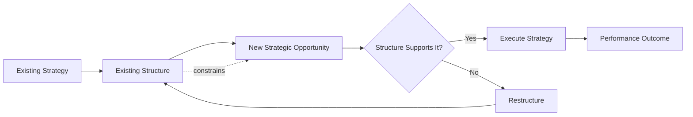

## Structural Forms and Strategic Fit

### Definition and Conceptual Overview

Structural fit refers to the degree of congruence between an organization's formal structure and its strategy, such that the structure enables efficient execution rather than constraining it. The foundational premise, originating from Alfred Chandler's historical research on American industrial enterprises, is captured in the maxim "structure follows strategy": as firms pursue new strategies (diversification, geographic expansion, vertical integration), their existing structures become inadequate, creating administrative strain that forces structural adaptation.

**Key Points**

- Strategic fit is not static; it must be continuously reassessed as strategy, scale, and environment evolve
- Misfit between structure and strategy manifests as slow decision-making, duplicated effort, unclear accountability, or lost market responsiveness
- No single structural form is universally superior — the correct choice is contingent on strategy type, firm size, diversity of operations, and environmental volatility

### Chandler's Structure-Strategy Thesis

Chandler's study of firms like DuPont, General Motors, Standard Oil, and Sears found a recurring pattern: growth strategies (volume expansion, geographic dispersion, vertical integration, product diversification) created coordination problems that centralized, functional structures could not handle, prompting a shift toward decentralized, multidivisional structures.

$$\text{Strategy Change} \rightarrow \text{Administrative Strain} \rightarrow \text{Structural Adaptation} \rightarrow \text{Improved Performance}$$

**[Inference]** This sequence is best understood as a recurring cyclical pattern rather than a one-time linear event, since subsequent strategic shifts (e.g., globalization, digital transformation) trigger further rounds of restructuring in mature firms.

### Core Structural Forms

#### 1. Simple Structure

Characteristic of small, owner-managed firms with a single or narrow product line. Decision-making is centralized in the owner/founder; there is little formal specialization or hierarchy.

- **Strategic Fit**: Best suited to single-business, focus, or niche strategies pursued by startups and small enterprises
- **Strengths**: Flexibility, fast decision-making, low overhead, direct accountability
- **Weaknesses**: Founder dependency, limited capacity to manage complexity or growth, succession risk

#### 2. Functional (Unitary/U-Form) Structure

Organizes activities by business function — marketing, operations, finance, R&D, HR — each headed by a functional specialist reporting to a central CEO.

- **Strategic Fit**: Ideal for firms pursuing a single-business or narrowly related-diversification strategy where economies of scale and functional expertise are the primary sources of competitive advantage
- **Strengths**: Deep functional expertise, economies of scale, clear career paths within functions, efficient resource utilization
- **Weaknesses**: Narrow functional perspectives ("silo thinking"), slow cross-functional coordination, difficulty managing diversified product lines, bottlenecks at the top for cross-functional decisions

#### 3. Multidivisional (M-Form) Structure

Organizes the firm into semi-autonomous divisions (by product, brand, or geography), each with its own functional units, operating largely as profit centers, with a corporate headquarters overseeing capital allocation, strategic control, and portfolio decisions.

- **Strategic Fit**: Suited to related and unrelated diversification strategies, where distinct businesses require differentiated strategies but shared corporate oversight
- **Strengths**: Clear accountability via divisional profit-and-loss responsibility, frees corporate management for strategic (rather than operational) decisions, facilitates internal capital allocation across businesses
- **Weaknesses**: Duplication of functional resources across divisions, potential for interdivisional rivalry, risk of corporate headquarters adding cost without adding value (parenting disadvantage)

#### 4. Holding Company (H-Form) Structure

A variant of the M-form with minimal corporate involvement in divisional operations; the parent functions primarily as a financial investor/owner of legally distinct, highly autonomous subsidiaries.

- **Strategic Fit**: Appropriate for unrelated diversification / conglomerate strategies where synergies across businesses are minimal and the corporate role is limited to capital allocation and portfolio management
- **Strengths**: Maximum divisional autonomy, minimal corporate overhead, risk isolation between subsidiaries
- **Weaknesses**: Limited synergy capture, weak strategic control, potential for capital misallocation absent rigorous parent oversight

#### 5. Matrix Structure

Overlays two (or more) structural dimensions — commonly function and product, or product and geography — such that employees report to two managers simultaneously (dual authority).

- **Strategic Fit**: Suited to firms pursuing strategies that require simultaneous responsiveness along multiple dimensions — e.g., global firms balancing product standardization with local responsiveness, or project-based firms (aerospace, consulting, construction)
- **Strengths**: Flexible resource sharing across projects/products, improved cross-functional communication, dual focus on efficiency and specialized outcomes
- **Weaknesses**: Dual-reporting confusion, power struggles between matrix managers, slower decision-making due to negotiated authority, higher administrative cost

#### 6. Divisional-by-Geography Structure

Organizes around geographic markets, each with substantial autonomy over local operations.

- **Strategic Fit**: Appropriate for multidomestic international strategies where local responsiveness (regulatory, cultural, consumer preference differences) outweighs the benefits of global standardization

#### 7. Network / Modular Structure

A loosely coupled structure in which a core firm coordinates a network of external partners, suppliers, and contractors, retaining only strategically critical activities in-house (e.g., brand management, design, R&D) while outsourcing others.

- **Strategic Fit**: Suited to strategies emphasizing flexibility, speed-to-market, and asset-light operations in volatile or fast-moving industries (e.g., fashion, electronics assembly)
- **Strengths**: Low fixed costs, scalability, access to specialized external capabilities
- **Weaknesses**: Coordination and quality-control complexity, dependency risk on partners, weaker control over proprietary knowledge

#### 8. Team-Based / Horizontal Structure

Minimizes vertical hierarchy in favor of self-managed, cross-functional teams organized around core processes or customer outcomes rather than functions.

- **Strategic Fit**: Appropriate for innovation-driven or customer-centric strategies requiring rapid cross-functional collaboration

### Comparative Summary Table

| Structural Form | Primary Strategic Fit | Coordination Mechanism | Key Risk |
| --- | --- | --- | --- |
| Simple | Single-business, focus | Direct supervision | Founder bottleneck |
| Functional (U-Form) | Single-business, related | Standardization of skills/processes | Silo thinking |
| Multidivisional (M-Form) | Related/unrelated diversification | Output/performance control | Duplication, rivalry |
| Holding Company (H-Form) | Unrelated diversification | Financial control only | Weak synergy capture |
| Matrix | Multi-dimensional strategy (global/product) | Mutual adjustment | Dual-authority conflict |
| Geographic Divisional | Multidomestic international | Local autonomy | Loss of global scale economies |
| Network/Modular | Flexibility, asset-light strategies | Contracts/relational governance | Partner dependency |
| Team-Based/Horizontal | Innovation, customer-centricity | Mutual adjustment among peers | Ambiguous accountability |

### Diagram: Structural Form Selection Logic (svg_diagram)

<svg xmlns="http://www.w3.org/2000/svg" viewBox="0 0 900 480" font-family="Arial, sans-serif">
<text x="450" y="30" text-anchor="middle" font-size="18" font-weight="bold">Structural Form Selection Logic (svg_diagram)</text>
<rect x="370" y="50" width="160" height="45" rx="8" fill="#dbeafe" stroke="#1e40af" />
<text x="450" y="77" text-anchor="middle" font-size="13">Diversification Level?</text>
<line x1="450" y1="95" x2="200" y2="150" stroke="#333" stroke-width="1.5" />
<text x="300" y="120" font-size="12">Single Business</text>
<line x1="450" y1="95" x2="450" y2="150" stroke="#333" stroke-width="1.5" />
<text x="460" y="120" font-size="12">Related</text>
<line x1="450" y1="95" x2="700" y2="150" stroke="#333" stroke-width="1.5" />
<text x="600" y="120" font-size="12">Unrelated</text>
<rect x="120" y="150" width="160" height="45" rx="8" fill="#dcfce7" stroke="#166534" />
<text x="200" y="177" text-anchor="middle" font-size="13">Firm Size?</text>
<rect x="370" y="150" width="160" height="45" rx="8" fill="#dcfce7" stroke="#166534" />
<text x="450" y="177" text-anchor="middle" font-size="13">Global Reach Needed?</text>
<rect x="620" y="150" width="160" height="45" rx="8" fill="#dcfce7" stroke="#166534" />
<text x="700" y="177" text-anchor="middle" font-size="13">Synergy Potential?</text>
<line x1="200" y1="195" x2="100" y2="250" stroke="#333" stroke-width="1.5" />
<text x="100" y="230" font-size="11">Small</text>
<rect x="30" y="250" width="140" height="45" rx="8" fill="#fef3c7" stroke="#92400e" />
<text x="100" y="277" text-anchor="middle" font-size="12">Simple Structure</text>
<line x1="200" y1="195" x2="280" y2="250" stroke="#333" stroke-width="1.5" />
<text x="260" y="230" font-size="11">Large</text>
<rect x="210" y="250" width="140" height="45" rx="8" fill="#fef3c7" stroke="#92400e" />
<text x="280" y="277" text-anchor="middle" font-size="12">Functional (U-Form)</text>
<line x1="450" y1="195" x2="400" y2="250" stroke="#333" stroke-width="1.5" />
<text x="380" y="230" font-size="11">Yes</text>
<rect x="330" y="250" width="140" height="45" rx="8" fill="#fef3c7" stroke="#92400e" />
<text x="400" y="277" text-anchor="middle" font-size="12">Matrix / Geographic</text>
<line x1="450" y1="195" x2="500" y2="250" stroke="#333" stroke-width="1.5" />
<text x="510" y="230" font-size="11">No</text>
<rect x="490" y="250" width="150" height="45" rx="8" fill="#fef3c7" stroke="#92400e" />
<text x="565" y="277" text-anchor="middle" font-size="12">Multidivisional (M-Form)</text>
<line x1="700" y1="195" x2="640" y2="250" stroke="#333" stroke-width="1.5" />
<text x="620" y="230" font-size="11">Low</text>
<rect x="580" y="250" width="150" height="45" rx="8" fill="#fef3c7" stroke="#92400e" />
<text x="655" y="277" text-anchor="middle" font-size="12">Holding Company (H-Form)</text>
<line x1="700" y1="195" x2="770" y2="250" stroke="#333" stroke-width="1.5" />
<text x="790" y="230" font-size="11">High</text>
<rect x="740" y="250" width="150" height="45" rx="8" fill="#fef3c7" stroke="#92400e" />
<text x="815" y="277" text-anchor="middle" font-size="12">Multidivisional (M-Form)</text>

<text x="450" y="340" text-anchor="middle" font-size="12" font-style="italic">Overlay consideration: strategies requiring speed/flexibility may favor Network or Team-Based forms regardless of the path above</text>

<rect x="300" y="360" width="300" height="45" rx="8" fill="`#ede9fe`" stroke="`#5b21b6`" />

<text x="450" y="387" text-anchor="middle" font-size="12">Network / Modular / Team-Based (cross-cutting option)</text>

</svg>

### Contingency Factors Beyond Diversification

Structural fit is not determined by strategy alone. Additional contingency variables include:

- **Environmental uncertainty**: High-velocity environments favor flatter, more organic structures (network, team-based); stable environments tolerate mechanistic, functional structures
- **Firm size**: Larger firms generally require greater formalization and specialization to manage complexity
- **Technology/task interdependence**: Pooled interdependence (divisions operate independently) fits M-form/H-form; sequential or reciprocal interdependence (heavy cross-unit coordination needed) favors matrix or team-based forms
- **International strategy type**: Global strategy (standardization) favors centralized product divisions; multidomestic strategy (local adaptation) favors geographic divisions; transnational strategy (simultaneous global efficiency and local responsiveness) favors matrix structures

### Structural Misfit: Symptoms and Consequences

**Example**

A conglomerate pursuing unrelated diversification but retaining a centralized functional structure typically experiences: corporate headquarters overwhelmed by operational decisions across unrelated businesses, slow response to industry-specific competitive threats, and unclear performance accountability since costs and revenues are not segregated by business line. The remedy consistent with structural-fit theory is decentralization into an M-form or H-form, granting divisional general managers full profit-and-loss authority.

**[Inference]** The speed and severity of misfit symptoms vary by industry clock-speed; firms in slow-moving industries may sustain a misaligned structure for years without material performance decline, while those in fast-moving industries face more immediate competitive consequences.

### Strategy-Structure-Performance Relationship

$$\text{Performance} = f(\text{Strategy}, \text{Structure}, \text{Fit}(\text{Strategy}, \text{Structure}))$$

Empirical research following Chandler (notably by Rumelt and others studying diversification-structure pairings) generally supports the proposition that firms exhibiting fit between diversification strategy and structural form outperform those with misfit, though the magnitude of the effect is moderated by industry and time period. **[Unverified]** Precise effect sizes vary considerably across studies and are sensitive to the performance metrics and time horizons used, so no single universal coefficient should be treated as definitive.

### Evolutionary View: Structure Also Shapes Strategy

While Chandler's thesis emphasizes strategy driving structure, later scholars (e.g., Hall & Saias) argued the relationship is reciprocal: an existing structure constrains which strategic options are administratively feasible, meaning structure can also shape or limit future strategy choices. This bidirectional view is important for strategists evaluating whether to pursue a strategy that current structural capabilities cannot support without prior redesign.

### Practical Diagnostic Checklist for Assessing Strategic Fit

- Does the current structure allow decisions to be made at the level closest to the relevant information?
- Are performance metrics and accountability aligned with how the structure segments the business?
- Does the structure duplicate resources unnecessarily, or conversely, force incompatible businesses to share resources inefficiently?
- Can the structure accommodate anticipated strategic moves (e.g., planned acquisitions, market entry) without a full redesign?
- Is the span of control and layer count appropriate for the coordination demands of the strategy?

**Next Steps**

- Organizational Life Cycle and Structural Evolution
- Centralization vs. Decentralization in Strategy Implementation
- Strategic Control Systems and Divisional Performance Metrics
- International Structural Configurations (Global, Multidomestic, Transnational)
- Mergers, Acquisitions, and Post-Merger Structural Integration
- Agile and Network Organizational Forms in Digital Strategy
- McKinsey 7-S Framework and Structure-Strategy-Systems Alignment