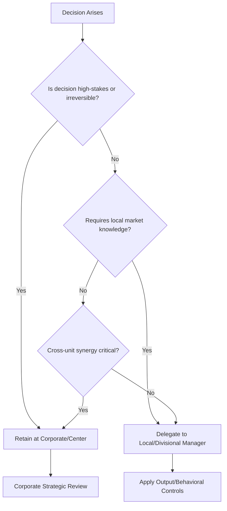

## Centralization versus Decentralization

### Definition and Conceptual Overview

Centralization and decentralization describe the locus of decision-making authority within an organizational hierarchy. Centralization concentrates decision rights at upper levels of management (typically corporate headquarters or senior executives); decentralization disperses decision rights downward to divisional managers, business units, or frontline employees closer to operational information and customers.

**Key Points**

- Centralization and decentralization exist on a continuum, not as a binary choice; most firms centralize some decisions (capital allocation, brand strategy) while decentralizing others (local pricing, hiring)
- The appropriate degree of decentralization is contingent on strategy, environmental volatility, organizational size, and the nature of the decisions involved
- Decentralization is distinct from divisionalization: a firm can be divisionalized (M-form) yet still centralize key decisions if corporate retains tight control over divisional budgets and strategy

### The Centralization-Decentralization Continuum

$$\text{Decision Authority Location} = f(\text{Decision Type}, \text{Information Location}, \text{Coordination Need}, \text{Environmental Volatility})$$

| Dimension | Highly Centralized | Highly Decentralized |
| --- | --- | --- |
| Decision speed at local level | Slow | Fast |
| Consistency across units | High | Low (variable by unit) |
| Responsiveness to local conditions | Low | High |
| Corporate control/oversight | High | Low |
| Managerial development at lower levels | Limited | Extensive |
| Risk of goal incongruence | Low | Higher (without controls) |
| Administrative overhead | Lower (fewer redundant staff) | Higher (duplicated functions) |

### Arguments for Centralization

- **Consistency and standardization**: Ensures uniform policies, brand standards, and quality control across the organization
- **Economies of scale**: Consolidates functions (e.g., procurement, IT, finance) to negotiate better terms and avoid duplication
- **Coordinated strategic direction**: Facilitates alignment of all units toward corporate-level objectives, particularly important when cross-unit synergies are strategically significant
- **Tighter financial and risk control**: Concentrates oversight of capital expenditure, debt issuance, and major risk exposures
- **Faster response to organization-wide crises**: A single point of authority can mobilize resources quickly during company-level emergencies

### Arguments for Decentralization

- **Faster local decision-making**: Managers closer to customers and operations can respond to market changes without waiting for approval up a long hierarchy
- **Improved motivation and accountability**: Granting authority alongside responsibility increases managerial engagement and ownership of outcomes
- **Better use of local knowledge**: Local managers typically possess superior information about local market conditions, customer preferences, and competitive dynamics
- **Management development**: Decentralized authority provides general management experience to a broader pool of managers, building leadership bench strength
- **Reduced burden on top management**: Frees senior executives to focus on strategic, rather than operational, decisions

### Contingency Factors Determining the Appropriate Degree

#### 1. Strategy Type

- Firms pursuing **related diversification** relying on shared resources and cross-business synergies tend to centralize more decisions to enforce coordination
- Firms pursuing **unrelated diversification** (conglomerate strategy) tend to decentralize operating decisions extensively, since businesses have little in common, retaining centralized control primarily over capital allocation

#### 2. Environmental Volatility

- Stable, predictable environments tolerate centralized decision-making since conditions change slowly
- Turbulent, fast-changing environments favor decentralization, since centralized approval processes cannot keep pace with the rate of required adaptation

#### 3. Organizational Size and Geographic Dispersion

- As firms grow and expand geographically, the informational and time burden of centralized decision-making increases, typically pushing organizations toward decentralization
- **[Inference]** This relationship is not strictly linear; very large firms sometimes recentralize specific functions (e.g., IT, procurement) even while remaining broadly decentralized, in order to recapture scale economies

#### 4. Competence and Reliability of Subordinate Managers

- Decentralization requires confidence in the judgment and capability of lower-level managers; firms with less mature management talent may centralize more heavily until managerial capability develops

#### 5. Importance and Risk of the Decision

- High-stakes, irreversible decisions (major capital investments, M&A, executive compensation) are typically retained at the center regardless of overall decentralization philosophy
- Routine, reversible, or low-risk decisions are natural candidates for delegation

### Diagram: Centralization-Decentralization Decision Framework (svg_diagram)

<svg xmlns="http://www.w3.org/2000/svg" viewBox="0 0 900 420" font-family="Arial, sans-serif">
<text x="450" y="30" text-anchor="middle" font-size="18" font-weight="bold">Centralization-Decentralization Decision Framework (svg_diagram)</text>
<line x1="80" y1="90" x2="820" y2="90" stroke="#333" stroke-width="2" />
<text x="80" y="75" font-size="13" font-weight="bold">Centralized</text>
<text x="740" y="75" font-size="13" font-weight="bold">Decentralized</text>
<circle cx="150" cy="90" r="6" fill="#1e40af" />
<text x="150" y="115" text-anchor="middle" font-size="11">Capital Budgeting</text>
<circle cx="280" cy="90" r="6" fill="#1e40af" />
<text x="280" y="115" text-anchor="middle" font-size="11">Brand/IP Strategy</text>
<circle cx="410" cy="90" r="6" fill="#166534" />
<text x="410" y="115" text-anchor="middle" font-size="11">IT Infrastructure</text>
<circle cx="540" cy="90" r="6" fill="#166534" />
<text x="540" y="115" text-anchor="middle" font-size="11">HR Policy</text>
<circle cx="670" cy="90" r="6" fill="#92400e" />
<text x="670" y="115" text-anchor="middle" font-size="11">Local Pricing</text>
<circle cx="790" cy="90" r="6" fill="#92400e" />
<text x="790" y="115" text-anchor="middle" font-size="11">Local Hiring</text>
<rect x="60" y="160" width="780" height="220" rx="10" fill="#f8fafc" stroke="#94a3b8" />
<text x="450" y="185" text-anchor="middle" font-size="13" font-weight="bold">Push Toward Centralization When:</text>
<text x="90" y="210" font-size="12">- Cross-unit synergies are strategically critical</text>
<text x="90" y="230" font-size="12">- Consistency/brand standards matter more than local variation</text>
<text x="90" y="250" font-size="12">- Decision risk/stakes are high and irreversible</text>
<text x="90" y="270" font-size="12">- Environment is stable and predictable</text>

<text x="450" y="305" text-anchor="middle" font-size="13" font-weight="bold">Push Toward Decentralization When:</text>

<text x="90" y="330" font-size="12">- Local market knowledge is critical to good decisions</text>

<text x="90" y="350" font-size="12">- Environment is volatile and requires fast local response</text>

<text x="90" y="370" font-size="12">- Businesses are unrelated with little synergy potential</text>

</svg>

### Mechanisms for Managing Decentralized Authority

Decentralization without control mechanisms risks goal incongruence — divisional managers optimizing local performance at the expense of overall corporate objectives. Common control mechanisms include:

- **Output/results controls**: Corporate sets performance targets (ROI, revenue growth) and evaluates managers on results rather than dictating methods
- **Behavioral controls**: Policies, standard operating procedures, and approval thresholds that constrain how decisions are made even when the decision itself is delegated
- **Cultural/clan controls**: Shared values and norms that guide decision-making without formal rules, relying on socialization rather than direct oversight
- **Transfer pricing systems**: Internal pricing mechanisms for goods/services exchanged between decentralized units, designed to align local incentives with corporate profitability

**Example**

A retail chain decentralizes inventory ordering and local promotional decisions to store managers (who have superior knowledge of local demand patterns) while centralizing supplier contracts, private-label branding, and IT systems at headquarters (to capture negotiating leverage and consistency). Store managers are evaluated against store-level profitability targets (output control), constrained by centrally mandated pricing floors (behavioral control).

### Centralization/Decentralization and Structural Form Interaction

| Structural Form | Typical Centralization Pattern |
| --- | --- |
| Functional (U-Form) | High centralization; cross-functional decisions naturally flow to the top |
| Multidivisional (M-Form) | Operating decisions decentralized to divisions; capital allocation/strategy centralized at corporate |
| Holding Company (H-Form) | Very high decentralization; corporate role limited to financial oversight |
| Matrix | Shared/negotiated authority; neither fully centralized nor decentralized |
| Network/Modular | Decentralized by design; core firm retains centralized control only over strategically critical activities |

### Common Pitfalls

- **Over-centralization**: Bottlenecks at the top, slow responsiveness, demotivated middle management, and loss of local market relevance
- **Over-decentralization without controls**: Fragmented strategy execution, inconsistent customer experience, duplicated overhead, and potential for divisional managers to pursue local optima that harm overall firm performance
- **Mismatched delegation**: Delegating authority without corresponding accountability (or vice versa) undermines both motivation and control
- **Static configuration**: Failing to revisit the centralization balance as strategy, environment, or organizational maturity changes

**[Inference]** Organizations experiencing rapid growth or entering more volatile markets often need to periodically shift the balance toward decentralization, while organizations pursuing greater integration or facing margin pressure may cyclically recentralize support functions to capture cost synergies; the specific timing and magnitude of such shifts vary by firm and cannot be generalized as a fixed rule.

### Practical Diagnostic Questions

- Which decisions genuinely require information that is only available locally?
- Which decisions carry firm-wide risk or strategic significance that justifies retaining control at the top?
- Are the control systems (metrics, incentives, reporting) in place to prevent decentralized decision rights from producing goal incongruence?
- Does the current balance align with the firm's diversification strategy (related vs. unrelated) and competitive environment?

**Next Steps**

- Structural Forms and Strategic Fit
- Strategic Control Systems and Performance Metrics
- Transfer Pricing and Divisional Incentive Alignment
- Organizational Culture as an Informal Control Mechanism
- Span of Control and Managerial Hierarchy Design
- Delegation, Empowerment, and Middle Management Roles in Strategy Execution