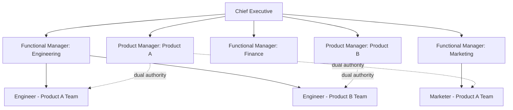
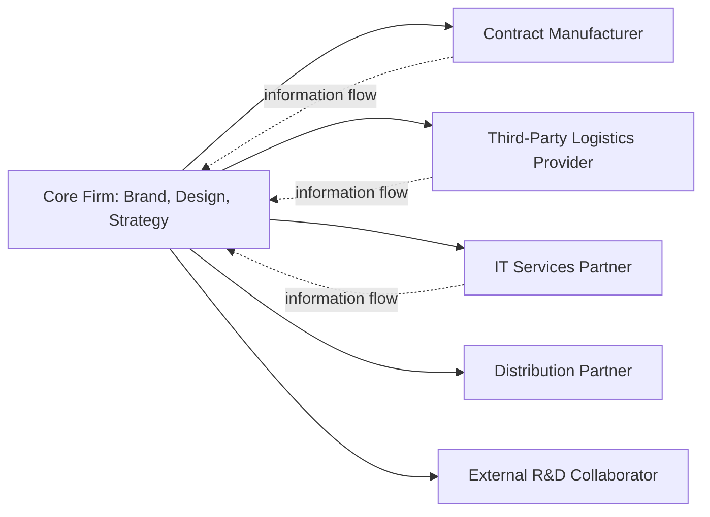

## Matrix and Network Organizational Structures

### Definition and Conceptual Overview

Matrix and network structures represent two distinct departures from traditional unitary hierarchies, each designed to address coordination demands that functional, divisional, or simple structures cannot efficiently handle. The matrix structure overlays multiple reporting dimensions (typically function and product, or product and geography) to create dual authority. The network structure disaggregates the value chain across a core firm and a set of external partners, coordinated through relational and contractual mechanisms rather than internal hierarchy.

**Key Points**

- Matrix structures address the need for simultaneous responsiveness along two or more strategic dimensions
- Network structures address the need for flexibility, speed, and asset-light operations by outsourcing non-core activities
- Both structures trade hierarchical clarity for a different form of coordination capability, and both impose distinctive managerial and control challenges

### Matrix Structure

#### Architecture

A matrix structure creates two (or occasionally three) simultaneous lines of authority. The most common form combines functional managers (who control specialist resources — engineering, marketing, finance) with product or project managers (who control strategic priorities for a specific product line, project, or geography). Employees report to both.

#### Variants of Matrix Structure

- **Weak/Functional Matrix**: Functional managers retain primary authority; product/project managers act mainly as coordinators with limited formal power
- **Balanced Matrix**: Functional and product managers hold roughly equal authority over shared staff
- **Strong/Project Matrix**: Product or project managers hold primary authority, with functional managers serving a resource-provisioning role

#### Strategic Fit

- Global firms pursuing a **transnational strategy** that requires simultaneous global efficiency (functional/product standardization) and local responsiveness (geographic adaptation)
- Project-based industries (aerospace, engineering/construction, consulting, film production) where specialized functional talent must be flexibly reallocated across concurrent projects
- Firms with multiple product lines that must share scarce, specialized functional resources (e.g., R&D scientists shared across drug development programs in pharmaceuticals)

#### Strengths

- Efficient use of specialized resources across multiple products/projects without duplicating functional departments in each line
- Improved cross-functional communication and integration of diverse expertise on a single deliverable
- Flexibility to reallocate talent as project or product priorities shift
- Simultaneous focus on two strategically important dimensions rather than sacrificing one for the other

#### Weaknesses

- **Dual-authority conflict**: Employees receiving conflicting priorities or directives from two bosses face role ambiguity and stress
- **Slower decision-making**: Decisions often require negotiation between functional and product managers, adding time and administrative overhead
- **Power struggles**: Ambiguous authority boundaries can generate persistent political conflict between the two management lines
- **Higher coordination cost**: Requires more meetings, liaison roles, and formal integration mechanisms than single-authority structures

**[Inference]** The severity of dual-authority conflict in practice depends heavily on organizational culture and the clarity with which the firm defines which manager has final say on which categories of decisions (e.g., functional manager owns technical standards, product manager owns deadlines and budget); firms that fail to specify this division typically report more matrix dysfunction than those that do.

### Diagram: Matrix Structure Authority Overlay (svg_diagram)

<svg xmlns="http://www.w3.org/2000/svg" viewBox="0 0 800 400" font-family="Arial, sans-serif">
<text x="400" y="30" text-anchor="middle" font-size="18" font-weight="bold">Matrix Structure Authority Overlay (svg_diagram)</text>
<rect x="50" y="70" width="700" height="40" fill="#dbeafe" stroke="#1e40af" />
<text x="400" y="95" text-anchor="middle" font-size="13">Functional Dimension (Engineering / Marketing / Finance)</text>
<rect x="50" y="130" width="700" height="220" fill="none" stroke="#94a3b8" stroke-dasharray="4" />
<rect x="70" y="150" width="180" height="35" fill="#f1f5f9" stroke="#334155" />
<text x="160" y="172" text-anchor="middle" font-size="11">Engineer (Product A)</text>
<rect x="270" y="150" width="180" height="35" fill="#f1f5f9" stroke="#334155" />
<text x="360" y="172" text-anchor="middle" font-size="11">Marketer (Product A)</text>
<rect x="470" y="150" width="180" height="35" fill="#f1f5f9" stroke="#334155" />
<text x="560" y="172" text-anchor="middle" font-size="11">Analyst (Product A)</text>
<rect x="70" y="220" width="180" height="35" fill="#f1f5f9" stroke="#334155" />
<text x="160" y="242" text-anchor="middle" font-size="11">Engineer (Product B)</text>
<rect x="270" y="220" width="180" height="35" fill="#f1f5f9" stroke="#334155" />
<text x="360" y="242" text-anchor="middle" font-size="11">Marketer (Product B)</text>
<rect x="470" y="220" width="180" height="35" fill="#f1f5f9" stroke="#334155" />
<text x="560" y="242" text-anchor="middle" font-size="11">Analyst (Product B)</text>
<rect x="670" y="130" width="90" height="125" fill="#dcfce7" stroke="#166534" />
<text x="715" y="195" text-anchor="middle" font-size="11" transform="rotate(90 715 195)">Product A Line</text>
<rect x="670" y="260" width="90" height="90" fill="#dcfce7" stroke="#166534" />
<text x="715" y="240" text-anchor="middle" font-size="11">Product B Manager</text>

<text x="400" y="380" text-anchor="middle" font-size="11" font-style="italic">Each staff cell reports both vertically (function) and horizontally (product line)</text>

</svg>

### Network Structure

#### Architecture

A network (or modular/virtual) structure retains a small core organization performing strategically critical activities — brand management, product design, strategic planning, key customer relationships — while outsourcing other value-chain activities (manufacturing, logistics, customer service, IT operations) to a network of external partners coordinated through contracts, relational governance, and information systems.

#### Types of Network Structures

- **Internal Network**: Business units within a single firm act as internal market participants, buying and selling to each other at market-based transfer prices, mimicking external market discipline within firm boundaries
- **Stable Network**: A core firm maintains long-term relationships with a limited, consistent set of partner firms (common in automotive and aerospace supply chains)
- **Dynamic Network**: A core firm assembles and disassembles partner relationships flexibly on a project-by-project or product-cycle basis (common in fashion, entertainment/film production, and fast-fashion apparel)

#### Strategic Fit

- Industries with rapid product cycles or high demand volatility, where owning fixed manufacturing capacity would create excess risk and cost inflexibility
- Strategies emphasizing speed-to-market and asset-light operations, allowing capital to be redirected toward core differentiating capabilities (design, brand, innovation)
- Global sourcing strategies that exploit cost or capability advantages distributed across multiple countries

#### Strengths

- Low fixed costs and capital intensity; the firm avoids owning underutilized assets
- Scalability — capacity can be added or shed by adjusting partner contracts rather than building or closing facilities
- Access to specialized external capabilities without the cost of developing them internally
- Faster response to demand shifts, since partners can be reallocated across product lines

#### Weaknesses

- **Coordination complexity**: Requires sophisticated information systems and contract management to synchronize activities across independent firms
- **Quality control risk**: The core firm has less direct oversight over processes conducted by external partners, elevating the risk of quality lapses reflecting on the core brand
- **Dependency and opportunism risk**: Reliance on external partners exposes the firm to supply disruption, and partners may behave opportunistically absent strong relational or contractual safeguards
- **Erosion of proprietary knowledge**: Sharing technical specifications with external manufacturers can create risk of knowledge leakage or the emergence of competing capacity

**Example**

A fashion apparel company retains design, brand management, and merchandising in-house (core, strategically critical activities) while contracting fabric sourcing, garment manufacturing, and distribution to a network of external partners across multiple countries. This allows the firm to change seasonal collections rapidly without owning factories, but requires robust supplier quality audits and contractual lead-time guarantees to manage the coordination and quality risks inherent in the network model.

### Comparative Analysis

| Dimension | Matrix Structure | Network Structure |
| --- | --- | --- |
| Boundary | Entirely internal to the firm | Spans firm boundaries (core + external partners) |
| Authority mechanism | Dual formal reporting lines | Contracts and relational governance (no formal hierarchy over partners) |
| Primary strategic driver | Multi-dimensional responsiveness (e.g., global + local) | Flexibility, cost reduction, speed-to-market |
| Coordination cost driver | Negotiation between co-equal internal managers | Information/monitoring systems across independent firms |
| Key risk | Role ambiguity, power conflict | Partner dependency, quality control, IP leakage |
| Typical industries | Aerospace, consulting, global consumer goods | Apparel/fashion, electronics assembly, media/entertainment |

### Governance and Integration Mechanisms

For **matrix structures**, common integration mechanisms include:

- Explicit decision charters specifying which manager has final authority over which decision categories
- Dual performance evaluation, incorporating input from both functional and product managers
- Liaison roles or program management offices (PMOs) to mediate cross-line conflicts

For **network structures**, common governance mechanisms include:

- Service-level agreements (SLAs) with defined quality, cost, and delivery metrics
- Relational contracts supplemented by trust-building mechanisms (long-term partnerships, joint investment)
- Real-time information sharing platforms (e.g., shared ERP/EDI systems) to synchronize inventory, production schedules, and demand forecasts across the network

### Related Hybrid Forms

**[Inference]** Many contemporary organizations combine elements of both structures — for instance, a firm may use an internal matrix to coordinate global product lines and regional markets, while simultaneously operating a network of external manufacturing partners for production — since the two structural logics address different coordination problems (internal multi-dimensionality versus external value-chain flexibility) and are not mutually exclusive.

### Practical Diagnostic Questions

- Does the strategy require simultaneous excellence along two or more organizational dimensions that a single hierarchy cannot capture (candidate for matrix)?
- Are there value-chain activities that are not sources of competitive differentiation and could be performed more flexibly or cost-effectively by external partners (candidate for network)?
- Does the firm have the managerial capability and cultural tolerance to manage dual-authority conflict (matrix) or partner governance complexity (network)?
- What information systems and contractual safeguards are needed to make the chosen structure function without excessive coordination failure?

**Related Topics**

- Structural Forms and Strategic Fit
- Centralization versus Decentralization
- Strategic Alliances and Joint Venture Governance
- Outsourcing and Vertical Integration Decisions
- Global Strategy: Standardization versus Local Responsiveness
- Supply Chain Coordination and Transaction Cost Economics
- Project Management Offices (PMOs) and Cross-Functional Integration