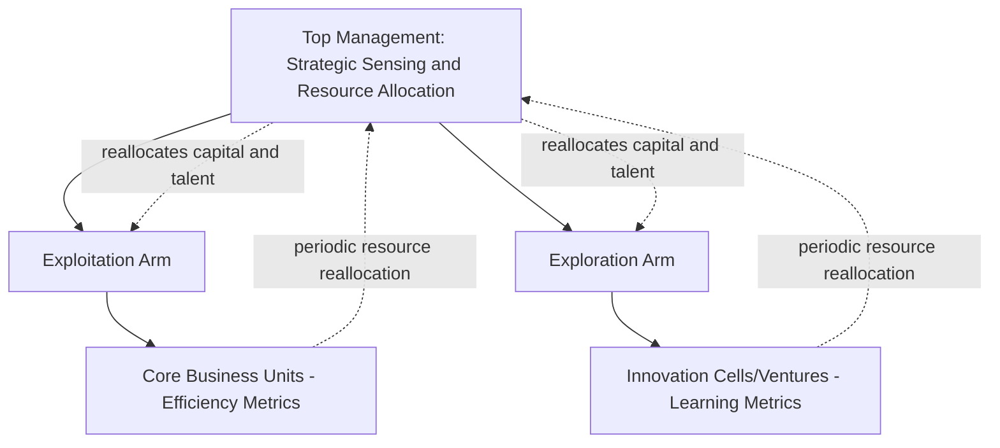

## Organizational Design for Strategic Agility

### Definition and Conceptual Overview

Strategic agility refers to an organization's capacity to sense changes in its competitive environment rapidly and to reconfigure resources, capabilities, and strategy in response, without being paralyzed by structural rigidity. Organizational design for agility concerns the structural, process, and cultural choices that enable this rapid sensing-and-reconfiguration capacity, as distinct from static efficiency-oriented designs optimized for stable environments.

**Key Points**

- Agility is a dynamic capability, not a fixed structural form; it concerns the organization's capacity for reconfiguration over time
- Traditional efficiency-oriented structures (deep hierarchy, high formalization, narrow spans of control) tend to trade agility for predictability and cost control
- Agile design typically combines a stable "backbone" (core capabilities, shared platforms, common identity) with flexible, reconfigurable elements (teams, resource allocation, decision rights) — a pattern often termed "ambidextrous" design

### Strategic Agility: Component Capabilities

Scholarship on strategic agility (notably associated with Yves Doz and Mikko Kosonen) typically decomposes it into three interrelated capabilities:

1. **Strategic sensitivity**: The capacity to perceive and interpret weak signals of environmental change (emerging competitors, shifting customer needs, technological discontinuities) before they become obvious
2. **Leadership unity/collective commitment**: The capacity of top management to make fast, high-quality collective decisions and commit organizational resources without protracted internal negotiation
3. **Resource fluidity**: The capacity to reallocate capital, talent, and other resources quickly across business units in response to changing priorities, rather than resources being permanently "owned" by fixed organizational silos

$$\text{Strategic Agility} = f(\text{Sensitivity}, \text{Leadership Unity}, \text{Resource Fluidity})$$

**[Inference]** These three capabilities are mutually reinforcing rather than independent; an organization with high resource fluidity but weak strategic sensitivity may reallocate resources quickly but toward the wrong priorities, suggesting that agility initiatives focused on only one dimension tend to underperform those addressing all three together.

### Structural Design Principles for Agility

#### 1. Modular / Cellular Structures

Organizing around small, semi-autonomous units (cells, squads, or pods) with end-to-end responsibility for a product, customer segment, or outcome, rather than functionally siloed departments. Modules can be recombined, added, or dissolved as strategic priorities shift, analogous to reconfigurable building blocks.

#### 2. Flatter Hierarchies and Wider Spans of Control

Reducing the number of vertical layers between frontline decision-makers and top management shortens information transmission time and reduces the number of approval gates a decision must pass through, directly increasing decision velocity.

#### 3. Dynamic Resource Allocation Processes

Replacing fixed annual budgeting cycles (which lock in resource commitments for 12+ months) with rolling or continuous resource allocation processes that allow capital and talent to shift toward emerging opportunities more frequently.

#### 4. Dual/Ambidextrous Operating Models

Maintaining a structural or process-level distinction between:

- **Exploitation units**: Optimized for efficiency, reliability, and incremental improvement of the current core business
- **Exploration units**: Optimized for experimentation, rapid iteration, and pursuit of new/uncertain opportunities, often insulated from the performance metrics and cultural norms of the core business

This separation (structural ambidexterity) allows an organization to pursue efficiency and innovation simultaneously without one logic crowding out the other.

#### 5. Cross-Functional, Autonomous Teams

Empowering small, cross-functional teams with the authority to make decisions within defined boundaries, reducing dependency on cross-departmental coordination for routine execution decisions. This design principle underlies many "agile" methodologies borrowed from software development (e.g., squads, tribes, chapters in scaled-agile organizational models) and applied more broadly to non-technology functions.

#### 6. Networked/Platform-Based Coordination

Using shared digital platforms, common data infrastructure, and standardized interfaces between units to allow rapid recombination of capabilities without requiring formal restructuring every time priorities shift.

### Diagram: Agile Organizational Design Levers (svg_diagram)

<svg xmlns="http://www.w3.org/2000/svg" viewBox="0 0 900 460" font-family="Arial, sans-serif">
<text x="450" y="30" text-anchor="middle" font-size="18" font-weight="bold">Agile Organizational Design Levers (svg_diagram)</text>
<circle cx="450" cy="230" r="70" fill="#dbeafe" stroke="#1e40af" stroke-width="2" />
<text x="450" y="225" text-anchor="middle" font-size="13" font-weight="bold">Strategic</text>
<text x="450" y="243" text-anchor="middle" font-size="13" font-weight="bold">Agility</text>
<line x1="450" y1="160" x2="450" y2="90" stroke="#333" />
<rect x="360" y="50" width="180" height="40" rx="6" fill="#dcfce7" stroke="#166534" />
<text x="450" y="75" text-anchor="middle" font-size="12">Modular/Cellular Units</text>
<line x1="510" y1="185" x2="620" y2="110" stroke="#333" />
<rect x="600" y="80" width="200" height="40" rx="6" fill="#dcfce7" stroke="#166534" />
<text x="700" y="105" text-anchor="middle" font-size="12">Flatter Hierarchy/Wider Span</text>
<line x1="520" y1="230" x2="650" y2="230" stroke="#333" />
<rect x="650" y="210" width="200" height="40" rx="6" fill="#dcfce7" stroke="#166534" />
<text x="750" y="235" text-anchor="middle" font-size="12">Dynamic Resource Allocation</text>
<line x1="510" y1="275" x2="620" y2="350" stroke="#333" />
<rect x="600" y="350" width="200" height="40" rx="6" fill="#dcfce7" stroke="#166534" />
<text x="700" y="375" text-anchor="middle" font-size="12">Ambidextrous Operating Model</text>
<line x1="450" y1="300" x2="450" y2="380" stroke="#333" />
<rect x="360" y="380" width="180" height="40" rx="6" fill="#dcfce7" stroke="#166534" />
<text x="450" y="405" text-anchor="middle" font-size="12">Autonomous Cross-Fn Teams</text>
<line x1="390" y1="260" x2="270" y2="330" stroke="#333" />
<rect x="70" y="330" width="200" height="40" rx="6" fill="#dcfce7" stroke="#166534" />
<text x="170" y="355" text-anchor="middle" font-size="12">Platform-Based Coordination</text>
<line x1="390" y1="200" x2="270" y2="130" stroke="#333" />
<rect x="70" y="90" width="200" height="40" rx="6" fill="#dcfce7" stroke="#166534" />
<text x="170" y="115" text-anchor="middle" font-size="12">Strategic Sensing Mechanisms</text>
</svg>

### Process-Level Enablers

- **Rolling strategic planning**: Shorter, more frequent strategic review cycles (e.g., quarterly strategic check-ins) replacing rigid annual planning, allowing faster course correction
- **Fast-cycle experimentation**: Structured processes (e.g., minimum viable product testing, staged-gate funding tied to learning milestones) that allow the organization to test strategic bets cheaply before committing full resources
- **Distributed decision rights**: Explicit delegation of specific decision categories to lower organizational levels, paired with clear escalation criteria for higher-stakes decisions (avoiding pure decentralization without guardrails)
- **Continuous environmental scanning**: Formal mechanisms (competitive intelligence functions, customer feedback loops, scenario planning exercises) that feed weak signals into strategic decision-making processes on an ongoing basis

### Cultural and Leadership Enablers

- **Psychological safety**: Team environments where members can raise concerns, admit uncertainty, or challenge existing plans without fear of punitive consequences, which is necessary for rapid learning and course correction
- **Tolerance for productive failure**: Distinguishing between failures from poor execution (to be corrected) and failures from well-reasoned experimentation (to be treated as valuable learning), rather than uniformly punishing all failure
- **Leadership unity on strategic priorities**: Top management teams that can reach fast, aligned decisions reduce the delay agility initiatives often encounter at the most senior level, even when lower levels of the organization are structurally agile

### Trade-offs and Limitations of Agile Design

**Example**

A firm redesigning around autonomous cross-functional squads may achieve faster local decision-making and higher team engagement, but risks losing economies of scale in shared functions (e.g., duplicated marketing or engineering effort across squads) and can face difficulty maintaining consistent customer experience or brand standards across autonomous units. The common resolution is a **bimodal or tiered agile design**: fully agile squads for customer-facing/innovation activities, paired with more standardized, centrally coordinated shared services for scale-dependent back-office functions.

**[Inference]** The optimal balance between agility and efficiency is highly firm- and industry-specific; capital-intensive, safety-regulated industries (e.g., utilities, pharmaceuticals manufacturing) generally sustain a narrower scope for structural agility than software or digital-services firms, given the higher cost and risk associated with rapid reconfiguration in physical-asset-intensive or heavily regulated operations.

### Agility versus Traditional Efficiency-Oriented Design

| Dimension | Efficiency-Oriented Design | Agility-Oriented Design |
| --- | --- | --- |
| Hierarchy depth | Deep, many layers | Flat, few layers |
| Resource allocation | Annual, fixed budgets | Rolling, dynamic reallocation |
| Decision rights | Concentrated, formal approval chains | Distributed, bounded autonomy |
| Team structure | Functional silos | Cross-functional, modular teams |
| Planning horizon | Long, infrequent revision | Short cycles, frequent revision |
| Primary optimization goal | Cost, consistency, predictability | Speed, adaptability, learning |
| Risk tolerance | Low tolerance for deviation from plan | Structured tolerance for experimentation |

### Assessing Organizational Agility Readiness

A practical diagnostic considers:

- **Sensing capacity**: Does the organization have functioning mechanisms to detect early signals of strategic change (competitive intelligence, customer analytics, scenario planning)?
- **Decision velocity**: How many approval layers must a typical strategic decision pass through, and how long does this take relative to competitors?
- **Resource mobility**: Can capital and talent be reallocated across business units within a quarter, or are they effectively locked in for a full budget year?
- **Cultural readiness**: Does the organization's incentive and performance evaluation system tolerate well-reasoned failure, or does it uniformly punish any deviation from plan?

$$\text{Decision Velocity} \propto \frac{1}{\text{Number of Approval Layers} \times \text{Average Layer Response Time}}$$

**[Unverified]** While this relationship directionally holds (fewer layers and faster individual response times generally increase decision velocity), the specific functional form and magnitude of the relationship will vary by organization and decision type, and should not be treated as a precise predictive formula.

### Practical Diagnostic Questions

- Which parts of the organization require efficiency and predictability (candidates for a more traditional design), and which require speed and adaptability (candidates for agile redesign)?
- Are resource allocation processes rigid enough to prevent the organization from responding to a strategically significant environmental shift within an acceptable time frame?
- Does the organization's culture support fast, aligned senior decision-making, or does strategic agility stall at the top despite structural flexibility lower down?
- What structural mechanisms exist to prevent modular, autonomous units from fragmenting brand consistency, quality standards, or economies of scale?

**Next Steps**

- Structural Forms and Strategic Fit
- Centralization versus Decentralization
- Matrix and Network Organizational Structures
- Organizational Ambidexterity: Balancing Exploration and Exploitation
- Dynamic Capabilities and Strategic Renewal
- Agile Methodologies Applied to Non-Software Organizational Functions
- Resource Allocation Processes and Strategic Planning Cycles