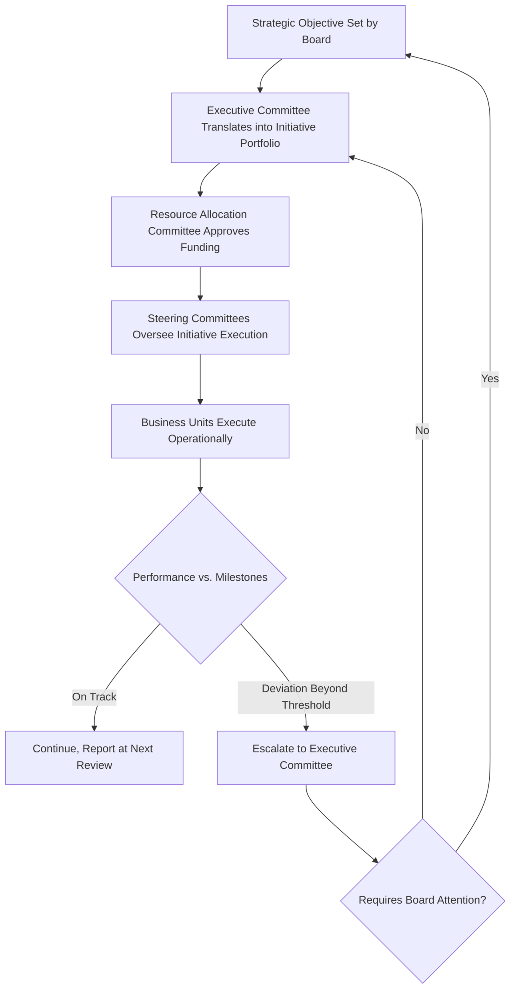

## Governance Structures for Strategy Execution

### Definition and Conceptual Overview

Governance structures for strategy execution refer to the formal bodies, decision rights, oversight mechanisms, and accountability systems through which an organization translates approved strategy into monitored, controlled action. Governance in this context sits above day-to-day organizational structure: it defines who approves strategic decisions, who monitors execution progress, who is accountable for results, and what escalation paths exist when execution deviates from plan.

**Key Points**

- Governance structures answer "who decides, who oversees, and who is accountable" for strategy, distinct from organizational structure, which answers "who reports to whom operationally"
- Effective governance closes the strategy-execution gap by embedding regular review cadences, clear decision rights, and performance accountability directly into organizational processes
- Governance spans multiple levels: board-level oversight, executive-level strategic management, and operational-level performance management, each with distinct roles

### Levels of Strategic Governance

#### 1. Board of Directors Level

The board holds ultimate fiduciary oversight of corporate strategy, typically discharged through:

- **Strategy approval**: Reviewing and approving major strategic initiatives, acquisitions, and capital allocation decisions proposed by executive management
- **Risk oversight**: Ensuring strategic risks (competitive, financial, regulatory, reputational) are identified and managed within acceptable tolerances
- **CEO/executive performance oversight**: Evaluating executive leadership against strategic objectives and adjusting incentive compensation accordingly
- **Committee structures**: Specialized board committees (audit, compensation, risk, nominating/governance, and increasingly technology or sustainability committees) that provide focused oversight of specific strategic dimensions

#### 2. Executive/C-Suite Level

Senior executives translate board-approved strategy into an executable strategic plan and are accountable for organization-wide execution, typically through:

- **Executive/strategy committees**: Cross-functional senior leadership forums that meet regularly (monthly or quarterly) to review strategic initiative progress, resolve cross-functional resource conflicts, and make course corrections
- **Strategy/PMO (Program Management Office) functions**: Dedicated teams responsible for tracking strategic initiative portfolios, standardizing reporting formats, and surfacing execution risks to senior leadership
- **Resource allocation committees**: Bodies (sometimes called investment committees or capital allocation committees) that govern how capital and talent are assigned across competing strategic priorities

#### 3. Business Unit/Divisional Level

Divisional or business-unit leadership governs execution within their scope, typically through:

- **Divisional strategy reviews**: Periodic (often quarterly) reviews of business-unit performance against strategic targets, escalating material deviations to the executive level
- **Cross-functional steering committees**: Governance bodies for specific strategic initiatives (e.g., a digital transformation steering committee) drawing members from multiple functions/divisions affected by the initiative

### Diagram: Multi-Level Strategic Governance Architecture (svg_diagram)

<svg xmlns="http://www.w3.org/2000/svg" viewBox="0 0 900 480" font-family="Arial, sans-serif">
<text x="450" y="30" text-anchor="middle" font-size="18" font-weight="bold">Multi-Level Strategic Governance Architecture (svg_diagram)</text>
<rect x="300" y="60" width="300" height="55" rx="8" fill="#1e3a8a" stroke="#1e293b" />
<text x="450" y="83" text-anchor="middle" font-size="13" fill="white" font-weight="bold">Board of Directors</text>
<text x="450" y="102" text-anchor="middle" font-size="11" fill="white">Strategy Approval, Risk Oversight</text>
<line x1="450" y1="115" x2="450" y2="150" stroke="#333" stroke-width="2" />
<rect x="250" y="150" width="400" height="55" rx="8" fill="#2563eb" stroke="#1e293b" />
<text x="450" y="173" text-anchor="middle" font-size="13" fill="white" font-weight="bold">Executive/Strategy Committee</text>
<text x="450" y="192" text-anchor="middle" font-size="11" fill="white">Portfolio Review, Resource Allocation</text>
<line x1="450" y1="205" x2="450" y2="240" stroke="#333" stroke-width="2" />
<line x1="450" y1="240" x2="200" y2="270" stroke="#333" stroke-width="1.5" />
<line x1="450" y1="240" x2="450" y2="270" stroke="#333" stroke-width="1.5" />
<line x1="450" y1="240" x2="700" y2="270" stroke="#333" stroke-width="1.5" />
<rect x="100" y="270" width="200" height="55" rx="8" fill="#60a5fa" stroke="#1e293b" />
<text x="200" y="293" text-anchor="middle" font-size="12" fill="white">Strategy/PMO Function</text>
<text x="200" y="311" text-anchor="middle" font-size="10" fill="white">Tracking &amp; Reporting</text>
<rect x="350" y="270" width="200" height="55" rx="8" fill="#60a5fa" stroke="#1e293b" />
<text x="450" y="293" text-anchor="middle" font-size="12" fill="white">Divisional Steering Committees</text>
<text x="450" y="311" text-anchor="middle" font-size="10" fill="white">Initiative Oversight</text>
<rect x="600" y="270" width="200" height="55" rx="8" fill="#60a5fa" stroke="#1e293b" />
<text x="700" y="293" text-anchor="middle" font-size="12" fill="white">Capital Allocation Committee</text>
<text x="700" y="311" text-anchor="middle" font-size="10" fill="white">Investment Decisions</text>
<line x1="450" y1="325" x2="450" y2="360" stroke="#333" stroke-width="2" />
<rect x="200" y="360" width="500" height="55" rx="8" fill="#93c5fd" stroke="#1e293b" />
<text x="450" y="383" text-anchor="middle" font-size="13" font-weight="bold">Business Unit / Divisional Performance Reviews</text>
<text x="450" y="402" text-anchor="middle" font-size="11">Operational Execution and KPI Monitoring</text>
<line x1="450" y1="415" x2="450" y2="440" stroke="#333" stroke-width="2" marker-end="url(#arrow)" />
<text x="450" y="460" text-anchor="middle" font-size="11" font-style="italic">Feedback loop: execution data escalates upward; direction cascades downward</text>
</svg>

### Core Governance Mechanisms

#### 1. Strategy Review Cadences

Regularly scheduled, structured reviews of strategic initiative progress against milestones, typically organized in a cascading rhythm:

- **Annual**: Full strategic plan review and refresh, often tied to budget cycles
- **Quarterly**: Business review of strategic initiative portfolio, KPI performance, and resource reallocation decisions
- **Monthly/Weekly**: Operational tracking of specific initiative workstreams at the program or project level

#### 2. Decision Rights Frameworks

Explicit documentation of who has authority to make which categories of strategic decisions, often formalized using frameworks such as RACI (Responsible, Accountable, Consulted, Informed) or RAPID (Recommend, Agree, Perform, Input, Decide) to prevent decision ambiguity and delay.

$$\text{Decision Clarity} = f(\text{Explicit Decision Rights}, \text{Escalation Criteria}, \text{Accountability Assignment})$$

#### 3. Performance Measurement and Accountability Systems

- **Balanced Scorecard / Strategy Maps**: Translating strategic objectives into a structured set of financial and non-financial metrics across multiple perspectives (financial, customer, internal process, learning and growth), cascaded down to business-unit and individual accountability
- **OKRs (Objectives and Key Results)**: A goal-setting governance framework linking qualitative strategic objectives to specific, measurable key results, reviewed on a regular cycle (commonly quarterly)
- **Strategic KPI dashboards**: Standardized reporting formats that allow governance bodies to compare execution progress across business units or initiatives using consistent metrics

#### 4. Escalation and Exception Management Protocols

Defined thresholds and pathways for escalating execution problems (budget overruns, missed milestones, emerging competitive threats) from operational levels up to executive or board attention, preventing minor deviations from silently accumulating into major strategic failures.

### Governance Structures for Major Strategic Initiatives

**Example**

A company undertaking a multi-year digital transformation typically establishes a dedicated steering committee comprising the CEO or a delegated executive sponsor, the CIO/CTO, relevant business-unit heads, and a program management office lead. The steering committee meets on a fixed cadence (e.g., monthly), reviews a standardized dashboard of milestones, budget, and risk indicators, and holds explicit decision rights over scope changes and budget reallocation beyond a pre-agreed threshold — while day-to-day execution decisions remain delegated to workstream leads reporting into the PMO.

### Governance Structure Variations by Strategic Context

| Strategic Context | Typical Governance Emphasis |
| --- | --- |
| Stable, single-business strategy | Lightweight governance; annual planning cycle with quarterly reviews suffices |
| Large-scale transformation/M&A integration | Dedicated steering committee, high-frequency review cadence, formal PMO |
| Multi-business diversified conglomerate | Strong capital allocation committee at corporate; delegated divisional strategy governance |
| High-uncertainty/innovation-driven strategy | Stage-gate governance tied to learning milestones rather than fixed calendar reviews |
| Joint ventures/strategic alliances | Joint governance boards with representation from all partner organizations, explicit dispute-resolution mechanisms |

### Common Governance Failures in Strategy Execution

- **Governance without teeth**: Review meetings occur on schedule but lack real authority to reallocate resources or change course, becoming reporting rituals rather than decision-making forums
- **Metric proliferation without prioritization**: Overloading governance dashboards with excessive KPIs dilutes attention from the few metrics that materially indicate strategic health
- **Ambiguous accountability**: Strategic initiatives lacking a single accountable executive sponsor tend to receive diffused attention and slower escalation when problems arise
- **Cadence mismatch**: Review frequency that is too infrequent for fast-moving initiatives (or excessively frequent for long-cycle initiatives) reduces the value of the governance process relative to its administrative cost

**[Inference]** Organizations that treat strategic governance meetings primarily as status-reporting exercises rather than genuine decision-making forums tend to experience slower course-correction when execution deviates from plan, since the actual decision authority remains bottlenecked elsewhere even though a formal review structure exists; the degree of this effect is difficult to generalize precisely across firms and depends on the specific culture and authority patterns involved.

### Practical Diagnostic Questions

- Does each strategic initiative have a single accountable executive sponsor with clear decision authority over scope, budget, and timeline?
- Are review cadences matched to the pace of change in the relevant initiative or market, rather than following a uniform calendar regardless of context?
- Do governance bodies have genuine authority to reallocate resources when priorities shift, or do decisions get re-escalated elsewhere?
- Are escalation thresholds and criteria explicit, so that execution problems surface to the appropriate level before they compound?

**Related Topics**

- Structural Forms and Strategic Fit
- Centralization versus Decentralization
- Strategic Control Systems and Performance Metrics
- Balanced Scorecard and Strategy Maps
- Board of Directors' Role in Strategic Oversight
- Program and Portfolio Management for Strategic Initiatives
- Mergers, Acquisitions, and Post-Merger Integration Governance