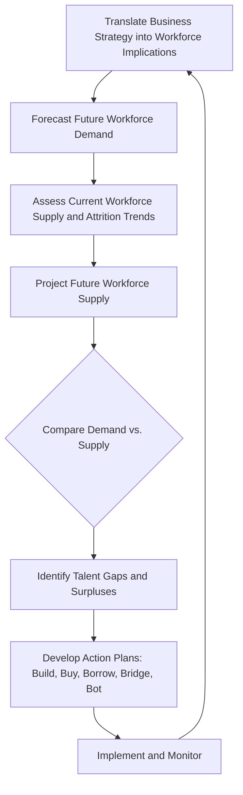

## Strategic Workforce Planning

### Definition and Conceptual Overview

Strategic workforce planning (SWP) is the systematic process of analyzing an organization's current workforce, forecasting future talent needs based on strategic objectives, identifying gaps between current and required capabilities, and developing action plans to close those gaps. Unlike operational headcount planning (which addresses near-term staffing to fill existing roles), SWP is forward-looking and directly tied to the organization's strategic direction, typically spanning a three-to-five-year horizon.

**Key Points**

- SWP links human capital decisions directly to strategic objectives, rather than treating workforce planning as a purely administrative HR function
- The process is fundamentally a gap-analysis exercise: comparing the workforce an organization has to the workforce its strategy will require
- Effective SWP requires quantitative forecasting (numbers and skills needed) combined with qualitative judgment (which capabilities are strategically critical versus commodity)

### The Strategic Workforce Planning Process

$$\text{Workforce Gap} = \text{Future Workforce Demand} - \text{Projected Future Workforce Supply}$$

#### Step 1: Translate Strategy into Workforce Implications

Every strategic choice (market entry, digital transformation, geographic expansion, M&A, automation) carries implicit workforce requirements. This step involves working with business leaders to articulate what capabilities, roles, and headcount levels the strategy will demand over the planning horizon.

#### Step 2: Forecast Future Workforce Demand

Quantitative and qualitative techniques are used to project the number, type, and location of roles needed, including:

- **Trend/ratio analysis**: Extrapolating historical staffing ratios (e.g., revenue per employee, customer-to-service-rep ratios) forward based on projected business volume
- **Scenario-based forecasting**: Modeling workforce demand under multiple strategic scenarios (e.g., aggressive growth vs. conservative growth) to build planning flexibility
- **Capability-based forecasting**: Identifying specific emerging skill requirements (e.g., data science, AI/ML engineering, sustainability expertise) driven by strategic shifts, independent of simple headcount ratios

#### Step 3: Assess Current Workforce Supply

An internal audit of existing workforce composition, including headcount by role/location/skill, demographic profile (age, tenure), performance and potential ratings, and historical attrition/retirement patterns.

#### Step 4: Project Future Workforce Supply

Modeling how the current workforce will evolve without intervention, accounting for projected attrition, retirements, internal promotions, and planned reductions.

$$\text{Projected Supply}_{t+1} = \text{Current Supply}_t - \text{Attrition} - \text{Retirements} + \text{Planned Internal Promotions/Transfers}$$

#### Step 5: Gap Analysis

Comparing projected demand against projected supply, by role, skill, level, and location, to identify:

- **Talent shortages**: Roles/skills where demand will exceed available supply
- **Talent surpluses**: Roles/skills where supply will exceed strategic need (often due to automation, strategic divestiture, or declining business lines)
- **Critical versus commodity gaps**: Distinguishing gaps in strategically differentiating capabilities (which warrant significant investment) from gaps in more easily substitutable roles

#### Step 6: Develop Action Plans

Commonly organized around the "5 B's" framework for closing talent gaps:

| Approach | Description | Best Suited For |
| --- | --- | --- |
| **Build** | Develop existing employees through training, reskilling, upskilling | Longer time horizons; strategically critical capabilities where internal knowledge/culture fit matters |
| **Buy** | Recruit external talent to fill gaps | Shorter time horizons; capabilities not present internally at all |
| **Borrow** | Use contractors, consultants, or contingent workers | Temporary or fluctuating demand; specialized expertise needed briefly |
| **Bridge** | Redeploy or transition surplus employees into gap areas via reskilling | Internal surpluses coexisting with internal gaps elsewhere in the organization |
| **Bot** (automate) | Substitute technology/automation for the labor requirement | Roles where automation is technically feasible and economically favorable relative to human staffing |

### Diagram: Strategic Workforce Planning Gap Analysis (svg_diagram)

<svg xmlns="http://www.w3.org/2000/svg" viewBox="0 0 800 420" font-family="Arial, sans-serif">
<text x="400" y="30" text-anchor="middle" font-size="18" font-weight="bold">Strategic Workforce Planning Gap Analysis (svg_diagram)</text>
<line x1="80" y1="360" x2="80" y2="70" stroke="#333" stroke-width="1.5" />
<line x1="80" y1="360" x2="750" y2="360" stroke="#333" stroke-width="1.5" />
<text x="40" y="200" text-anchor="middle" font-size="12" transform="rotate(-90 40 200)">Headcount / Capability</text>
<text x="400" y="395" text-anchor="middle" font-size="12">Time Horizon (Years)</text>
<path d="M80,300 L250,260 L420,220 L590,180 L750,150" fill="none" stroke="#1e40af" stroke-width="2.5" />
<text x="700" y="135" font-size="11" fill="#1e40af">Demand (Strategy-Driven)</text>
<path d="M80,300 L250,290 L420,300 L590,320 L750,340" fill="none" stroke="#166534" stroke-width="2.5" />
<text x="700" y="355" font-size="11" fill="#166534">Supply (Attrition-Adjusted)</text>
<line x1="590" y1="180" x2="590" y2="320" stroke="#dc2626" stroke-width="1.5" stroke-dasharray="4" />
<text x="610" y="250" font-size="12" fill="#dc2626" font-weight="bold">Gap</text>
<rect x="100" y="80" width="14" height="14" fill="#1e40af" />
<text x="120" y="92" font-size="11">Demand line reflects strategic plan requirements</text>
<rect x="100" y="100" width="14" height="14" fill="#166534" />
<text x="120" y="112" font-size="11">Supply line reflects natural attrition trajectory</text>
</svg>

### Critical Workforce Segmentation

Not all roles carry equal strategic weight. A common analytical distinction (drawing on strategic human capital theory, notably associated with Boudreau & Ramstad's "decision science" approach to talent) segments roles by:

- **Strategic impact**: The degree to which variation in performance in a role affects competitive outcomes (e.g., a lead algorithm engineer at a tech firm has high strategic impact; a facilities clerk typically has lower strategic impact)
- **Talent scarcity/differentiation potential**: The degree to which performance varies meaningfully across individuals in the role and superior performers are hard to source

Roles high on both dimensions ("pivotal roles") warrant disproportionate investment in workforce planning, succession depth, and retention, while roles low on both dimensions are typically managed for cost efficiency and process standardization rather than differentiated talent investment.

| Strategic Impact | Low Differentiation Potential | High Differentiation Potential |
| --- | --- | --- |
| **High** | Support roles requiring reliable execution | Pivotal roles — disproportionate investment warranted |
| **Low** | Commodity roles — standardize and manage for cost | Roles with variable performance but limited strategic leverage |

### Integration with Strategic Planning Cycles

**Example**

A retail chain planning aggressive e-commerce expansion over a three-year horizon uses SWP to determine that its existing workforce is heavily weighted toward in-store retail associates, while the strategy requires substantial growth in supply-chain logistics, data analytics, and digital marketing roles. The resulting workforce plan combines "buy" actions (external hiring for specialized digital roles), "build" actions (reskilling programs for in-store staff whose roles are declining), and "bot" actions (automating routine inventory tasks), phased against the multi-year strategic rollout rather than executed as a single reactive hiring push.

### Workforce Planning and Organizational Structure Interdependence

SWP does not occur in isolation from structural design decisions covered elsewhere in this chapter: the chosen structural form (functional, divisional, matrix, network) directly shapes where and how workforce gaps manifest. A firm shifting toward a network/modular structure, for instance, will show reduced internal demand for certain operational roles (shifted to external partners) and increased internal demand for partner-management and integration capabilities.

### Common Pitfalls in Strategic Workforce Planning

- **Treating SWP as a one-time headcount exercise**: Effective SWP is a continuous, iterative process integrated into the strategic planning cycle, not an annual static forecast disconnected from strategy revisions
- **Underestimating capability shifts**: Focusing exclusively on headcount numbers while missing qualitative shifts in required skills (e.g., digital, analytical, or sustainability-related competencies) that a strategy will demand
- **Ignoring workforce surpluses**: Overemphasis on filling gaps while neglecting proactive management of roles becoming redundant due to strategic shifts or automation, which can create later restructuring costs and morale damage if unaddressed
- **Insufficient scenario planning**: Building a single-point forecast rather than testing workforce plans against multiple plausible strategic and market scenarios, reducing resilience to uncertainty

**[Inference]** The reliability of quantitative workforce demand forecasts tends to decrease as the planning horizon lengthens and as the pace of strategic or technological change in the industry increases, which is why organizations in fast-changing sectors often supplement long-range forecasts with more frequent scenario-based reviews rather than relying on a single multi-year projection.

### Practical Diagnostic Questions

- Which roles in the organization are truly "pivotal" to strategic differentiation, warranting disproportionate workforce investment?
- Does the current workforce plan account for both talent shortages and talent surpluses created by the strategy (including automation-driven surpluses)?
- Is workforce planning integrated into the strategic planning cycle, or does it occur as a separate, disconnected HR process?
- What combination of build, buy, borrow, bridge, and bot actions is most cost-effective and time-appropriate for each identified gap?

**Next Steps**

- Talent Management and Succession Planning
- Reskilling and Upskilling Strategies for Digital Transformation
- Organizational Structure and Design for Strategy
- Human Capital as a Source of Sustainable Competitive Advantage
- Workforce Analytics and People Data Strategy
- Strategic HR Metrics: Time-to-Fill, Quality-of-Hire, Retention Rate