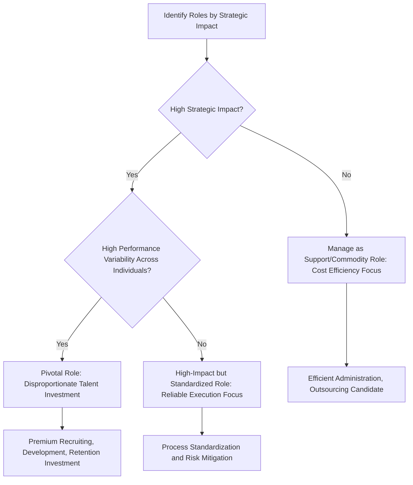

## Talent as a Source of Competitive Advantage

### Definition and Conceptual Overview

Talent as a source of competitive advantage refers to the strategic proposition that an organization's human capital — the knowledge, skills, abilities, and behaviors embodied in its people — can constitute a resource capable of generating sustained superior performance relative to competitors, when that human capital meets specific resource-based criteria. This perspective treats talent not merely as a cost to be managed but as a strategic asset to be deliberately built, deployed, and protected.

**Key Points**

- Talent generates competitive advantage only when it is difficult for competitors to replicate or acquire, not merely when it is high-quality in an absolute sense
- The resource-based view (RBV) of the firm provides the primary theoretical foundation for analyzing when and how human capital contributes to sustained advantage
- Not all talent within an organization contributes equally to competitive advantage; strategic value is concentrated in specific "pivotal" roles and capabilities

### Theoretical Foundation: The Resource-Based View Applied to Human Capital

The resource-based view holds that sustained competitive advantage arises from resources and capabilities that are Valuable, Rare, Inimitable, and Non-substitutable (the VRIN/VRIO framework). Applied to human capital, each criterion translates as follows:

| VRIO Criterion | Application to Human Capital |
| --- | --- |
| **Valuable** | Talent must contribute meaningfully to value creation — improving quality, reducing costs, or enabling differentiation that customers care about |
| **Rare** | The specific combination of skills, experience, and judgment must not be widely available in the labor market |
| **Inimitable** | Competitors must find it difficult to replicate the human capital, typically because it is embedded in firm-specific tacit knowledge, social relationships, or organizational routines rather than easily codified or transferred |
| **Organized (non-substitutable)** | The organization must have complementary systems (structure, culture, incentives) that allow it to actually capture value from the talent, rather than the value being appropriable by the individual alone or substitutable by another resource |

$$\text{Sustained Talent Advantage} = \text{Value} \times \text{Rarity} \times \text{Inimitability} \times \text{Organizational Capture}$$

**[Inference]** Because this is a multiplicative rather than additive relationship, a weakness in any single criterion substantially undermines the overall advantage — for example, highly valuable and rare talent that is poorly organized (e.g., lacking retention systems or complementary processes) may generate little sustained advantage, since competitors or the market can appropriate the value even without directly imitating the talent itself.

### Why Talent Is Often Difficult to Imitate

- **Firm-specific tacit knowledge**: Knowledge developed through years of experience within a specific organizational context, often not fully articulable or transferable even by the individual who possesses it
- **Social complexity**: Competitive advantage frequently resides not in individual stars but in the interactions, trust, and coordination patterns among teams, which cannot be replicated by hiring individuals away from a competitor
- **Causal ambiguity**: Competitors often cannot precisely identify which combination of talent practices is generating a firm's superior performance, making deliberate replication difficult even when they wish to imitate it
- **Path dependence**: Human capital advantages frequently accumulate over time through a firm's unique history of hiring, development, and culture-building, making the resulting capability difficult for a late-moving competitor to replicate quickly regardless of resource commitment

### Distinguishing Human Capital from Social and Organizational Capital

Strategic human capital theory typically distinguishes three related but distinct constructs:

- **Human capital**: Knowledge, skills, and abilities residing in individual employees
- **Social capital**: The value embedded in relationships and networks among employees (and between employees and external stakeholders), which facilitates knowledge sharing and coordination
- **Organizational capital**: Codified knowledge embedded in organizational systems, processes, databases, and routines that persists independent of any specific individual

**[Inference]** Advantage grounded primarily in individual human capital is generally more vulnerable to erosion through employee turnover than advantage grounded in social or organizational capital, since the latter two are embedded in the firm rather than portable with a departing individual; this is a common rationale for firms investing deliberately in knowledge codification and team-based (rather than star-individual-based) work design.

### The "Pivotal Talent" / Workforce Differentiation Perspective

Building on strategic human capital theory (notably associated with Boudreau & Ramstad, and separately with Huselid, Beatty & Becker's "A players in A positions" framework), competitive advantage from talent is concentrated disproportionately in specific roles rather than distributed uniformly across the workforce.

This perspective argues against the common HR practice of applying uniform talent investment across all roles, instead advocating differentiated investment concentrated on roles where variation in individual performance most directly affects strategic and financial outcomes.

### Diagram: Talent-Advantage Value Chain (svg_diagram)

<svg xmlns="http://www.w3.org/2000/svg" viewBox="0 0 900 380" font-family="Arial, sans-serif">
<text x="450" y="30" text-anchor="middle" font-size="18" font-weight="bold">Talent-Advantage Value Chain (svg_diagram)</text>
<rect x="40" y="80" width="160" height="60" rx="8" fill="#dbeafe" stroke="#1e40af" />
<text x="120" y="105" text-anchor="middle" font-size="12">Individual Human Capital</text>
<text x="120" y="123" text-anchor="middle" font-size="10">(skills, knowledge)</text>
<line x1="200" y1="110" x2="260" y2="110" stroke="#333" stroke-width="2" marker-end="url(#a1)" />
<rect x="260" y="80" width="160" height="60" rx="8" fill="#dcfce7" stroke="#166534" />
<text x="340" y="105" text-anchor="middle" font-size="12">Social Capital</text>
<text x="340" y="123" text-anchor="middle" font-size="10">(relationships, trust)</text>
<line x1="420" y1="110" x2="480" y2="110" stroke="#333" stroke-width="2" />
<rect x="480" y="80" width="180" height="60" rx="8" fill="#fef3c7" stroke="#92400e" />
<text x="570" y="105" text-anchor="middle" font-size="12">Organizational Capital</text>
<text x="570" y="123" text-anchor="middle" font-size="10">(codified routines, systems)</text>
<line x1="660" y1="110" x2="720" y2="110" stroke="#333" stroke-width="2" />
<rect x="720" y="80" width="150" height="60" rx="8" fill="#ede9fe" stroke="#5b21b6" />
<text x="795" y="105" text-anchor="middle" font-size="12">Competitive Advantage</text>
<text x="795" y="123" text-anchor="middle" font-size="10">(sustained, if VRIO met)</text>
<line x1="120" y1="140" x2="120" y2="230" stroke="#dc2626" stroke-width="1.5" stroke-dasharray="4" />
<text x="120" y="250" text-anchor="middle" font-size="11" fill="#dc2626">Most portable/</text>
<text x="120" y="265" text-anchor="middle" font-size="11" fill="#dc2626">imitable via poaching</text>
<line x1="795" y1="140" x2="795" y2="230" stroke="#166534" stroke-width="1.5" stroke-dasharray="4" />
<text x="795" y="250" text-anchor="middle" font-size="11" fill="#166534">Most durable/</text>
<text x="795" y="265" text-anchor="middle" font-size="11" fill="#166534">defensible advantage</text>
</svg>

### Mechanisms for Building and Protecting Talent-Based Advantage

- **Selective, capability-aligned recruiting**: Hiring processes explicitly calibrated to the specific capabilities the strategy requires, rather than generic "high performer" criteria
- **Firm-specific development investment**: Training and experience programs that build knowledge and skills tightly coupled to the organization's specific processes, technology, and market context, increasing inimitability
- **Team- and system-embedding**: Designing work so that critical knowledge and capability are embedded in team routines and organizational systems rather than residing solely in individuals, reducing vulnerability to turnover
- **Retention of pivotal talent**: Differentiated compensation, career development, and engagement strategies concentrated on roles identified as strategically pivotal
- **Non-compete and knowledge-protection mechanisms**: Legal and structural mechanisms to reduce the risk of critical knowledge migrating to competitors via employee departure, subject to jurisdictional and regulatory limits on enforceability

### Risks and Limitations of Talent-Based Advantage

**Example**

A professional services firm that built its reputation and client relationships primarily around a small number of star partners faces significant vulnerability if those partners depart, since much of the firm's competitive advantage may be embodied in individually portable relationships and expertise rather than in firm-level systems. A firm that instead invests in codifying methodologies, building strong internal knowledge-management systems, and developing broad-based team capability is comparatively more resilient to individual departures, though potentially at some cost to the differentiation that star individual expertise can provide.

- **Poaching risk**: Competitors can directly recruit key talent, particularly where compensation, culture, or career opportunities elsewhere are more attractive
- **Labor market constraints**: Rare and valuable talent, by definition, is scarce; firms competing for the same limited talent pool may face escalating compensation costs that erode the economic value captured from the advantage
- **Overreliance on stars**: Concentrating capability in a small number of individuals increases organizational fragility and succession risk
- **Legal and ethical limits on lock-in**: Mechanisms to prevent talent mobility (e.g., non-compete agreements) face varying and increasingly restrictive regulatory treatment across jurisdictions, limiting how far firms can rely on legal barriers to protect talent-based advantage

**[Unverified]** The enforceability and scope of non-compete agreements varies substantially by jurisdiction and has been subject to significant recent regulatory change in some regions; firms should verify current legal standing in their specific jurisdiction rather than assume historical enforceability patterns still apply.

### Talent Advantage and Broader Strategic Human Capital Themes

Talent-based competitive advantage connects directly to workforce planning (identifying which roles are pivotal), organizational structure (how work is designed to embed knowledge in teams versus individuals), and culture (how effectively an organization can attract, motivate, and retain differentiated talent) — treating human capital strategy as integrated with, rather than separate from, overall corporate strategy formulation.

### Practical Diagnostic Questions

- Which specific roles or capabilities in the organization meet the VRIO criteria, warranting treatment as genuine sources of sustained advantage rather than commodity talent?
- To what extent is the organization's current competitive advantage embedded in portable individual human capital versus more durable social and organizational capital?
- What retention, development, and knowledge-embedding mechanisms are in place to protect pivotal talent-based advantages from erosion through turnover?
- How does the organization's talent investment allocation compare to the actual strategic impact distribution across its roles?

**Related Topics**

- Strategic Workforce Planning
- Resource-Based View and VRIO Framework
- Organizational Culture and Strategy Execution
- Succession Planning for Pivotal Roles
- Knowledge Management and Organizational Learning
- Compensation Strategy and Talent Retention
- Human Capital Analytics and Strategic HR Measurement