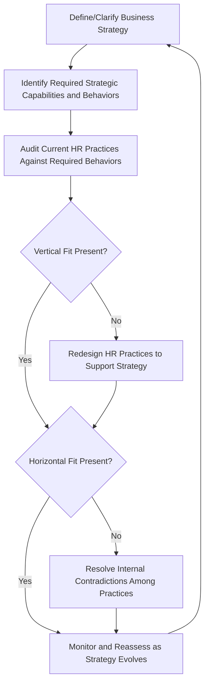

## Aligning Human Resource Strategy with Business Strategy

### Definition and Conceptual Overview

Alignment between human resource strategy and business strategy refers to the deliberate design of HR policies, practices, and systems so that they directly reinforce and enable the organization's chosen competitive strategy, rather than operating as a generic, standardized function disconnected from strategic intent. Strategic HR alignment theory holds that HR practices generate the greatest impact on firm performance when they are configured coherently around the specific behaviors and capabilities a given strategy requires.

**Key Points**

- Alignment operates at two interdependent levels: vertical fit (HR strategy supports business strategy) and horizontal fit (individual HR practices are internally consistent with one another)
- Different generic business strategies imply different required employee behaviors, and therefore different optimal HR practice configurations
- Misalignment — applying HR practices suited to one strategic context within a different strategic context — can actively undermine strategy execution rather than merely being suboptimal

### Vertical Fit: Linking Business Strategy to HR Strategy

Vertical (or external) fit refers to the alignment between the organization's overall strategic direction and the design of its HR system. The foundational logic, drawing on behavioral perspectives in strategic HRM (notably associated with Schuler & Jackson), holds that different competitive strategies require different employee role behaviors, which in turn require different HR practice configurations to elicit and reinforce.

$$\text{HR Practice Effectiveness} = f(\text{Fit with Business Strategy}, \text{Internal Consistency Among Practices})$$

#### Cost Leadership Strategy — Implied HR Configuration

A cost leadership strategy requires efficient, reliable, repetitive task performance with minimal deviation and low turnover-driven cost.

- **Job design**: Narrowly defined, standardized, closely specified roles
- **Staffing**: Emphasis on internal promotion and stable employment to preserve process knowledge and minimize hiring/training costs
- **Compensation**: Fixed pay tied to job level, with limited performance-based variability, and tight cost control
- **Training**: Focused, task-specific skill-building rather than broad developmental investment
- **Performance management**: Short-term, results-oriented, emphasizing consistency and efficiency metrics

#### Differentiation Strategy — Implied HR Configuration

A differentiation strategy (through innovation, quality, or customer experience) requires creativity, risk tolerance, cross-functional collaboration, and flexible role behavior.

- **Job design**: Broader, more loosely defined roles allowing for creativity and cross-functional contribution
- **Staffing**: Greater openness to external hiring for fresh perspectives and specialized expertise, alongside internal development
- **Compensation**: Higher use of variable, incentive-based pay tied to innovation or quality outcomes, with tolerance for higher overall compensation levels
- **Training**: Broad-based developmental investment, including cross-functional exposure
- **Performance management**: Longer-term orientation, tolerance for calculated risk-taking and experimentation, qualitative as well as quantitative evaluation criteria

#### Focus/Niche Strategy — Implied HR Configuration

A focus strategy targeting a narrow market segment typically requires deep specialization and close customer intimacy.

- **Job design**: Specialized roles requiring deep domain or customer-segment expertise
- **Staffing**: Selective hiring for specialized expertise, often from niche talent pools
- **Compensation and training**: Calibrated to the specific specialized capability the niche strategy depends on, blending elements of both cost and differentiation configurations depending on whether the niche strategy competes on cost or differentiation within its segment

| Strategy Type | Job Design | Staffing Emphasis | Compensation | Training Focus |
| --- | --- | --- | --- | --- |
| Cost Leadership | Narrow, standardized | Internal, stable | Fixed, cost-controlled | Task-specific |
| Differentiation | Broad, flexible | External + internal mix | Variable, incentive-heavy | Broad, cross-functional |
| Focus/Niche | Specialized | Selective, expertise-driven | Segment-calibrated | Deep domain expertise |

### Diagram: Strategy-HR Alignment Framework (svg_diagram)

<svg xmlns="http://www.w3.org/2000/svg" viewBox="0 0 900 420" font-family="Arial, sans-serif">
<text x="450" y="30" text-anchor="middle" font-size="18" font-weight="bold">Strategy-HR Alignment Framework (svg_diagram)</text>
<rect x="350" y="55" width="200" height="45" rx="8" fill="#1e3a8a" stroke="#1e293b" />
<text x="450" y="82" text-anchor="middle" font-size="13" fill="white">Business Strategy</text>
<line x1="450" y1="100" x2="450" y2="130" stroke="#333" stroke-width="2" />
<rect x="350" y="130" width="200" height="45" rx="8" fill="#2563eb" stroke="#1e293b" />
<text x="450" y="157" text-anchor="middle" font-size="13" fill="white">Required Employee Behaviors</text>
<line x1="450" y1="175" x2="450" y2="205" stroke="#333" stroke-width="2" />
<rect x="350" y="205" width="200" height="45" rx="8" fill="#60a5fa" stroke="#1e293b" />
<text x="450" y="232" text-anchor="middle" font-size="13" fill="white">HR Strategy Configuration</text>
<line x1="450" y1="250" x2="450" y2="280" stroke="#333" stroke-width="2" />
<line x1="450" y1="280" x2="150" y2="310" stroke="#333" stroke-width="1.5" />
<line x1="450" y1="280" x2="320" y2="310" stroke="#333" stroke-width="1.5" />
<line x1="450" y1="280" x2="580" y2="310" stroke="#333" stroke-width="1.5" />
<line x1="450" y1="280" x2="750" y2="310" stroke="#333" stroke-width="1.5" />
<rect x="80" y="310" width="140" height="45" rx="6" fill="#dcfce7" stroke="#166534" />
<text x="150" y="337" text-anchor="middle" font-size="11">Staffing</text>
<rect x="250" y="310" width="140" height="45" rx="6" fill="#dcfce7" stroke="#166534" />
<text x="320" y="337" text-anchor="middle" font-size="11">Compensation</text>
<rect x="510" y="310" width="140" height="45" rx="6" fill="#dcfce7" stroke="#166534" />
<text x="580" y="337" text-anchor="middle" font-size="11">Training/Dev.</text>
<rect x="680" y="310" width="140" height="45" rx="6" fill="#dcfce7" stroke="#166534" />
<text x="750" y="337" text-anchor="middle" font-size="11">Performance Mgmt.</text>

<text x="450" y="390" text-anchor="middle" font-size="11" font-style="italic">Horizontal fit: all four practice areas must be internally consistent with one another</text>

</svg>

### Horizontal Fit: Internal Consistency Among HR Practices

Horizontal (or internal) fit concerns whether individual HR practices — staffing, compensation, training, performance management, job design — reinforce rather than contradict one another, independent of whether the overall configuration matches strategy. A configuration exhibiting strong horizontal fit but poor vertical fit will be internally coherent yet strategically misaligned; conversely, isolated "best practice" adoption without regard to internal consistency can create contradictory signals to employees.

**Example**

An organization pursuing a differentiation strategy through innovation that adopts an incentive-heavy compensation system rewarding creative risk-taking, but simultaneously retains a rigid performance management process that penalizes any missed short-term target regardless of learning value, exhibits horizontal misfit: the compensation system encourages risk-taking while the performance evaluation system punishes the failures that risk-taking sometimes produces, creating contradictory incentives that undermine the intended strategic behavior.

### Universalistic, Contingency, and Configurational Perspectives

Strategic HRM theory identifies three broad perspectives on how HR practices relate to performance:

- **Universalistic (best practice) perspective**: Certain HR practices ("high-performance work practices" — selective staffing, extensive training, performance-based pay, employee involvement) improve performance across virtually all strategic contexts, regardless of fit
- **Contingency perspective**: The effectiveness of HR practices depends on their fit with business strategy; a practice effective under one strategy may be ineffective or counterproductive under another (the perspective underlying the Schuler-Jackson framework above)
- **Configurational perspective**: Performance depends on internally consistent bundles or "configurations" of HR practices (horizontal fit) rather than on any single practice in isolation, and the ideal configuration also varies by strategic context (combining contingency logic with a systems view)

**[Inference]** These perspectives are not strictly mutually exclusive in practice; a plausible synthesis is that a baseline set of practices (e.g., basic selective hiring, safety, and fair treatment) may generate universal benefit, while the more differentiated elements of HR strategy (incentive design, degree of role flexibility, developmental investment) require strategic contingency and internal configurational coherence to generate their full performance effect. This synthesis view is a reasonable interpretation of the literature rather than a definitively settled consensus.

### The HR Strategy Alignment Process

### Structural and Governance Enablers of Alignment

Effective HR-strategy alignment is facilitated by several organizational design choices covered elsewhere in this course:

- **HR representation in strategic decision-making**: A Chief HR Officer or equivalent participating directly in strategy formulation (not merely strategy implementation) ensures workforce implications are considered when strategic choices are made, not only afterward
- **HR business partner models**: Embedding HR professionals within business units to align local HR practice design with unit-specific strategic requirements, rather than applying a single centralized HR policy uniformly across differentiated business strategies
- **Integration with strategic workforce planning**: Workforce planning gap analysis and HR practice design should be developed jointly, since the "build, buy, borrow, bridge, bot" resolution of workforce gaps has direct implications for staffing, training, and compensation practice design

### Diagnosing Misalignment

Common signals of HR-strategy misalignment include:

- Recruitment criteria and interview processes that select for behaviors inconsistent with the strategy's requirements (e.g., screening for rule-following consistency in an organization pursuing an innovation-driven differentiation strategy)
- Compensation systems that reward behaviors contrary to the strategy (e.g., pure individual sales volume incentives in a strategy dependent on collaborative, team-based customer solutions)
- Performance management systems using generic, company-wide criteria that do not reflect the specific behaviors different business units need under differentiated strategies (relevant in diversified, multidivisional firms)
- Training investment patterns that do not track the capabilities identified as strategically critical in workforce planning

### Alignment Challenges in Diversified/Multi-Business Organizations

**[Inference]** In multidivisional organizations pursuing different competitive strategies across different business units (e.g., one division pursuing cost leadership, another pursuing differentiation), a single, uniform corporate-wide HR policy is likely to produce misalignment in at least one division, since the required practice configurations differ by strategy type; this suggests that corporate HR functions in diversified firms typically need to permit differentiated HR practice design at the divisional level while maintaining certain company-wide baseline standards (e.g., legal compliance, core values, safety).

### Practical Diagnostic Questions

- What specific employee behaviors does the current business strategy require, and do current HR practices actively encourage those behaviors?
- Are staffing, compensation, training, and performance management practices internally consistent with one another, or do they send contradictory signals?
- Is HR strategy formulated in partnership with business strategy formulation, or only applied afterward as an implementation afterthought?
- In diversified organizations, does HR practice design appropriately differentiate across business units with different competitive strategies?

**Next Steps**

- Strategic Workforce Planning
- Talent as a Source of Competitive Advantage
- Organizational Culture and Strategy Execution
- Compensation Strategy and Incentive Alignment
- HR Business Partner Models and Strategic HR Roles
- Strategy Implementation and Organizational Structure