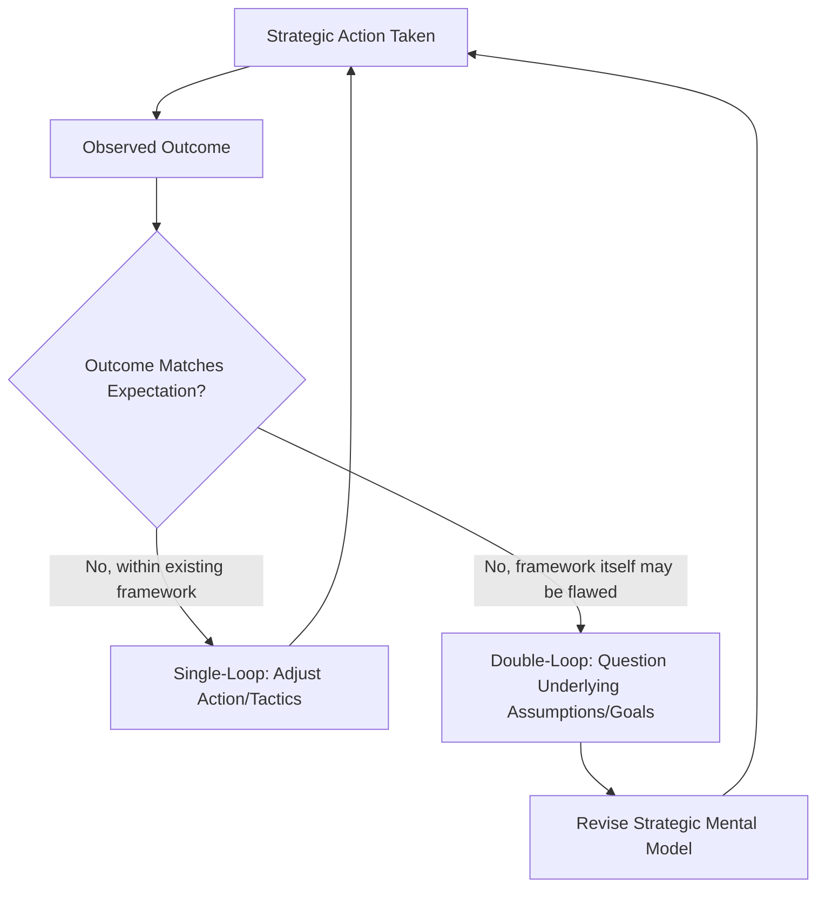

## Organizational Learning Systems

### Definition and Conceptual Overview

Organizational learning systems refer to the structures, processes, and cultural mechanisms through which an organization acquires, creates, retains, and disseminates knowledge to improve its capabilities and adapt its strategy over time. Distinct from individual learning, organizational learning is concerned with knowledge that becomes embedded in the organization's routines, systems, and shared understanding, such that it persists beyond the tenure of any single individual and can be systematically leveraged for strategic advantage.

**Key Points**

- Organizational learning is a dynamic capability: the capacity to learn faster or more effectively than competitors can itself be a source of sustained competitive advantage
- Learning must be deliberately captured and institutionalized (organizational capital) to avoid being lost when individuals with tacit knowledge depart
- Effective learning systems balance exploitation (refining existing knowledge and capabilities) with exploration (generating genuinely new knowledge), echoing the organizational ambidexterity concept introduced in the structural agility discussion

### Levels of Organizational Learning

A widely used distinction (drawing on Argyris & Schön's foundational work) separates learning into two qualitatively different loops:

#### Single-Loop Learning

Detecting and correcting errors or deviations from expected outcomes within the existing framework of goals, strategies, and assumptions, without questioning those underlying assumptions themselves. Analogous to a thermostat adjusting temperature to a fixed setpoint.

#### Double-Loop Learning

Questioning and potentially revising the underlying goals, assumptions, or mental models that generated the original strategy or behavior, not merely correcting deviations from it. This is the deeper form of learning most associated with genuine strategic adaptation and renewal.

$$\text{Single-Loop: } \text{Action} \rightarrow \text{Outcome} \rightarrow \text{Correct Action (fixed goals)}$$

$$\text{Double-Loop: } \text{Action} \rightarrow \text{Outcome} \rightarrow \text{Question Goals/Assumptions} \rightarrow \text{Revise Strategy}$$

**[Inference]** Organizations tend to default toward single-loop learning because it is less threatening to existing power structures, sunk investments, and individual identities tied to prior decisions; double-loop learning typically requires deliberate structural and cultural mechanisms (e.g., psychological safety, external benchmarking, formal strategic assumption reviews) to overcome this default tendency, since it is not likely to occur spontaneously at the same rate.

### The Knowledge Creation Process: SECI Model

A widely referenced framework for how organizations convert individual tacit knowledge into shared organizational knowledge is Nonaka and Takeuchi's SECI model, describing four modes of knowledge conversion:

| Mode | Conversion Type | Description |
| --- | --- | --- |
| **Socialization** | Tacit to Tacit | Sharing experiences directly (mentoring, observation, shared practice) without formal articulation |
| **Externalization** | Tacit to Explicit | Articulating tacit knowledge into explicit concepts, models, or documented best practices |
| **Combination** | Explicit to Explicit | Systematizing and combining existing explicit knowledge into more complex, organized knowledge (e.g., databases, reports, manuals) |
| **Internalization** | Explicit to Tacit | Individuals absorbing explicit knowledge through practice until it becomes intuitive, embodied skill |

This cycle (often depicted as a continuous spiral) suggests organizational learning systems should deliberately support all four conversion modes rather than relying solely on one — for example, documentation systems alone (combination) without mentoring and communities of practice (socialization) will fail to capture and transfer the tacit knowledge that resists full codification.

### Diagram: SECI Knowledge Conversion Spiral (svg_diagram)

<svg xmlns="http://www.w3.org/2000/svg" viewBox="0 0 800 420" font-family="Arial, sans-serif">
<text x="400" y="30" text-anchor="middle" font-size="18" font-weight="bold">SECI Knowledge Conversion Spiral (svg_diagram)</text>
<rect x="80" y="80" width="220" height="80" rx="8" fill="#dbeafe" stroke="#1e40af" />
<text x="190" y="115" text-anchor="middle" font-size="13" font-weight="bold">Socialization</text>
<text x="190" y="135" text-anchor="middle" font-size="11">Tacit → Tacit</text>
<text x="190" y="150" text-anchor="middle" font-size="10">(mentoring, shadowing)</text>
<line x1="300" y1="120" x2="380" y2="120" stroke="#333" stroke-width="2" marker-end="url(#arr)" />
<rect x="380" y="80" width="220" height="80" rx="8" fill="#dcfce7" stroke="#166534" />
<text x="490" y="115" text-anchor="middle" font-size="13" font-weight="bold">Externalization</text>
<text x="490" y="135" text-anchor="middle" font-size="11">Tacit → Explicit</text>
<text x="490" y="150" text-anchor="middle" font-size="10">(documenting best practice)</text>
<line x1="490" y1="160" x2="490" y2="220" stroke="#333" stroke-width="2" />
<rect x="380" y="220" width="220" height="80" rx="8" fill="#fef3c7" stroke="#92400e" />
<text x="490" y="255" text-anchor="middle" font-size="13" font-weight="bold">Combination</text>
<text x="490" y="275" text-anchor="middle" font-size="11">Explicit → Explicit</text>
<text x="490" y="290" text-anchor="middle" font-size="10">(knowledge bases, manuals)</text>
<line x1="380" y1="260" x2="300" y2="260" stroke="#333" stroke-width="2" marker-end="url(#arr)" />
<rect x="80" y="220" width="220" height="80" rx="8" fill="#ede9fe" stroke="#5b21b6" />
<text x="190" y="255" text-anchor="middle" font-size="13" font-weight="bold">Internalization</text>
<text x="190" y="275" text-anchor="middle" font-size="11">Explicit → Tacit</text>
<text x="190" y="290" text-anchor="middle" font-size="10">(learning by doing)</text>
<line x1="190" y1="220" x2="190" y2="160" stroke="#333" stroke-width="2" />

<text x="400" y="360" text-anchor="middle" font-size="11" font-style="italic">Cycle repeats at progressively higher organizational scope (individual → team → firm)</text>

</svg>

### Structural and Process Mechanisms for Organizational Learning

- **Communities of practice**: Informal or semi-formal groups of practitioners who share expertise and jointly develop knowledge around a common domain, facilitating socialization-mode learning across formal organizational boundaries
- **After-action reviews / post-mortems**: Structured retrospective processes examining what happened, why, and what should change, applied after major projects, initiatives, or incidents — a mechanism strongly associated with converting experience into explicit, transferable lessons
- **Knowledge management systems**: Digital repositories, wikis, and databases that codify explicit knowledge for organization-wide access, supporting the combination mode but requiring active governance to remain current and genuinely used
- **Cross-functional and cross-unit rotation**: Deliberately moving employees across functions, business units, or geographies to transfer tacit knowledge and build shared mental models across organizational silos
- **Environmental scanning and competitive intelligence functions**: Formal mechanisms for importing external knowledge (market trends, competitor moves, technological developments) into the organization's learning system, preventing learning from becoming purely internally focused
- **Strategic assumption surfacing/testing**: Formal processes (e.g., structured strategy reviews, scenario planning, red-teaming) explicitly designed to invite double-loop questioning of existing strategic assumptions rather than relying on this occurring spontaneously

### Organizational Learning and Ambidexterity

Organizational learning systems intersect directly with the exploration/exploitation distinction introduced in the discussion of strategic agility:

- **Exploitative learning**: Refining and improving existing knowledge, processes, and capabilities through incremental adjustment — closely aligned with single-loop learning
- **Exploratory learning**: Generating genuinely novel knowledge through experimentation, search, and the recombination of previously unconnected ideas — closely aligned with double-loop learning and typically requiring more risk tolerance and resource commitment with less certain near-term payoff

**Example**

A manufacturing firm's continuous improvement program (analyzing defect data and refining process parameters incrementally) exemplifies exploitative, single-loop learning: it optimizes performance within the existing production paradigm. If the same firm periodically convenes cross-functional teams to question whether the existing production paradigm itself (e.g., centralized versus distributed manufacturing, or the underlying technology platform) remains appropriate given shifts in market demand or technology, and is willing to substantially redesign the paradigm based on that inquiry, this constitutes exploratory, double-loop learning operating alongside the exploitative system.

### Barriers to Effective Organizational Learning

- **Knowledge hoarding**: Individuals or units retaining knowledge as a source of personal power or job security rather than sharing it, undermining organization-wide knowledge diffusion
- **Structural silos**: Functional or divisional boundaries (see structural forms discussion) that impede cross-unit knowledge transfer absent deliberate integration mechanisms
- **Punitive failure culture**: Organizations that penalize any failure discourage the experimentation necessary for exploratory learning, biasing the system toward safer, purely exploitative single-loop adjustments
- **Turnover of tacit-knowledge holders**: Loss of key personnel without adequate knowledge transfer mechanisms in place, resulting in the erosion of organizational capital
- **Superstitious learning**: Drawing incorrect causal inferences from ambiguous outcomes (attributing success or failure to the wrong factors), leading to reinforcement of behaviors that do not actually drive the observed results

**[Inference]** The risk of superstitious learning is likely elevated in organizations facing high causal ambiguity (where the link between action and outcome is difficult to observe directly) and in organizations with weak feedback mechanisms; more rigorous after-action review processes and controlled experimentation (e.g., A/B testing where feasible) can reduce, though not eliminate, this risk.

### Measuring Organizational Learning Capacity

While organizational learning is inherently difficult to measure directly, common proxy indicators include:

- Rate of internal knowledge reuse (e.g., how often documented best practices or lessons learned are actually referenced in subsequent projects)
- Time-to-competency for new hires or employees moving into new roles, as an indicator of how effectively tacit knowledge is being transferred
- Frequency and depth of structured after-action reviews conducted relative to major initiatives
- Employee survey measures of psychological safety and willingness to report errors or challenge existing assumptions

$$\text{Learning System Effectiveness} \approx f(\text{Knowledge Capture Rate}, \text{Knowledge Diffusion Rate}, \text{Assumption-Questioning Frequency})$$

**[Unverified]** No single validated composite metric for "organizational learning capacity" is universally accepted in the literature; the proxy indicators above are commonly used in practice but each captures only a partial dimension of the underlying construct, and organizations typically need to triangulate across multiple such indicators rather than relying on any single measure.

### Practical Diagnostic Questions

- Does the organization have deliberate mechanisms for double-loop learning (assumption-questioning), or does it rely almost entirely on single-loop, within-framework correction?
- Are all four SECI knowledge-conversion modes actively supported, or does the organization over-rely on one mode (e.g., documentation systems without mentoring/socialization)?
- What happens to critical tacit knowledge when key employees leave — is there a structured knowledge-transfer process, or is the knowledge simply lost?
- Does the organizational culture support the productive failure and experimentation necessary for exploratory learning, or does it punish deviation in ways that suppress it?

**Related Topics**

- Organizational Design for Strategic Agility
- Talent as a Source of Competitive Advantage
- Dynamic Capabilities and Strategic Renewal
- Knowledge Management Systems and Technology Infrastructure
- Organizational Culture and Psychological Safety
- Communities of Practice and Cross-Functional Collaboration
- Scenario Planning and Strategic Assumption Testing