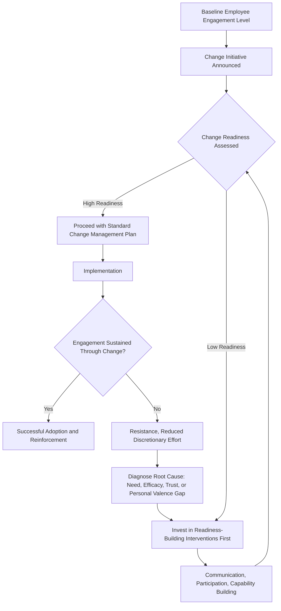

## Change Readiness and Employee Engagement

### Definition and Conceptual Overview

Change readiness refers to the degree to which an organization's employees, systems, and culture are prepared to accept, support, and actively participate in a planned strategic change initiative. Employee engagement refers to the level of cognitive, emotional, and behavioral investment employees bring to their work and to the organization's goals. The two constructs are closely linked in strategy execution: highly engaged employees generally exhibit greater change readiness, and successful change management approaches typically treat engagement as both a precondition for, and an outcome of, well-managed change.

**Key Points**

- Change readiness is a diagnosable, measurable state that precedes successful strategic change implementation, not merely an assumed byproduct of good change communication
- Employee engagement operates at cognitive (belief in the change), emotional (feeling toward the change), and behavioral (willingness to act in support of the change) dimensions, and resistance can originate from a deficit in any one of them
- Most strategic execution failures are attributed not to flawed strategy formulation but to inadequate attention to the human and organizational readiness required for implementation

### Dimensions of Change Readiness

$$\text{Change Readiness} = f(\text{Perceived Need for Change}, \text{Perceived Efficacy}, \text{Organizational Capacity}, \text{Trust in Leadership})$$

- **Perceived need (discrepancy)**: The degree to which employees believe a genuine gap exists between current performance/conditions and a desired future state, making change necessary rather than arbitrary
- **Perceived efficacy**: Employees' confidence that the organization (and they personally) have the capability to successfully execute the proposed change
- **Perceived appropriateness**: Belief that the specific change being proposed is the right response to the identified need, as opposed to a different or better alternative
- **Principal support**: Perception that key organizational leaders and opinion leaders are genuinely committed to the change, not merely mandating it symbolically
- **Personal valence**: The degree to which employees perceive the change as personally beneficial (or at least not personally harmful) to their own interests

### Diagram: Change Readiness Assessment Model (svg_diagram)

<svg xmlns="http://www.w3.org/2000/svg" viewBox="0 0 900 400" font-family="Arial, sans-serif">
<text x="450" y="30" text-anchor="middle" font-size="18" font-weight="bold">Change Readiness Assessment Model (svg_diagram)</text>
<circle cx="450" cy="220" r="75" fill="#dbeafe" stroke="#1e40af" stroke-width="2" />
<text x="450" y="215" text-anchor="middle" font-size="13" font-weight="bold">Change</text>
<text x="450" y="233" text-anchor="middle" font-size="13" font-weight="bold">Readiness</text>
<rect x="60" y="70" width="180" height="50" rx="8" fill="#dcfce7" stroke="#166534" />
<text x="150" y="100" text-anchor="middle" font-size="12">Perceived Need</text>
<line x1="240" y1="100" x2="390" y2="180" stroke="#333" stroke-width="1.5" />
<rect x="660" y="70" width="180" height="50" rx="8" fill="#dcfce7" stroke="#166534" />
<text x="750" y="100" text-anchor="middle" font-size="12">Perceived Efficacy</text>
<line x1="660" y1="100" x2="510" y2="180" stroke="#333" stroke-width="1.5" />
<rect x="60" y="330" width="180" height="50" rx="8" fill="#dcfce7" stroke="#166534" />
<text x="150" y="360" text-anchor="middle" font-size="12">Principal Support</text>
<line x1="240" y1="330" x2="390" y2="260" stroke="#333" stroke-width="1.5" />
<rect x="660" y="330" width="180" height="50" rx="8" fill="#dcfce7" stroke="#166534" />
<text x="750" y="360" text-anchor="middle" font-size="12">Personal Valence</text>
<line x1="660" y1="330" x2="510" y2="260" stroke="#333" stroke-width="1.5" />
<rect x="360" y="70" width="180" height="50" rx="8" fill="#dcfce7" stroke="#166534" />
<text x="450" y="100" text-anchor="middle" font-size="12">Perceived Appropriateness</text>
<line x1="450" y1="120" x2="450" y2="145" stroke="#333" stroke-width="1.5" />
</svg>

### Employee Engagement: Components and Drivers

Employee engagement is commonly decomposed into three interrelated components:

| Component | Description |
| --- | --- |
| **Cognitive engagement** | Intellectual belief in and understanding of organizational goals and strategy |
| **Emotional engagement** | Affective attachment, pride, and enthusiasm toward the organization and its direction |
| **Behavioral engagement** | Discretionary effort, advocacy, and proactive behavior in support of organizational goals |

Common organizational drivers of engagement include role clarity, meaningful work, recognition, manager relationship quality, opportunities for growth and development, and perceived organizational support. Engagement is distinct from mere job satisfaction: an employee can be satisfied with compensation and conditions while remaining behaviorally disengaged from discretionary effort toward organizational goals, and vice versa.

### The Engagement-Readiness-Execution Relationship

### Common Sources of Resistance to Change

Resistance is best understood as a diagnostic signal pointing to a specific readiness deficit rather than as an undifferentiated obstacle to overcome through generic persuasion:

- **Lack of perceived need**: Employees do not believe current performance genuinely requires the proposed change
- **Loss aversion / personal valence concerns**: Employees perceive the change as threatening their job security, status, established skills, or informal influence
- **Low efficacy/capability concerns**: Employees doubt their own or the organization's ability to successfully execute the change, particularly where it demands substantially new skills
- **Low trust in leadership**: History of unfulfilled past change commitments, or perceived inconsistency between leadership's stated rationale and actual motives
- **Insufficient participation**: Employees experiencing the change as something being done to them, rather than with them, reducing psychological ownership
- **Structural/systemic misalignment**: Existing performance evaluation, compensation, or reporting structures that continue to reward behaviors inconsistent with the change, undermining its credibility regardless of communication quality

### Interventions to Build Change Readiness and Sustain Engagement

- **Creating urgency through transparent diagnosis**: Sharing credible data and narrative that builds genuine (not manufactured) shared understanding of why change is needed
- **Participative design**: Involving employees, particularly informal opinion leaders, in designing implementation details (not just being informed of decisions already made), which increases psychological ownership and surfaces practical implementation risks early
- **Capability-building investment**: Providing training, coaching, and resources proactively rather than assuming capability will emerge automatically once the change is mandated
- **Visible, consistent leadership behavior**: Ensuring leaders' visible actions (resource allocation, personal behavior, follow-through) are consistent with stated change priorities, since inconsistency is a major driver of cynicism and disengagement
- **Structural reinforcement**: Aligning performance management, incentive, and recognition systems with the behaviors the change requires, removing systemic contradictions that would otherwise undermine credibility
- **Pulse surveys and continuous feedback loops**: Regularly measuring engagement and readiness indicators throughout the change process (not only at the outset) to detect emerging resistance early and adjust the change approach accordingly

**Example**

A company implementing a new enterprise digital platform faces resistance from frontline staff who question whether the new system genuinely improves their workflow (perceived appropriateness gap) and who lack confidence in using unfamiliar software (efficacy gap). Rather than relying solely on top-down communication reiterating the platform's strategic rationale, an effective approach combines participative pilot testing with frontline staff (building both efficacy and ownership), visible leadership use of the new system themselves (demonstrating principal support), and phased rollout with dedicated coaching support (addressing the capability gap directly) rather than a single mandatory go-live date.

### Kotter's Change Model as a Readiness-Building Sequence

A widely referenced sequential model for building change readiness and engagement (Kotter's eight-step model) includes: establishing a sense of urgency, forming a guiding coalition, developing a vision and strategy, communicating the change vision, empowering broad-based action, generating short-term wins, consolidating gains and producing more change, and anchoring new approaches in the culture. The early steps map closely onto building perceived need and principal support; the later steps map onto sustaining engagement and embedding the change into organizational routines (connecting to the organizational learning systems discussed elsewhere in this chapter).

| Kotter Step | Primary Readiness/Engagement Function |
| --- | --- |
| Establish urgency | Builds perceived need |
| Form guiding coalition | Builds principal support |
| Develop vision/strategy | Builds perceived appropriateness |
| Communicate vision | Builds cognitive engagement |
| Empower broad-based action | Removes structural barriers to behavioral engagement |
| Generate short-term wins | Builds perceived efficacy |
| Consolidate gains | Sustains momentum, prevents relapse |
| Anchor in culture | Converts change into organizational capital (see organizational learning) |

### Measurement Approaches

- **Engagement surveys**: Standardized instruments (e.g., Gallup Q12-style item sets) measuring cognitive, emotional, and behavioral engagement at regular intervals
- **Change readiness assessments**: Structured diagnostic surveys measuring the specific readiness dimensions above (perceived need, efficacy, appropriateness, principal support, personal valence) prior to and during major change initiatives
- **Behavioral/operational indicators**: Adoption rates of new systems or processes, voluntary turnover during the change window, and discretionary participation in change-related activities (training completion, volunteering for pilot programs) as behavioral proxies for engagement

**[Unverified]** Specific benchmark scores or thresholds for "acceptable" engagement or readiness levels vary considerably across industries, national/cultural contexts, and survey instruments; organizations should generally interpret these measures relative to their own historical trends and relevant peer benchmarks rather than assuming a universal numerical standard applies.

### Common Pitfalls

- **Treating communication as sufficient**: Assuming that clearly explaining the change rationale alone will generate readiness, while neglecting efficacy-building, structural reinforcement, or genuine participation
- **One-time assessment**: Measuring readiness only at the start of a change initiative rather than continuously throughout implementation, missing emerging resistance that develops as the change unfolds
- **Structural contradiction**: Proceeding with change communication while leaving incentive and evaluation systems unchanged, sending employees a credible signal that the change is not genuinely prioritized
- **Ignoring middle management**: Focusing readiness-building efforts on frontline employees and senior leadership while neglecting middle managers, who are often simultaneously implementers and recipients of change and whose own readiness disproportionately affects downstream engagement

**[Inference]** Because middle managers typically serve as the primary interpreters and enforcers of change for frontline employees, readiness deficits at the middle-management level likely have a disproportionate downstream effect on frontline engagement relative to their numerical share of the workforce, making them a particularly high-leverage (though frequently under-prioritized) target for readiness-building investment.

### Practical Diagnostic Questions

- Which specific readiness dimension (need, efficacy, appropriateness, principal support, personal valence) is most deficient for this particular change initiative and this particular employee population?
- Are performance management and incentive systems structurally aligned with the behaviors the change requires, or do they continue to reward the old behaviors?
- Is readiness and engagement being measured continuously throughout implementation, or only assessed once at the outset?
- Have middle managers received the same level of readiness-building investment as frontline employees and senior leadership?

**Next Steps**

- Organizational Learning Systems
- Organizational Design for Strategic Agility
- Aligning Human Resource Strategy with Business Strategy
- Leading Organizational Change: Models and Frameworks
- Organizational Culture as a Strategic Asset
- Internal Communication Strategy for Strategic Initiatives