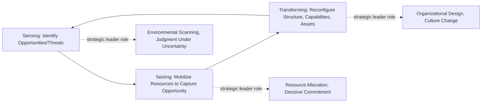

## The Role of the Strategic Leader

### Definition and Conceptual Overview

The strategic leader is the individual (typically a CEO, senior executive, or business-unit head) responsible for setting organizational direction, making high-stakes resource allocation decisions under uncertainty, and mobilizing the organization to formulate and execute strategy effectively. Strategic leadership is distinguished from general management or operational leadership by its focus on the organization's overall direction, long-term positioning, and adaptation to external environmental change, rather than on optimizing existing operations within a fixed strategic frame.

**Key Points**

- Strategic leadership operates at the intersection of external environmental interpretation and internal organizational mobilization, requiring both analytical and social/behavioral capabilities
- Effective strategic leadership is generally distinguished from operational leadership by its emphasis on ambiguity, long time horizons, and irreversible high-stakes decisions
- Upper Echelons Theory provides a widely used academic framework for understanding how strategic leaders' characteristics and cognitions shape organizational strategy and performance

### Core Responsibilities of the Strategic Leader

#### 1. Strategic Direction-Setting

Formulating and articulating a clear vision and mission that provides organizational purpose and a reference point for prioritization, and translating that vision into a coherent strategic logic (how the organization will compete and create value).

#### 2. Environmental Sensing and Interpretation

Continuously scanning the external environment for competitive, technological, regulatory, and social shifts, and interpreting the strategic significance of ambiguous or weak signals before they become obvious to competitors — directly connecting to the "strategic sensitivity" component of strategic agility discussed elsewhere in this course.

#### 3. Resource Allocation

Making high-stakes decisions about where to commit scarce capital, talent, and managerial attention across competing strategic priorities, including decisions to exit declining businesses and invest in emerging opportunities.

#### 4. Organizational Design and Alignment

Shaping organizational structure, governance, and systems (as covered in the organizational structure and human capital chapters) so that they support rather than constrain the chosen strategy.

#### 5. Building Dynamic Capabilities

Developing the organization's capacity to sense opportunities, seize them through resource reconfiguration, and transform organizational assets and structures over time — the "sensing, seizing, transforming" framework associated with dynamic capabilities theory (Teece).

#### 6. Cultivating Culture and Values

Shaping and reinforcing organizational culture as a strategic asset, since culture significantly influences how strategy is actually executed at every organizational level, often more powerfully than formal policy.

#### 7. Managing Stakeholder Relationships

Building and maintaining relationships with the board, investors, employees, customers, regulators, and other stakeholders whose support or resistance materially affects strategic execution feasibility.

#### 8. Developing Successor Leadership

Ensuring leadership continuity through deliberate succession planning, recognizing that strategic leadership capability is itself a form of organizational capital requiring active cultivation rather than passive assumption of availability.

### Diagram: Strategic Leader Role Domains (svg_diagram)

<svg xmlns="http://www.w3.org/2000/svg" viewBox="0 0 900 460" font-family="Arial, sans-serif">
<text x="450" y="30" text-anchor="middle" font-size="18" font-weight="bold">Strategic Leader Role Domains (svg_diagram)</text>
<circle cx="450" cy="240" r="80" fill="#1e3a8a" stroke="#1e293b" stroke-width="2" />
<text x="450" y="235" text-anchor="middle" font-size="13" fill="white" font-weight="bold">Strategic</text>
<text x="450" y="253" text-anchor="middle" font-size="13" fill="white" font-weight="bold">Leader</text>
<rect x="60" y="70" width="180" height="50" rx="8" fill="#dbeafe" stroke="#1e40af" />
<text x="150" y="100" text-anchor="middle" font-size="11">Direction-Setting</text>
<line x1="240" y1="100" x2="385" y2="195" stroke="#333" stroke-width="1.5" />
<rect x="660" y="70" width="180" height="50" rx="8" fill="#dbeafe" stroke="#1e40af" />
<text x="750" y="100" text-anchor="middle" font-size="11">Environmental Sensing</text>
<line x1="660" y1="100" x2="515" y2="195" stroke="#333" stroke-width="1.5" />
<rect x="60" y="180" width="180" height="50" rx="8" fill="#dcfce7" stroke="#166534" />
<text x="150" y="210" text-anchor="middle" font-size="11">Resource Allocation</text>
<line x1="240" y1="205" x2="370" y2="230" stroke="#333" stroke-width="1.5" />
<rect x="660" y="180" width="180" height="50" rx="8" fill="#dcfce7" stroke="#166534" />
<text x="750" y="210" text-anchor="middle" font-size="11">Org. Design/Alignment</text>
<line x1="660" y1="205" x2="530" y2="230" stroke="#333" stroke-width="1.5" />
<rect x="60" y="290" width="180" height="50" rx="8" fill="#fef3c7" stroke="#92400e" />
<text x="150" y="320" text-anchor="middle" font-size="11">Dynamic Capabilities</text>
<line x1="240" y1="315" x2="370" y2="270" stroke="#333" stroke-width="1.5" />
<rect x="660" y="290" width="180" height="50" rx="8" fill="#fef3c7" stroke="#92400e" />
<text x="750" y="320" text-anchor="middle" font-size="11">Culture Stewardship</text>
<line x1="660" y1="315" x2="530" y2="270" stroke="#333" stroke-width="1.5" />
<rect x="270" y="380" width="180" height="50" rx="8" fill="#ede9fe" stroke="#5b21b6" />
<text x="360" y="410" text-anchor="middle" font-size="11">Stakeholder Mgmt.</text>
<line x1="360" y1="380" x2="410" y2="310" stroke="#333" stroke-width="1.5" />
<rect x="470" y="380" width="180" height="50" rx="8" fill="#ede9fe" stroke="#5b21b6" />
<text x="560" y="410" text-anchor="middle" font-size="11">Succession Planning</text>
<line x1="560" y1="380" x2="500" y2="310" stroke="#333" stroke-width="1.5" />
</svg>

### Upper Echelons Theory

Upper Echelons Theory (Hambrick & Mason) argues that organizational outcomes — strategic choices, structure, and performance — are partially predicted by the background characteristics, values, and cognitive frames of top executives, since strategic decisions under uncertainty are inevitably filtered through executives' bounded rationality and personal experience rather than through purely objective analysis.

$$\text{Strategic Choice} = f(\text{Executive Characteristics}, \text{Executive Cognitive Base and Values}, \text{Situational Factors})$$

Commonly studied executive characteristics include functional background (e.g., finance versus marketing/engineering orientation), tenure, educational background, and prior industry experience, which are used as observable proxies for less directly observable cognitive frames and values.

**[Inference]** Because executive characteristics function as imperfect proxies for underlying cognition rather than direct causal drivers, the predictive strength of any single observable characteristic (e.g., functional background alone) for a specific strategic decision is generally modest and context-dependent; Upper Echelons research typically finds these relationships as statistical tendencies across many executives and firms rather than as reliable predictors for any individual leader's specific decisions.

### Distinguishing Strategic Leadership from Operational/Transactional Leadership

| Dimension | Strategic Leadership | Operational/Transactional Leadership |
| --- | --- | --- |
| Time horizon | Long-term, multi-year | Short-term, immediate execution |
| Primary focus | External positioning, direction, adaptation | Internal efficiency, task execution |
| Decision reversibility | Often high-stakes, difficult to reverse | Generally more reversible, lower individual stakes |
| Ambiguity level | High; often incomplete information | Lower; typically clearer performance criteria |
| Primary skill emphasis | Sense-making, vision articulation, judgment under uncertainty | Process management, monitoring, incremental optimization |

**[Inference]** These are best understood as emphases along a continuum rather than as a strict dichotomy, since most senior executives exercise some blend of both strategic and operational leadership depending on organizational level, firm size, and the specific decision at hand; a CEO of a small firm, for instance, may exercise considerably more direct operational leadership than a CEO of a large, highly divisionalized corporation.

### Leadership Styles and Strategic Fit

Different leadership styles carry different implications for strategy formulation and execution effectiveness, contingent on organizational and environmental context:

- **Transformational leadership**: Emphasizes vision articulation, intellectual stimulation, and inspirational motivation; frequently associated with effectively driving significant strategic change and innovation-oriented strategies
- **Transactional leadership**: Emphasizes clear goal-setting, contingent reward, and management-by-exception; often effective for executing well-defined strategies in more stable environments
- **Servant leadership**: Emphasizes prioritizing the growth and well-being of followers; associated in some research with higher levels of employee engagement and trust, which can support change readiness and execution
- **Authentic leadership**: Emphasizes self-awareness, transparency, and consistency between values and behavior; associated with building the trust that underlies effective stakeholder and change management

**[Unverified]** The relative effectiveness of different leadership styles is highly context-dependent (varying by industry, national culture, organizational life-cycle stage, and specific strategic challenge), and empirical findings on which style most strongly predicts firm performance are mixed across studies; no single style should be treated as universally superior across all strategic contexts.

### Strategic Leadership and Dynamic Capabilities

Teece's dynamic capabilities framework positions the strategic leader as the central agent responsible for each phase of this cycle: sensing draws on the leader's environmental interpretation capacity, seizing draws on decisive resource allocation, and transforming draws on organizational design and culture-shaping capability — directly linking strategic leadership to the firm's capacity for the kind of ongoing adaptation discussed in the strategic agility and organizational learning sections of this course.

### Common Strategic Leadership Failure Modes

- **Overconfidence and escalation of commitment**: Continuing to invest in a failing strategic direction due to sunk-cost bias or reluctance to publicly acknowledge error, rather than objectively reassessing based on current information
- **Cognitive entrenchment**: Relying excessively on the mental models and experiences that drove past success, which can become a liability when environmental conditions shift (sometimes termed the "success trap" or "competency trap")
- **Insufficient environmental sensing**: Becoming insulated from external signals due to organizational hierarchy, filtered information flow, or excessive reliance on internal metrics rather than direct external engagement
- **Poor succession planning**: Failing to develop bench strength for strategic leadership roles, creating organizational vulnerability when leadership transitions occur
- **Charisma without substance**: Strong vision articulation and inspirational communication that is not backed by disciplined resource allocation and organizational design follow-through, resulting in unfulfilled strategic aspirations

**Example**

A CEO who built a company's early success around a specific technology platform may, due to cognitive entrenchment, be slower than external analysts or lower-level employees to recognize that an emerging competing technology has fundamentally altered the basis of competition, since the leader's mental model of "how we win" was formed and reinforced during the period when the original platform was genuinely superior. Effective strategic leadership in this scenario typically requires deliberately structured mechanisms (e.g., board challenge processes, external advisory input, internal dissent channels) to counteract this natural cognitive entrenchment tendency, since it is unlikely to be self-corrected purely through the leader's individual reflection.

### Governance Mechanisms Supporting Effective Strategic Leadership

Connecting to the governance structures discussed earlier in this course, several mechanisms help counteract individual strategic leadership limitations:

- **Board oversight and challenge**: An engaged, independent board that constructively challenges executive strategic assumptions rather than merely ratifying management proposals
- **Executive team diversity of perspective**: A senior leadership team with varied functional backgrounds and experiences, reducing the risk that a single dominant cognitive frame goes unchallenged (connecting to Upper Echelons Theory)
- **Structured decision processes**: Formal mechanisms (e.g., devil's advocacy, red-teaming, pre-mortem analysis) that deliberately introduce critical scrutiny into major strategic decisions before commitment
- **External advisory input**: Board advisors, industry experts, or consultants providing perspectives less subject to internal organizational cognitive entrenchment

### Practical Diagnostic Questions

- Does the current strategic leadership team collectively possess sufficiently diverse functional backgrounds and cognitive frames to avoid a single dominant, unchallenged perspective?
- What formal mechanisms exist to challenge the strategic leader's assumptions before major resource commitments, rather than relying solely on individual judgment?
- Is succession planning for strategic leadership roles treated as an ongoing strategic priority, or addressed reactively only when a transition becomes imminent?
- Does the leadership style currently in use fit the specific strategic challenge and organizational context, or is it a default approach applied regardless of context?

**Related Topics**

- Organizational Culture and Strategy Execution
- Dynamic Capabilities and Strategic Renewal
- Governance Structures for Strategy Execution
- Change Readiness and Employee Engagement
- Board of Directors' Role in Strategic Oversight
- Succession Planning for Executive Leadership
- Cognitive Biases in Strategic Decision-Making