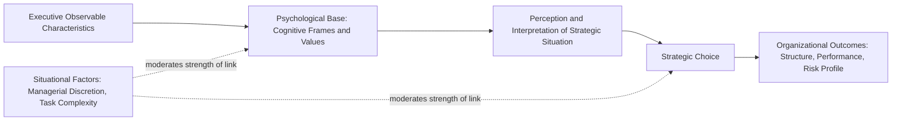

## Upper Echelons Theory

### Definition and Conceptual Overview

Upper Echelons Theory, introduced by Donald Hambrick and Phyllis Mason in 1984, proposes that organizational outcomes — strategic choices, structural configurations, and ultimately firm performance — are partial reflections of the values, cognitive frames, and experiences of the organization's top executives. The theory's central claim is that strategic decisions are made under conditions of bounded rationality and ambiguity, and executives inevitably interpret complex strategic situations through the lens of their own personalized cognitive base and values rather than through purely objective, complete analysis.

**Key Points**

- Upper Echelons Theory shifts strategic analysis focus from purely external environmental determinism toward the role of executive cognition and characteristics as a partial explanation of strategic choice
- The theory uses observable executive demographic and background characteristics as proxies for less directly observable psychological constructs (cognitive frames, values, perceptions)
- The theory applies most strongly under conditions of high managerial discretion, complexity, and ambiguity, where objective "correct" strategic answers are not readily determinable

### The Core Theoretical Logic

$$\text{Organizational Outcomes} = f(\text{Executive Psychological Properties})$$

$$\text{Executive Psychological Properties} \approx g(\text{Observable Executive Characteristics})$$

Because psychological properties (cognitive frames, values, perceptual filters) are difficult to observe or measure directly at scale, Upper Echelons research typically relies on observable demographic and career-history proxies as indirect indicators of the underlying cognitive constructs the theory is actually concerned with.

### The Strategic Decision-Making Process Under Bounded Rationality

Hambrick and Mason's original formulation grounds the theory in a three-stage cognitive filtering process that precedes any strategic decision:

1. **Limited field of vision**: Executives cannot scan the entirety of available information; their attention is inherently selective and shaped by prior experience and cognitive orientation
2. **Selective perception**: Within the limited field of vision actually attended to, executives interpret and filter information according to existing values and cognitive frames, not neutrally
3. **Interpretation**: The filtered information is given meaning based on the executive's existing mental models, which then directly shapes the resulting strategic choice

$$\text{Objective Situation} \xrightarrow{\text{Limited Field of Vision}} \text{Attended Information} \xrightarrow{\text{Selective Perception}} \text{Interpreted Information} \xrightarrow{\text{Values}} \text{Strategic Choice}$$

### Commonly Studied Executive Characteristics

| Characteristic | Hypothesized Strategic Implication |
| --- | --- |
| **Functional background** | Executives from finance/accounting backgrounds tend toward more conservative, control-oriented strategies; those from marketing/R&D backgrounds tend toward more growth- and innovation-oriented strategies |
| **Tenure (organizational and industry)** | Longer tenure is associated with greater commitment to existing strategic paradigms and lower propensity for strategic change (potential cognitive entrenchment) |
| **Educational background/level** | Higher formal education is associated in some studies with greater information-processing capacity and receptivity to innovation |
| **Age** | Older executives are hypothesized (with mixed empirical support) to exhibit greater risk aversion and shorter strategic time horizons |
| **Functional and international experience diversity** | Broader career experience diversity is associated with greater cognitive complexity and openness to strategic change |
| **Financial and equity position** | Executives with substantial personal equity stakes may exhibit different risk preferences than those primarily compensated through fixed salary |

**[Unverified]** Empirical support across these hypothesized relationships is uneven; some (such as functional background effects on strategic orientation) have accumulated more consistent supporting evidence across studies than others (such as the age-risk aversion relationship, where findings have been more mixed), and effect sizes are generally modest rather than strongly deterministic in either case.

### Diagram: Upper Echelons Theoretical Model (svg_diagram)

<svg xmlns="http://www.w3.org/2000/svg" viewBox="0 0 900 400" font-family="Arial, sans-serif">
<text x="450" y="30" text-anchor="middle" font-size="18" font-weight="bold">Upper Echelons Theoretical Model (svg_diagram)</text>
<rect x="40" y="160" width="180" height="70" rx="8" fill="#dbeafe" stroke="#1e40af" />
<text x="130" y="190" text-anchor="middle" font-size="12">Objective Situation</text>
<text x="130" y="208" text-anchor="middle" font-size="10">(Internal/External)</text>
<line x1="220" y1="195" x2="290" y2="195" stroke="#333" stroke-width="2" />
<rect x="290" y="120" width="220" height="150" rx="8" fill="#dcfce7" stroke="#166534" />
<text x="400" y="145" text-anchor="middle" font-size="12" font-weight="bold">Upper Echelon</text>
<text x="400" y="165" text-anchor="middle" font-size="10">Observable Characteristics:</text>
<text x="400" y="182" text-anchor="middle" font-size="10">Age, Tenure, Function,</text>
<text x="400" y="199" text-anchor="middle" font-size="10">Education, Experience</text>
<text x="400" y="222" text-anchor="middle" font-size="10" font-style="italic">↓ (proxy for)</text>
<text x="400" y="240" text-anchor="middle" font-size="10">Cognitive Base and Values</text>
<line x1="510" y1="195" x2="580" y2="195" stroke="#333" stroke-width="2" />
<rect x="580" y="160" width="180" height="70" rx="8" fill="#fef3c7" stroke="#92400e" />
<text x="670" y="190" text-anchor="middle" font-size="12">Strategic Choice</text>
<text x="670" y="208" text-anchor="middle" font-size="10">(Structure, Risk, Innovation)</text>
<line x1="670" y1="230" x2="670" y2="300" stroke="#333" stroke-width="2" />
<rect x="580" y="300" width="180" height="60" rx="8" fill="#ede9fe" stroke="#5b21b6" />
<text x="670" y="325" text-anchor="middle" font-size="12">Performance</text>
<text x="670" y="343" text-anchor="middle" font-size="10">Outcomes</text>
<rect x="290" y="310" width="220" height="50" rx="8" fill="#fecaca" stroke="#991b1b" />
<text x="400" y="330" text-anchor="middle" font-size="11">Moderator: Managerial Discretion</text>
<text x="400" y="347" text-anchor="middle" font-size="10">(strength of executive influence)</text>
<line x1="400" y1="310" x2="400" y2="270" stroke="#333" stroke-width="1.5" stroke-dasharray="4" />
</svg>

### Managerial Discretion as a Moderating Condition

Upper Echelons Theory does not claim that executive characteristics uniformly determine strategy in all contexts. The theory's predictive strength is explicitly moderated by **managerial discretion** — the degree of latitude executives actually have to act on their own interpretations and preferences, which varies according to:

- **Task/environmental discretion**: Industries with fewer regulatory constraints, more product differentiation potential, and faster growth typically afford executives greater discretion than heavily regulated, commoditized, or slow-growth industries
- **Organizational discretion**: Factors such as firm size, organizational culture, resource availability, and board oversight strength affect how much latitude an individual executive has relative to institutional constraints
- **Individual/personal discretion**: An executive's own aspiration level, tolerance for ambiguity, internal locus of control, and political skill affect how fully they exercise the discretion structurally available to them

$$\text{Strength of Executive-Strategy Link} \propto \text{Managerial Discretion}$$

**[Inference]** This implies that Upper Echelons predictions will generally have weaker explanatory power in highly regulated, low-discretion industries (e.g., utilities operating under close regulatory oversight) compared to high-discretion industries (e.g., technology or consumer products), since executive interpretation and preference have comparatively less room to influence strategic choice where external and structural constraints dominate.

### Executive Team Composition and Upper Echelons Extensions

Subsequent research extended the original single-executive (typically CEO-focused) formulation to consider the **top management team (TMT)** collectively, recognizing that most strategic decisions in practice involve a group of senior executives rather than a single individual:

- **TMT heterogeneity**: Diversity of functional background, tenure, and experience within the executive team is associated with more comprehensive strategic information processing but also potentially greater internal conflict and slower decision consensus
- **TMT tenure homogeneity**: Executive teams with similar organizational tenure (having joined and been socialized together) may exhibit less internal cognitive conflict but greater collective susceptibility to shared cognitive entrenchment or groupthink
- **CEO dominance/power distribution**: The degree to which a single CEO's individual characteristics dominate strategic choice versus a more collectively negotiated TMT process affects how directly individual Upper Echelons predictions apply

**Example**

A technology firm with a founder-CEO possessing strong engineering background, low organizational tenure diversity across the executive team, and high managerial discretion (due to founder control and high-growth industry dynamics) would, per Upper Echelons logic, be expected to exhibit strategic choices more directly reflecting the founder's individual cognitive frame and risk preferences than a mature, heavily regulated utility company with a professionally recruited CEO operating under extensive board oversight and regulatory constraint, where Upper Echelons predictions would be expected to have comparatively less explanatory power relative to external structural determinants.

### Applications and Uses of Upper Echelons Theory in Strategic Analysis

- **Executive selection and succession planning**: Using the theory's logic to consider how candidate executives' backgrounds and experience profiles may shape future strategic direction, informing succession decisions beyond pure competency assessment
- **M&A and post-merger integration analysis**: Anticipating potential strategic and cultural friction points based on differences in acquiring and target firm executive team composition
- **Board composition and governance design**: Informing decisions about executive team diversity to ensure a sufficiently broad range of cognitive perspectives is represented in strategic deliberation, connecting to the governance mechanisms discussed in the strategic leadership role material
- **Explaining strategic variation among seemingly similar firms**: Providing a partial explanation for why firms facing similar external competitive conditions nonetheless pursue meaningfully different strategies, attributing some of this variation to differences in executive composition rather than purely to external environmental differences

### Critiques and Limitations

- **Proxy validity concerns**: Observable demographic characteristics are indirect and imperfect proxies for the underlying psychological constructs (cognitive frames, values) the theory is actually concerned with, introducing measurement uncertainty into empirical tests
- **Modest and inconsistent effect sizes**: Meta-analytic reviews of Upper Echelons research have generally found effect sizes to be statistically detectable but modest in magnitude, and inconsistent across specific characteristic-outcome relationships and study contexts
- **Endogeneity and reverse causality concerns**: Firms may select executives whose existing characteristics already fit an intended strategic direction, meaning the causal arrow (does executive characteristic cause strategic choice, or does anticipated strategy shape executive selection) is not always clearly established in cross-sectional research designs
- **Oversimplification of complex cognition**: Reducing rich individual psychological variation to a small set of observable demographic proxies risks oversimplifying the actual cognitive processes the theory seeks to explain

**[Unverified]** The magnitude and consistency of Upper Echelons effects reported across the academic literature vary considerably by the specific characteristic studied, the industry context, and the methodological approach used; practitioners should treat the theory as a useful conceptual lens for considering executive influence on strategy rather than as a source of precise, universally generalizable predictive coefficients.

### Practical Diagnostic Questions

- Given the level of managerial discretion in this industry and organizational context, how much should observed strategic choices be attributed to executive characteristics versus external structural constraints?
- Does the current executive team's composition (functional background, tenure, experience diversity) suggest any systematic blind spots or biases in strategic interpretation?
- In evaluating a potential executive hire or successor, what does their background and experience profile suggest about their likely strategic orientation, and does this align with or challenge the organization's current strategic needs?
- Are governance mechanisms in place to counterbalance potential cognitive limitations arising from the specific composition of the current executive team?

**Next Steps**

- The Role of the Strategic Leader
- Cognitive Biases in Strategic Decision-Making
- Governance Structures for Strategy Execution
- Top Management Team Diversity and Firm Performance
- Succession Planning for Executive Leadership
- Organizational Culture and Strategy Execution