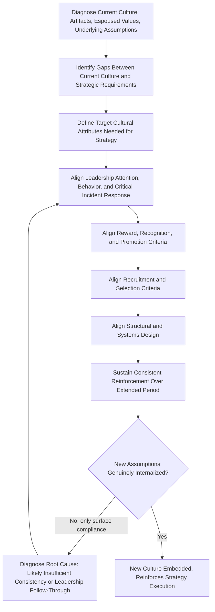

## Building and Shaping Organizational Culture

### Definition and Conceptual Overview

Organizational culture refers to the shared assumptions, values, beliefs, and behavioral norms that develop within an organization and shape how its members perceive problems, make decisions, and interact. In a strategic management context, culture is treated not as a soft, peripheral concern but as a strategic asset (or liability) that materially influences whether formulated strategy is actually executed as intended, since culture governs the countless unmonitored, discretionary decisions employees make daily that formal strategy documents cannot directly control.

**Key Points**

- Culture operates at multiple levels, from visible artifacts to invisible, taken-for-granted assumptions, and strategic leaders must work at all levels to genuinely shape it
- Culture can function as either a powerful enabler of strategic execution or a significant barrier to it, particularly when a chosen strategy requires behaviors inconsistent with deeply embedded existing norms
- Culture change is generally slow, resource-intensive, and resistant to purely top-down mandate; it typically requires sustained, consistent reinforcement across multiple organizational mechanisms over an extended period

### Schein's Three Levels of Organizational Culture

Edgar Schein's influential model decomposes culture into three levels of increasing depth and decreasing visibility:

$$\text{Artifacts (visible)} \rightarrow \text{Espoused Values (stated)} \rightarrow \text{Underlying Assumptions (taken-for-granted)}$$

| Level | Description | Examples |
| --- | --- | --- |
| **Artifacts** | Visible, observable structures, processes, and behaviors | Office layout, dress codes, rituals, published mission statements, visible symbols |
| **Espoused Values** | Stated strategies, goals, and philosophies the organization explicitly claims to hold | Corporate value statements, stated leadership philosophies, official policies |
| **Underlying Assumptions** | Unconscious, taken-for-granted beliefs that actually drive behavior, often unstated and unexamined | Deep assumptions about human nature, the basis of truth, appropriate authority relationships |

**[Inference]** A common diagnostic challenge in practice is that espoused values (what an organization says it values) frequently diverge from underlying assumptions (what actually drives behavior), and this gap is often the root cause of failed cultural change initiatives that focus only on restating values or artifacts (posters, mission statements) without addressing the deeper assumptions that continue to drive actual employee behavior.

### Diagram: Schein's Culture Iceberg Model (svg_diagram)

<svg xmlns="http://www.w3.org/2000/svg" viewBox="0 0 800 460" font-family="Arial, sans-serif">
<text x="400" y="30" text-anchor="middle" font-size="18" font-weight="bold">Schein's Culture Iceberg Model (svg_diagram)</text>
<rect x="0" y="60" width="800" height="140" fill="#e0f2fe" />
<rect x="0" y="200" width="800" height="240" fill="#0c4a6e" />
<line x1="0" y1="200" x2="800" y2="200" stroke="#fff" stroke-width="2" />
<polygon points="250,80 550,80 480,190 320,190" fill="#f8fafc" stroke="#334155" stroke-width="2" />
<text x="400" y="120" text-anchor="middle" font-size="13" font-weight="bold">Artifacts</text>
<text x="400" y="140" text-anchor="middle" font-size="10">(visible: dress, rituals,</text>
<text x="400" y="155" text-anchor="middle" font-size="10">office design, symbols)</text>
<polygon points="300,220 500,220 440,320 360,320" fill="#93c5fd" stroke="#334155" stroke-width="2" />
<text x="400" y="255" text-anchor="middle" font-size="12" fill="#1e293b" font-weight="bold">Espoused Values</text>
<text x="400" y="273" text-anchor="middle" font-size="10" fill="#1e293b">(stated strategies,</text>
<text x="400" y="288" text-anchor="middle" font-size="10" fill="#1e293b">value statements)</text>
<polygon points="330,340 470,340 430,420 370,420" fill="#1e40af" stroke="#334155" stroke-width="2" />
<text x="400" y="375" text-anchor="middle" font-size="11" fill="white" font-weight="bold">Underlying</text>
<text x="400" y="392" text-anchor="middle" font-size="11" fill="white" font-weight="bold">Assumptions</text>

<text x="650" y="90" font-size="12" fill="`#1e293b`">Visible / Easy to observe</text>

<text x="650" y="410" font-size="12" fill="white">Invisible / Taken for granted</text>

</svg>

### Culture and Strategy: The Fit Imperative

Following the same "fit" logic applied to structure and HR strategy elsewhere in this course, culture must be assessed for compatibility with the organization's chosen strategy:

- **Innovation-driven differentiation strategies** typically require cultures tolerating risk-taking, experimentation, and productive failure — cultures that punish deviation or mistakes uniformly will systematically undermine such strategies regardless of formal innovation investment
- **Cost leadership strategies** typically benefit from cultures emphasizing discipline, efficiency, consistency, and process adherence
- **Customer-intimacy/service-differentiation strategies** typically require cultures emphasizing empowerment, responsiveness, and genuine customer-centric values embedded beyond surface-level customer service scripts
- **Rapid-growth or transformation strategies** typically require cultures with higher tolerance for ambiguity and change, as opposed to cultures optimized for stability and predictability

**Example**

An organization pursuing an innovation-driven differentiation strategy that retains a deeply embedded underlying assumption (from a prior era of cost-focused competition) that "mistakes reflect poorly on the individual and should be minimized at all costs" will likely experience persistent innovation underperformance regardless of how much capital is invested in R&D or how strongly innovation is emphasized in espoused value statements, since the underlying assumption continues to drive risk-averse behavior at the level where actual day-to-day decisions are made.

### Mechanisms Through Which Strategic Leaders Shape Culture

Schein identifies several primary mechanisms through which leaders embed and reinforce cultural assumptions, extending directly from the strategic leadership role discussed earlier in this chapter:

- **What leaders pay attention to, measure, and control**: Employees infer genuine priorities from what leaders consistently attend to and follow up on, often more than from formal statements
- **Leader reactions to critical incidents and crises**: How leaders respond to significant unexpected events reveals underlying priorities and assumptions far more powerfully than routine communication
- **Deliberate role modeling and coaching**: Leaders' own visible behavior, particularly under difficult circumstances, teaches employees which behaviors are genuinely valued
- **Criteria for allocating rewards and status**: What behaviors are actually promoted, compensated, and recognized shapes assumptions about what the organization truly values, regardless of stated values
- **Criteria for recruitment, selection, and dismissal**: Who is hired, promoted, and let go communicates powerful signals about which values and behaviors are genuinely tolerated or rewarded
- **Organizational structure and systems design**: Structural choices (centralization, span of control, incentive systems) themselves communicate cultural assumptions about autonomy, trust, and control

### The Culture Change Process

### Subcultures and Cultural Fragmentation

Large or diversified organizations frequently contain multiple subcultures — distinct cultural patterns within functions, business units, geographies, or hierarchical levels — rather than a single monolithic organizational culture. This is particularly relevant in the multidivisional and matrix structures discussed earlier in this course:

- **Functional subcultures**: Engineering, sales, and finance functions often develop distinct professional subcultures with different values and norms even within a single organization
- **Geographic subcultures**: Multinational organizations frequently develop distinct regional subcultures reflecting local national cultural influences layered onto the corporate culture
- **Business-unit subcultures**: Divisions pursuing different competitive strategies (per the HR-strategy alignment discussion) may appropriately require and develop somewhat different subcultures suited to their specific strategic requirements

**[Inference]** In diversified multidivisional organizations, attempting to impose a single uniform culture across all divisions regardless of their differing strategic requirements may be counterproductive, analogous to the argument against uniform HR practices across differentiated business strategies; a more effective approach for such organizations likely involves maintaining certain core, company-wide cultural elements (e.g., ethical standards, safety, core values) while permitting legitimate subcultural variation aligned with each division's specific strategic needs.

### Culture During Mergers and Acquisitions

Cultural incompatibility is a widely cited factor in M&A underperformance, since combining organizations typically brings together distinct, often deeply embedded cultural assumptions that resist rapid integration:

- **Cultural due diligence**: Assessing cultural compatibility (not only financial and strategic fit) prior to acquisition completion, ideally before final deal commitment
- **Integration approach choice**: Decisions regarding whether to fully assimilate the acquired culture into the acquirer's culture, preserve the acquired culture's distinctiveness, or deliberately blend elements of both, contingent on the strategic rationale for the acquisition and the relative importance of the acquired firm's distinctive culture to the value being acquired
- **Symbolic and substantive integration actions**: Early, visible leadership actions during integration (both symbolic gestures and substantive decisions about which practices and people are retained) send powerful signals that shape how quickly and successfully a shared culture develops post-acquisition

### Measuring Organizational Culture

- **Culture surveys and diagnostic instruments**: Structured surveys (e.g., the Organizational Culture Assessment Instrument, or custom instruments) measuring perceived values, norms, and behaviors across the organization
- **Behavioral and outcome proxies**: Turnover patterns, internal promotion rates, whistleblower/ethics hotline usage patterns, and employee engagement scores as indirect behavioral indicators of underlying cultural health
- **Qualitative methods**: Structured interviews, focus groups, and ethnographic observation to surface underlying assumptions that survey instruments may not fully capture, particularly given that underlying assumptions are by definition often not consciously articulated by organizational members themselves

$$\text{Culture-Strategy Alignment Gap} = \text{Required Cultural Attributes (per Strategy)} - \text{Assessed Current Cultural Attributes}$$

**[Unverified]** No universally validated single instrument definitively captures organizational culture in its entirety, given the construct's inherent complexity and the difficulty of directly measuring underlying assumptions rather than surface-level artifacts and espoused values; practitioners typically need to triangulate across multiple methods (quantitative surveys, behavioral proxies, and qualitative inquiry) rather than relying on any single measurement approach.

### Common Pitfalls in Culture-Shaping Efforts

- **Values-statement theater**: Publishing aspirational value statements without corresponding changes to reward systems, promotion criteria, or leadership behavior, producing cynicism rather than genuine cultural shift
- **Underestimating time horizon**: Expecting meaningful culture change within unrealistically short timeframes, when embedding new underlying assumptions typically requires sustained, consistent reinforcement over multiple years
- **Inconsistent leadership modeling**: Senior leaders publicly espousing desired cultural values while personally exhibiting contradictory behavior, which employees will generally weight more heavily than formal communication
- **Ignoring structural reinforcement**: Attempting to shift culture through communication and training alone while leaving incentive systems, structure, and promotion criteria unchanged and continuing to reward the old cultural pattern
- **Treating culture as uniform**: Failing to recognize legitimate subcultural variation appropriate to different strategic contexts within a diversified organization, applying a one-size-fits-all cultural change program

### Practical Diagnostic Questions

- What underlying assumptions currently drive actual employee behavior, and how do these compare to the organization's espoused values and the behaviors the strategy actually requires?
- Are reward, promotion, and recruitment criteria genuinely aligned with the cultural attributes the strategy requires, or do they continue to reinforce prior cultural patterns?
- How have senior leaders responded to recent critical incidents, and what does that response signal about genuinely prioritized values relative to stated ones?
- In a diversified organization, is cultural variation across business units appropriately aligned with differing strategic requirements, or is inconsistency creating unintended fragmentation?

**Related Topics**

- The Role of the Strategic Leader
- Upper Echelons Theory
- Change Readiness and Employee Engagement
- Aligning Human Resource Strategy with Business Strategy
- Mergers, Acquisitions, and Post-Merger Integration Governance
- Organizational Learning Systems
- Ethics and Values-Based Leadership in Strategy