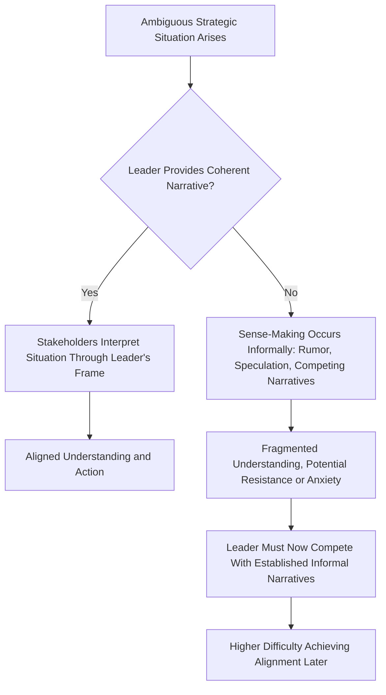

## Strategic Communication and Narrative

### Definition and Conceptual Overview

Strategic communication and narrative refers to the deliberate construction and dissemination of messages, stories, and framing by strategic leaders to build shared understanding, generate stakeholder buy-in, and mobilize collective action in support of organizational strategy. Distinct from routine operational communication, strategic narrative operates at the level of meaning-making: it shapes how employees, investors, customers, and other stakeholders interpret the organization's purpose, direction, and the significance of specific strategic decisions.

**Key Points**

- Strategic narrative functions as a sense-making tool, helping stakeholders interpret ambiguous or complex strategic situations in a way that generates coherent understanding and aligned action
- Effective strategic communication is bidirectional and iterative, not merely top-down broadcast; it requires listening and adaptation as much as message transmission
- Narrative consistency across multiple communication channels and over time is critical to credibility, since stakeholders integrate messages received across many touchpoints into a single coherent (or incoherent) impression

### The Role of Narrative in Strategic Sense-Making

Strategic situations, particularly during periods of ambiguity or change, do not present themselves with self-evident meaning. Sense-making theory (associated with Karl Weick) holds that organizational members actively construct meaning from ambiguous cues, and leaders who fail to provide a coherent interpretive narrative leave that sense-making process to occur informally and often less favorably (through rumor, speculation, or competing informal narratives).

$$\text{Stakeholder Understanding} = f(\text{Narrative Coherence}, \text{Narrative Consistency Across Channels/Time}, \text{Perceived Leader Credibility})$$

**[Inference]** Because informal sense-making tends to fill communication vacuums quickly, particularly during periods of visible organizational change or uncertainty, delays in providing a coherent strategic narrative likely increase the difficulty of later achieving stakeholder alignment, since leaders must then work to displace already-formed informal interpretations rather than shaping understanding from a neutral starting point.

### Components of Effective Strategic Narrative

- **Diagnosis**: A clear, credible account of the current situation and why change or a particular strategic direction is necessary — connecting directly to the "perceived need" dimension of change readiness discussed elsewhere in this course
- **Vision**: A compelling depiction of the desired future state that the strategy aims to achieve, providing a clear reference point for prioritization and motivation
- **Bridge/pathway**: A credible explanation of how the organization will move from the current state to the envisioned future state, addressing the "how" that separates aspiration from actionable plan
- **Identity connection**: Framing that connects the strategic narrative to stakeholders' existing sense of organizational or professional identity, since narratives that feel identity-consistent are generally more readily accepted than those that feel identity-threatening
- **Evidence and proof points**: Concrete examples, data, or early wins that substantiate the narrative's claims, building credibility beyond rhetoric alone

### Diagram: Strategic Narrative Architecture (svg_diagram)

<svg xmlns="http://www.w3.org/2000/svg" viewBox="0 0 900 380" font-family="Arial, sans-serif">
<text x="450" y="30" text-anchor="middle" font-size="18" font-weight="bold">Strategic Narrative Architecture (svg_diagram)</text>
<rect x="40" y="80" width="160" height="70" rx="8" fill="#dbeafe" stroke="#1e40af" />
<text x="120" y="110" text-anchor="middle" font-size="12" font-weight="bold">Diagnosis</text>
<text x="120" y="128" text-anchor="middle" font-size="10">Why change is needed</text>
<line x1="200" y1="115" x2="250" y2="115" stroke="#333" stroke-width="2" />
<rect x="250" y="80" width="160" height="70" rx="8" fill="#dcfce7" stroke="#166534" />
<text x="330" y="110" text-anchor="middle" font-size="12" font-weight="bold">Vision</text>
<text x="330" y="128" text-anchor="middle" font-size="10">Desired future state</text>
<line x1="410" y1="115" x2="460" y2="115" stroke="#333" stroke-width="2" />
<rect x="460" y="80" width="160" height="70" rx="8" fill="#fef3c7" stroke="#92400e" />
<text x="540" y="110" text-anchor="middle" font-size="12" font-weight="bold">Bridge/Pathway</text>
<text x="540" y="128" text-anchor="middle" font-size="10">How we get there</text>
<line x1="620" y1="115" x2="670" y2="115" stroke="#333" stroke-width="2" />
<rect x="670" y="80" width="180" height="70" rx="8" fill="#ede9fe" stroke="#5b21b6" />
<text x="760" y="110" text-anchor="middle" font-size="12" font-weight="bold">Evidence/Proof Points</text>
<text x="760" y="128" text-anchor="middle" font-size="10">Credibility building</text>
<rect x="250" y="220" width="380" height="70" rx="8" fill="#fecaca" stroke="#991b1b" />
<text x="440" y="250" text-anchor="middle" font-size="12" font-weight="bold">Identity Connection</text>
<text x="440" y="268" text-anchor="middle" font-size="10">Links narrative to stakeholder self-concept</text>
<line x1="440" y1="220" x2="440" y2="150" stroke="#333" stroke-width="1.5" stroke-dasharray="4" />
<text x="440" y="330" text-anchor="middle" font-size="11" font-style="italic">Underpins acceptance of all four preceding elements</text>
</svg>

### Audience Segmentation and Message Tailoring

Strategic communication must be tailored to distinct stakeholder audiences, each with different information needs, levels of detail required, and framing sensitivities, while maintaining underlying narrative consistency:

| Audience | Primary Communication Emphasis |
| --- | --- |
| **Board/Investors** | Financial rationale, risk management, competitive positioning, return expectations |
| **Employees (all levels)** | Personal relevance, job security/opportunity implications, how their specific role connects to the strategy |
| **Middle management** | Implementation detail, resource implications, how to communicate the narrative further downward |
| **Customers** | Value proposition changes, service continuity, benefits of the strategic direction to them specifically |
| **Regulators/external stakeholders** | Compliance implications, risk mitigation, broader societal/industry impact framing |

**[Inference]** Tailoring message emphasis and detail level by audience is distinct from — and should not be confused with — sending genuinely inconsistent or contradictory core narratives to different audiences; the latter is likely to be detected (particularly in the era of internal communications leaking externally or overlapping stakeholder networks) and tends to undermine credibility more severely than would have resulted from a single, consistently framed narrative applied with audience-appropriate emphasis and detail.

### Communication Channels and Cadence

- **Town halls and all-hands meetings**: High-visibility forums for senior leadership to deliver core narrative directly, allowing real-time question-and-answer engagement that builds perceived transparency
- **Cascading manager briefings**: Structured processes equipping middle managers with consistent messaging and supporting materials to relay the narrative to their teams, addressing the "insufficient participation" and middle-management readiness gaps discussed in the change management material
- **Written communication (memos, intranet, newsletters)**: Providing a stable, referenceable record of the narrative that employees can revisit, reducing distortion that can occur through purely verbal cascading communication
- **Informal channels and leader visibility**: Leaders' informal interactions (walking the floor, informal conversations) reinforcing the formal narrative through consistent day-to-day behavior, connecting to the culture-shaping mechanisms discussed in the organizational culture material
- **External channels (investor calls, press, social media)**: Communicating strategic narrative to external stakeholders, requiring careful coordination with internal communication to avoid employees learning of major strategic direction through external media rather than internal channels

### Narrative Consistency Over Time

**Example**

An organization announcing a multi-year strategic transformation faces a credibility test not at the announcement itself, but in whether subsequent leadership communication, resource allocation decisions, and responses to setbacks remain consistent with the original narrative over the following months and years. If early setbacks are met with silence, deflection, or narrative reversal without acknowledgment, stakeholders are likely to discount future strategic communications regardless of their content, since perceived narrative consistency over time functions as a primary basis for stakeholder trust in leadership communication generally.

### Managing Narrative During Setbacks and Crises

Strategic narrative is tested most severely not during favorable periods but when execution encounters genuine setbacks:

- **Acknowledging setbacks credibly**: Attempting to conceal or minimize genuine setbacks typically damages credibility more than transparent acknowledgment paired with a credible course-correction narrative, since stakeholders often have some independent means of detecting the gap between the stated narrative and observed reality
- **Distinguishing setback from failure**: Effective crisis narrative frames genuine setbacks within the broader strategic narrative as expected friction within a longer-term trajectory (where credible) rather than allowing a single setback to be interpreted as invalidating the entire strategic direction
- **Maintaining narrative-behavior consistency**: Leadership behavior during a crisis (resource allocation, personal visibility, tone) must remain consistent with the narrative being communicated, since inconsistency during high-scrutiny crisis periods is particularly damaging to credibility

### Narrative and Change Readiness Connection

Strategic communication and narrative directly operationalize several of the change readiness dimensions discussed elsewhere in this course:

| Change Readiness Dimension | Narrative Component Addressing It |
| --- | --- |
| Perceived need | Diagnosis component |
| Perceived appropriateness | Vision and bridge/pathway components |
| Perceived efficacy | Evidence/proof points, bridge/pathway detail |
| Principal support | Consistency of leadership behavior with stated narrative |
| Personal valence | Identity connection and audience-tailored messaging |

### Common Pitfalls in Strategic Communication

- **Communication as one-time event**: Treating a major announcement as sufficient, rather than sustaining consistent reinforcement through repeated, varied communication over the full implementation period
- **Jargon and abstraction without concrete meaning**: Strategic language (e.g., generic terms like "synergy," "transformation," "excellence") that fails to translate into concrete implications for specific audiences, leaving genuine understanding gaps despite apparent communication volume
- **Narrative-reality gaps**: Communicating a narrative that diverges visibly from actual resource allocation, structural decisions, or leadership behavior, which stakeholders typically weight more heavily than the stated narrative itself
- **Neglecting upward and lateral listening**: Focusing exclusively on message transmission (top-down broadcast) while failing to genuinely gather and respond to stakeholder feedback, questions, and concerns, undermining the perceived authenticity and adaptiveness of the communication effort
- **Inconsistency across channels or over time**: Allowing different communication channels or successive communications to drift out of alignment, creating confusion or perceived contradiction that damages overall narrative coherence

**[Unverified]** The specific relative effectiveness of different communication channels (e.g., town halls versus written communication versus informal leader visibility) for building strategic understanding and trust likely varies by organizational culture, generational composition of the workforce, and the nature of the strategic change itself; no single channel or cadence should be assumed universally optimal across all organizational contexts.

### Practical Diagnostic Questions

- Does the current strategic narrative include all core components (diagnosis, vision, bridge, identity connection, evidence), or is a critical component (often the credible "bridge" or evidence) missing?
- Is the narrative being communicated consistently across all channels and over time, or have inconsistencies emerged that stakeholders may notice?
- Are leadership behavior and resource allocation decisions visibly consistent with the stated narrative, or is there a detectable narrative-reality gap?
- Does the communication approach include genuine mechanisms for upward listening and adaptation, or does it function purely as one-directional broadcast?

**Related Topics**

- Change Readiness and Employee Engagement
- The Role of the Strategic Leader
- Building and Shaping Organizational Culture
- Stakeholder Management and Strategic Communication
- Governance Structures for Strategy Execution
- Crisis Management and Organizational Resilience